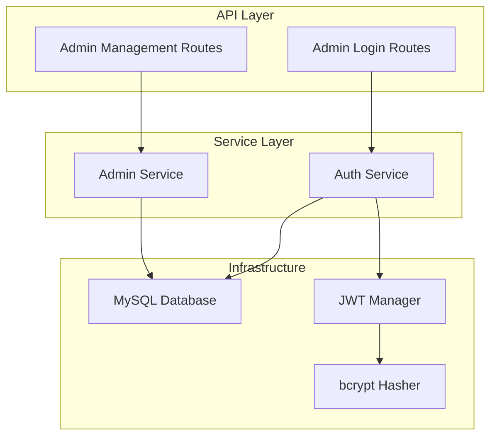
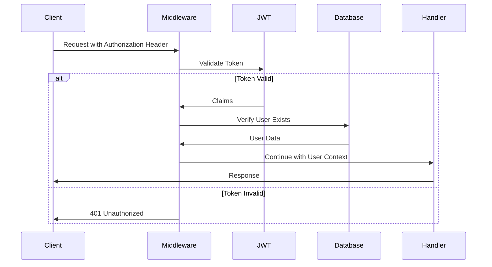

# 管理员认证路由设计

## 概述

本设计旨在为 Royale Arena 项目的 Rust 后端实现管理员认证系统，包括用户登录验证、管理员用户的 CRUD 操作等核心功能。系统基于 Axum 框架构建，使用 JWT 进行身份认证，SQLx 进行数据库操作。

**架构原则**：针对小型工程，采用简化的分层架构，Service 层直接访问数据库，无需额外的 Repository 抽象层，降低复杂度，提高开发效率。

## 技术架构

### 核心技术栈
- **Web 框架**: Axum 0.8.4
- **数据库**: MySQL + SQLx 0.8.6
- **认证机制**: JWT (jsonwebtoken 9.3.1)
- **密码加密**: bcrypt 0.17.1
- **异步运行时**: Tokio
- **序列化**: Serde

### 架构分层



## 数据模型设计

### Admin User 实体结构

```rust
#[derive(Debug, Clone, Serialize, Deserialize, sqlx::FromRow)]
pub struct AdminUser {
    pub id: Uuid,
    pub username: String,
    #[serde(skip_serializing)]
    pub password: String,
    pub is_super_admin: bool,
    pub created_at: DateTime<Utc>,
    pub updated_at: DateTime<Utc>,
}

#[derive(Debug, Serialize, Deserialize)]
pub struct AdminUserResponse {
    pub id: Uuid,
    pub username: String,
    pub is_super_admin: bool,
}
```

### JWT Claims 结构

```rust
#[derive(Debug, Serialize, Deserialize)]
pub struct JwtClaims {
    pub sub: String,  // user_id
    pub username: String,
    pub is_super_admin: bool,
    pub exp: usize,   // expiration timestamp
    pub iat: usize,   // issued at timestamp
}
```

## API 端点设计

### 路由组织结构

```
/api/admin
├── POST   /login              # 管理员登录
├── GET    /users              # 获取管理员列表 (超级管理员)
├── POST   /users              # 创建管理员账户 (超级管理员)
├── PUT    /users/{user_id}    # 修改管理员账户 (超级管理员)
└── DELETE /users/{user_id}    # 删除管理员账户 (超级管理员)
```

### 认证中间件设计



## 项目模块结构

为了组织代码，建议在 `src/` 目录下创建以下模块：

```
src/
├── main.rs              # 主程序入口
├── config.rs            # 配置管理
├── auth.rs              # 认证模块入口
├── auth/                # 认证子模块
│   ├── jwt.rs           # JWT 相关功能
│   ├── middleware.rs    # 认证中间件
│   └── service.rs       # 认证服务
├── admin.rs             # 管理员模块入口
├── admin/               # 管理员子模块
│   ├── handlers.rs      # 路由处理函数
│   ├── service.rs       # 管理员服务
│   └── models.rs        # 数据模型
├── database.rs          # 数据库连接
├── errors.rs            # 错误定义
└── routes.rs            # 路由配置
```

## 核心组件实现

### 1. 认证服务 (Auth Service)

```rust
pub struct AuthService {
    pool: SqlPool,
    jwt_manager: JwtManager,
}

impl AuthService {
    pub async fn login(&self, credentials: LoginRequest) -> Result<LoginResponse, AuthError> {
        // 1. 直接查询数据库验证用户凭据
        // 2. 生成 JWT Token
        // 3. 返回认证结果
    }
    
    pub async fn validate_token(&self, token: &str) -> Result<JwtClaims, AuthError> {
        // 1. 验证 JWT Token
        // 2. 直接查询数据库检查用户是否仍然存在
        // 3. 返回用户信息
    }
    
    async fn find_by_username(&self, username: &str) -> Result<Option<AdminUser>, sqlx::Error> {
        sqlx::query_as::<_, AdminUser>(
            "SELECT id, username, password, is_super_admin, created_at, updated_at 
             FROM admin_users WHERE username = ?"
        )
        .bind(username)
        .fetch_optional(&self.pool)
        .await
    }
}
```

### 2. 管理员管理服务 (Admin Service)

```rust
pub struct AdminService {
    pool: SqlPool,
}

impl AdminService {
    pub async fn list_admins(&self) -> Result<Vec<AdminUserResponse>, ServiceError> {
        let admins = sqlx::query_as::<_, AdminUser>(
            "SELECT id, username, password, is_super_admin, created_at, updated_at 
             FROM admin_users ORDER BY created_at DESC"
        )
        .fetch_all(&self.pool)
        .await?;
        
        Ok(admins.into_iter().map(AdminUserResponse::from).collect())
    }
    
    pub async fn create_admin(&self, request: CreateAdminRequest) -> Result<AdminUserResponse, ServiceError> {
        // 直接执行数据库插入操作
    }
    
    pub async fn update_admin(&self, id: Uuid, request: UpdateAdminRequest) -> Result<AdminUserResponse, ServiceError> {
        // 直接执行数据库更新操作
    }
    
    pub async fn delete_admin(&self, id: Uuid) -> Result<(), ServiceError> {
        // 直接执行数据库删除操作
    }
}
```

## 安全设计

### 密码安全策略

| 安全措施 | 实现方式 | 配置参数 |
|---------|---------|---------|
| 密码哈希 | bcrypt | cost = 12 |
| 盐值生成 | bcrypt 自动生成 | 每次随机 |
| 密码复杂度 | 前端验证 | 最少8位，包含字母数字 |

### JWT 安全配置

| 配置项 | 值 | 说明 |
|-------|---|------|
| 算法 | HS256 | HMAC SHA-256 |
| 过期时间 | 24小时 | 可配置 |
| 密钥长度 | 256位 | 环境变量存储 |
| 刷新策略 | 手动刷新 | 需要重新登录 |

### 权限控制矩阵

| 操作 | 普通管理员 | 超级管理员 |
|------|-----------|-----------|
| 登录系统 | ✓ | ✓ |
| 查看管理员列表 | ✗ | ✓ |
| 创建管理员 | ✗ | ✓ |
| 修改管理员 | ✗ | ✓ |
| 删除管理员 | ✗ | ✓ |

## 错误处理设计

### 错误类型定义

```rust
#[derive(Debug, thiserror::Error)]
pub enum AuthError {
    #[error("Invalid credentials")]
    InvalidCredentials,
    
    #[error("User not found")]
    UserNotFound,
    
    #[error("Token expired")]
    TokenExpired,
    
    #[error("Invalid token")]
    InvalidToken,
    
    #[error("Insufficient permissions")]
    InsufficientPermissions,
}

#[derive(Debug, thiserror::Error)]
pub enum ServiceError {
    #[error("Database error: {0}")]
    Database(#[from] sqlx::Error),
    
    #[error("Auth error: {0}")]
    Auth(#[from] AuthError),
    
    #[error("Validation error: {0}")]
    Validation(String),
}
```

### HTTP 状态码映射

| 错误类型 | HTTP 状态码 | 响应消息 |
|---------|------------|---------|
| InvalidCredentials | 401 | 用户名或密码错误 |
| UserNotFound | 404 | 用户不存在 |
| TokenExpired | 401 | 认证令牌已过期 |
| InvalidToken | 401 | 认证令牌无效 |
| InsufficientPermissions | 403 | 权限不足 |
| ValidationError | 400 | 请求参数验证失败 |

## 数据库操作

### SQL 查询模板

```sql
-- 用户认证查询
SELECT id, username, password, is_super_admin, created_at, updated_at 
FROM admin_users 
WHERE username = ?

-- 管理员列表查询
SELECT id, username, is_super_admin, created_at, updated_at 
FROM admin_users 
ORDER BY created_at DESC

-- 创建管理员
INSERT INTO admin_users (id, username, password, is_super_admin) 
VALUES (?, ?, ?, ?)

-- 更新管理员信息
UPDATE admin_users 
SET username = COALESCE(?, username),
    password = COALESCE(?, password),
    is_super_admin = COALESCE(?, is_super_admin),
    updated_at = CURRENT_TIMESTAMP
WHERE id = ?

-- 删除管理员
DELETE FROM admin_users WHERE id = ?
```

### 数据库连接池配置

使用项目现有的 `.env` 文件配置，通过 dotenvy 加载环境变量：

```rust
use dotenvy::dotenv;
use sqlx::mysql::MySqlPool;

pub async fn create_pool() -> Result<MySqlPool, sqlx::Error> {
    dotenv().ok(); // 加载 .env 文件
    
    let database_url = std::env::var("DATABASE_URL")
        .expect("DATABASE_URL must be set in .env file");
    
    MySqlPool::connect(&database_url).await
}
```

## 请求/响应格式

### 登录请求/响应

```json
// POST /api/admin/login
{
  "username": "admin",
  "password": "password123"
}

// 响应
{
  "success": true,
  "token": "eyJ0eXAiOiJKV1QiLCJhbGciOiJIUzI1NiJ9...",
  "expires_in": 86400
}
```

### 管理员 CRUD 操作

```json
// GET /api/admin/users 响应
{
  "users": [
    {
      "id": "123e4567-e89b-12d3-a456-426614174000",
      "username": "admin",
      "is_super_admin": true
    }
  ]
}

// POST /api/admin/users 请求
{
  "username": "newadmin",
  "password": "password123",
  "is_super_admin": false
}

// PUT /api/admin/users/{id} 请求
{
  "username": "updatedadmin",
  "is_super_admin": true
}
```

## 中间件实现

### JWT 认证中间件

```rust
pub async fn jwt_auth_middleware<B>(
    State(auth_service): State<AuthService>,
    mut req: Request<B>,
    next: Next<B>,
) -> Result<Response, StatusCode> {
    // 1. 提取 Authorization Header
    // 2. 验证 JWT Token
    // 3. 将用户信息注入请求上下文
    // 4. 继续处理请求
}
```

### 超级管理员权限中间件

```rust
pub async fn super_admin_middleware<B>(
    Extension(user): Extension<JwtClaims>,
    req: Request<B>,
    next: Next<B>,
) -> Result<Response, StatusCode> {
    if !user.is_super_admin {
        return Err(StatusCode::FORBIDDEN);
    }
    Ok(next.run(req).await)
}
```

## 测试策略

### 集成测试设计

在 `tests/` 目录下创建单个集成测试，使用 `sqlx::test` 进行数据库测试：

```rust
// tests/admin_auth_integration.rs
use sqlx::mysql::MySqlPool;
use uuid::Uuid;

#[sqlx::test(migrations = "../migrations")]
async fn test_admin_auth_complete_flow(pool: MySqlPool) {
    // 测试 1: 管理员登录流程
    // 1.1 创建测试管理员
    // 1.2 执行登录验证
    // 1.3 验证 JWT Token 生成
    
    // 测试 2: 管理员 CRUD 操作
    // 2.1 创建超级管理员
    // 2.2 测试创建普通管理员
    // 2.3 测试查询管理员列表
    // 2.4 测试更新管理员信息
    // 2.5 测试删除管理员
    
    // 测试 3: 权限控制验证
    // 3.1 验证普通管理员无法访问超级管理员端点
    // 3.2 验证超级管理员可以执行所有操作
    // 3.3 验证 JWT Token 过期和无效场景
}
```

### 测试场景覆盖

| 测试场景 | 预期结果 |
|---------|---------|
| 有效凭据登录 | 返回 JWT Token |
| 无效凭据登录 | 返回 401 错误 |
| 使用有效 Token 访问受保护端点 | 正常响应 |
| 使用过期 Token 访问 | 返回 401 错误 |
| 普通管理员访问超级管理员端点 | 返回 403 错误 |
| 超级管理员 CRUD 操作 | 正常执行 |

## 配置管理

### 环境变量配置

使用项目现有的 `.env` 文件，其中已包含所需的数据库配置和其他认证相关设置。

### 应用配置结构

基于现有 `.env` 文件的配置加载：

```rust
use dotenvy::dotenv;
use std::env;

#[derive(Debug, Clone)]
pub struct AppConfig {
    pub jwt_secret: String,
    pub jwt_expiration_hours: u64,
    pub bcrypt_cost: u32,
}

impl AppConfig {
    pub fn from_env() -> Self {
        dotenv().ok();
        
        Self {
            jwt_secret: env::var("JWT_SECRET")
                .expect("JWT_SECRET must be set in .env"),
            jwt_expiration_hours: env::var("JWT_EXPIRATION_HOURS")
                .unwrap_or_else(|_| "24".to_string())
                .parse()
                .expect("JWT_EXPIRATION_HOURS must be a valid number"),
            bcrypt_cost: env::var("BCRYPT_COST")
                .unwrap_or_else(|_| "12".to_string())
                .parse()
                .expect("BCRYPT_COST must be a valid number"),
        }
    }
}
```