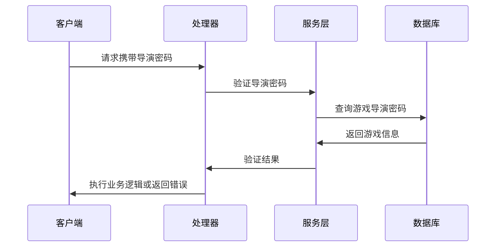
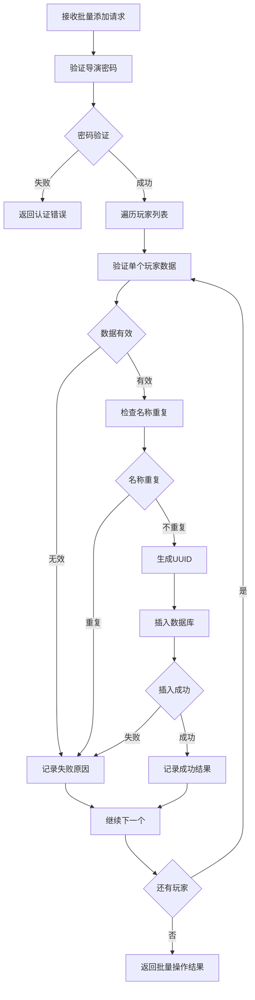
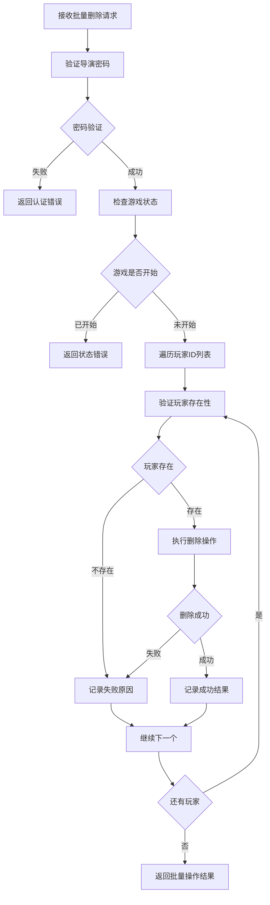

# 导演接口实现设计文档

## 概述

本文档设计导演接口的后端实现方案，涵盖演员（玩家）管理功能。导演接口允许游戏导演通过导演密码管理游戏中的演员账户，包括批量添加、查询列表和批量删除功能。

## 技术架构

### 模块结构
```
backend/src/director/
├── models.rs      # 数据模型定义
├── errors.rs      # 错误处理
├── service.rs     # 业务逻辑层
└── handlers.rs    # HTTP 处理器
```

### 数据库设计

#### actors 表结构（已存在）
```sql
CREATE TABLE actors (
    id VARCHAR(36) PRIMARY KEY,
    game_id VARCHAR(36) NOT NULL,
    name VARCHAR(50) NOT NULL,
    password VARCHAR(8) NOT NULL,
    team_id INT NOT NULL DEFAULT 0,
    created_at TIMESTAMP DEFAULT CURRENT_TIMESTAMP,
    updated_at TIMESTAMP DEFAULT CURRENT_TIMESTAMP ON UPDATE CURRENT_TIMESTAMP,
    FOREIGN KEY (game_id) REFERENCES games(id) ON DELETE CASCADE
);
```

#### games 表相关字段
- `director_password`: 导演密码，用于身份验证

## 数据模型设计

### 请求模型
```rust
// 批量添加演员请求
#[derive(Debug, Deserialize)]
pub struct BatchAddPlayersRequest {
    pub players: Vec<CreatePlayerRequest>,
}

#[derive(Debug, Deserialize)]
pub struct CreatePlayerRequest {
    pub player_name: String,
    pub password: String,
    pub team_id: Option<i32>, // 可选的队伍ID，默认为0
}

// 批量删除演员请求
#[derive(Debug, Deserialize)]
pub struct BatchDeletePlayersRequest {
    pub player_ids: Vec<String>,
}
```

### 响应模型
```rust
// 演员信息
#[derive(Debug, Serialize)]
pub struct PlayerInfo {
    pub id: String,
    pub name: String,
    pub password: String,
    pub game_id: String,
    pub team_id: i32,
}

// 批量操作响应
#[derive(Debug, Serialize)]
pub struct BatchOperationResponse<T> {
    pub success: Vec<T>,
    pub failed: Vec<OperationFailure>,
}

#[derive(Debug, Serialize)]
pub struct OperationFailure {
    pub player_name: Option<String>,
    pub id: Option<String>,
    pub reason: String,
}
```

## 核心业务逻辑

### 导演身份验证机制



### 批量添加演员业务流程



### 批量删除演员业务流程



## 服务层设计

### 核心服务方法

```rust
impl DirectorService {
    // 验证导演密码
    async fn verify_director_password(
        &self, 
        game_id: &str, 
        password: &str
    ) -> Result<(), DirectorError>;
    
    // 批量添加演员
    async fn batch_add_players(
        &self,
        game_id: &str,
        password: &str,
        request: BatchAddPlayersRequest,
    ) -> Result<BatchOperationResponse<PlayerInfo>, DirectorError>;
    
    // 获取演员列表
    async fn get_players(
        &self,
        game_id: &str,
        password: &str,
    ) -> Result<Vec<PlayerInfo>, DirectorError>;
    
    // 批量删除演员
    async fn batch_delete_players(
        &self,
        game_id: &str,
        password: &str,
        request: BatchDeletePlayersRequest,
    ) -> Result<BatchOperationResponse<PlayerInfo>, DirectorError>;
    
    // 创建单个演员（内部方法）
    async fn create_player(
        &self,
        game_id: &str,
        player_name: &str,
        password: &str,
        team_id: i32,
    ) -> Result<PlayerInfo, DirectorError>;
    
    // 获取演员信息（内部方法）
    async fn get_player_by_id(
        &self,
        player_id: &str,
    ) -> Result<PlayerInfo, DirectorError>;
}
```

### 数据验证规则

#### 演员密码验证
- 长度：6-8位字符
- 字符集：字母和数字
- 唯一性：同一游戏内不重复

#### 演员名称验证
- 长度：1-50字符
- 唯一性：同一游戏内不重复
- 非空检查

#### 队伍ID验证
- 类型：整数
- 范围：大于等于0
- 默认值：0（表示无队伍）
- 可选字段：如果未提供则使用默认值

## API接口说明更新

基于新增的game_id和team_id字段，以下是更新后的API接口规范：

### 接口1：批量添加演员账户
```
POST /api/game/{game_id}/players?password=<director_password>
```

**更新内容：**
- 请求体中添加可选的team_id字段
- 响应体中包含game_id和team_id信息

**新的请求格式：**
```json
{
  "players": [
    {
      "player_name": "string",
      "password": "string",      // 6-8位字母数字
      "team_id": "integer"       // 可选，队伍ID，默认为0
    }
  ]
}
```

**新的响应格式：**
```json
{
  "success": [
    {
      "id": "string",
      "name": "string",
      "password": "string",
      "game_id": "string",      // 新增：所属游戏ID
      "team_id": "integer"      // 新增：队伍ID
    }
  ],
  "failed": [
    {
      "player_name": "string",
      "reason": "string"
    }
  ]
}
```

### 接口2：获取演员列表
```
GET /api/game/{game_id}/players?password=<director_password>
```

**更新内容：**
- 响应体中包含完整的演员信息，包括game_id和team_id

**新的响应格式：**
```json
{
  "players": [
    {
      "id": "string",
      "name": "string",
      "password": "string",     // 明文返回密码
      "game_id": "string",     // 新增：所属游戏ID
      "team_id": "integer"     // 新增：队伍ID
    }
  ]
}
```

### 接口3：批量删除演员账户
```
DELETE /api/game/{game_id}/players?password=<director_password>
```

**说明：**
- 删除接口的请求和响应格式保持不变
- 但删除操作需要考虑team_id相关的业务逻辑验证

### 1. 批量添加演员账户
```
POST /api/game/{game_id}/players?password={director_password}
```

**请求参数：**
```json
{
  "players": [
    {
      "player_name": "string",
      "password": "string",
      "team_id": "integer"  // 可选，默认为0
    }
  ]
}
```

**响应格式：**
```json
{
  "success": [
    {
      "id": "string",
      "name": "string",
      "password": "string",
      "game_id": "string",
      "team_id": "integer"
    }
  ],
  "failed": [
    {
      "player_name": "string",
      "reason": "string"
    }
  ]
}
```

**处理器实现要点：**
- 路径参数提取游戏ID
- 查询参数提取导演密码
- JSON体解析批量添加请求
- 自动设置game_id为路径参数值
- team_id默认为0，支持自定义设置
- 调用服务层批量添加方法
- 返回标准批量操作响应

### 2. 获取演员列表
```
GET /api/game/{game_id}/players?password={director_password}
```

**响应格式：**
```json
{
  "players": [
    {
      "id": "string",
      "name": "string",
      "password": "string",
      "game_id": "string",
      "team_id": "integer"
    }
  ]
}
```

**处理器实现要点：**
- 路径参数提取游戏ID
- 查询参数提取导演密码
- 调用服务层获取玩家列表
- 返回完整的玩家信息（包含game_id、team_id和明文密码）

### 3. 批量删除演员账户
```
DELETE /api/game/{game_id}/players?password={director_password}
```

**请求参数：**
```json
{
  "player_ids": ["string"]
}
```

**响应格式：**
```json
{
  "success": [
    {
      "id": "string",
      "name": "string",
      "message": "Player deleted successfully"
    }
  ],
  "failed": [
    {
      "id": "string",
      "reason": "string"  // 游戏开始后不允许删除演员
    }
  ]
}
```

**处理器实现要点：**
- 路径参数提取游戏ID
- 查询参数提取导演密码
- JSON体解析批量删除请求
- 验证游戏状态（只能在游戏开始前删除）
- 调用服务层批量删除方法
- 返回标准批量操作响应

## 错误处理设计

### 错误类型定义
```rust
#[derive(Debug, thiserror::Error)]
pub enum DirectorError {
    #[error("Game not found")]
    GameNotFound,
    
    #[error("Invalid director password")]
    InvalidDirectorPassword,
    
    #[error("Player name already exists: {name}")]
    PlayerNameExists { name: String },
    
    #[error("Invalid password format")]
    InvalidPasswordFormat,
    
    #[error("Player not found: {id}")]
    PlayerNotFound { id: String },
    
    #[error("Cannot delete players after game started")]
    GameAlreadyStarted,
    
    #[error("Database error: {0}")]
    DatabaseError(#[from] sqlx::Error),
}
```

### HTTP状态码映射
- 游戏不存在 → 404 Not Found
- 导演密码错误 → 401 Unauthorized
- 数据验证失败 → 400 Bad Request
- 游戏状态错误 → 409 Conflict
- 数据库错误 → 500 Internal Server Error

## 路由注册

### 路由配置
```rust
// 导演接口路由（无需JWT认证，使用导演密码验证）
let director_routes = Router::new()
    .route(&format!("{}/game/{{game_id}}/players", api_prefix), 
           post(batch_add_players)
           .get(get_players)
           .delete(batch_delete_players))
    .with_state(app_state.clone());
```

## 数据库事务处理

### 批量操作事务策略
- 批量添加：不使用事务，逐个处理以支持部分成功
- 批量删除：不使用事务，逐个处理以支持部分成功
- 单个操作失败不影响其他操作的执行

### 并发控制
- 通过数据库唯一约束防止重复插入
- 使用适当的隔离级别避免脏读
- 删除操作检查外键约束

## 性能考虑

### 批量操作优化
- 批量查询减少数据库往返
- 使用连接池管理数据库连接
- 适当的索引支持（已在schema中定义）

### 内存使用优化
- 流式处理大批量操作
- 及时释放不需要的数据结构
- 避免一次性加载过多数据

## 单元测试策略

### 测试覆盖范围
- 导演密码验证逻辑
- 数据验证规则测试
- 批量操作边界条件
- 错误处理路径测试

### 集成测试策略
- 使用 `#[sqlx::test]` 进行数据库集成测试
- 测试完整的HTTP请求响应流程
- 验证批量操作的事务行为

## 实现细节补充

### 数据库操作设计

#### 创建演员的SQL语句
```sql
INSERT INTO actors (id, game_id, name, password, team_id, created_at, updated_at)
VALUES (?, ?, ?, ?, COALESCE(?, 0), CURRENT_TIMESTAMP, CURRENT_TIMESTAMP)
```

#### 查询演员列表的SQL语句
```sql
SELECT id, game_id, name, password, team_id, created_at, updated_at
FROM actors
WHERE game_id = ?
ORDER BY created_at ASC
```

### 业务逻辑处理

#### team_id处理规则
1. **默认值处理：** 如果请求中未提供team_id，则使用默认值0
2. **验证规则：** team_id必须为非负整数
3. **约束条件：** 同一游戏内的玩家可以属于不同队伍

#### game_id处理规则
1. **自动设置：** game_id由路径参数提取，不从请求体获取
2. **外键约束：** 需要验证game_id对应的游戏存在
3. **数据一致性：** 确保所有返回的演员数据都包含正确的game_id

### 错误处理增强

#### 新增错误类型
```rust
#[derive(Debug, thiserror::Error)]
pub enum DirectorError {
    // ... 现有错误类型 ...
    
    #[error("Invalid team_id: {team_id}")]
    InvalidTeamId { team_id: i32 },
    
    #[error("Game_id mismatch: expected {expected}, got {actual}")]
    GameIdMismatch { expected: String, actual: String },
}
```

### 数据模型验证增强

#### CreatePlayerRequest验证方法
```rust
impl CreatePlayerRequest {
    pub fn validate(&self) -> Result<(), String> {
        // 现有验证逻辑...
        
        // 新增 team_id 验证
        if let Some(team_id) = self.team_id {
            if team_id < 0 {
                return Err("队伍ID不能为负数".to_string());
            }
        }
        
        Ok(())
    }
    
    // 获取有效的 team_id，如果为 None 则返回 0
    pub fn get_team_id(&self) -> i32 {
        self.team_id.unwrap_or(0)
    }
}
```

## 安全考虑

### 密码安全
- 导演密码验证防止未授权访问
- 演员密码以明文存储（按需求设计）
- 输入验证防止SQL注入

### 访问控制
- 每个游戏的演员只能被对应导演管理
- 通过游戏ID和导演密码双重验证
- 防止跨游戏数据访问
- team_id字段的访问不需要额外权限控制，但需验证数据有效性
