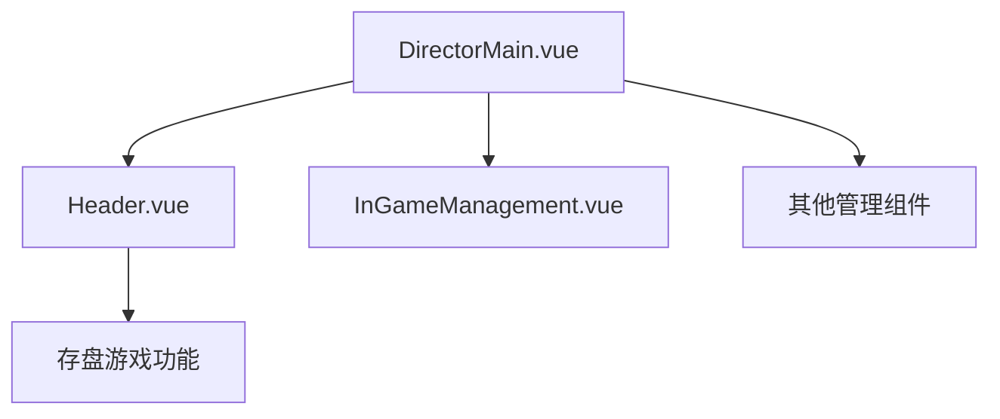
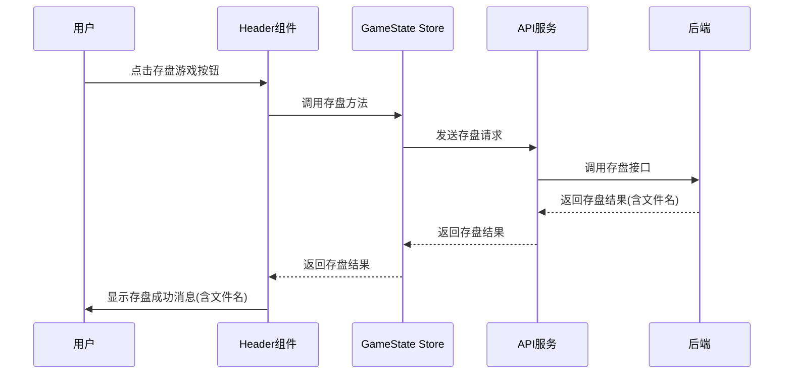
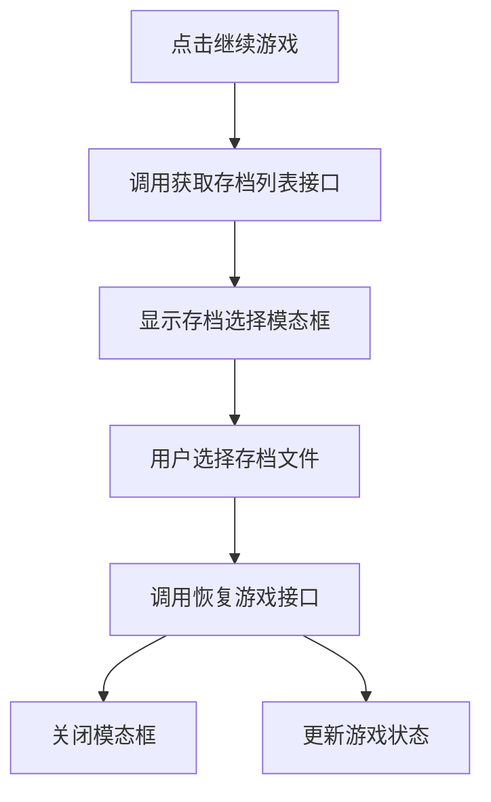
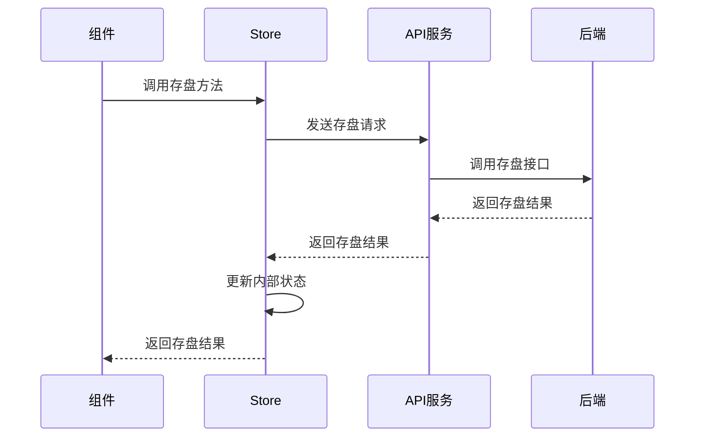

# Royale Arena 前端存盘游戏功能增强设计文档

## 1. 概述

### 1.1 目的
本文档旨在设计和规范 Royale Arena 前端关于存盘游戏功能的增强实现，包括在导演界面中添加存盘游戏按钮、在存盘和暂停游戏后显示保存的文件名、以及在继续游戏时提供文件选择界面。

### 1.2 背景
后台已实现了存盘游戏、读取已存盘文件列表接口，并在修改游戏状态的接口和传入参数中加入了欲读取文件名的参数输入（适用于"继续游戏"功能），在输出参数中加入了存储的文件名的输出（适用于"存盘游戏"或"暂停游戏"功能）。现在需要在前端实现相应的用户界面和交互功能。

### 1.3 范围
本文档涵盖以下功能增强：
1. 在导演的Header中加入"存盘游戏"按钮
2. 在"存盘游戏"和"暂停游戏"产生保存的文件后，在消息中显式展示保存的文件名
3. 在"继续游戏"按钮点击后，调用读取文件列表接口获得所有文件名，展示一个临时窗口用于用户选择；选择想要读取的存储的文件后，将这个文件名作为参数传入到update game status的api中

## 2. 架构设计

### 2.1 前端架构概览
Royale Arena 前端采用 Vue 3 和 Vite 构建，使用 Pinia 进行状态管理。导演界面作为独立的视图模块，包含 Header 组件和多个管理组件。

### 2.2 组件结构


### 2.3 数据流设计


## 3. 功能详细设计

### 3.1 存盘游戏按钮添加

#### 3.1.1 UI 设计
在导演界面的 Header 组件中添加"存盘游戏"按钮，位置在现有操作按钮组中。

#### 3.1.2 组件修改
修改 `frontend/src/views/director/components/Header.vue` 组件：
- 在模板中添加存盘按钮
- 在逻辑中添加存盘方法

#### 3.1.3 按钮显示逻辑
存盘按钮在游戏状态为 RUNNING 或 PAUSED 时显示。

### 3.2 存盘文件名显示

#### 3.2.1 消息提示设计
在存盘游戏或暂停游戏成功后，使用 Element Plus 的消息组件显示成功消息，包含保存的文件名。

#### 3.2.2 API 响应处理
后端在暂停游戏和手动存盘接口的响应中包含 `save_file_name` 字段，前端需要正确处理并显示。

### 3.3 继续游戏文件选择

#### 3.3.1 文件选择窗口设计
点击"继续游戏"按钮后，弹出一个模态窗口显示所有存档文件列表供用户选择。

#### 3.3.2 UI 组件设计
创建一个新的模态组件用于显示存档文件列表：
- 显示文件名和创建时间
- 提供选择和取消按钮
- 支持按时间排序

#### 3.3.3 交互流程


## 4. API 接口设计

### 4.1 手动存盘接口
- **端点**: `POST /api/director/game/{game_id}/save`
- **认证**: 导演密码（请求体）
- **请求体**:
  ```json
  {
    "password": "string"
  }
  ```
- **响应**:
  ```json
  {
    "success": true,
    "message": "Game state saved successfully",
    "save_file_name": "2023-01-01T12:00:00.000Z.json"
  }
  ```

### 4.2 查询存档文件列表接口
- **端点**: `GET /api/director/game/{game_id}/saves?password={director_password}`
- **认证**: 导演密码（查询参数）
- **响应**:
  ```json
  {
    "success": true,
    "data": [
      {
        "file_name": "2023-01-01T12:00:00.000Z.json",
        "created_at": "2023-01-01T12:00:00.000Z"
      }
    ]
  }
  ```

### 4.3 恢复游戏接口
- **端点**: `PUT /api/director/game/{game_id}/status`
- **认证**: 导演密码（请求体）
- **请求体**:
  ```json
  {
    "password": "string",
    "status": "running",
    "save_file_name": "2023-01-01T12:00:00.000Z.json"
  }
  ```
- **响应**:
  ```json
  {
    "success": true,
    "message": "Game resumed successfully"
  }
  ```

## 5. 状态管理设计

### 5.1 Pinia Store 修改
在 `gameState.ts` store 中添加以下方法：
- `manualSaveGame`: 调用手动存盘接口
- `fetchSaveFiles`: 获取存档文件列表
- `resumeGameWithSave`: 恢复游戏状态

### 5.2 状态更新流程


## 6. UI/UX 设计

### 6.1 存盘按钮设计
- 文本: "存盘游戏"
- 类型: primary
- 位置: Header 操作按钮组中，位于"暂停游戏"按钮之后

### 6.2 成功消息设计
- 类型: success
- 内容: "游戏状态已保存至: {文件名}"

### 6.3 存档选择模态框设计
- 标题: "选择存档文件"
- 内容: 文件列表（带时间排序）
- 操作按钮:
  - 确认选择
  - 取消

## 7. 错误处理

### 7.1 网络错误
- 显示网络错误消息
- 提供重试选项

### 7.2 认证错误
- 显示密码错误消息
- 引导用户重新输入密码

### 7.3 业务逻辑错误
- 显示后端返回的错误消息
- 根据错误类型提供相应处理建议
