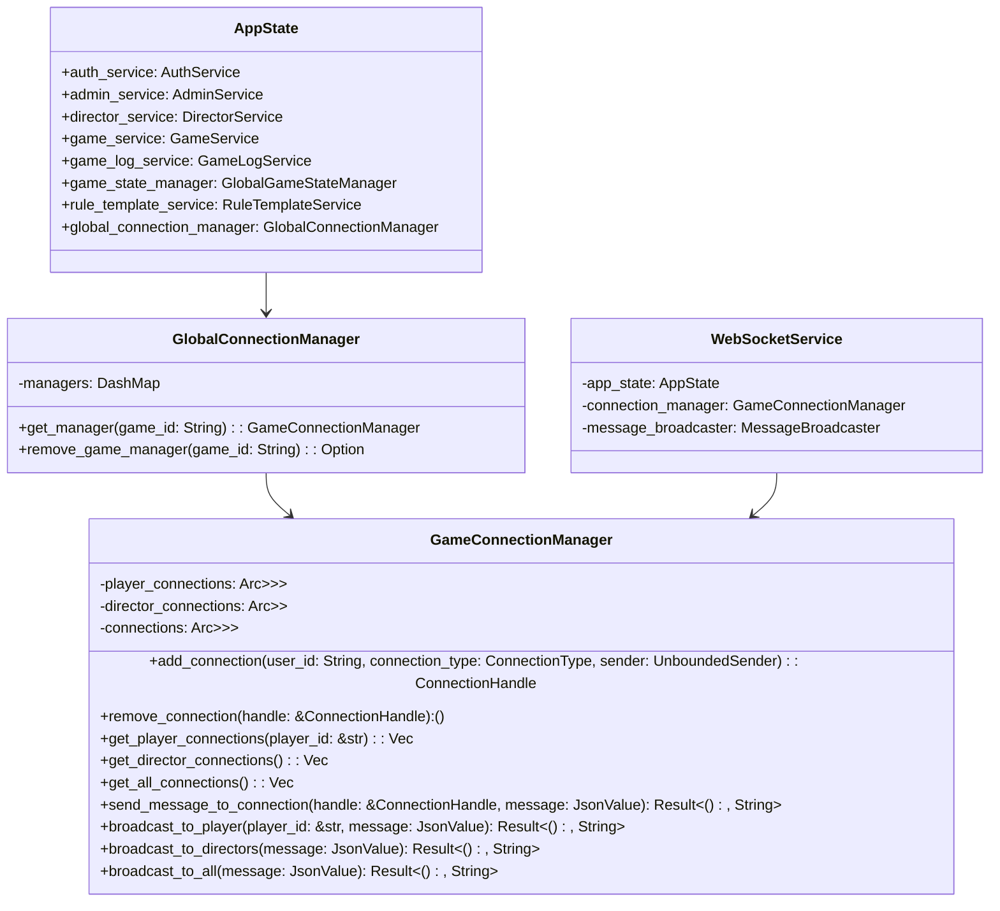
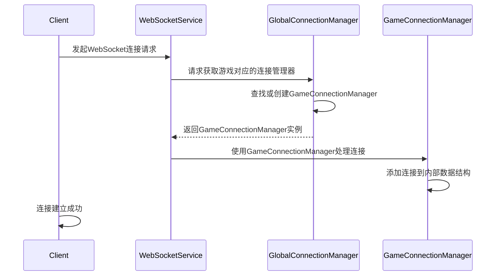
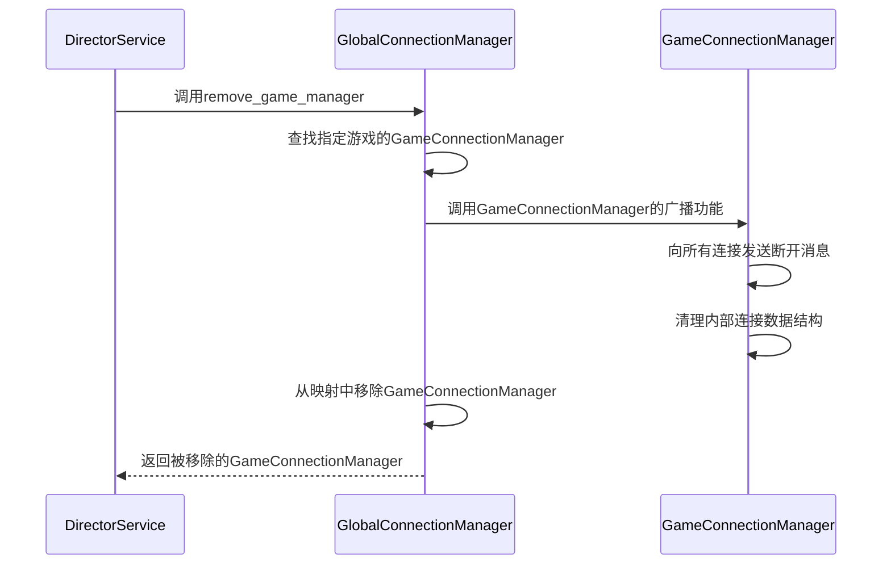

# WebSocket连接管理器重构设计文档

## 1. 概述

当前的WebSocket连接管理器设计存在一个关键问题：它被设计为全局单例，但实际应该针对每个游戏实例进行管理。当服务器同时运行多个游戏时，所有连接都被混在一起管理，无法区分属于哪个游戏。

本设计旨在重构连接管理器架构，使其能够支持多个并行游戏实例，每个游戏拥有独立的连接管理器。

## 2. 当前问题分析

### 2.1 设计缺陷
- `ConnectionManager`被设计为全局单例，管理所有游戏的连接
- 无法区分不同游戏的连接，导致连接混乱
- 导演服务无法针对特定游戏断开所有连接

### 2.2 功能需求
- 每个游戏应有独立的连接管理器
- 支持根据游戏ID获取对应的连接管理器
- 支持为特定游戏断开所有连接
- 兼容现有的连接管理功能

## 3. 设计方案

### 3.1 总体架构

```
[AppState]
    |
    | (包含)
    v
[GlobalConnectionManager] ----> 管理多个游戏的连接管理器
    |
    | (包含字典映射)
    v
[game_id] => [GameConnectionManager] ----> 管理单个游戏的所有连接
```

### 3.2 核心组件

#### 3.2.1 GameConnectionManager (原ConnectionManager重命名)
- 职责：管理单个游戏的所有WebSocket连接
- 功能保持不变，仅重命名以明确其作用范围
- 包含玩家连接、导演连接的管理
- 提供广播消息、发送消息等基础功能

#### 3.2.2 GlobalConnectionManager (新增)
- 职责：管理所有游戏的GameConnectionManager实例
- 使用DashMap存储 game_id => GameConnectionManager 的映射
- 提供根据游戏ID获取GameConnectionManager的方法
- 提供断开并移除特定游戏所有连接的功能

### 3.3 类图设计



## 4. 接口设计

### 4.1 GlobalConnectionManager接口

```rust
impl GlobalConnectionManager {
    /// 创建新的全局连接管理器
    pub fn new() -> Self;
    
    /// 获取指定游戏的连接管理器，如果不存在则创建新的
    pub fn get_manager(&self, game_id: String) -> GameConnectionManager;
    
    /// 断开并移除指定游戏的所有连接，返回被移除的连接管理器
    pub async fn remove_game_manager(&self, game_id: String) -> Option<GameConnectionManager>;
}
```

### 4.2 GameConnectionManager接口
保持原有接口不变，仅重命名类名。

### 4.3 WebSocketService修改
WebSocketService在初始化时需要通过GlobalConnectionManager获取对应游戏的GameConnectionManager：

```rust
// 修改前
let ws_service = WebSocketService::new(state, &mut state.connection_manager);

// 修改后
let game_connection_manager = state.global_connection_manager.get_manager(game_id.clone());
let ws_service = WebSocketService::new(state, &mut game_connection_manager);
```

## 5. 数据结构设计

### 5.1 GlobalConnectionManager内部结构
```rust
pub struct GlobalConnectionManager {
    /// 游戏ID到连接管理器的映射
    managers: Arc<DashMap<String, Arc<GameConnectionManager>>>,
}
```

### 5.2 现有数据结构保持不变
- ConnectionHandle
- ConnectionType
- GameConnectionManager内部结构（将迁移到DashMap形式）

## 6. 业务流程

### 6.1 WebSocket连接建立流程


### 6.2 导演断开游戏所有连接流程


## 7. 并发安全性

### 7.1 使用DashMap替代RwLock+HashMap
- DashMap提供更好的并发性能
- 避免全局写锁竞争
- 提供原子性的查找、插入、删除操作
- DashMap本身使用Arc包装以确保多线程间的正确共享
- 对于GameConnectionManager内部结构，也将原有的Arc<RwLock<HashMap结构迁移到DashMap形式

### 7.2 现有并发控制保持不变
- GameConnectionManager内部的并发控制保持不变
- WebSocket连接的并发处理保持不变

## 8. 向后兼容性

### 8.1 接口兼容性
- GameConnectionManager的公共接口保持不变
- WebSocketService的使用方式基本保持不变
- 仅需修改AppState中的字段名和初始化逻辑

### 8.2 数据兼容性
- 不影响现有连接数据结构
- 不改变消息格式和传输方式
