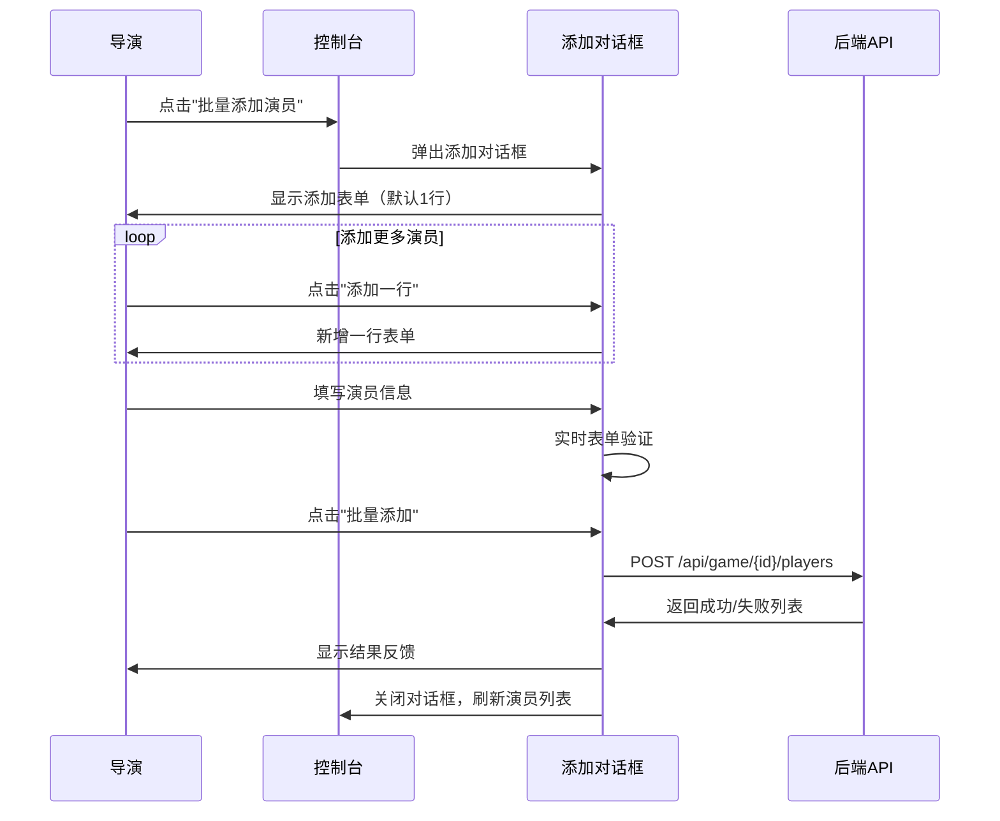

# 导演控制台页面开发设计

## 概述

本设计文档描述前端导演控制台页面的重构需求，主要实现导演身份验证机制的优化、演员表格显示和管理功能、URI直接访问功能，以及批量粘贴演员信息的开发。

## 技术栈

- **前端框架**: Vue 3 + TypeScript + Element Plus
- **路由管理**: Vue Router
- **状态管理**: Pinia
- **HTTP客户端**: Axios
- **UI组件库**: Element Plus

## 功能架构

### 核心功能模块

``mermaid
graph TB
    A[导演控制台页面] --> B[URI直接访问模块]
    A --> C[身份验证模块]
    A --> D[演员管理模块]
    A --> E[视角切换模块]
    
    B --> B1[URI参数解析]
    B --> B2[密码验证]
    B --> B3[访问控制]
    
    C --> C1[密码验证]
    C --> C2[权限检查]
    C --> C3[自动跳转]
    
    D --> D1[演员列表展示]
    D --> D2[折叠表格显示]
    D --> D3[密码明文显示]
    D --> D4[批量添加演员]
    D --> D5[批量删除演员]
    D --> D6[批量粘贴功能]
    
    E --> E1[演员视角跳转]
    E --> E2[路由导航]
    
    D4 --> D41[添加表单]
    D4 --> D42[批量导入]
    D4 --> D43[结果反馈]
    
    D5 --> D51[多选操作]
    D5 --> D52[删除确认]
    D5 --> D53[结果反馈]
    
    D6 --> D61[TEXTAREA批量输入]
    D6 --> D62[数据解析]
    D6 --> D63[一对一匹配]
```

## API集成方案

### URI直接访问验证

**路由设计**: `/game/{game_id}/{password}`
- `game_id`: 游戏ID
- `password`: 导演或演员密码（明文）

**验证流程**:
1. 用户访问 URI
2. 解析 URI 中的密码参数
3. 先尝试导演身份验证：`GET /api/game/{game_id}/players?password=<password>`
4. 如果导演验证成功，进入导演控制台
5. 如果导演验证失败，尝试演员身份验证（预留功能）
6. 如果两种身份都验证失败，显示权限不通过

### 传统导演验证API

**API接口**: `GET /api/game/{game_id}/players?password=<director_password>`

**验证流程**:
1. 用户输入导演密码
2. 调用API验证导演身份
3. 验证成功后跳转到导演控制台页面
4. 验证失败显示错误提示

### 批量添加演员API

**API接口**: `POST /api/game/{game_id}/players?password=<director_password>`

**请求数据结构**:
```typescript
interface AddPlayersRequest {
  players: Array<{
    player_name: string;
    password: string; // 6-8位字母数字
    team_id?: string; // 可选的组队编号
  }>;
}
```

**响应数据结构**:
```typescript
interface AddPlayersResponse {
  success: Array<{
    id: string;
    name: string;
    password: string;
    team_id?: string;
  }>;
  failed: Array<{
    player_name: string;
    reason: string;
  }>;
}
```

### 批量删除演员API

**API接口**: `DELETE /api/game/{game_id}/players?password=<director_password>`

**请求数据结构**:
```typescript
interface DeletePlayersRequest {
  player_ids: string[];
}
```

**响应数据结构**:
```typescript
interface DeletePlayersResponse {
  success: Array<{
    id: string;
    name: string;
    message: string;
  }>;
  failed: Array<{
    id: string;
    reason: string;
  }>;
}
```

### 获取演员列表API

**响应数据结构**:

``typescript
interface DirectorPlayersResponse {
  players: Array<{
    id: string;
    name: string;
    password: string; // 明文密码
    team_id?: string; // 组队编号
  }>;
}
```

## 组件架构设计

### DirectorConsole.vue重构

``mermaid
graph TD
    A[DirectorConsole.vue] --> B[URI参数处理]
    A --> C[认证状态管理]
    A --> D[演员表格组件]
    A --> E[操作按钮组件]
    A --> F[批量添加对话框]
    A --> G[批量删除组件]
    A --> H[批量粘贴组件]
    
    B --> B1[路由参数解析]
    B --> B2[密码提取]
    B --> B3[自动验证]
    
    C --> C1[密码输入]
    C --> C2[验证状态]
    C --> C3[错误处理]
    
    D --> D1[可折叠表格]
    D --> D2[演员信息展示]
    D --> D3[密码明文显示]
    D --> D4[多选操作]
    
    E --> E1[视角跳转按钮]
    E --> E2[批量操作按钮]
    E --> E3[返回按钮]
    
    F --> F1[表单输入]
    F --> F2[批量添加逻辑]
    F --> F3[结果展示]
    
    G --> G1[选中项管理]
    G --> G2[删除确认]
    G --> G3[结果反馈]
    
    H --> H1[TEXTAREA批量输入]
    H --> H2[数据解析与匹配]
    H --> H3[预览与确认]
```

### 组件状态管理

```typescript
interface DirectorConsoleState {
  // URI参数相关
  passwordFromURI: string | null;
  autoAuthenticated: boolean;
  
  // 认证相关
  isAuthenticated: boolean;
  directorPassword: string;
  authLoading: boolean;
  authError: string | null;
  
  // 演员数据
  players: PlayerInfo[];
  playersLoading: boolean;
  
  // UI状态
  playersTableCollapsed: boolean;
  
  // 批量操作状态
  selectedPlayers: string[]; // 选中的演员ID列表
  batchAddDialogVisible: boolean;
  batchDeleteLoading: boolean;
  batchAddLoading: boolean;
  
  // 批量添加表单
  addPlayersForm: AddPlayerItem[];
  
  // 批量粘贴功能
  batchPasteDialogVisible: boolean;
  pasteUsernames: string; // 用户名列表（换行分隔）
  pastePasswords: string; // 密码列表（换行分隔）
  pasteTeamIds: string; // 组队编号列表（换行分隔）
}

interface PlayerInfo {
  id: string;
  name: string;
  password: string;
  team_id?: string;
}

interface AddPlayerItem {
  player_name: string;
  password: string;
  team_id?: string;
  tempId: string; // 临时ID，用于表单管理
}

interface BatchOperationResult {
  success: any[];
  failed: any[];
}

interface BatchPasteData {
  usernames: string[];
  passwords: string[];
  teamIds: string[];
  isValid: boolean;
  errorMessage?: string;
}
```

## 用户界面设计

### 页面布局结构

``mermaid
graph TD
    A[导演控制台] --> B[页面头部]
    A --> C[认证区域]
    A --> D[演员管理区域]
    A --> E[批量操作区域]
    
    B --> B1[标题]
    B --> B2[游戏ID显示]
    B --> B3[返回按钮]
    
    C --> C1[密码输入框]
    C --> C2[验证按钮]
    C --> C3[错误提示]
    
    D --> D1[折叠标题栏]
    D --> D2[演员表格]
    D --> D3[操作按钮列]
    
    E --> E1[批量添加按钮]
    E --> E2[批量删除按钮]
    E --> E3[批量添加对话框]
    E --> E4[删除确认对话框]
```

### 演员表格设计

**表格字段**:
- 多选框（用于批量删除）
- 演员ID
- 演员姓名
- 明文密码
- 操作按钮（跳转到演员视角）

**表格特性**:
- 可折叠展开
- 响应式设计
- 密码明文显示（安全考虑仅限导演权限）
- 支持多选操作
- 全选/反选功能

### 批量添加交互设计

**对话框组件设计**:
- 标题: “批量添加演员账户”
- 内容区域:
  - 三个竖着的TEXTAREA输入框，分别用于粘贴用户名、密码、组队编号（可留空）
  - 每行对应一名演员
  - 实时表单校验（用户名不能为空，密码符合规则，组队编号可选）
- 按钮区域:
  - “取消”按钮
  - “批量添加”按钮（禁用状态当没有有效数据时）

**交互流程**:
1. 用户点击批量添加按钮
2. 弹出对话框，显示三个TEXTAREA
3. 用户可直接粘贴三列数据到对应框
4. 实时表单验证（用户名不能为空，密码符合规则）
5. 点击“批量添加”发送请求
6. 显示结果反馈（成功/失败列表）
7. 刷新演员列表

**批量添加表单数据结构**：

``typescript
interface AddPlayerItem {
  player_name: string;
  password: string;
  team_no?: string; // 新增字段，组队编号，可为空
  tempId: string;
}
```

### 批量删除交互设计

**触发方式**: 在表格中选中多个演员后，点击“批量删除”按钮

**按钮状态管理**:
- 默认禁用状态（未选中任何演员）
- 选中至少一个演员后启用
- 显示选中数量：“批量删除（{count}）”

**确认对话框设计**:
- 标题: “确认删除演员”
- 内容: 
  - 警告信息: “您即将删除以下演员账户，此操作不可恢复：”
  - 选中演员列表（姓名 + ID）
  - 注意事项: “游戏开始后不允许删除演员”
- 按钮:
  - “取消”按钮（灰色）
  - “确认删除”按钮（红色警告样式）

**交互流程**:
1. 用户在表格中勾选多个演员
2. 点击“批量删除”按钮
3. 弹出确认对话框，展示将要删除的演员信息
4. 用户确认后发送删除请求
5. 显示结果反馈（成功/失败列表）
6. 清空选中状态，刷新演员列表

**结果展示设计**:
- 成功删除: 绿色成功提示 + 成功列表
- 失败项目: 红色错误提示 + 失败原因（如游戏已开始）
- 部分成功: 同时显示成功和失败信息

## 业务逻辑流程

### URI直接访问流甜甜

``mermaid
sequenceDiagram
    participant User as 用户
    participant Router as 路由系统
    participant Console as 控制台组件
    participant API as 后端API
    
    User->>Router: 访问 /game/{id}/{password}
    Router->>Console: 加载导演控制台
    Console->>Console: 解析URI中的密码参数
    
    Console->>API: 尝试导演验证 GET /api/game/{id}/players?password=xxx
    
    alt 导演验证成功
        API->>Console: 返回演员列表数据
        Console->>User: 显示导演控制台界面
    else 导演验证失败
        Console->>API: 尝试演员验证（预留功能）
        alt 演员验证成功
            API->>Console: 返回演员视角数据
            Console->>Router: 重定向到演员界面
        else 所有验证失败
            API->>Console: 返回401错误
            Console->>User: 显示权限不通过页面
        end
    end
```

### 传统导演认证流程

``mermaid
sequenceDiagram
    participant User as 导演用户
    participant UI as 控制台界面
    participant API as 后端API
    participant Router as 路由系统
    
    User->>UI: 访问导演控制台页面
    UI->>User: 显示密码输入界面
    User->>UI: 输入导演密码
    UI->>API: GET /api/game/{id}/players?password=xxx
    
    alt 验证成功
        API->>UI: 返回演员列表数据
        UI->>Router: 跳转到导演控制台页面
        Router->>User: 显示演员管理界面
    else 验证失败
        API->>UI: 返回401错误
        UI->>User: 显示错误提示
    end
```
        API->>UI: 返回演员列表数据
        UI->>User: 显示演员管理界面
    else 验证失败
        API->>UI: 返回401错误
        UI->>User: 显示错误提示
    end
```

### 批量粘贴演员流程

``mermaid
sequenceDiagram
    participant Director as 导演
    participant UI as 控制台
    participant Dialog as 粘贴对话框
    participant Parser as 数据解析器
    participant API as 后端API
    
    Director->>UI: 点击"批量添加演员"
    UI->>Dialog: 弹出粘贴对话框
    Dialog->>Director: 显示三个TEXTAREA输入框
    
    Director->>Dialog: 粘贴用户名列表
    Director->>Dialog: 粘贴密码列表
    Director->>Dialog: 粘贴组队编号列表
    
    Dialog->>Parser: 解析三列数据
    Parser->>Parser: 按行分割数据
    Parser->>Parser: 验证数据一致性
    Parser->>Dialog: 返回解析结果
    
    Dialog->>Director: 显示预览数据
    Director->>Dialog: 确认批量添加
    
    Dialog->>API: POST /api/game/{id}/players
    API->>Dialog: 返回成功/失败列表
    Dialog->>Director: 显示结果反馈
    Dialog->>UI: 关闭对话框，刷新演员列表
```



### 批量删除演员流程

``mermaid
sequenceDiagram
    participant Director as 导演
    participant Table as 演员表格
    participant Confirm as 确认对话框
    participant API as 后端API
    
    Director->>Table: 勾选多个演员
    Table->>Table: 更新选中状态，启用批量删除按钮
    Director->>Table: 点击"批量删除"
    
    Table->>Confirm: 弹出删除确认对话框
    Confirm->>Director: 显示将要删除的演员列表
    
    alt 确认删除
        Director->>Confirm: 点击"确认删除"
        Confirm->>API: DELETE /api/game/{id}/players
        API->>Confirm: 返回成功/失败列表
        Confirm->>Director: 显示结果反馈
        Confirm->>Table: 关闭对话框，清空选中，刷新列表
    else 取消操作
        Director->>Confirm: 点击"取消"
        Confirm->>Table: 关闭对话框，保持选中状态
    end
```

### 演员视角跳转流程

``mermaid
sequenceDiagram
    participant Director as 导演
    participant Console as 控制台
    participant Router as 路由系统
    participant PlayerView as 演员视角
    
    Director->>Console: 点击"跳转到演员视角"按钮
    Console->>Router: 导航到 /game/{id}/player
    Router->>PlayerView: 加载演员界面
    PlayerView->>Director: 以该演员身份显示游戏界面
```

## 服务层设计

### DirectorService

``typescript
class DirectorService {
  // 验证导演身份并获取演员列表
  async authenticateAndGetPlayers(
    gameId: string, 
    password: string
  ): Promise<DirectorPlayersResponse> {
    const response = await apiClient.get(
      `/api/game/${gameId}/players`,
      { params: { password } }
    );
    return response.data;
  }
  
  // 批量添加演员
  async batchAddPlayers(
    gameId: string,
    password: string,
    players: AddPlayerItem[]
  ): Promise<AddPlayersResponse> {
    const response = await apiClient.post(
      `/api/game/${gameId}/players`,
      { players: players.map(p => ({
        player_name: p.player_name,
        password: p.password,
        team_no: p.team_no // 新增字段，组队编号
      })) },
      { params: { password } }
    );
    return response.data;
  }
  
  // 批量删除演员
  async batchDeletePlayers(
    gameId: string,
    password: string,
    playerIds: string[]
  ): Promise<DeletePlayersResponse> {
    const response = await apiClient.delete(
      `/api/game/${gameId}/players`,
      { 
        data: { player_ids: playerIds },
        params: { password }
      }
    );
    return response.data;
  }
  
  // URI参数解析
  parsePasswordFromURI(path: string): string | null {
    const match = path.match(/\/game\/([^/]+)\/([^/]+)(\/director)?$/);
    return match ? match[2] : null;
  }
  
  // 解析批量粘贴数据
  parseBatchPasteData(
    usernames: string,
    passwords: string,
    teamIds: string
  ): BatchPasteData {
    const usernameList = usernames.trim().split('\n').filter(s => s.trim());
    const passwordList = passwords.trim().split('\n').filter(s => s.trim());
    const teamIdList = teamIds.trim().split('\n').map(s => s.trim());
    
    // 数据一致性检查
    if (usernameList.length !== passwordList.length) {
      return {
        usernames: [],
        passwords: [],
        teamIds: [],
        isValid: false,
        errorMessage: '用户名和密码数量不一致'
      };
    }
    
    // 组队编号可以少于用户名数量，缺失的补空
    while (teamIdList.length < usernameList.length) {
      teamIdList.push('');
    }
    
    return {
      usernames: usernameList,
      passwords: passwordList,
      teamIds: teamIdList.slice(0, usernameList.length),
      isValid: true
    };
  }
  
  // 跳转到指定演员视角
  switchToPlayerView(gameId: string, playerId: string): void {
    // 实现路由跳转逻辑
  }
}
```

## 错误处理策略

### 认证错误处理

- **401 Unauthorized**: 密码错误，显示"导演密码错误"
- **403 Forbidden**: 权限不足，显示"无导演权限"
- **404 Not Found**: 游戏不存在，显示"游戏未找到"
- **500 Server Error**: 服务器错误，显示通用错误信息

### 批量操作错误处理

- **批量添加失败**: 显示失败原因（名称重复、密码重复、密码不符合规则等）
- **批量删除失败**: 显示失败原因（游戏已开始、演员不存在等）
- **部分成功情况**: 分别显示成功和失败列表，提供详细反馈

### 表单验证错误

- **演员姓名验证**: 不能为空，不能重复
- **密码验证**: 不能为空，不能重复；除此外不进行任何检测
- **批量粘贴验证**: 用户名和密码数量必须一致，组队编号可少于用户名数量
- **实时验证**: 表单输入时实时验证，显示错误提示

### 用户体验优化

- 加载状态指示器
- 错误信息自动清除
- 表单验证反馈
- 操作成功提示
- 批量操作进度显示
- 智能防重复提交
- 快捷键支持（Enter键提交等）

## 安全考虑

### 密码处理

- 不进行任何安全处理

## 响应式设计

### 桌面端布局
- 表格完整显示
- 操作按钮右对齐
- 充分利用屏幕宽度
- 批量操作按钮固定在顶部

### 移动端适配
- 表格字段优先级显示
- 操作按钮下方放置
- 折叠功能更加重要
- 批量操作采用抽屉或全屏对话框

## URI设计与路由配置

### 新增路由规则

``typescript
// 新增导演控制台直接访问路由
{
  path: '/game/:id/:password',
  name: 'DirectorConsoleWithPassword',
  component: DirectorConsole,
  beforeEnter: async (to, from, next) => {
    const gameId = to.params.id as string;
    const password = to.params.password as string;
    
    try {
      // 尝试导演身份验证
      await directorService.authenticateAndGetPlayers(gameId, password);
      next(); // 验证成功，进入导演控制台
    } catch (error) {
      // TODO: 尝试演员身份验证（预留功能）
      // 验证失败，重定向到权限错误页面
      next({ name: 'AccessDenied', params: { gameId } });
    }
  },
  meta: {
    title: '导演控制台'
  }
}
```

### URI访问流程

1. **直接访问**: 用户访问 `/game/{game_id}/{password}`
2. **路由守卫**: beforeEnter 钩子自动解析密码参数
3. **身份验证**: 先尝试导演验证，失败后尝试演员验证（预留）
4. **页面跳转**: 验证成功进入对应界面，失败显示权限错误

### 兼容性设计

- 保持原有的导演控制台路由 `/game/:id/director` 不变
- 新增带密码的直接访问路由作为快捷方式
- 支持从GameCard组件的快捷登录跳转到带密码的URI


