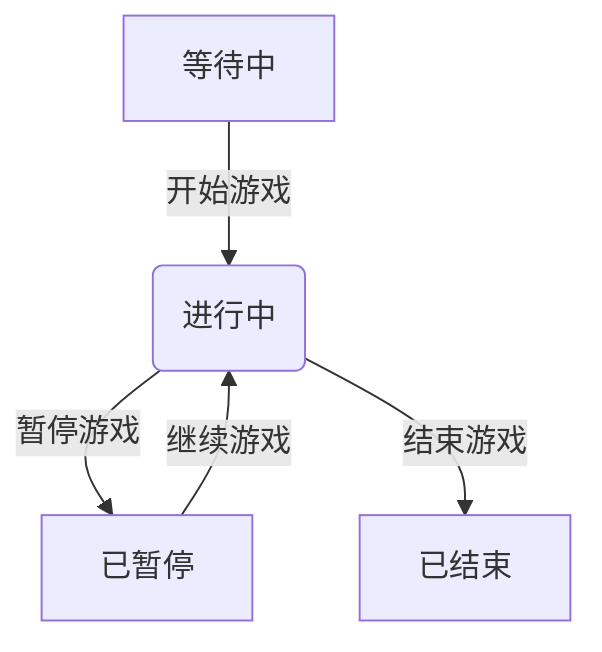

# 导演控制台迁移设计文档

## 1. 概述

本文档描述了将现有的 `DirectorConsole.vue` 组件迁移到一个新的目录结构中的设计方案。新的目录结构将包含一个主页面和多个管理页面，根据游戏状态动态显示相应的管理界面。

### 1.1 目标

- 将导演控制台功能拆分为更清晰的模块化结构
- 根据游戏状态动态加载不同的管理页面
- 保持与现有后端 API 的兼容性
- 遵循 Element Plus 设计风格

### 1.2 范围

本次迁移主要包括：
- 创建新的目录结构
- 实现主页面，包含题头和状态管理页
- 实现游戏前管理页面（演员管理和规则管理）
- 为游戏中管理和无管理页面预留空结构

## 2. 新目录结构设计

```
frontend/src/views/director/
├── DirectorMain.vue          # 导演控制台主页面
├── components/
│   ├── Header.vue            # 题头组件
│   └── StatusManager.vue     # 状态管理组件
└── management/               # 管理页面
    ├── PreGameManagement.vue # 游戏前管理主页面
    ├── ActorManagement.vue   # 演员管理组件
    ├── RuleManagement.vue    # 规则管理组件
    ├── InGameManagement.vue  # 游戏中管理页面（预留简单文字提示的空页面）
    └── PostGameManagement.vue # 无管理页面（预留简单文字提示的空页面）
```

## 3. 组件设计

### 3.1 DirectorMain.vue（导演控制台主页面）

主页面负责：
- 调用 `get_game_by_id_with_player_counts` 获取游戏详情
- 根据游戏状态决定加载哪个管理页面
- 提供统一的页面布局和导航

#### 3.1.1 状态映射关系

| 游戏状态 | 加载页面 |
|---------|---------|
| waiting | PreGameManagement.vue |
| running | InGameManagement.vue |
| paused | InGameManagement.vue |
| ended | PostGameManagement.vue |
| hidden | PostGameManagement.vue |
| deleted | PostGameManagement.vue |

### 3.2 Header.vue（题头组件）

题头组件展示：
- 游戏名称
- 游戏当前状态
- 状态变更按钮（根据当前状态显示不同按钮）

#### 3.2.1 状态变更按钮逻辑

| 当前状态 | 显示按钮 | 调用API |
|---------|---------|--------|
| waiting | 开始游戏 | update_game_status |
| running | 暂停游戏、结束游戏 | update_game_status |
| paused | 继续游戏 | update_game_status |

注意：
- 开始游戏和结束游戏操作不可逆，需要弹窗确认
- 按钮调用 `update_game_status` API 更新游戏状态

### 3.3 PreGameManagement.vue（游戏前管理页面）

游戏前管理页面包含：
- ActorManagement.vue（演员管理）
- RuleManagement.vue（规则管理）

#### 3.3.1 ActorManagement.vue（演员管理）

功能与现有 DirectorConsole.vue 中的演员管理功能一致：
- 演员列表展示
- 批量添加演员
- 批量删除演员
- 刷新演员列表

#### 3.3.2 RuleManagement.vue（规则管理）

新功能组件，用于：
- 展示当前游戏规则（从游戏详情中获取 rules_config）
- 允许编辑规则 JSON
- 调用 `update_game` API 保存规则变更

## 4. API 接口设计

### 4.1 获取游戏详情

```typescript
// 调用现有接口
const response = await gameService.getGameDetail(gameId)
```

### 4.2 更新游戏状态

```typescript
// 调用现有导演接口
const response = await apiClient.put(
  `/game/${gameId}/status`,
  { password: directorPassword, status: targetStatus }
)
```

### 4.3 更新游戏规则

```typescript
// 调用管理员接口更新游戏
const response = await adminClient.put(
  `/admin/games/${gameId}`,
  { rules_config: updatedRules }
)
```

## 5. 状态管理设计

### 5.1 游戏状态映射

```typescript
// 游戏状态到管理页面的映射
const statusToComponentMap = {
  'waiting': 'PreGameManagement',
  'running': 'InGameManagement',
  'paused': 'InGameManagement',
  'ended': 'PostGameManagement',
  'hidden': 'PostGameManagement',
  'deleted': 'PostGameManagement'
}
```

### 5.2 状态变更流程



## 6. UI/UX 设计

### 6.1 Element Plus 组件使用

- 使用 `el-card` 组织页面内容
- 使用 `el-button` 实现操作按钮
- 使用 `el-dialog` 实现确认弹窗
- 使用 `el-alert` 显示状态信息

### 6.2 响应式设计

- 保持与现有 DirectorConsole.vue 相同的响应式设计
- 在小屏幕设备上适配布局

## 7. 路由设计

### 7.1 路由配置更新

需要更新 `frontend/src/router/index.ts` 中的路由配置：

```typescript
{
  path: '/game/:id/director',
  name: 'DirectorMain',
  component: () => import('@/views/director/DirectorMain.vue'),
  meta: {
    title: '导演控制台'
  }
}
```