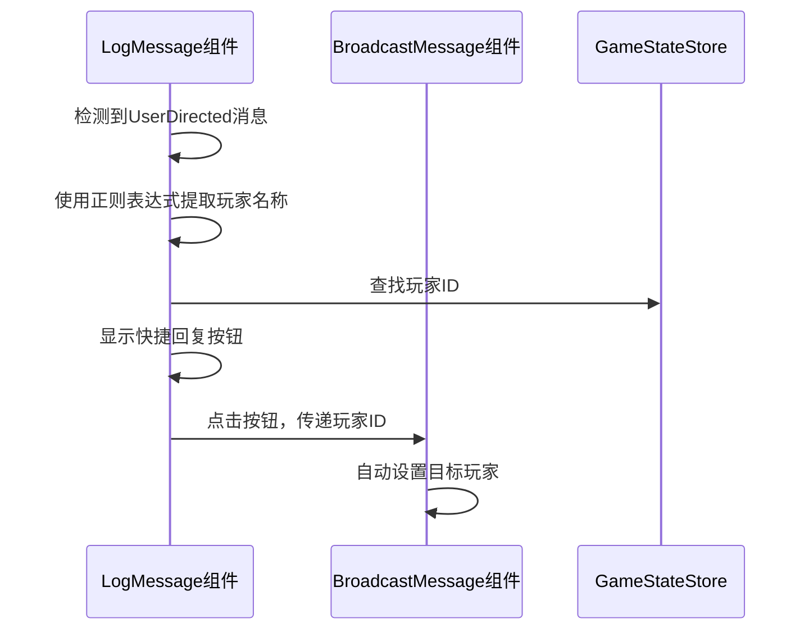
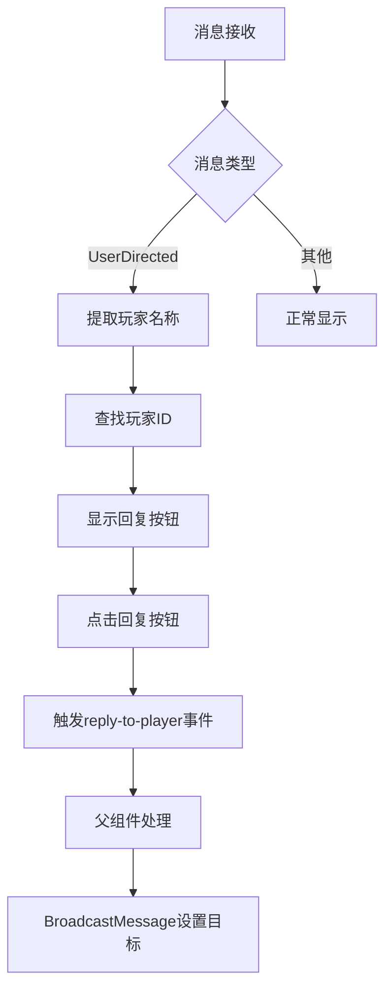

# 导演消息处理与快捷回复功能设计

## 1. 概述

本文档描述了在导演管理界面中，当`LogMessage`组件检测到`UserDirected`类型消息时，如何识别发送消息的玩家，并在消息旁添加快捷回复按钮，使导演能够一键跳转到`BroadcastMessage`组件并自动设置目标玩家的功能。

该设计旨在提升导演操作效率，提供更流畅的用户交互体验。此功能仅在导演端实现，演员端不显示回复按钮。

## 2. 功能需求

- 在导演端的`LogMessage`组件中识别`UserDirected`类型的消息
- 从消息内容中提取发送消息的玩家名称
- 为这类消息添加快捷回复按钮
- 点击按钮后跳转到`BroadcastMessage`组件，并自动设置目标为该玩家

## 3. 设计方案

### 3.1 消息格式分析

根据现有代码分析，`UserDirected`类型的消息具有以下特征：
- 消息类型为`UserDirected`
- 日志消息格式为："玩家 {player_name} 向导演发送消息: {message_content}"

### 3.2 玩家识别机制

1. 使用正则表达式从日志消息中提取玩家名称
2. 正则表达式模式：`玩家 (.*?) 向导演发送消息: `
3. 根据提取的玩家名称，在玩家列表中查找对应的玩家ID

### 3.3 组件交互设计



### 3.4 界面设计

1. 在`LogMessage`组件中，为符合条件的`UserDirected`消息添加"回复"按钮，仅在导演端显示
2. 按钮位于消息内容的右侧，使用Element Plus的`el-button`组件
3. 按钮点击事件触发跳转到`BroadcastMessage`组件的逻辑

## 4. 实现细节

### 4.1 LogMessage组件修改

1. 添加玩家名称提取方法：
   ```typescript
   const extractPlayerName = (message: string) => {
     const match = message.match(/玩家 (.*?) 向导演发送消息: /);
     return match ? match[1] : null;
   }
   ```

2. 添加回复按钮渲染逻辑（仅在导演端显示）：
   ```vue
   <div v-if="isDirector && message.message_type === 'UserDirected'" class="reply-section">
     <el-button 
       size="small" 
       type="primary" 
       @click="handleReply(message)"
     >
       回复
     </el-button>
   </div>
   ```

3. 添加回复处理方法：
   ```typescript
   const handleReply = (message: ActionResult) => {
     const playerName = extractPlayerName(message.log_message);
     if (playerName) {
       const player = props.players.find(p => p.name === playerName);
       if (player) {
         // 触发事件，通知父组件跳转到BroadcastMessage并设置目标玩家
         emit('reply-to-player', player.id);
       }
     }
   }
   ```

### 4.2 父组件修改

1. 在包含`LogMessage`和`BroadcastMessage`组件的导演端父组件中：
   - 监听`LogMessage`组件的`reply-to-player`事件
   - 将事件传递给`BroadcastMessage`组件

2. 在`BroadcastMessage`组件中：
   - 添加设置目标玩家的方法
   - 在组件挂载时检查是否有预设的目标玩家

### 4.3 样式调整

1. 为回复按钮添加适当的样式，确保与消息内容协调
2. 在小屏幕设备上调整布局，确保按钮可见性

## 5. 数据流设计



## 6. 错误处理

1. 如果无法从消息中提取玩家名称，不显示回复按钮
2. 如果找不到对应的玩家ID，显示错误提示
3. 添加适当的日志记录以便调试

## 7. 性能考虑

1. 正则表达式匹配在渲染时进行，避免重复计算
2. 玩家查找使用现有玩家列表，无需额外API调用
3. 事件传递机制简单高效，不会造成性能瓶颈