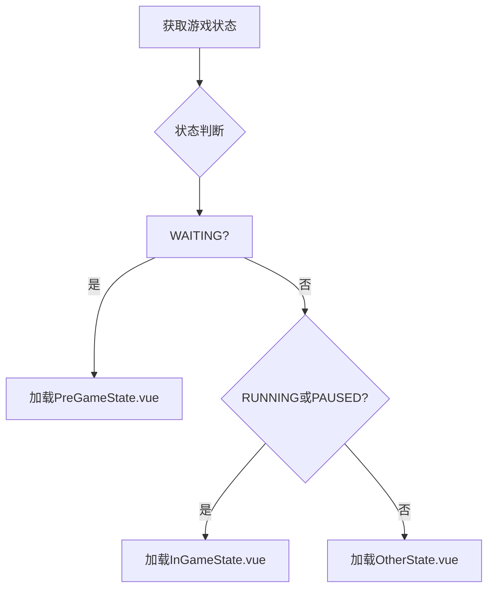
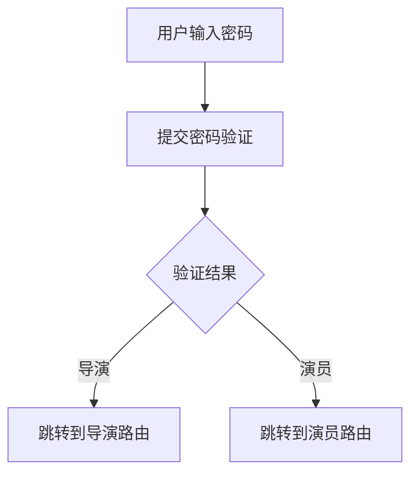
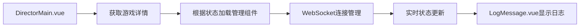
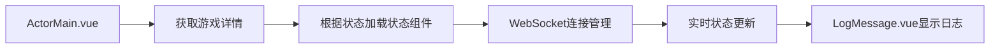

# 导演页面迁移与演员页面架构设计文档

## 1. 概述

### 1.1 项目背景
Royale Arena 是一个基于网页的大逃杀游戏，旨在提供实时、互动性强的多人在线生存竞技体验。本项目是对旧版导演工具的升级重构，提升稳定性与可扩展性。

### 1.2 设计目标
本次设计主要完成以下两个任务：
1. 迁移部分导演操作页已有逻辑，重构路由结构
2. 开发面向玩家的游戏操作页面架构

### 1.3 核心需求
- 将LogMessage.vue组件从导演目录架构下挪出，设置为可被导演页和演员页同时使用的公共Card控件
- 重构导演页面路由，由`/game/:id/:password`改为`/game/:id/director/:password`
- 设计演员端页面架构，包含题头、当前状态页、日志显示三大项
- 实现根据游戏状态动态加载对应管理页面的机制
- 根据密码验证结果跳转到导演或演员路由

## 2. 架构设计

### 2.1 前端架构概览
```
frontend/src/
├── views/
│   ├── director/           # 导演页面目录
│   │   ├── components/     # 导演专用组件
│   │   ├── management/     # 管理页面组件
│   │   └── DirectorMain.vue # 导演主页面
│   ├── actor/              # 演员页面目录（新增）
│   │   ├── components/     # 演员专用组件
│   │   ├── states/         # 状态页面组件
│   │   └── ActorMain.vue   # 演员主页面（新增）
├── router/
│   └── index.ts            # 路由配置
└── components/             # 全局通用组件
    └── LogMessage.vue      # 日志消息组件（从director/components迁移）
```

### 2.2 组件架构设计

#### 2.2.1 导演页面组件架构
```
DirectorMain.vue
├── Header.vue              # 题头组件
├── LogMessage.vue          # 日志消息组件（从components目录引入）
├── 管理组件（根据游戏状态动态加载）
│   ├── PreGameManagement.vue  # 游戏前管理
│   ├── InGameManagement.vue   # 游戏中管理
│   └── PostGameManagement.vue # 游戏后管理
```

#### 2.2.2 演员页面组件架构
```
ActorMain.vue
├── Header.vue              # 题头组件（共享或独立）
├── LogMessage.vue          # 日志消息组件（从components目录引入）
├── 状态组件（根据游戏状态动态加载）
│   ├── PreGameState.vue    # 游戏前状态（待实现）
│   ├── InGameState.vue     # 游戏中状态（留空）
│   └── OtherState.vue      # 其他状态（待实现）
```

### 2.3 路由架构设计

#### 2.3.1 导演路由
- `/game/:id/director` - 导演主页面（无密码）
- `/game/:id/director/:password` - 导演主页面（带密码）

#### 2.3.2 演员路由
- `/game/:id/actor` - 演员主页面（无密码）
- `/game/:id/actor/:password` - 演员主页面（带密码）

### 2.4 状态管理设计

#### 2.4.1 游戏状态映射关系
| 游戏状态 | 导演页面组件 | 演员页面组件 | 日志显示 |
|---------|-------------|-------------|---------|
| WAITING | PreGameManagement | PreGameState | 否 |
| RUNNING | InGameManagement | InGameState | 是 |
| PAUSED | InGameManagement | InGameState | 是 |
| ENDED | PostGameManagement | OtherState | 是 |
| HIDDEN | PostGameManagement | OtherState | 是 |
| DELETED | PostGameManagement | OtherState | 是 |

## 3. 组件详细设计

### 3.1 LogMessage.vue 组件迁移

#### 3.1.1 迁移前位置
`frontend/src/views/director/components/LogMessage.vue`

#### 3.1.2 迁移后位置
`frontend/src/components/LogMessage.vue`

#### 3.1.3 组件功能说明
- 实时显示游戏日志消息
- 支持按日期、演员、关键词筛选
- 支持只显示用户消息
- 支持消息分页显示
- 新消息高亮显示效果

#### 3.1.4 组件接口
| 属性 | 类型 | 必填 | 说明 |
|-----|------|------|-----|
| messages | ActionResult[] | 是 | 日志消息数组 |
| players | Array<{id: string, name: string}> | 是 | 演员列表 |

### 3.2 DirectorMain.vue 组件更新

#### 3.2.1 路由参数处理更新
- 更新路由匹配规则以支持新的路径结构
- 修改密码提取逻辑以适配新路由

#### 3.2.2 组件引用路径更新
- 更新LogMessage组件的引用路径为`@/components/LogMessage.vue`

### 3.3 ActorMain.vue 组件设计（新增）

#### 3.3.1 页面结构
- 左侧内容区域：题头组件 + 状态组件
- 右侧内容区域：日志消息组件（根据状态决定是否显示）

#### 3.3.2 状态组件映射


#### 3.3.3 日志显示逻辑
- 游戏状态为WAITING时：不显示日志组件
- 其他状态：显示日志组件

## 4. 路由配置设计

### 4.1 路由结构更新
``typescript
// 导演路由
{
  path: '/game/:id/director',
  name: 'DirectorMain',
  component: DirectorMain,
  meta: {
    title: '导演控制台'
  }
},
{
  path: '/game/:id/director/:password',
  name: 'DirectorMainWithPassword',
  component: DirectorMain,
  meta: {
    title: '导演控制台'
  }
},

// 演员路由
{
  path: '/game/:id/actor',
  name: 'ActorMain',
  component: () => import('@/views/actor/ActorMain.vue'),
  meta: {
    title: '演员界面'
  }
},
{
  path: '/game/:id/actor/:password',
  name: 'ActorMainWithPassword',
  component: () => import('@/views/actor/ActorMain.vue'),
  meta: {
    title: '演员界面'
  }
}
```

### 4.2 密码验证与路由跳转


## 5. UI/UX 设计规范

### 5.1 组件设计规范
- 所有组件遵循Element Plus设计风格
- 使用响应式设计，适配不同屏幕尺寸
- 组件间通信通过props和emits实现

### 5.2 布局规范
- 导演页面：左右分栏布局，左侧为管理组件，右侧为日志组件
- 演员页面：左右分栏布局，左侧为状态组件，右侧为日志组件（条件显示）

### 5.3 样式规范
- 使用Element Plus组件库
- 颜色方案遵循项目现有设计
- 所有输出使用简体中文

## 6. 数据流设计

### 6.1 导演页面数据流


### 6.2 演员页面数据流


## 7. 安全设计

### 7.1 路由安全
- 导演和演员路由通过密码验证区分访问权限
- 密码通过URL参数明文传递（按需求说明）

### 7.2 组件安全
- 共享组件不包含敏感逻辑
- 状态组件根据用户权限显示不同内容
