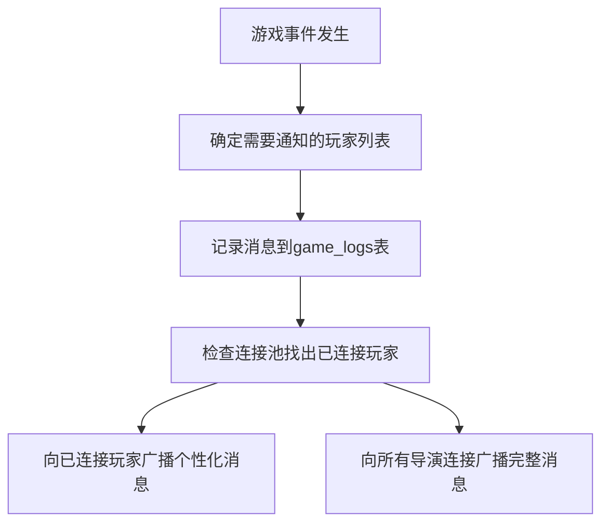

# 导演与玩家WebSocket消息广播设计文档

## 1. 概述

本文档详细描述了Royale Arena游戏中导演和玩家WebSocket接口的消息广播方案设计。该方案旨在确保所有游戏事件都能被正确记录并广播给相关的玩家和导演客户端，同时支持每个用户可能存在的多个WebSocket连接。特别地，设计确保了玩家之间状态的保密性，只有导演能够获取完整的游戏状态信息。

## 2. 架构设计

### 2.1 连接池管理

系统维护一个WebSocket连接池来管理所有已建立的玩家和导演连接：

```mermaid
graph TD
    A[WebSocket连接池] --> B[玩家连接映射]
    A --> C[导演连接列表]
    B --> D[玩家ID: [连接句柄1, 连接句柄2, ...]]
    C --> E[导演连接句柄列表]
```

### 2.2 消息处理流程

当游戏事件发生时，系统按照以下流程处理消息：



## 3. 消息广播方案

### 3.1 广播策略

1. **系统消息**（如游戏状态变更、天气变化等）：
   - 向所有已连接的玩家广播个性化消息（不包含其他玩家信息）
   - 向所有导演连接广播完整消息
2. **玩家特定消息**（如攻击结果、搜索结果等）：
   - 向相关玩家的所有连接广播消息
3. **导演消息**：
   - 向所有导演连接广播完整消息

### 3.2 消息格式

所有广播消息遵循统一的格式，确保客户端可以统一处理：

```json
{
  "type": "消息类型",
  "data": {
    // 具体数据内容
  }
}
```

### 3.3 玩家状态更新消息

当玩家状态发生变化时，向该玩家的所有连接广播包含完整玩家信息的消息：

```json
{
  "type": "player_update",
  "data": {
    "id": "玩家ID",
    "name": "玩家名称",
    "location": "当前位置",
    "life": "当前生命值",
    "strength": "当前体力值",
    "inventory": [
      {
        "id": "物品ID",
        "name": "物品名称",
        "item_type": "物品类型"
      }
    ],
    "equipped_item": "装备物品ID",
    "hand_item": "手持物品ID",
    "is_alive": "是否存活",
    "is_bound": "是否被捆绑",
    "rest_mode": "是否处于静养模式"
  }
}
```

### 3.4 游戏状态更新消息

当游戏全局状态发生变化时，系统会根据接收者类型发送不同的消息：

#### 向玩家广播的消息（仅包含该玩家相关信息）：

```json
{
  "type": "game_state",
  "data": {
    "game_phase": "当前游戏阶段",
    "weather": "天气条件",
    "night_start_time": "夜晚开始时间",
    "night_end_time": "夜晚结束时间",
    "next_night_destroyed_places": ["下一夜晚缩圈地点列表"],
    "player": {
      "id": "玩家ID",
      "name": "玩家名称",
      "location": "当前位置",
      "life": "当前生命值",
      "strength": "当前体力值",
      "is_alive": "是否存活",
      "rest_mode": "是否处于静养模式"
    },
    "places": [
      {
        "name": "地点名称",
        "is_destroyed": "是否已被摧毁"
        // 注意：不包含players字段
      }
    ]
  }
}
```

#### 向导演广播的消息（包含完整信息）：

```json
{
  "type": "game_state",
  "data": {
    "game_phase": "当前游戏阶段",
    "weather": "天气条件",
    "night_start_time": "夜晚开始时间",
    "night_end_time": "夜晚结束时间",
    "next_night_destroyed_places": ["下一夜晚缩圈地点列表"],
    "players": [
      {
        "id": "玩家ID",
        "name": "玩家名称",
        "location": "当前位置",
        "life": "当前生命值",
        "strength": "当前体力值",
        "is_alive": "是否存活",
        "rest_mode": "是否处于静养模式"
      }
    ],
    "places": [
      {
        "name": "地点名称",
        "players": ["在该地点的玩家ID列表"],
        "is_destroyed": "是否已被摧毁"
      }
    ]
  }
}
```

## 4. 具体动作广播实现

### 4.1 玩家动作广播

#### 出生 (born)
- **广播对象**：该玩家所有连接、所有导演连接
- **消息内容**：
  - 向玩家发送更新后的位置信息
  - 向导演发送更新后的完整游戏状态

#### 移动 (move)
- **广播对象**：该玩家所有连接、所有导演连接
- **消息内容**：
  - 向玩家发送更新后的位置和体力值
  - 向导演发送更新后的完整游戏状态

#### 搜索 (search)
- **广播对象**：该玩家所有连接、所有导演连接
- **消息内容**：
  - 向玩家发送搜索结果、更新后的体力值和上次搜索时间
  - 向导演发送更新后的完整游戏状态

#### 捡拾 (pick)
- **广播对象**：该玩家所有连接、所有导演连接
- **消息内容**：
  - 向玩家发送更新后的背包信息
  - 向导演发送更新后的完整游戏状态

#### 攻击 (attack)
- **广播对象**：攻击者所有连接、被攻击者所有连接、所有导演连接
- **消息内容**：
  - 向攻击者发送攻击结果（包含目标玩家状态）
  - 向被攻击者发送被攻击通知
  - 向导演发送更新后的完整游戏状态

#### 装备 (equip)
- **广播对象**：该玩家所有连接、所有导演连接
- **消息内容**：
  - 向玩家发送更新后的手持物品状态
  - 向导演发送更新后的完整游戏状态

#### 使用道具 (use)
- **广播对象**：该玩家所有连接、所有导演连接
- **消息内容**：
  - 向玩家发送更新后的玩家状态（生命值、背包、装备等）
  - 向导演发送更新后的完整游戏状态

#### 丢弃道具 (throw)
- **广播对象**：该玩家所有连接、所有导演连接
- **消息内容**：
  - 向玩家发送更新后的背包和手持物品状态
  - 向导演发送更新后的完整游戏状态

#### 传音 (deliver)
- **广播对象**：目标玩家所有连接、所有导演连接
- **消息内容**：
  - 向目标玩家发送传音消息内容
  - 向导演发送传音记录

#### 对话导演 (send)
- **广播对象**：所有导演连接
- **消息内容**：玩家发送给导演的消息

### 4.2 导演动作广播

#### 更新开始时间 (set_night_start_time)
- **广播对象**：所有玩家和导演的所有连接
- **消息内容**：
  - 向玩家发送更新后的夜晚开始时间
  - 向导演发送更新后的完整游戏状态

#### 更新结束时间 (set_night_end_time)
- **广播对象**：所有玩家和导演的所有连接
- **消息内容**：
  - 向玩家发送更新后的夜晚结束时间
  - 向导演发送更新后的完整游戏状态

#### 调整地点状态 (modify_place)
- **广播对象**：所有玩家和导演的所有连接
- **消息内容**：
  - 向玩家发送更新后的地点状态（不包含其他玩家信息）
  - 向导演发送更新后的完整地点状态

#### 设置缩圈地点 (set_destroy_places)
- **广播对象**：所有玩家和导演的所有连接
- **消息内容**：
  - 向玩家发送更新后的缩圈地点集合
  - 向导演发送更新后的完整游戏状态

#### 空投 (drop)
- **广播对象**：所有玩家和导演的所有连接
- **消息内容**：
  - 向玩家发送更新后的地点物品列表（不包含其他玩家信息）
  - 向导演发送更新后的完整地点状态

#### 调整天气 (weather)
- **广播对象**：所有玩家和导演的所有连接
- **消息内容**：
  - 向玩家发送更新后的天气条件
  - 向导演发送更新后的完整游戏状态

#### 加减生命 (life)
- **广播对象**：指定玩家所有连接、所有导演连接
- **消息内容**：
  - 向玩家发送更新后的生命值和存活状态
  - 向导演发送更新后的完整玩家状态

#### 加减体力 (strength)
- **广播对象**：指定玩家所有连接、所有导演连接
- **消息内容**：
  - 向玩家发送更新后的体力值
  - 向导演发送更新后的完整玩家状态

#### 移动角色 (move_player)
- **广播对象**：指定玩家所有连接、所有导演连接
- **消息内容**：
  - 向玩家发送更新后的位置信息
  - 向导演发送更新后的完整玩家状态

#### 增减道具 (give)
- **广播对象**：
  - 如果是给玩家：指定玩家所有连接、所有导演连接
  - 如果是放置地点：所有玩家和导演的所有连接
- **消息内容**：
  - 向玩家发送更新后的背包或地点物品列表（不包含其他玩家信息）
  - 向导演发送更新后的完整状态

#### 捆绑/松绑 (rope/unrope)
- **广播对象**：指定玩家所有连接、所有导演连接
- **消息内容**：
  - 向玩家发送更新后的绑定状态
  - 向导演发送更新后的完整玩家状态

#### 广播消息 (broadcast)
- **广播对象**：所有玩家和导演的所有连接
- **消息内容**：
  - 向玩家和导演发送系统广播消息

## 5. 技术实现要点

### 5.1 连接管理

1. 在WebSocket服务中维护一个连接池，记录所有玩家和导演的连接
2. 当新的WebSocket连接建立时，将其添加到对应用户的连接列表中
3. 当连接断开时，从对应用户的连接列表中移除该连接句柄

### 5.2 消息广播函数

实现统一的消息广播函数，支持以下功能：
1. 向指定玩家的所有连接广播个性化消息（不包含其他玩家信息）
2. 向所有导演连接广播完整消息
3. 根据接收者类型动态生成不同的消息内容

### 5.3 消息序列化

所有广播消息都应序列化为JSON格式，确保不同客户端可以正确解析。针对不同接收者，需要生成不同的消息内容：
1. 玩家消息：仅包含该玩家相关信息，隐藏其他玩家信息
2. 导演消息：包含完整的游戏状态信息

## 6. 错误处理

1. 当向某个连接发送消息失败时，应从连接池中移除该连接
2. 确保消息广播的原子性，避免部分连接收到消息而其他连接未收到的情况
3. 对于重要的游戏状态变更，应实现消息确认机制，确保消息被成功接收
4. 当生成个性化消息内容失败时，应记录错误日志并跳过该消息的发送