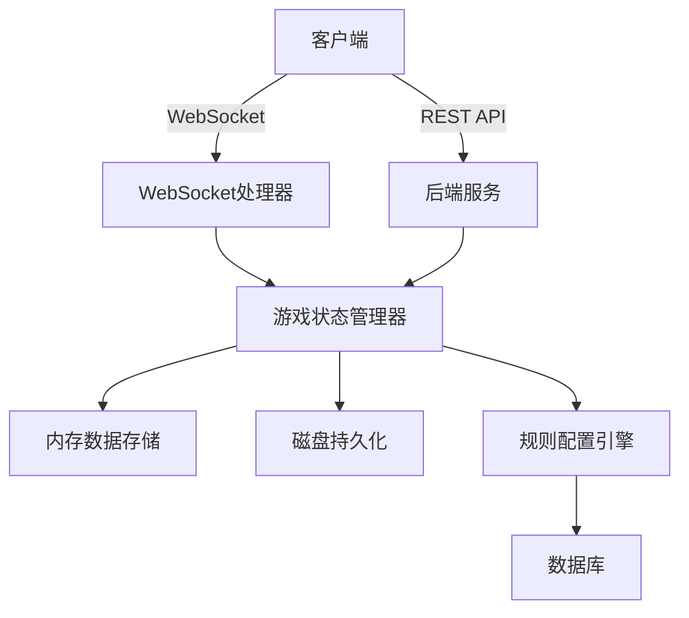
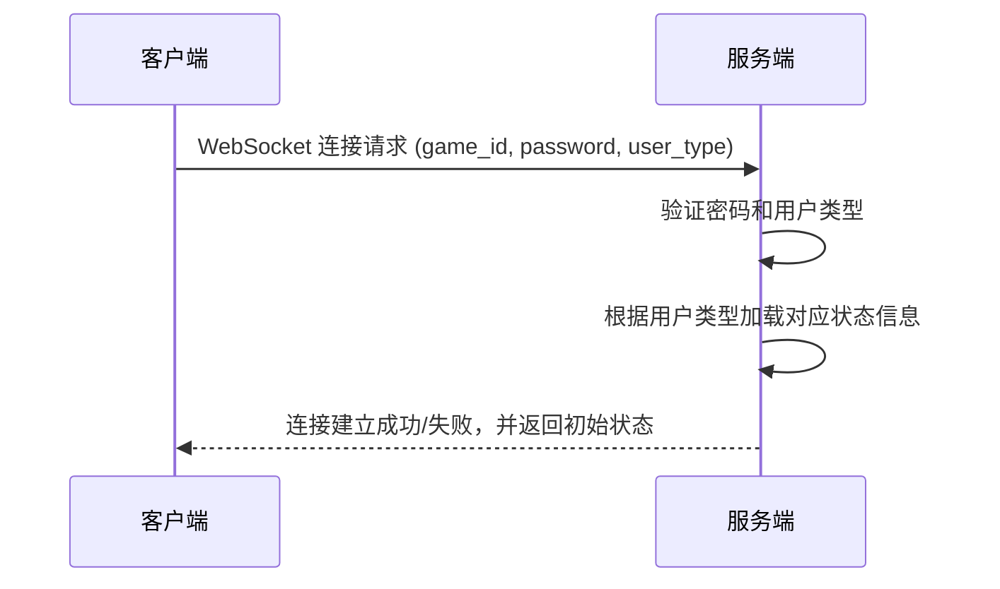
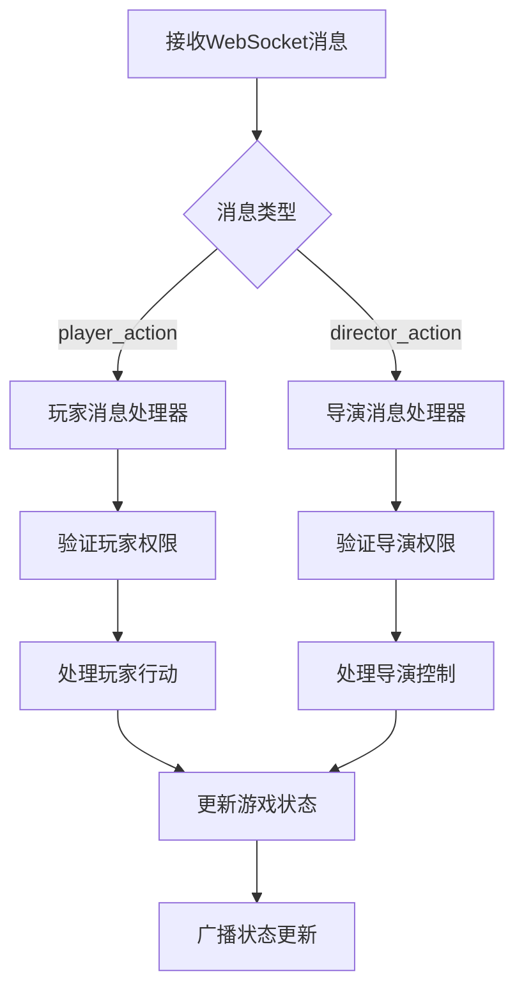

# Royale Arena API 扩展设计文档

## 1. 概述

本文档描述了 Royale Arena 游戏系统的 API 扩展设计，包括新增的导演更新游戏状态接口、WebSocket 通信实现以及游戏状态管理逻辑。

**注意：本文档中的设计需要随后在操作轨迹中更新/docs/api目录的相关文档，以记录我们对系统的新设计。**

### 1.1 项目背景

Royale Arena 是一个基于网页的大逃杀游戏，玩家在限定时间内执行一系列行动，包括移动、搜索、攻击和使用道具等操作。导演负责控制游戏进程、规则和状态。

### 1.2 设计目标

- 实现导演通过 REST API 更新游戏状态的功能
- 实现 WebSocket 通信以处理实时游戏请求
- 实现游戏状态变化时的磁盘持久化逻辑
- 实现基于游戏规则配置的动态游戏行为

### 1.3 核心功能

- 新增导演更新游戏状态的 REST API 接口
- 实现 WebSocket 通信处理玩家和导演的实时请求
- 实现游戏状态转换时的磁盘读写操作
- 实现基于游戏规则配置的动态游戏行为

## 2. 架构设计

### 2.1 系统架构



### 2.2 模块结构

- `game` 模块：扩展游戏状态更新功能
- `websocket` 模块：实现 WebSocket 通信处理
- `game_state` 模块：管理游戏状态和持久化
- `rules_engine` 模块：处理游戏规则配置

### 2.3 技术栈

- **编程语言**：Rust
- **Web框架**：Axum（支持WebSocket）
- **数据库**：SQLx库 + MySQL
- **序列化**：serde库
- **内存存储**：标准Rust数据结构

### 2.4 核心类设计

#### 2.4.1 游戏状态类 (GameState)

GameState 类用于存储整个游戏的当前状态，包括所有玩家状态、地点状态以及其他全局游戏信息。

##### 属性

- `game_id: String` - 游戏ID
- `players: HashMap<String, Player>` - 玩家状态映射，键为玩家ID
- `places: HashMap<String, Place>` - 地点状态映射，键为地点名称
- `game_phase: GamePhase` - 当前游戏阶段（白天/夜晚）
- `weather: f64` - 天气条件（影响搜索可见性）
- `votes: HashMap<String, String>` - 投票记录，键为投票者ID，值为被投票者ID
- `rules_config: serde_json::Value` - 游戏规则配置
- `night_start_time: Option<DateTime<Utc>>` - 夜晚开始时间
- `night_end_time: Option<DateTime<Utc>>` - 夜晚结束时间
- `next_night_destroyed_places: Vec<String>` - 下一夜晚缩圈地点集合

#### 2.4.2 玩家类 (Player)

Player 类用于存储单个玩家的当前状态。

##### 属性

- `id: String` - 玩家ID
- `name: String` - 玩家名称
- `location: String` - 当前位置
- `life: i32` - 当前生命值
- `strength: i32` - 当前体力值
- `inventory: Vec<Item>` - 物品背包
- `equipped_item: Option<String>` - 当前装备的物品
- `hand_item: Option<String>` - 当前手持的物品
- `last_search_result: Option<SearchResult>` - 上一次搜索结果
- `is_alive: bool` - 是否存活
- `is_bound: bool` - 是否被捆绑（禁止行动）
- `rest_mode: bool` - 是否处于静养模式
- `last_search_time: Option<DateTime<Utc>>` - 上次搜索时间
- `votes: i32` - 当前持有票数

#### 2.4.3 地点类 (Place)

Place 类用于存储单个地点的当前状态。

##### 属性

- `name: String` - 地点名称
- `players: Vec<String>` - 在该地点的玩家ID列表
- `items: Vec<Item>` - 在该地点的物品列表
- `is_destroyed: bool` - 是否已被摧毁（缩圈）

#### 2.4.4 物品类 (Item)

Item 类用于表示游戏中的各种道具。

##### 属性

- `id: String` - 物品ID
- `name: String` - 物品名称
- `item_type: ItemType` - 物品类型（武器、消耗品等）
- `properties: serde_json::Value` - 物品属性（伤害值、恢复值等）

#### 2.4.5 搜索结果类 (SearchResult)

SearchResult 类用于存储玩家搜索行动的结果。

##### 属性

- `target_type: SearchResultType` - 搜索到的目标类型（玩家、物品等）
- `target_id: String` - 目标ID
- `target_name: String` - 目标名称
- `is_visible: bool` - 是否可见（受天气影响）

## 3. API 设计

### 3.1 更新游戏状态接口

#### 接口详情
- **URL**: `PUT /api/game/{game_id}/status`
- **方法**: PUT
- **权限**: 需要导演密码验证

#### 请求参数
| 参数名 | 类型 | 必填 | 说明 |
|--------|------|------|------|
| game_id | string | 是 | 游戏ID |
| password | string | 是 | 导演密码 |
| status | string | 是 | 目标游戏状态 (waiting, running, paused, ended) |

#### 响应格式
```json
{
  "success": true,
  "message": "Game status updated successfully"
}
```

#### 状态转换逻辑
| 当前状态 | 目标状态 | 操作 |
|----------|----------|------|
| waiting | running | 开始游戏，启动 WebSocket 监听 |
| running | paused | 暂停游戏，保存游戏状态到磁盘 |
| running | ended | 结束游戏，保存游戏状态到磁盘 |
| paused | running | 恢复游戏，从磁盘读取游戏状态 |

### 3.2 获取玩家消息记录接口

#### 接口详情
- **URL**: `GET /api/game/{game_id}/player/{player_id}/messages`
- **方法**: GET
- **权限**: 需要玩家密码验证

#### 请求参数
| 参数名 | 类型 | 必填 | 说明 |
|--------|------|------|------|
| game_id | string | 是 | 游戏ID |
| player_id | string | 是 | 玩家ID |
| password | string | 是 | 玩家密码 |

#### 响应格式
```json
{
  "success": true,
  "data": [
    {
      "id": "string",
      "timestamp": "ISO8601 datetime",
      "type": "SystemNotice|UserDirected",
      "message": "string"
    }
  ]
}
```

#### 错误响应
```json
{
  "success": false,
  "error": "错误描述"
}
```

#### 说明
- 此接口用于获取与指定玩家相关的所有过往消息记录
- 客户户端在提供正确密码后可随时调用此接口获取历史消息
- 消息类型与数据库game_logs表结构一致，包括SystemNotice和UserDirected两种类型
- 消息按时间顺序排列，最新的消息在列表末尾
- 此接口返回的消息格式与WebSocket推送的消息格式完全一致
- 注意：虽然数据库game_logs表包含player_id字段，但在API返回的消息格式中不包含该字段

#### 错误响应
```json
{
  "success": false,
  "error": "错误描述"
}
```

## 4. WebSocket 实现

### 4.1 连接认证


#### 4.1.1 玩家连接初始化
当玩家建立 WebSocket 连接时，如果游戏不处于"进行中"状态，服务端将拒绝连接并返回失败原因（例如已结束或暂停中）。连接成功时，服务端返回玩家当前状态信息：
- 位置
- 血量
- 体力
- 装备栏
- 背包
- 当前持有票数
- 夜晚开始和结束时间
- 当前所有地点名单
- 接下来缩圈的地点名单

注意：与该玩家相关的过往消息记录已拆分为独立的REST API接口获取，不在WebSocket连接初始化时返回。

#### 4.1.2 导演连接初始化
当导演建立 WebSocket 连接时，如果游戏不处于"进行中"状态，服务端将拒绝连接并返回失败原因（例如已结束或暂停中）。连接成功时，服务端返回完整游戏状态信息：
- 游戏状态
- 夜晚开始结束时间
- 所有玩家状态
- 所有地点状态

### 4.2 消息处理流程


### 4.3 消息格式

#### 客户端发送消息
```json
{
  "type": "player_action|director_action",
  "data": {
    "action": "action_name",
    "params": {}
  }
}
```

#### 服务端推送消息
```json
{
  "type": "game_state|player_update|system_message|error",
  "data": {},
  "message_data": {
    "id": "string",
    "timestamp": "ISO8601 datetime",
    "type": "SystemNotice|UserDirected",
    "message": "string"
  }
}
```

**说明：** WebSocket推送的消息格式与REST API获取玩家消息记录接口返回的格式完全一致，确保客户端可以统一处理。

### 4.4 WebSocket 行为交互设计

#### 4.4.1 玩家行为设计

所有玩家行动（除与导演对话外）均只能在玩家存活状态下使用，且只在夜晚状态可用。如果玩家不满足前置条件，系统将返回相应的错误提示信息。

##### 出生 (born)
- **前置条件**: 玩家未执行过出生
- **操作流程**:
  1. 验证指定地点是否存在且未被摧毁
  2. 更新玩家位置到指定地点
  3. 将玩家添加到地点的玩家列表中
  4. 向该玩家发送位置更新结果

##### 移动 (move)
- **前置条件**: 玩家处于存活状态，有足够体力
- **操作流程**:
  1. 验证目标地点是否存在且未被摧毁
  2. 消耗体力值（根据规则配置）
  3. 从当前地点移除玩家
  4. 更新玩家位置到目标地点
  5. 将玩家添加到目标地点的玩家列表中
  6. 向该玩家发送位置更新结果

##### 搜索 (search)
- **前置条件**: 玩家处于存活状态，有足够体力，未处于搜索冷却期
- **操作流程**:
  1. 消耗体力值（根据规则配置）
  2. 更新上次搜索时间
  3. 随机确定搜索结果（玩家/物品/空）
  4. 根据天气条件确定结果可见性
  5. 更新玩家的上次搜索结果
  6. 向该玩家发送搜索结果

##### 捡拾 (pick)
- **前置条件**: 玩家处于存活状态，上一次搜索结果为物品
- **操作流程**:
  1. 验证上一次搜索到的物品是否仍然存在
  2. 从地点物品列表中移除物品
  3. 将物品添加到玩家背包
  4. 向该玩家发送背包更新
  5. 如果物品不存在，向该玩家发送捡拾失败消息

##### 攻击 (attack)
- **前置条件**: 玩家处于存活状态，上一次搜索结果为玩家，玩家装备了武器
- **操作流程**:
  1. 验证上一次搜索到的玩家是否仍然在同一地点且存活
  2. 根据武器属性计算伤害
  3. 减少目标玩家生命值
  4. 检查目标玩家是否死亡
  5. 向攻击者发送攻击结果（仅包括主目标）
  6. 向被攻击者发送被攻击通知（不包括攻击者身份）
  7. 如果目标玩家已离开或死亡，向攻击者发送攻击失败消息
  8. 消耗体力值（根据规则配置）

##### 拿在手上 (equip)
- **前置条件**: 玩家处于存活状态，背包中有指定物品
- **操作流程**:
  1. 验证玩家背包中是否存在指定物品
  2. 更新玩家当前手持物品
  3. 向该玩家发送手持物品状态更新

##### 使用道具 (use)
- **前置条件**: 玩家处于存活状态，手持道具
- **操作流程**:
  1. 根据道具类型执行相应效果
     - 如果是消耗品：恢复生命值、传送等，并从玩家背包中移除消耗品
     - 如果是装备类：装备到对应位置，替换原有装备
  2. 更新玩家状态
  3. 向该玩家发送状态更新

##### 丢弃道具 (throw)
- **前置条件**: 玩家处于存活状态，背包中有指定物品
- **操作流程**:
  1. 从玩家背包中移除物品
  2. 将物品添加到当前地点的物品列表
  3. 向该玩家发送背包更新

##### 传音 (deliver)
- **前置条件**: 玩家处于存活状态
- **操作流程**:
  1. 向目标玩家发送消息
  2. 消耗体力值（根据规则配置）

##### 对话导演 (send)
- **前置条件**: 无特定限制
- **操作流程**:
  1. 将消息转发给导演客户端

#### 4.4.2 导演行为设计

##### 更新开始时间 (set_night_start_time)
- **前置条件**: 无特定限制
- **操作流程**:
  1. 更新游戏状态中的夜晚开始时间
  2. 向所有客户端广播更新后的时间设置

##### 更新结束时间 (set_night_end_time)
- **前置条件**: 无特定限制
- **操作流程**:
  1. 更新游戏状态中的夜晚结束时间
  2. 向所有客户端广播更新后的时间设置

##### 调整地点状态 (modify_place)
- **前置条件**: 无特定限制
- **操作流程**:
  1. 更新指定地点的摧毁状态（可摧毁或恢复）
  2. 检查地点内的玩家是否受影响
  3. 向相关客户端广播地点状态更新

##### 设置缩圈地点 (set_destroy_places)
- **前置条件**: 无特定限制
- **操作流程**:
  1. 更新下一夜晚缩圈地点集合
  2. 向所有客户端广播更新后的缩圈地点集合

##### 空投 (drop)
- **前置条件**: 无特定限制
- **操作流程**:
  1. 在指定地点添加空投物品
  2. 向所有客户端广播地点物品更新

##### 调整天气 (weather)
- **前置条件**: 无特定限制
- **操作流程**:
  1. 更新天气条件值
  2. 向所有客户端广播天气更新

##### 加减生命 (life)
- **前置条件**: 无特定限制
- **操作流程**:
  1. 更新指定玩家生命值
  2. 检查玩家是否死亡或复活
  3. 向相关客户端广播玩家状态更新
  4. 如果玩家生命值降至0，标记玩家为死亡状态
  5. 如果玩家从0生命值恢复，标记玩家为存活状态

##### 加减体力 (strength)
- **前置条件**: 无特定限制
- **操作流程**:
  1. 更新指定玩家体力值
  2. 向所有客户端广播玩家状态更新

##### 移动角色 (move_player)
- **前置条件**: 无特定限制
- **操作流程**:
  1. 验证目标地点是否存在且未被摧毁
  2. 从当前地点移除玩家
  3. 更新玩家位置到目标地点
  4. 将玩家添加到目标地点的玩家列表中
  5. 向所有客户端广播玩家位置更新

##### 增减道具 (give)
- **前置条件**: 无特定限制
- **操作流程**:
  1. 创建新物品
  2. 将物品添加到指定玩家背包或指定地点物品列表
  3. 向相关客户端广播物品更新

##### 捆绑/松绑 (rope/unrope)
- **前置条件**: 无特定限制
- **操作流程**:
  1. 更新指定玩家的绑定状态
  2. 向该玩家发送状态更新

##### 广播消息 (broadcast)
- **前置条件**: 无
- **操作流程**:
  1. 向所有客户端发送系统消息

## 5. 游戏状态管理

### 5.1 状态转换处理

#### 开始游戏 (waiting → running)
1. 验证当前状态为 "waiting"
2. 更新数据库中游戏状态为 "running"
3. 启动 WebSocket 监听器
4. 初始化游戏内存状态
5. 开始接受 WebSocket 连接请求

#### 暂停/结束游戏 (running → paused/ended)
1. 验证当前状态为 "running"
2. 更新数据库中游戏状态为 "paused" 或 "ended"
3. 将当前游戏状态序列化并保存到磁盘文件
4. 关闭 WebSocket 监听器
5. 中断所有已建立的 WebSocket 连接
6. 通知所有连接的客户端

#### 恢复游戏 (paused → running)
1. 验证当前状态为 "paused"
2. 更新数据库中游戏状态为 "running"
3. 从磁盘文件读取游戏状态并恢复到内存
4. 重新启动 WebSocket 监听器
5. 开始接受 WebSocket 连接请求

### 5.2 磁盘持久化

#### 存储格式
```json
{
  "game_id": "string",
  "timestamp": "ISO8601 datetime",
  "state": {}
}
```

#### 文件命名规范
- 暂存文件: `game_{game_id}_temp.json`
- 持久化文件: `game_{game_id}_{timestamp}.json`

### 5.3 内存状态管理

游戏运行时的所有状态都保存在内存中，通过 GameState 类进行管理。内存状态包括：

1. 所有玩家的实时状态（位置、生命值、体力值、背包等）
2. 所有地点的实时状态（玩家列表、物品列表、是否被摧毁等）
3. 游戏全局状态（当前阶段、天气、投票记录、夜晚时间设定等）

内存状态在以下情况下更新：
- 玩家执行行动（移动、搜索、攻击等）
- 导演执行控制（开始/结束行动、缩圈、调整天气等）
- 系统自动更新（处理死亡玩家、恢复体力等）

内存状态通过 WebSocket 实时推送给所有连接的客户端。

### 5.4 WebSocket连接池与消息广播架构

为了确保所有游戏事件都能被正确记录和广播，系统采用以下架构设计：

1. **连接池管理**
   - 服务器维护一个WebSocket连接池，记录所有已建立的玩家和导演连接
   - 由于每名玩家或导演可能与服务器建立多个WebSocket连接，连接池需要支持一个用户ID对应多个连接句柄
   - 连接池以玩家ID或导演标识为键，WebSocket连接句柄列表为值
   - 当新的WebSocket连接建立时，将其添加到对应用户的连接列表中
   - 当连接断开时，从对应用户的连接列表中移除该连接句柄

2. **消息处理流程**
   - 当游戏事件发生时，服务器首先确定需要通知的玩家列表
   - 无论这些玩家当前是否有WebSocket连接，都将消息记录到game_logs表中（包含player_id字段用于数据库查询）
   - 然后检查连接池，找出当前已建立连接的玩家
   - 只向已建立连接的玩家广播消息，未连接的玩家可以在下次连接时通过获取玩家消息记录接口获取历史消息
   - 注意：虽然数据库game_logs表包含player_id字段，但在API和WebSocket返回的消息格式中不包含该字段

3. **消息广播策略**
   - 系统消息（如游戏状态变更、天气变化等）：广播给所有已连接的玩家和导演
   - 玩家特定消息（如攻击结果、搜索结果等）：广播给相关玩家的所有连接
   - 导演消息：广播给所有导演连接

4. **架构优势**
   - 确保所有游戏事件都被持久化记录，不会因网络问题丢失
   - 支持玩家离线后重新连接时获取历史消息
   - 减少不必要的网络传输，只向已连接的客户端广播消息
   - 提高系统的可靠性和用户体验

## 6. 游戏规则引擎

### 6.1 规则配置结构
```json
{
  "game_flow": {
    "day_duration": 300,
    "night_duration": 900
  },
  "map": {
    "places": ["码头", "工厂", "..."]
  },
  "player": {
    "max_life": 100,
    "max_strength": 100,
    "daily_strength_recovery": 40
  },
  "action": {
    "move_cost": 5,
    "search_cost": 5,
    "search_cooldown": 30
  },
  "rest_mode": {
    "life_recovery": 25,
    "max_moves": 1
  },
  "teammate_behavior": 0
}
```

### 6.2 规则应用
- 游戏开始时从数据库加载规则配置
- 在处理玩家行动时应用相关规则
- 在处理导演控制时应用相关规则

## 7. 错误处理

### 7.1 REST API 错误响应
```json
{
  "success": false,
  "error": "错误描述"
}
```

### 7.2 WebSocket 错误消息
```json
{
  "type": "error",
  "data": {
    "code": "ERROR_CODE",
    "message": "错误描述"
  }
}
```

## 8. 安全考虑

- 所有导演操作需要密码验证
- WebSocket 连接需要身份验证
- 玩家和导演权限分离
- 游戏状态文件访问控制

## 9. 性能优化

- 内存中维护活跃游戏状态
- 异步处理 WebSocket 消息
- 批量处理状态更新广播
- 定期清理过期游戏状态

## 10. 数据结构定义

### 10.1 枚举类型

#### GamePhase
- `Day` - 白天（投票时间）
- `Night` - 夜晚（行动时间）

#### SearchResultType
- `Player` - 玩家
- `Item` - 物品
- `None` - 无结果

#### ItemType
- `Weapon` - 武器
- `Consumable` - 消耗品
- `Tool` - 工具

### 10.2 状态更新消息格式

#### 游戏状态更新
```json
{
  "type": "game_state",
  "data": {
    "game_phase": "day|night",
    "weather": "number",
    "safe_zones": ["string"],
    "players": [
      {
        "id": "string",
        "name": "string",
        "location": "string",
        "life": "integer",
        "strength": "integer",
        "is_alive": "boolean",
        "rest_mode": "boolean"
      }
    ],
    "places": [
      {
        "name": "string",
        "players": ["string"],
        "is_destroyed": "boolean"
      }
    ]
  }
}
```

#### 玩家状态更新
```json
{
  "type": "player_update",
  "data": {
    "life": "integer",
    "strength": "integer",
    "inventory": [
      {
        "id": "string",
        "name": "string",
        "item_type": "weapon|consumable|tool"
      }
    ],
    "equipped_item": "string",
    "location": "string",
    "is_alive": "boolean",
    "rest_mode": "boolean"
  }
}
```