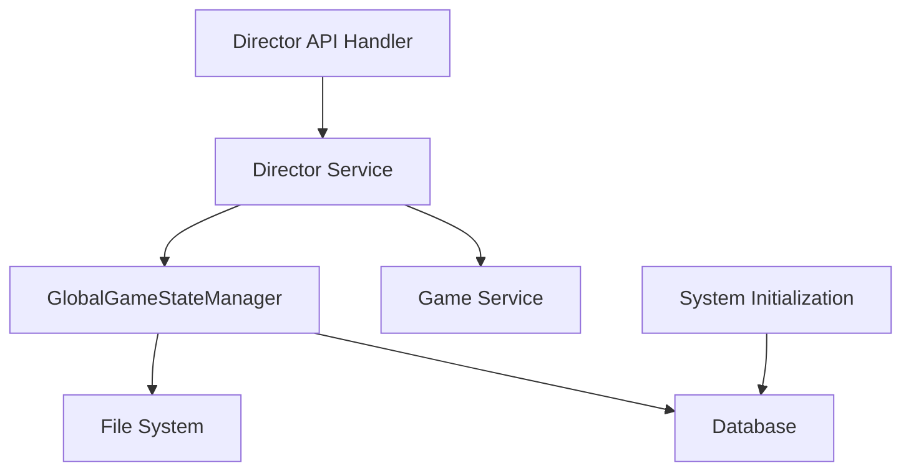

# 重写导演暂停、继续游戏功能及游戏状态存盘读取逻辑设计文档

## 1. 概述

本文档旨在设计和规范游戏状态管理功能的重构，包括游戏状态的存盘与读取逻辑，以及导演相关切换状态的API增强功能。目标是提供更灵活的游戏状态管理机制，支持多存档版本管理，增强导演对游戏进程的控制能力。

### 1.1 背景
当前系统的游戏状态管理仅支持单一存档文件，且在暂停/恢复游戏时缺乏对特定存档版本的选择能力。为了提升系统的灵活性和用户体验，需要重构相关功能。

### 1.2 目标
1. 实现游戏状态的多版本存盘管理
2. 支持指定存档文件的读取功能
3. 增强导演API，支持存盘版本选择和手动存盘操作
4. 提供存档文件列表查询功能

## 2. 架构设计

### 2.1 系统组件关系


### 2.2 核心模块职责
- **Director API Handler**: 处理导演端的HTTP请求，验证参数和权限
- **Director Service**: 实现导演业务逻辑，包括游戏状态转换和存档管理
- **GlobalGameStateManager**: 管理游戏状态的内存存储和持久化操作
- **Game Service**: 提供游戏基础信息服务
- **System Initialization**: 系统启动时执行初始化任务

## 3. 功能详细设计

### 3.1 游戏状态存盘与读取

#### 3.1.1 存盘逻辑
- 存盘操作将当前内存中的游戏状态序列化为JSON格式
- 存档文件按游戏ID组织目录结构
- 每个存档文件具有唯一标识符（时间戳）
- 存盘操作返回存档文件名供后续使用

#### 3.1.2 读取逻辑
- 读取操作需要指定存档文件名
- 从指定文件中反序列化游戏状态到内存中
- 支持读取任意历史存档版本

### 3.2 导演状态切换API增强

#### 3.2.1 暂停游戏API
- 保持原有暂停功能逻辑
- 暂停时必须执行一次存盘操作
- 返回存盘文件名
- 使用现有的update_game_status接口处理

#### 3.2.2 继续游戏API
- 增加存档文件名参数，指定从哪个存档恢复游戏状态
- 验证存档文件存在性
- 从指定存档文件加载游戏状态到内存
- 使用现有的update_game_status接口处理

#### 3.2.3 手动存盘API
- 提供独立的存盘接口，不改变游戏状态
- 返回存盘文件名

#### 3.2.4 存档列表查询API
- 提供查询指定游戏所有存档文件的接口
- 返回存档文件名列表及创建时间信息

## 4. API接口设计

### 4.1 请求/响应结构

#### 4.1.1 暂停游戏请求
| 字段名 | 类型 | 必填 | 描述 |
|--------|------|------|------|
| password | string | 是 | 导演密码 |
| status | string | 是 | 目标状态，应为"paused" |

#### 4.1.2 暂停游戏响应
| 字段名 | 类型 | 描述 |
|--------|------|------|
| success | boolean | 操作是否成功 |
| message | string | 操作结果消息 |
| save_file_name | string | 存盘文件名 |

#### 4.1.3 继续游戏请求
| 字段名 | 类型 | 必填 | 描述 |
|--------|------|------|------|
| password | string | 是 | 导演密码 |
| status | string | 是 | 目标状态，应为"running" |
| save_file_name | string | 是 | 要加载的存档文件名 |

#### 4.1.4 继续游戏响应
| 字段名 | 类型 | 描述 |
|--------|------|------|
| success | boolean | 操作是否成功 |
| message | string | 操作结果消息 |

#### 4.1.5 手动存盘请求
| 字段名 | 类型 | 必填 | 描述 |
|--------|------|------|------|
| password | string | 是 | 导演密码 |

#### 4.1.6 手动存盘响应
| 字段名 | 类型 | 描述 |
|--------|------|------|
| success | boolean | 操作是否成功 |
| message | string | 操作结果消息 |
| save_file_name | string | 存盘文件名 |

#### 4.1.7 存档列表查询响应
| 字段名 | 类型 | 描述 |
|--------|------|------|
| success | boolean | 操作是否成功 |
| data | array | 存档文件信息列表 |
| data[].file_name | string | 存档文件名 |
| data[].created_at | string | 创建时间 |

### 4.2 API端点

#### 4.2.1 暂停游戏
- **URL**: `PUT /game/{game_id}/status`
- **Method**: PUT
- **Description**: 暂停游戏并执行存盘操作，使用update_game_status接口

#### 4.2.2 继续游戏
- **URL**: `PUT /game/{game_id}/status`
- **Method**: PUT
- **Description**: 从指定存档继续游戏，使用update_game_status接口

#### 4.2.3 手动存盘
- **URL**: `POST /game/{game_id}/save`
- **Method**: POST
- **Description**: 执行手动存盘操作

#### 4.2.4 查询存档列表
- **URL**: `GET /game/{game_id}/saves`
- **Method**: GET
- **Description**: 获取游戏的所有存档文件列表

## 5. 数据模型设计

### 5.1 存档文件命名规范
存档文件名采用以下格式：
```
{timestamp}.json
```
其中：
- `timestamp`: ISO 8601格式的时间戳（精确到毫秒）

### 5.2 存档文件存储结构
```
game_states/
└── {game_id}/
    ├── 2023-01-01T10:00:00.000Z.json
    ├── 2023-01-01T11:30:00.000Z.json
    └── 2023-01-01T14:45:00.000Z.json
```

## 6. 业务逻辑层设计

### 6.1 DirectorService增强功能

#### 6.1.1 pause_game
增强原有的暂停游戏功能，必须执行存盘操作：
1. 验证导演密码
2. 更新数据库游戏状态为"paused"
3. 调用GlobalGameStateManager执行存盘操作
4. 返回操作结果及存盘文件名

#### 6.1.2 resume_game
增强原有的恢复游戏功能，从指定存档恢复游戏：
1. 验证导演密码
2. 验证存档文件存在性
3. 调用GlobalGameStateManager从指定文件加载游戏状态
4. 更新数据库游戏状态为"running"
5. 返回操作结果

#### 6.1.3 manual_save
手动执行存盘操作：
1. 验证导演密码
2. 调用GlobalGameStateManager执行存盘操作
3. 返回操作结果及存盘文件名

#### 6.1.4 list_save_files
查询存档文件列表：
1. 验证导演密码
2. 查询指定游戏ID目录下的所有存档文件
3. 返回文件名列表及创建时间

### 6.2 GlobalGameStateManager增强功能

#### 6.2.1 save_game_state_to_disk_with_name
增强原有存盘方法，支持指定存档文件名：
1. 序列化当前游戏状态
2. 生成唯一存档文件名
3. 将序列化数据写入指定文件
4. 返回存档文件名

#### 6.2.2 load_game_state_from_disk_with_name
增强原有读取方法，支持指定存档文件名：
1. 验证存档文件存在性
2. 从指定文件读取序列化数据
3. 反序列化为游戏状态对象
4. 更新内存中的游戏状态

#### 6.2.3 list_save_files
提供存档文件列表查询功能：
1. 遍历指定游戏ID目录下的所有存档文件
2. 提取文件名和创建时间信息
3. 返回文件信息列表

## 7. 系统初始化

### 7.1 游戏状态恢复
系统启动时，需要将数据库中状态为"进行中"的游戏全部变更为"暂停中"状态，以确保系统状态的一致性。

## 8. 安全与权限控制

### 8.1 导演身份验证
所有API操作均需验证导演密码，确保只有合法导演可以操作游戏状态。

### 8.2 存档文件访问控制
存档文件按游戏ID隔离存储，确保不同游戏间的存档文件不会相互访问。

### 8.3 输入验证
对所有输入参数进行严格验证，防止路径遍历等安全问题。

## 8. 错误处理

### 9.1 常见错误场景
1. 导演密码错误
2. 存档文件不存在
3. 存档文件格式错误
4. 数据库操作失败
5. 文件系统操作失败

### 9.2 错误响应格式
```json
{
  "success": false,
  "error": {
    "code": "ERROR_CODE",
    "message": "错误描述信息"
  }
}
```