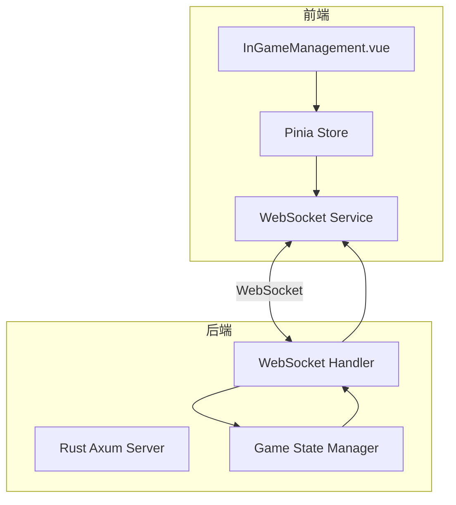

# 前端导演控制台功能完善设计文档

## 1. 概述

本文档旨在设计和实现 Royale Arena 游戏中"进行中"状态下前端导演控制台的完整功能。当前前端界面已实现了广播消息和随机空投两个小组件，本设计将补充所有其他导演可管理的功能，包括天气调节、夜晚时间设置、缩圈地点设置、地点状态调整、玩家状态调整等。

设计将基于现有的 WebSocket 连接机制，通过扩展 `InGameManagement.vue` 组件来实现所有导演控制功能，并确保在接收到 `updateGameState` 触发时，相关 Vue 控件能自动更新数值。

## 2. 架构设计

### 2.1 技术栈
- **框架**: Vue 3 (Composition API)
- **语言**: TypeScript
- **UI库**: Element Plus
- **状态管理**: Pinia
- **构建工具**: Vite
- **WebSocket**: 浏览器原生 WebSocket API

### 2.2 系统架构
前端导演控制台通过 WebSocket 与后端进行实时通信，后端使用 Rust + Axum 实现。前端通过 Pinia 状态管理库维护游戏状态，当 WebSocket 接收到状态更新时，自动更新界面。



### 2.3 WebSocket 消息协议

#### 2.3.1 导演控制消息格式
前端发送导演控制指令到后端:
```json
{
  "type": "director_action",
  "data": {
    "action": "action_name",
    "params": {
      // action specific parameters
    }
  }
}
```

#### 2.3.2 状态更新消息格式
后端发送状态更新到前端:
```json
{
  "type": "game_state",
  "data": {
    "global_state": {
      "game_phase": "day",
      "weather": 1.0,
      "night_start_time": null,
      "night_end_time": null,
      "next_night_destroyed_places": []
    },
    "game_data": {
      "players": {
        // player data
      },
      "places": {
        // place data
      }
    },
    "action_result": {
      // optional action result
    }
  }
}
```

## 3. 功能设计

### 3.1 已实现功能
1. **空投设置面板** - 允许输入空投物品并发送到指定地点
2. **广播消息面板** - 向所有玩家或特定玩家发送消息

### 3.2 待实现功能
1. **天气调节滑块** - 调整游戏天气条件值
2. **夜晚时间设置面板** - 设置夜晚开始和结束时间
3. **缩圈地点选择器** - 设置下一夜晚缩圈地点集合
4. **地点状态调整** - 调整地点的摧毁状态
5. **玩家状态调整表单** - 调整玩家的生命值、体力值、位置、道具等

### 3.3 组件设计

#### 3.3.1 天气调节滑块
- 使用 `el-slider` 组件和 `el-input-number` 组件实现
- 范围: 0.0 - 2.0 (默认1.0)
- 实时显示当前天气值
- 滑块和文本框互相同步
- 输入值需进行有效性验证（0-2之间的小数）
- 拖动结束后或文本框失焦时发送更新到后端

#### 3.3.2 夜晚时间设置面板
- 使用 `el-date-picker` 组件实现
- 包含夜晚开始时间和结束时间两个输入框
- 支持清空时间设置
- 提交按钮发送设置到后端

#### 3.3.3 缩圈地点选择器
- 使用 `el-select` 和 `el-option` 组件实现多选
- 选项来自游戏地点列表
- 显示当前设置的缩圈地点
- 提交按钮发送设置到后端

#### 3.3.4 地点状态调整
- 使用 `el-switch` 组件实现
- 列出所有地点及其当前状态(摧毁/未摧毁)
- 切换开关时立即发送更新到后端

#### 3.3.5 玩家状态调整表单
- 使用 `el-table` 展示所有玩家信息
- 每个玩家行包含以下操作:
  - 生命值调整输入框和按钮
  - 体力值调整输入框和按钮
  - 位置选择下拉框
  - 道具增减输入框和按钮
  - 捆绑/松绑按钮

## 5. 组件详细设计

### 5.1 InGameManagement.vue 组件结构
在现有的 [InGameManagement.vue](file://c:\PF\RustProjects
oyale-arenarontend\srciews\director\management\InGameManagement.vue) 组件基础上，我们将添加以下功能模块：

1. **全局状态控制区域**
   - 天气调节滑块
   - 夜晚时间设置面板
   - 缩圈地点选择器
   - 地点状态调整面板

2. **玩家状态管理区域**
   - 玩家状态表格（包含生命值、体力值、位置等调整功能）

3. **已实现功能区域**（保持现有）
   - 空投设置面板
   - 广播消息面板

4. **游戏操作按钮**（保持现有）
   - 暂停游戏
   - 结束游戏

### 5.2 全局状态控制区域实现

#### 5.2.1 天气调节滑块
```vue
<el-card class="control-card">
  <template #header>
    <div class="card-header">
      <h4>天气控制</h4>
    </div>
  </template>
  <div class="weather-control">
    <el-row :gutter="20" align="middle">
      <el-col :span="16">
        <el-slider 
          v-model="weatherValue" 
          :min="0" 
          :max="2" 
          :step="0.1"
          @change="handleWeatherChange"
        />
      </el-col>
      <el-col :span="8">
        <el-input-number 
          v-model="weatherValue" 
          :min="0" 
          :max="2" 
          :step="0.1"
          :precision="1"
          @change="handleWeatherChange"
          style="width: 100%"
        />
      </el-col>
    </el-row>
    <p>当前天气值: {{ weatherValue }}</p>
  </div>
</el-card>
```

#### 5.2.2 夜晚时间设置面板
```vue
<el-card class="control-card">
  <template #header>
    <div class="card-header">
      <h4>夜晚时间设置</h4>
    </div>
  </template>
  <el-form :model="nightTimeForm" label-width="120px">
    <el-form-item label="夜晚开始时间">
      <el-date-picker
        v-model="nightTimeForm.startTime"
        type="datetime"
        placeholder="选择开始时间"
        format="YYYY-MM-DD HH:mm"
        value-format="YYYY-MM-DDTHH:mm:ssZ"
      />
    </el-form-item>
    <el-form-item label="夜晚结束时间">
      <el-date-picker
        v-model="nightTimeForm.endTime"
        type="datetime"
        placeholder="选择结束时间"
        format="YYYY-MM-DD HH:mm"
        value-format="YYYY-MM-DDTHH:mm:ssZ"
      />
    </el-form-item>
    <el-form-item>
      <el-button type="primary" @click="setNightTime">设置夜晚时间</el-button>
      <el-button @click="clearNightTime">清空时间</el-button>
    </el-form-item>
  </el-form>
</el-card>
```

#### 5.2.3 缩圈地点选择器
```vue
<el-card class="control-card">
  <template #header>
    <div class="card-header">
      <h4>缩圈地点设置</h4>
    </div>
  </template>
  <el-select
    v-model="selectedDestroyPlaces"
    multiple
    placeholder="请选择缩圈地点"
    style="width: 100%"
  >
    <el-option
      v-for="place in placeList"
      :key="place.name"
      :label="place.name"
      :value="place.name"
    />
  </el-select>
  <div style="margin-top: 15px">
    <el-button type="primary" @click="setDestroyPlaces">设置缩圈地点</el-button>
  </div>
</el-card>
```

#### 5.2.4 地点状态调整面板
```vue
<el-card class="control-card">
  <template #header>
    <div class="card-header">
      <h4>地点状态调整</h4>
    </div>
  </template>
  <el-table :data="placeList" style="width: 100%">
    <el-table-column prop="name" label="地点名称" />
    <el-table-column label="状态">
      <template #default="scope">
        <el-switch
          v-model="scope.row.is_destroyed"
          active-text="已摧毁"
          inactive-text="未摧毁"
          @change="(val) => togglePlaceStatus(scope.row.name, val)"
        />
      </template>
    </el-table-column>
  </el-table>
</el-card>
```

### 5.3 玩家状态管理区域实现
```vue
<el-card class="control-card">
  <template #header>
    <div class="card-header">
      <h4>玩家状态管理</h4>
    </div>
  </template>
  <el-table :data="playerList" style="width: 100%">
    <el-table-column prop="name" label="玩家名称" />
    <el-table-column prop="life" label="生命值">
      <template #default="scope">
        <div class="player-stat-control">
          <el-input-number 
            v-model="scope.row.life_change" 
            :min="-100" 
            :max="100" 
            size="small" 
            style="width: 100px"
          />
          <el-button 
            size="small" 
            @click="updatePlayerLife(scope.row.id, scope.row.life_change || 0)"
          >
            调整
          </el-button>
        </div>
      </template>
    </el-table-column>
    <el-table-column prop="strength" label="体力值">
      <template #default="scope">
        <div class="player-stat-control">
          <el-input-number 
            v-model="scope.row.strength_change" 
            :min="-100" 
            :max="100" 
            size="small" 
            style="width: 100px"
          />
          <el-button 
            size="small" 
            @click="updatePlayerStrength(scope.row.id, scope.row.strength_change || 0)"
          >
            调整
          </el-button>
        </div>
      </template>
    </el-table-column>
    <el-table-column label="位置">
      <template #default="scope">
        <el-select 
          v-model="scope.row.new_location" 
          placeholder="选择位置" 
          size="small" 
          style="width: 120px"
        >
          <el-option
            v-for="place in placeList"
            :key="place.name"
            :label="place.name"
            :value="place.name"
          />
        </el-select>
        <el-button 
          size="small" 
          @click="movePlayer(scope.row.id, scope.row.new_location)"
        >
          移动
        </el-button>
      </template>
    </el-table-column>
    <el-table-column label="状态">
      <template #default="scope">
        <el-button 
          size="small" 
          :type="scope.row.is_bound ? 'warning' : 'primary'"
          @click="togglePlayerBinding(scope.row.id)"
        >
          {{ scope.row.is_bound ? '松绑' : '捆绑' }}
        </el-button>
      </template>
    </el-table-column>
  </el-table>
</el-card>
```

## 6. Pinia Store 扩展实现

在 `gameStateStore` 中添加以下方法用于与后端通信：

1. `updateWeather(weather: number)` - 发送天气更新指令
2. `setNightTime(startTime: string | null, endTime: string | null)` - 发送夜晚时间设置指令
3. `setDestroyPlaces(places: string[])` - 发送缩圈地点设置指令
4. `togglePlaceStatus(placeName: string, isDestroyed: boolean)` - 发送地点状态调整指令
5. `updatePlayerLife(playerId: string, change: number)` - 发送玩家生命值调整指令
6. `updatePlayerStrength(playerId: string, change: number)` - 发送玩家体力值调整指令
7. `movePlayer(playerId: string, targetPlace: string)` - 发送玩家移动指令
8. `togglePlayerBinding(playerId: string)` - 发送玩家捆绑/松绑指令

### 6.1 天气值验证
在设置天气值时，需要确保输入值在有效范围内(0-2)：

1. 在 `updateWeather` 方法中添加值验证逻辑
2. 如果输入值超出范围，应显示错误提示并不发送更新请求
3. 验证逻辑应同时适用于滑块和文本框输入

## 7. 后端接口映射

| 前端功能 | 后端方法 | WebSocket Action |
|---------|---------|-----------------|
| 天气调节 | `handle_weather` | `weather` |
| 夜晚开始时间设置 | `handle_set_night_start_time` | `set_night_start_time` |
| 夜晚结束时间设置 | `handle_set_night_end_time` | `set_night_end_time` |
| 缩圈地点设置 | `handle_set_destroy_places` | `set_destroy_places` |
| 地点状态调整 | `handle_modify_place` | `modify_place` |
| 玩家生命值调整 | `handle_life` | `life` |
| 玩家体力值调整 | `handle_strength` | `strength` |
| 玩家移动 | `handle_move_player` | `move_player` |
| 玩家捆绑/松绑 | `handle_rope_action` | `rope`/`unrope` |

## 8. 响应式设计

为了确保在不同设备上都有良好的用户体验，我们将采用以下响应式设计策略：

1. 使用 Element Plus 的响应式栅格系统
2. 在小屏幕设备上将多列布局调整为单列布局
3. 适当调整组件大小和间距
4. 确保所有操作按钮在移动设备上易于点击

## 9. 安全性考虑

1. 所有导演操作都需要通过 WebSocket 连接进行身份验证
2. 前端只显示导演有权访问的数据
3. 所有用户输入都需要进行验证和清理
4. 敏感操作（如结束游戏）需要二次确认

## 10. 性能优化

1. 使用计算属性缓存复杂计算结果
2. 对大量数据进行虚拟滚动处理
3. 避免不必要的组件重新渲染
4. 优化 WebSocket 消息处理逻辑