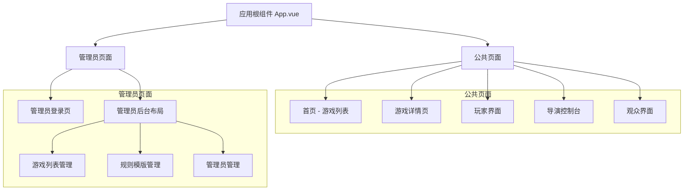
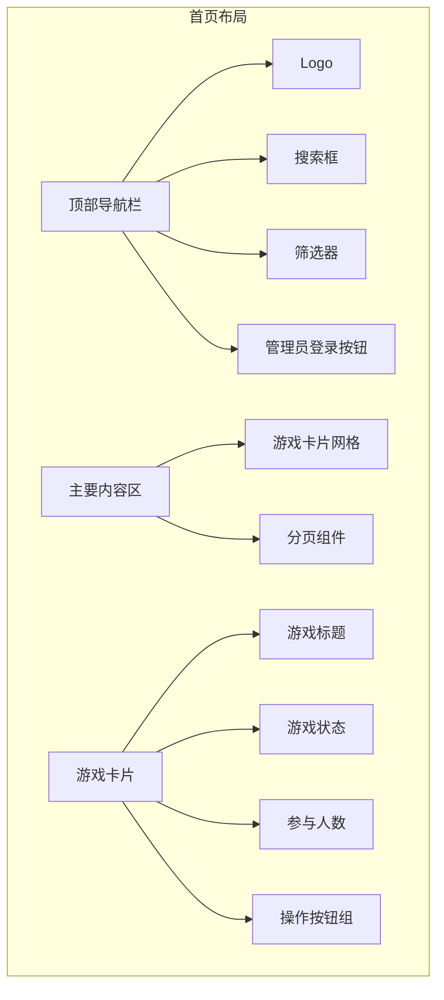
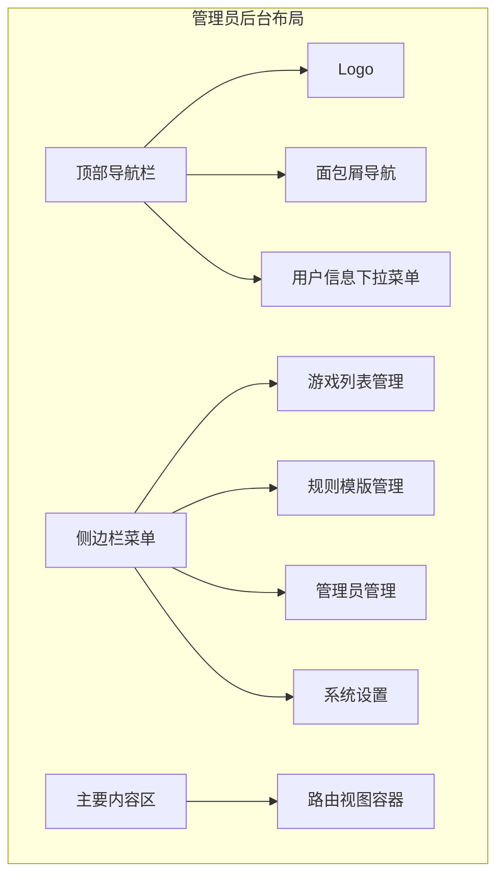

# Royale Arena 前端页面设计

## 概述

本文档详细描述 Royale Arena 前端应用的页面架构设计，包括用户界面布局、路由设计、响应式适配以及 API 集成策略。系统采用 Vue 3 + TypeScript + Element Plus 技术栈，支持桌面端和移动端的响应式设计。

## 技术栈

- **框架**: Vue 3 + TypeScript + Composition API
- **构建工具**: Vite
- **UI 组件库**: Element Plus
- **状态管理**: Pinia
- **路由管理**: Vue Router 4
- **HTTP 客户端**: Axios
- **样式方案**: CSS Modules + Element Plus Design Tokens
- **响应式设计**: Flexbox + CSS Grid + Media Queries

## 整体页面架构

### 页面层次结构



### 响应式布局适配

#### 断点设计
```css
/* 响应式断点设计 */
$breakpoint-mobile: 768px;
$breakpoint-tablet: 1024px;
$breakpoint-desktop: 1280px;

/* 移动端优先设计 */
.container {
  padding: 0 16px; /* 移动端 */
}

@media (min-width: 768px) {
  .container {
    padding: 0 24px; /* 平板端 */
  }
}

@media (min-width: 1024px) {
  .container {
    padding: 0 32px; /* 桌面端 */
  }
}
```

## 页面详细设计

### 1. 网页首页 (HomePage.vue)

#### 功能需求
- 展示当前进行中的游戏列表
- 支持分页浏览历史游戏
- 提供游戏搜索和筛选功能
- 管理员登录入口（右上角）
- 响应式设计适配

#### 页面布局


#### 组件结构
```vue
<template>
  <div class="home-page">
    <!-- 顶部导航 -->
    <header class="header">
      <div class="container">
        <div class="header-content">
          <div class="logo-section">
            <h1 class="logo">Royale Arena</h1>
          </div>
          
          <div class="search-section">
            <el-input
              v-model="searchQuery"
              placeholder="搜索游戏..."
              :prefix-icon="Search"
              class="search-input"
            />
            <el-select v-model="statusFilter" placeholder="状态筛选" class="status-filter">
              <el-option label="全部" :value="GameFilterType.ALL" />
              <el-option label="活动中" :value="GameFilterType.ACTIVE" />
              <el-option label="等待中" :value="GameFilterType.WAITING" />
              <el-option label="进行中" :value="GameFilterType.RUNNING" />
              <el-option label="已结束" :value="GameFilterType.ENDED" />
              <el-option label="已隐藏" :value="GameFilterType.HIDDEN" />
            </el-select>
          </div>
          
          <div class="admin-section">
            <el-button 
              @click="refreshGames"
              :loading="loading"
              :icon="Refresh"
              circle
              title="刷新游戏列表"
            />
            <el-button 
              type="primary" 
              @click="goToAdminLogin"
              :icon="User"
            >
              管理员登录
            </el-button>
          </div>
        </div>
      </div>
    </header>

    <!-- 主要内容 -->
    <main class="main-content">
      <div class="container">
        <!-- 游戏列表 -->
        <div class="games-grid" v-loading="loading">
          <GameCard
            v-for="game in paginatedGames"
            :key="game.id"
            :game="game"
            @view-detail="handleViewGameDetail"
          />
        </div>
        
        <!-- 空状态 -->
        <div v-if="!loading && filteredGames.length === 0" class="empty-state">
          <el-empty 
            :description="getEmptyStateText()"
            :image-size="200"
          >
            <el-button type="primary" @click="resetFilters">
              重置筛选
            </el-button>
          </el-empty>
        </div>
        
        <!-- 分页 -->
        <div class="pagination-wrapper" v-if="filteredGames.length > pageSize">
          <el-pagination
            v-model:current-page="currentPage"
            :page-size="pageSize"
            :total="filteredGames.length"
            layout="prev, pager, next, jumper, total"
            @current-change="handlePageChange"
          />
        </div>
      </div>
    </main>
  </div>
</template>

<script setup lang="ts">
import { ref, computed, onMounted, watch } from 'vue'
import { useRouter } from 'vue-router'
import { Search, User, Users, Clock, Document, Refresh, View } from '@element-plus/icons-vue'
import { ElMessage } from 'element-plus'
import GameCard from '@/components/GameCard.vue'
import { gameService } from '@/services/gameService'
import { filterGamesByStatus, GameFilterType } from '@/utils/gameFilter'
import type { Game } from '@/types/game'

const router = useRouter()

// 响应式数据
const loading = ref(false)
const games = ref<Game[]>([])
const searchQuery = ref('')
const statusFilter = ref<GameFilterType>(GameFilterType.ALL)
const currentPage = ref(1)
const pageSize = ref(12)

// 计算属性
const filteredGames = computed(() => {
  let result = games.value
  
  // 按状态筛选
  result = filterGamesByStatus(result, statusFilter.value)
  
  // 按搜索关键字筛选
  if (searchQuery.value.trim()) {
    const query = searchQuery.value.toLowerCase().trim()
    result = result.filter(game => 
      game.name.toLowerCase().includes(query) ||
      (game.description && game.description.toLowerCase().includes(query)) ||
      (game.rule_template?.template_name.toLowerCase().includes(query))
    )
  }
  
  return result
})

const paginatedGames = computed(() => {
  const start = (currentPage.value - 1) * pageSize.value
  const end = start + pageSize.value
  return filteredGames.value.slice(start, end)
})

// 方法
const loadGames = async () => {
  loading.value = true
  try {
    const response = await gameService.getGames()
    games.value = response.data || response // 适配不同的响应格式
  } catch (error) {
    console.error('加载游戏列表失败:', error)
    ElMessage.error('加载游戏列表失败，请刷新页面重试')
  } finally {
    loading.value = false
  }
}

const handleViewGameDetail = (game: Game) => {
  router.push(`/game/${game.id}`)
}

const handlePageChange = (page: number) => {
  currentPage.value = page
  // 滚动到页面顶部
  window.scrollTo({ top: 0, behavior: 'smooth' })
}

const goToAdminLogin = () => {
  router.push('/admin/login')
}

const resetFilters = () => {
  searchQuery.value = ''
  statusFilter.value = GameFilterType.ALL
  currentPage.value = 1
}

const getEmptyStateText = () => {
  if (statusFilter.value === GameFilterType.HIDDEN) {
    return '没有找到已隐藏的游戏'
  }
  if (searchQuery.value.trim()) {
    return `没有找到与 "${searchQuery.value}" 相关的游戏`
  }
  return '暂无游戏，请联系管理员创建游戏'
}

// 监听筛选条件变化，重置页码
watch([searchQuery, statusFilter], () => {
  currentPage.value = 1
})

// 生命周期
onMounted(() => {
  loadGames()
})

// 手动刷新功能
const refreshGames = async () => {
  await loadGames()
  ElMessage.success('刷新成功')
}
</script>
```

#### 响应式设计
```css
/* 移动端布局 */
@media (max-width: 767px) {
  .header-content {
    flex-direction: column;
    gap: 12px;
  }
  
  .search-section {
    order: 2;
    width: 100%;
  }
  
  .admin-section {
    order: 3;
    align-self: flex-end;
  }
  
  .games-grid {
    grid-template-columns: 1fr;
    gap: 12px;
  }
}

/* 平板端布局 */
@media (min-width: 768px) and (max-width: 1023px) {
  .games-grid {
    grid-template-columns: repeat(2, 1fr);
    gap: 16px;
  }
}

/* 桌面端布局 */
@media (min-width: 1024px) {
  .games-grid {
    grid-template-columns: repeat(3, 1fr);
    gap: 20px;
  }
}
```

### 2. 游戏卡片组件 (GameCard.vue)

#### 组件设计
```vue
<template>
  <el-card class="game-card" :class="getGameStatusClass(game.status)">
    <template #header>
      <div class="card-header">
        <div class="title-section">
          <h3 class="game-title">{{ game.name }}</h3>
          <p class="game-description" v-if="game.description">{{ game.description }}</p>
        </div>
        <el-tag 
          :type="getGameStatusConfig(game.status).type" 
          :color="getGameStatusConfig(game.status).color"
          size="small"
        >
          {{ getGameStatusConfig(game.status).text }}
        </el-tag>
      </div>
    </template>
    
    <div class="game-info">
      <!-- 玩家数量信息 -->
      <div class="info-item">
        <el-icon><Users /></el-icon>
        <span class="info-label">玩家数量：</span>
        <span class="info-value">{{ game.player_count || 0 }}/{{ game.max_players }}</span>
      </div>
      
      <!-- 创建时间 -->
      <div class="info-item">
        <el-icon><Clock /></el-icon>
        <span class="info-label">创建时间：</span>
        <span class="info-value">{{ formatDateTime(game.created_at) }}</span>
      </div>
      
      <!-- 规则模版信息 -->
      <div class="info-item" v-if="game.rule_template">
        <el-icon><Document /></el-icon>
        <span class="info-label">规则模版：</span>
        <span class="info-value">{{ game.rule_template.template_name }}</span>
      </div>
      
      <!-- 最后更新时间 -->
      <div class="info-item">
        <el-icon><Refresh /></el-icon>
        <span class="info-label">更新时间：</span>
        <span class="info-value">{{ formatDateTime(game.updated_at) }}</span>
      </div>
    </div>
    
    <!-- 游戏操作区域 -->
    <div class="game-actions">
      <!-- 快捷登录区域 -->
      <div class="quick-login" v-if="canQuickLogin">
        <div class="login-input-group">
          <el-input 
            v-model="loginPassword" 
            type="password"
            placeholder="输入密码快速加入"
            size="small"
            show-password
            @keyup.enter="handleQuickLogin"
          >
            <template #append>
              <el-button 
                type="primary" 
                :loading="loginLoading"
                @click="handleQuickLogin"
                size="small"
              >
                登录
              </el-button>
            </template>
          </el-input>
        </div>
        <div class="login-hint">
          <span class="hint-text">输入密码后自动识别身份进入游戏</span>
        </div>
      </div>
      
      <!-- 详情按钮 -->
      <el-button 
        type="info" 
        size="default"
        @click="$emit('view-detail', game)"
        class="detail-button"
        plain
      >
        <el-icon><View /></el-icon>
        查看详情
      </el-button>
    </div>
  </el-card>
</template>

<script setup lang="ts">
import { ref, computed } from 'vue'
import { useRouter } from 'vue-router'
import { ElMessage } from 'element-plus'
import type { Game } from '@/types/game'
import { getGameStatusConfig } from '@/utils/gameFilter'
import { GameStatus } from '@/types/game'
import { gameService } from '@/services/gameService'

interface Props {
  game: Game
}

const props = defineProps<Props>()
const router = useRouter()

const emit = defineEmits<{
  'view-detail': [game: Game]
}>()

// 响应式数据
const loginPassword = ref('')
const loginLoading = ref(false)

// 计算属性
const canQuickLogin = computed(() => {
  return props.game.status === GameStatus.WAITING || 
         props.game.status === GameStatus.RUNNING ||
         props.game.status === GameStatus.PAUSED
})

// 快捷登录处理
const handleQuickLogin = async () => {
  if (!loginPassword.value.trim()) {
    ElMessage.error('请输入密码')
    return
  }
  
  loginLoading.value = true
  
  try {
    // 先尝试作为玩家登录
    try {
      await gameService.joinAsPlayer(props.game.id, loginPassword.value)
      ElMessage.success('成功以玩家身份加入游戏')
      router.push(`/game/${props.game.id}/player`)
      return
    } catch (playerError) {
      // 玩家登录失败，尝试导演登录
      try {
        await gameService.joinAsDirector(props.game.id, loginPassword.value)
        ElMessage.success('成功以导演身份进入控制台')
        router.push(`/game/${props.game.id}/director`)
        return
      } catch (directorError) {
        // 两种身份都登录失败
        ElMessage.error('密码错误或无权限')
      }
    }
  } catch (error) {
    console.error('登录失败:', error)
    ElMessage.error('登录失败，请稍后重试')
  } finally {
    loginLoading.value = false
    loginPassword.value = ''
  }
}

// 格式化日期时间
const formatDateTime = (dateString: string) => {
  const date = new Date(dateString)
  return date.toLocaleString('zh-CN', {
    year: 'numeric',
    month: '2-digit', 
    day: '2-digit',
    hour: '2-digit',
    minute: '2-digit'
  })
}

// 获取游戏状态样式类
const getGameStatusClass = (status: string) => {
  return `game-card--${status}`
}
</script>

<style scoped>
.game-card {
  margin-bottom: 16px;
  transition: all 0.3s ease;
  border-radius: 8px;
  overflow: hidden;
}

.game-card:hover {
  box-shadow: 0 4px 12px rgba(0, 0, 0, 0.15);
  transform: translateY(-2px);
}

.card-header {
  display: flex;
  justify-content: space-between;
  align-items: flex-start;
  gap: 12px;
}

.title-section {
  flex: 1;
  min-width: 0;
}

.game-title {
  margin: 0;
  font-size: 16px;
  font-weight: 600;
  color: #303133;
  white-space: nowrap;
  overflow: hidden;
  text-overflow: ellipsis;
}

.game-description {
  margin: 4px 0 0 0;
  font-size: 12px;
  color: #909399;
  line-height: 1.4;
  display: -webkit-box;
  -webkit-line-clamp: 2;
  -webkit-box-orient: vertical;
  overflow: hidden;
}

.game-info {
  display: flex;
  flex-direction: column;
  gap: 8px;
  margin-bottom: 16px;
}

.info-item {
  display: flex;
  align-items: center;
  gap: 6px;
  font-size: 12px;
}

.info-label {
  color: #606266;
  min-width: 60px;
}

.info-value {
  color: #303133;
  font-weight: 500;
}

.game-actions {
  display: flex;
  flex-direction: column;
  gap: 12px;
}

.quick-login {
  display: flex;
  flex-direction: column;
  gap: 4px;
}

.login-input-group {
  width: 100%;
}

.login-hint {
  text-align: center;
}

.hint-text {
  font-size: 11px;
  color: #909399;
  line-height: 1.2;
}

.detail-button {
  width: 100%;
  border-radius: 4px;
}

/* 状态特定样式 */
.game-card--waiting {
  border-left: 4px solid #909399;
}

.game-card--running {
  border-left: 4px solid #67C23A;
}

.game-card--paused {
  border-left: 4px solid #E6A23C;
}

.game-card--ended {
  border-left: 4px solid #606266;
}

.game-card--hidden {
  border-left: 4px solid #C0C4CC;
  opacity: 0.7;
}

.game-card--deleted {
  border-left: 4px solid #F56C6C;
  opacity: 0.5;
}
</style>
```

### 3. 游戏详情页 (GameDetailPage.vue)

#### 页面功能
- 显示游戏的完整信息
- 提供加入游戏的各种入口
- 显示规则模版详细信息
- 显示当前玩家列表（如果游戏已开始）

#### 组件设计
```vue
<template>
  <div class="game-detail-page">
    <!-- 返回按钮 -->
    <div class="back-button-container">
      <el-button 
        :icon="ArrowLeft" 
        @click="$router.go(-1)"
        class="back-button"
      >
        返回游戏列表
      </el-button>
    </div>

    <!-- 游戏信息卡片 -->
    <el-card class="game-info-card" v-loading="loading">
      <template #header>
        <div class="game-header">
          <div class="title-section">
            <h1 class="game-title">{{ game?.name }}</h1>
            <el-tag 
              :type="gameStatusConfig?.type" 
              :color="gameStatusConfig?.color"
              size="large"
            >
              {{ gameStatusConfig?.text }}
            </el-tag>
          </div>
        </div>
      </template>

      <div class="game-content" v-if="game">
        <!-- 基本信息 -->
        <div class="info-section">
          <h3 class="section-title">游戏信息</h3>
          <el-descriptions :column="2" border>
            <el-descriptions-item label="游戏名称">{{ game.name }}</el-descriptions-item>
            <el-descriptions-item label="游戏状态">
              <el-tag :type="gameStatusConfig?.type">
                {{ gameStatusConfig?.text }}
              </el-tag>
            </el-descriptions-item>
            <el-descriptions-item label="玩家容量">{{ game.player_count || 0 }}/{{ game.max_players }}</el-descriptions-item>
            <el-descriptions-item label="创建时间">{{ formatDateTime(game.created_at) }}</el-descriptions-item>
            <el-descriptions-item label="最后更新">{{ formatDateTime(game.updated_at) }}</el-descriptions-item>
            <el-descriptions-item label="规则模版" v-if="game.rule_template">
              {{ game.rule_template.template_name }}
            </el-descriptions-item>
          </el-descriptions>
          
          <!-- 游戏描述 -->
          <div class="description-section" v-if="game.description">
            <h4>游戏描述</h4>
            <p class="description-text">{{ game.description }}</p>
          </div>
        </div>

        <!-- 规则信息 -->
        <div class="rule-section" v-if="game.rule_template">
          <h3 class="section-title">规则信息</h3>
          <el-card class="rule-card">
            <h4>{{ game.rule_template.template_name }}</h4>
            <p v-if="game.rule_template.description" class="rule-description">
              {{ game.rule_template.description }}
            </p>
            <!-- 注意：不显示规则的具体JSON内容 -->
          </el-card>
        </div>

        <!-- 操作按钮 -->
        <div class="action-section">
          <h3 class="section-title">加入游戏</h3>
          <div class="action-buttons">
            <!-- 统一登录入口 -->
            <el-card class="action-card main-login-card">
              <div class="login-content">
                <div class="login-info">
                  <h4>密码登录</h4>
                  <p>输入密码后系统会自动识别您的身份（玩家或导演）</p>
                </div>
                
                <div class="login-form">
                  <el-input 
                    v-model="loginPassword" 
                    type="password"
                    placeholder="请输入游戏密码"
                    size="large"
                    show-password
                    @keyup.enter="handleUnifiedLogin"
                  >
                    <template #prepend>
                      <el-icon><Lock /></el-icon>
                    </template>
                  </el-input>
                  
                  <el-button 
                    type="primary" 
                    size="large"
                    :loading="loginLoading"
                    @click="handleUnifiedLogin"
                    :disabled="!loginPassword.trim()"
                    class="login-button"
                  >
                    <el-icon><UserFilled /></el-icon>
                    登录游戏
                  </el-button>
                </div>
                
                <div class="login-hint">
                  <p class="hint-text">
                    • 系统会依次尝试玩家和导演身份验证<br>
                    • 登录成功后自动跳转到对应界面
                  </p>
                </div>
              </div>
            </el-card>

            <!-- 观众入口 -->
            <el-card class="action-card observer-card">
              <div class="action-content">
                <div class="action-info">
                  <h4>观众模式</h4>
                  <p>无需密码，直接观看游戏进程</p>
                </div>
                <el-button 
                  type="info" 
                  size="large"
                  @click="joinAsObserver"
                  class="observer-button"
                >
                  <el-icon><View /></el-icon>
                  观看游戏
                </el-button>
              </div>
            </el-card>
          </div>
        </div>
      </div>
    </el-card>


  </div>
</template>

<script setup lang="ts">
import { ref, computed, onMounted } from 'vue'
import { useRoute, useRouter } from 'vue-router'
import { ArrowLeft, Lock, UserFilled, View } from '@element-plus/icons-vue'
import { ElMessage } from 'element-plus'
import { gameService } from '@/services/gameService'
import { getGameStatusConfig } from '@/utils/gameFilter'
import { GameStatus } from '@/types/game'
import type { Game } from '@/types/game'

const route = useRoute()
const router = useRouter()

// 响应式数据
const loading = ref(false)
const loginLoading = ref(false)
const game = ref<Game | null>(null)
const loginPassword = ref('')

// 计算属性
const gameStatusConfig = computed(() => {
  return game.value ? getGameStatusConfig(game.value.status) : null
})

const canJoinAsPlayer = computed(() => {
  if (!game.value) return false
  return game.value.status === GameStatus.WAITING && 
         (game.value.player_count || 0) < game.value.max_players
})

// 方法
const loadGameDetail = async () => {
  const gameId = route.params.gameId as string
  if (!gameId) return
  
  loading.value = true
  try {
    const response = await gameService.getGameDetail(gameId)
    game.value = response.data || response
  } catch (error) {
    console.error('加载游戏详情失败:', error)
    ElMessage.error('加载游戏详情失败')
    router.push('/')
  } finally {
    loading.value = false
  }
}

const handleUnifiedLogin = async () => {
  if (!game.value || !loginPassword.value.trim()) {
    ElMessage.error('请输入密码')
    return
  }
  
  loginLoading.value = true
  
  try {
    // 先尝试作为玩家登录
    try {
      await gameService.joinAsPlayer(game.value.id, loginPassword.value)
      ElMessage.success('成功以玩家身份加入游戏')
      router.push(`/game/${game.value.id}/player`)
      return
    } catch (playerError) {
      console.log('玩家身份验证失败，尝试导演身份')
      
      // 玩家登录失败，尝试导演登录
      try {
        await gameService.joinAsDirector(game.value.id, loginPassword.value)
        ElMessage.success('成功以导演身份进入控制台')
        router.push(`/game/${game.value.id}/director`)
        return
      } catch (directorError) {
        console.log('导演身份验证也失败')
        // 两种身份都登录失败
        ElMessage.error('密码错误，请检查后重试')
      }
    }
  } catch (error) {
    console.error('登录过程中出现错误:', error)
    ElMessage.error('登录失败，请稍后重试')
  } finally {
    loginLoading.value = false
  }
}

const joinAsObserver = () => {
  if (!game.value) return
  router.push(`/game/${game.value.id}/observer`)
}

const formatDateTime = (dateString: string) => {
  const date = new Date(dateString)
  return date.toLocaleString('zh-CN', {
    year: 'numeric',
    month: '2-digit',
    day: '2-digit',
    hour: '2-digit',
    minute: '2-digit',
    second: '2-digit'
  })
}

// 生命周期
onMounted(() => {
  loadGameDetail()
})
</script>

<style scoped>
.game-detail-page {
  max-width: 1200px;
  margin: 0 auto;
  padding: 20px;
}

.back-button-container {
  margin-bottom: 20px;
}

.back-button {
  border-radius: 6px;
}

.game-info-card {
  margin-bottom: 20px;
}

.game-header {
  display: flex;
  justify-content: space-between;
  align-items: center;
}

.title-section {
  display: flex;
  align-items: center;
  gap: 16px;
}

.game-title {
  margin: 0;
  font-size: 24px;
  font-weight: 600;
  color: #303133;
}

.section-title {
  margin: 0 0 16px 0;
  font-size: 18px;
  font-weight: 600;
  color: #303133;
}

.info-section,
.rule-section,
.action-section {
  margin-bottom: 24px;
}

.description-section {
  margin-top: 16px;
}

.description-text {
  color: #606266;
  line-height: 1.6;
  margin: 8px 0;
}

.rule-card {
  background-color: #f8f9fa;
}

.rule-description {
  color: #606266;
  margin: 8px 0 0 0;
}

.action-buttons {
  display: grid;
  grid-template-columns: 2fr 1fr;
  gap: 20px;
  align-items: start;
}

.action-card {
  transition: all 0.3s ease;
}

.action-card:hover {
  box-shadow: 0 4px 12px rgba(0, 0, 0, 0.15);
}

.main-login-card {
  padding: 24px;
}

.login-content {
  display: flex;
  flex-direction: column;
  gap: 20px;
}

.login-info h4 {
  margin: 0 0 8px 0;
  font-size: 18px;
  font-weight: 600;
  color: #303133;
}

.login-info p {
  margin: 0;
  font-size: 14px;
  color: #606266;
  line-height: 1.5;
}

.login-form {
  display: flex;
  flex-direction: column;
  gap: 16px;
}

.login-button {
  width: 100%;
  height: 48px;
  font-size: 16px;
  font-weight: 600;
}

.login-hint {
  text-align: center;
  padding: 12px;
  background-color: #f8f9fa;
  border-radius: 6px;
  border-left: 4px solid #409eff;
}

.hint-text {
  font-size: 12px;
  color: #606266;
  line-height: 1.6;
  margin: 0;
}

.observer-card {
  display: flex;
  align-items: center;
  height: fit-content;
}

.action-content {
  display: flex;
  flex-direction: column;
  align-items: center;
  gap: 16px;
  text-align: center;
  width: 100%;
}

.action-info h4 {
  margin: 0 0 4px 0;
  font-size: 16px;
  font-weight: 600;
  color: #303133;
}

.action-info p {
  margin: 0;
  font-size: 14px;
  color: #606266;
}

.observer-button {
  width: 100%;
  height: 48px;
}

/* 移动端适配 */
@media (max-width: 767px) {
  .game-detail-page {
    padding: 16px;
  }
  
  .game-header {
    flex-direction: column;
    align-items: flex-start;
    gap: 12px;
  }
  
  .action-buttons {
    grid-template-columns: 1fr;
    gap: 16px;
  }
  
  .main-login-card {
    padding: 20px;
  }
  
  .login-content {
    gap: 16px;
  }
  
  .login-button {
    height: 44px;
  }
  
  .observer-button {
    height: 44px;
  }
}
</style>
```

### 4. 管理员登录页 (AdminLogin.vue)

#### 页面布局
```vue
<template>
  <div class="admin-login-page">
    <div class="login-container">
      <div class="login-box">
        <div class="login-header">
          <h2>管理员登录</h2>
          <p>请输入您的管理员凭据</p>
        </div>
        
        <el-form
          ref="loginFormRef"
          :model="loginForm"
          :rules="loginRules"
          class="login-form"
          @submit.prevent="handleLogin"
        >
          <el-form-item prop="username">
            <el-input
              v-model="loginForm.username"
              placeholder="用户名"
              :prefix-icon="User"
              size="large"
            />
          </el-form-item>
          
          <el-form-item prop="password">
            <el-input
              v-model="loginForm.password"
              type="password"
              placeholder="密码"
              :prefix-icon="Lock"
              size="large"
              show-password
            />
          </el-form-item>
          
          <el-form-item>
            <el-button
              type="primary"
              size="large"
              :loading="loginLoading"
              @click="handleLogin"
              class="login-button"
            >
              登录
            </el-button>
          </el-form-item>
        </el-form>
        
        <div class="login-footer">
          <el-button type="text" @click="$router.go(-1)">
            返回首页
          </el-button>
        </div>
      </div>
    </div>
  </div>
</template>
```

### 4. 管理员后台布局 (AdminLayout.vue)

#### 布局结构


#### 组件实现
```vue
<template>
  <el-container class="admin-layout">
    <!-- 顶部导航 -->
    <el-header class="admin-header">
      <div class="header-left">
        <el-button
          type="text"
          :icon="Menu"
          @click="toggleSidebar"
          class="sidebar-toggle"
        />
        <h1 class="admin-title">管理员后台</h1>
      </div>
      
      <div class="header-right">
        <el-breadcrumb separator=">">
          <el-breadcrumb-item 
            v-for="item in breadcrumbs" 
            :key="item.path"
            :to="item.path"
          >
            {{ item.title }}
          </el-breadcrumb-item>
        </el-breadcrumb>
        
        <el-dropdown @command="handleUserMenuCommand">
          <el-button type="text" class="user-menu">
            <el-icon><User /></el-icon>
            <span>{{ currentUser.username }}</span>
          </el-button>
          <template #dropdown>
            <el-dropdown-menu>
              <el-dropdown-item command="profile">个人设置</el-dropdown-item>
              <el-dropdown-item command="logout" divided>退出登录</el-dropdown-item>
            </el-dropdown-menu>
          </template>
        </el-dropdown>
      </div>
    </el-header>
    
    <el-container>
      <!-- 侧边栏 -->
      <el-aside :width="sidebarCollapsed ? '64px' : '240px'" class="admin-sidebar">
        <el-menu
          :default-active="$route.path"
          :collapse="sidebarCollapsed"
          :router="true"
          class="sidebar-menu"
        >
          <el-menu-item index="/admin/games">
            <el-icon><Grid /></el-icon>
            <template #title>游戏列表管理</template>
          </el-menu-item>
          
          <el-menu-item index="/admin/rule-templates">
            <el-icon><Document /></el-icon>
            <template #title>规则模版管理</template>
          </el-menu-item>
          
          <el-menu-item 
            index="/admin/admin-management"
            v-if="currentUser.role === 'super_admin'"
          >
            <el-icon><UserFilled /></el-icon>
            <template #title>管理员管理</template>
          </el-menu-item>
        </el-menu>
      </el-aside>
      
      <!-- 主要内容 -->
      <el-main class="admin-main">
        <router-view />
      </el-main>
    </el-container>
  </el-container>
</template>
```

#### 响应式侧边栏设计
```css
/* 移动端适配 */
@media (max-width: 767px) {
  .admin-layout {
    --sidebar-width: 100vw;
  }
  
  .admin-sidebar {
    position: fixed;
    left: 0;
    top: 60px;
    height: calc(100vh - 60px);
    z-index: 1000;
    transform: translateX(-100%);
    transition: transform 0.3s ease;
  }
  
  .admin-sidebar.show {
    transform: translateX(0);
  }
  
  .sidebar-backdrop {
    position: fixed;
    top: 0;
    left: 0;
    width: 100vw;
    height: 100vh;
    background-color: rgba(0, 0, 0, 0.5);
    z-index: 999;
  }
}
```

## 路由设计

### 路由配置结构

```typescript
// router/index.ts
import { createRouter, createWebHistory } from 'vue-router'
import type { RouteRecordRaw } from 'vue-router'

const routes: RouteRecordRaw[] = [
  // 公共路由
  {
    path: '/',
    name: 'Home',
    component: () => import('@/views/HomePage.vue'),
    meta: { title: '游戏大厅' }
  },
  
  // 游戏相关路由
  {
    path: '/game/:gameId',
    name: 'GameDetail',
    component: () => import('@/views/GameDetailPage.vue'),
    meta: { title: '游戏详情' }
  },
  {
    path: '/game/:gameId/player',
    name: 'PlayerInterface',
    component: () => import('@/views/PlayerInterface.vue'),
    meta: { title: '玩家界面', requiresGameAccess: true }
  },
  {
    path: '/game/:gameId/director',
    name: 'DirectorConsole',
    component: () => import('@/views/DirectorConsole.vue'),
    meta: { title: '导演控制台', requiresDirectorAuth: true }
  },
  {
    path: '/game/:gameId/observer',
    name: 'ObserverInterface',
    component: () => import('@/views/ObserverInterface.vue'),
    meta: { title: '观众界面' }
  },
  
  // 管理员路由
  {
    path: '/admin/login',
    name: 'AdminLogin',
    component: () => import('@/views/admin/AdminLogin.vue'),
    meta: { title: '管理员登录', guest: true }
  },
  {
    path: '/admin',
    component: () => import('@/layouts/AdminLayout.vue'),
    meta: { requiresAuth: true },
    children: [
      {
        path: '',
        redirect: '/admin/games'
      },
      {
        path: 'games',
        name: 'AdminGames',
        component: () => import('@/views/admin/GameManagement.vue'),
        meta: { title: '游戏列表管理' }
      },
      {
        path: 'rule-templates',
        name: 'AdminRuleTemplates', 
        component: () => import('@/views/admin/RuleTemplateManagement.vue'),
        meta: { title: '规则模版管理' }
      },
      {
        path: 'admin-management',
        name: 'AdminManagement',
        component: () => import('@/views/admin/AdminManagement.vue'),
        meta: { 
          title: '管理员管理', 
          requiresSuperAdmin: true 
        }
      }
    ]
  }
]

const router = createRouter({
  history: createWebHistory(import.meta.env.BASE_URL),
  routes
})

// 路由守卫
router.beforeEach(async (to, from, next) => {
  const authStore = useAuthStore()
  
  // 检查管理员认证
  if (to.meta.requiresAuth && !authStore.isAuthenticated) {
    return next('/admin/login')
  }
  
  // 检查超级管理员权限
  if (to.meta.requiresSuperAdmin && authStore.user?.role !== 'super_admin') {
    return next('/admin/games')
  }
  
  // 检查游戏访问权限
  if (to.meta.requiresGameAccess) {
    const gameAccess = await authStore.checkGameAccess(to.params.gameId as string)
    if (!gameAccess) {
      return next('/')
    }
  }
  
  next()
})
```

## 数据模型设计

### 游戏状态枚举扩展

根据后端迁移需求，游戏状态将从原有的四种状态扩展为六种状态：

```typescript
// types/game.ts
export enum GameStatus {
  WAITING = 'waiting',      // 等待中
  RUNNING = 'running',      // 进行中  
  PAUSED = 'paused',        // 已暂停
  ENDED = 'ended',          // 已结束
  HIDDEN = 'hidden',        // 已隐藏
  DELETED = 'deleted'       // 已删除
}

// 游戏筛选类型定义
export enum GameFilterType {
  ALL = 'all',              // 全部（不包括已隐藏）
  ACTIVE = 'active',        // 活动中（等待+暂停+进行中）
  WAITING = 'waiting',      // 等待中
  RUNNING = 'running',      // 进行中
  ENDED = 'ended',          // 已结束
  HIDDEN = 'hidden'         // 已隐藏
}

// 游戏数据接口
export interface Game {
  id: string
  name: string
  description?: string
  director_password: string
  max_players: number
  status: GameStatus
  rule_template_id?: string
  rule_template?: {
    id: string
    template_name: string
    description?: string
  }
  player_count?: number     // 当前玩家数量（运行时计算）
  created_at: string
  updated_at: string
}
```

### 筛选逻辑设计

```typescript
// utils/gameFilter.ts
export const filterGamesByStatus = (games: Game[], filterType: GameFilterType): Game[] => {
  switch (filterType) {
    case GameFilterType.ALL:
      // 全部：排除已隐藏和已删除的游戏
      return games.filter(game => 
        game.status !== GameStatus.HIDDEN && 
        game.status !== GameStatus.DELETED
      )
    
    case GameFilterType.ACTIVE:
      // 活动中：等待中、已暂停、进行中
      return games.filter(game => 
        game.status === GameStatus.WAITING ||
        game.status === GameStatus.PAUSED ||
        game.status === GameStatus.RUNNING
      )
    
    case GameFilterType.WAITING:
      return games.filter(game => game.status === GameStatus.WAITING)
    
    case GameFilterType.RUNNING:
      return games.filter(game => game.status === GameStatus.RUNNING)
    
    case GameFilterType.ENDED:
      return games.filter(game => game.status === GameStatus.ENDED)
    
    case GameFilterType.HIDDEN:
      return games.filter(game => game.status === GameStatus.HIDDEN)
    
    default:
      return games
  }
}

// 状态标签配置
export const getGameStatusConfig = (status: GameStatus) => {
  const configs = {
    [GameStatus.WAITING]: { text: '等待中', type: 'info', color: '#909399' },
    [GameStatus.RUNNING]: { text: '进行中', type: 'success', color: '#67C23A' },
    [GameStatus.PAUSED]: { text: '已暂停', type: 'warning', color: '#E6A23C' },
    [GameStatus.ENDED]: { text: '已结束', type: '', color: '#606266' },
    [GameStatus.HIDDEN]: { text: '已隐藏', type: 'info', color: '#C0C4CC' },
    [GameStatus.DELETED]: { text: '已删除', type: 'danger', color: '#F56C6C' }
  }
  return configs[status] || { text: '未知', type: 'info', color: '#909399' }
}
```

## API 集成设计

### API 基础配置

#### API 子路径设计
考虑到 Rust 服务器部署在子目录，API 路径设计如下：

```typescript
// config/api.ts
export const API_CONFIG = {
  // 基础 API 路径 - 适配子目录部署
  BASE_URL: import.meta.env.VITE_API_BASE_URL || '/api/v1',
  
  // WebSocket 连接路径
  WS_URL: import.meta.env.VITE_WS_BASE_URL || '/ws',
  
  // API 端点定义
  ENDPOINTS: {
    // 公共接口
    GAMES: '/games',
    GAME_DETAIL: '/games/:id',
    
    // 管理员认证
    ADMIN_LOGIN: '/admin/auth/login',
    ADMIN_LOGOUT: '/admin/auth/logout',
    ADMIN_PROFILE: '/admin/auth/profile',
    
    // 游戏管理
    ADMIN_GAMES: '/admin/games',
    ADMIN_GAME_CREATE: '/admin/games',
    ADMIN_GAME_UPDATE: '/admin/games/:id',
    ADMIN_GAME_DELETE: '/admin/games/:id',
    ADMIN_GAME_HIDE: '/admin/games/:id/hide',
    ADMIN_GAME_SHOW: '/admin/games/:id/show',
    
    // 规则模版管理
    RULE_TEMPLATES: '/admin/rule-templates',
    RULE_TEMPLATE_CREATE: '/admin/rule-templates',
    RULE_TEMPLATE_UPDATE: '/admin/rule-templates/:id',
    RULE_TEMPLATE_DELETE: '/admin/rule-templates/:id',
    
    // 管理员管理
    ADMIN_USERS: '/admin/users',
    ADMIN_USER_CREATE: '/admin/users',
    ADMIN_USER_UPDATE: '/admin/users/:id',
    ADMIN_USER_DELETE: '/admin/users/:id'
  }
}
```

#### HTTP 客户端封装
```typescript
// services/http.ts
import axios from 'axios'
import type { AxiosRequestConfig, AxiosResponse } from 'axios'
import { ElMessage } from 'element-plus'
import { useAuthStore } from '@/stores/auth'

// 创建 axios 实例
const httpClient = axios.create({
  baseURL: API_CONFIG.BASE_URL,
  timeout: 10000,
  headers: {
    'Content-Type': 'application/json'
  }
})

// 请求拦截器
httpClient.interceptors.request.use(
  (config) => {
    const authStore = useAuthStore()
    
    // 添加认证令牌
    if (authStore.token) {
      config.headers.Authorization = `Bearer ${authStore.token}`
    }
    
    return config
  },
  (error) => {
    return Promise.reject(error)
  }
)

// 响应拦截器
httpClient.interceptors.response.use(
  (response: AxiosResponse) => {
    return response
  },
  (error) => {
    const authStore = useAuthStore()
    
    // 处理认证错误
    if (error.response?.status === 401) {
      authStore.logout()
      router.push('/admin/login')
      ElMessage.error('认证已过期，请重新登录')
      return Promise.reject(error)
    }
    
    // 处理权限错误
    if (error.response?.status === 403) {
      ElMessage.error('权限不足')
      return Promise.reject(error)
    }
    
    // 处理服务器错误
    if (error.response?.status >= 500) {
      ElMessage.error('服务器错误，请稍后重试')
      return Promise.reject(error)
    }
    
    // 显示具体错误信息
    const message = error.response?.data?.message || '请求失败'
    ElMessage.error(message)
    
    return Promise.reject(error)
  }
)

export { httpClient }
```

### API 服务层设计

#### 游戏相关 API
```typescript
// services/gameService.ts
import { httpClient } from './http'
import { API_CONFIG } from '@/config/api'
import type { Game, GameStatus } from '@/types/game'

export interface GameListParams {
  search?: string
  status?: GameStatus
  include_hidden?: boolean
}

export interface GameCreateRequest {
  name: string
  description?: string
  director_password: string
  max_players?: number
  rule_template_id?: string
}

export interface GameUpdateRequest {
  name?: string
  description?: string
  director_password?: string
  max_players?: number
  status?: GameStatus
  rule_template_id?: string
}

export const gameService = {
  // 获取游戏列表（公共接口，不包含已删除的游戏）
  async getGames(params: GameListParams = {}) {
    const response = await httpClient.get(API_CONFIG.ENDPOINTS.GAMES, { params })
    return response.data
  },
  
  // 获取游戏详情
  async getGameDetail(gameId: string) {
    const url = API_CONFIG.ENDPOINTS.GAME_DETAIL.replace(':id', gameId)
    const response = await httpClient.get(url)
    return response.data
  },
  
  // 加入游戏（玩家）
  async joinAsPlayer(gameId: string, password: string) {
    const response = await httpClient.post(`${API_CONFIG.ENDPOINTS.GAMES}/${gameId}/join/player`, {
      password
    })
    return response.data
  },
  
  // 进入导演模式
  async joinAsDirector(gameId: string, password: string) {
    const response = await httpClient.post(`${API_CONFIG.ENDPOINTS.GAMES}/${gameId}/join/director`, {
      password
    })
    return response.data
  }
}
```

#### 管理员 API
```typescript
// services/adminService.ts
export interface AdminUser {
  id: string
  username: string
  role: 'admin' | 'super_admin'
  createdAt: string
  lastLoginAt?: string
}

export const adminService = {
  // 管理员登录
  async login(username: string, password: string) {
    const response = await httpClient.post(API_CONFIG.ENDPOINTS.ADMIN_LOGIN, {
      username,
      password
    })
    return response.data
  },
  
  // 获取管理员信息
  async getProfile() {
    const response = await httpClient.get(API_CONFIG.ENDPOINTS.ADMIN_PROFILE)
    return response.data
  },
  
  // 游戏管理（管理员专用，包含所有状态的游戏）
  async getAdminGames(params: GameListParams = {}) {
    const response = await httpClient.get(API_CONFIG.ENDPOINTS.ADMIN_GAMES, { params })
    return response.data
  },
  
  async createGame(gameData: GameCreateRequest) {
    const response = await httpClient.post(API_CONFIG.ENDPOINTS.ADMIN_GAME_CREATE, gameData)
    return response.data
  },
  
  async updateGame(gameId: string, gameData: GameUpdateRequest) {
    const url = API_CONFIG.ENDPOINTS.ADMIN_GAME_UPDATE.replace(':id', gameId)
    const response = await httpClient.put(url, gameData)
    return response.data
  },
  
  async deleteGame(gameId: string) {
    const url = API_CONFIG.ENDPOINTS.ADMIN_GAME_DELETE.replace(':id', gameId)
    const response = await httpClient.delete(url)
    return response.data
  },
  
  // 隐藏游戏
  async hideGame(gameId: string) {
    const url = API_CONFIG.ENDPOINTS.ADMIN_GAME_HIDE.replace(':id', gameId)
    const response = await httpClient.patch(url)
    return response.data
  },
  
  // 显示游戏
  async showGame(gameId: string) {
    const url = API_CONFIG.ENDPOINTS.ADMIN_GAME_SHOW.replace(':id', gameId)
    const response = await httpClient.patch(url)
    return response.data
  }
}
```

## 状态管理设计

### 认证状态管理
```typescript
// stores/auth.ts
import { defineStore } from 'pinia'
import { adminService } from '@/services/adminService'

export const useAuthStore = defineStore('auth', {
  state: () => ({
    user: null as AdminUser | null,
    token: localStorage.getItem('admin_token'),
    isAuthenticated: false
  }),
  
  getters: {
    isSuperAdmin: (state) => state.user?.role === 'super_admin',
    hasPermission: (state) => (permission: string) => {
      // 权限检查逻辑
      return true
    }
  },
  
  actions: {
    async login(username: string, password: string) {
      try {
        const { user, token } = await adminService.login(username, password)
        
        this.user = user
        this.token = token
        this.isAuthenticated = true
        
        localStorage.setItem('admin_token', token)
        
        return { success: true }
      } catch (error) {
        return { 
          success: false, 
          error: error.response?.data?.message || '登录失败' 
        }
      }
    },
    
    async logout() {
      this.user = null
      this.token = null
      this.isAuthenticated = false
      
      localStorage.removeItem('admin_token')
      
      await this.$router.push('/admin/login')
    },
    
    async checkAuth() {
      if (!this.token) return false
      
      try {
        const user = await adminService.getProfile()
        this.user = user
        this.isAuthenticated = true
        return true
      } catch (error) {
        this.logout()
        return false
      }
    }
  }
})
```

## 测试策略

### 单元测试
```typescript
// tests/components/GameCard.spec.ts
import { mount } from '@vue/test-utils'
import { describe, it, expect } from 'vitest'
import GameCard from '@/components/GameCard.vue'

describe('GameCard', () => {
  const mockGame = {
    id: '1',
    title: '测试游戏',
    status: 'waiting' as const,
    playerCount: 5,
    maxPlayers: 10,
    createdAt: '2024-01-01T00:00:00Z'
  }
  
  it('正确渲染游戏信息', () => {
    const wrapper = mount(GameCard, {
      props: { game: mockGame }
    })
    
    expect(wrapper.text()).toContain('测试游戏')
    expect(wrapper.text()).toContain('5/10')
  })
  
  it('游戏满员时禁用加入按钮', () => {
    const fullGame = { ...mockGame, playerCount: 10 }
    const wrapper = mount(GameCard, {
      props: { game: fullGame }
    })
    
    const joinButton = wrapper.find('[data-test="join-button"]')
    expect(joinButton.attributes('disabled')).toBeDefined()
  })
})
```


