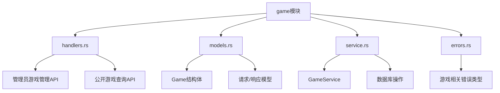
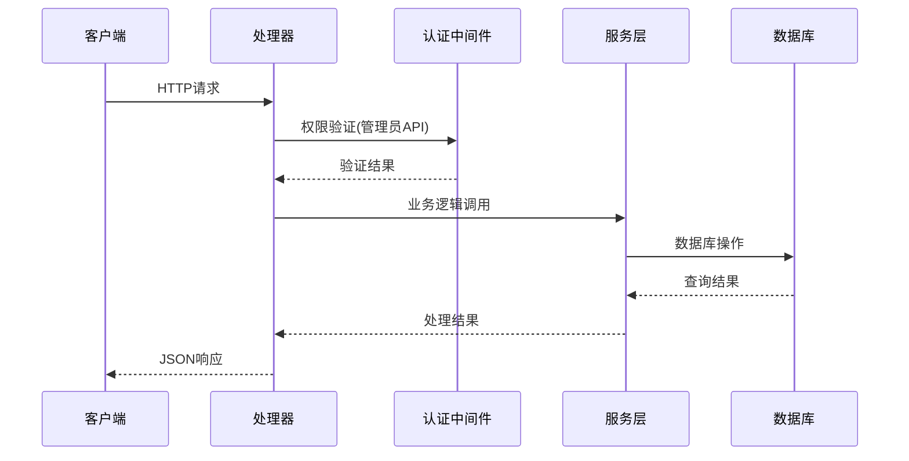
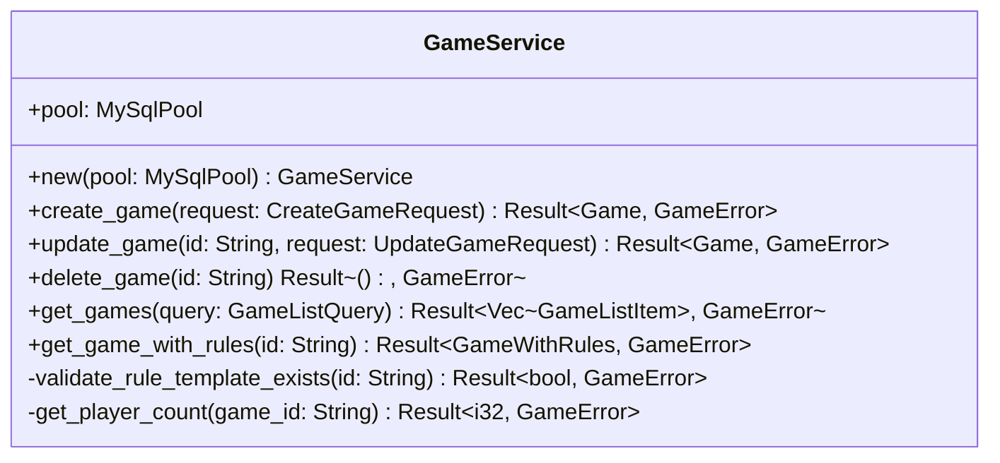
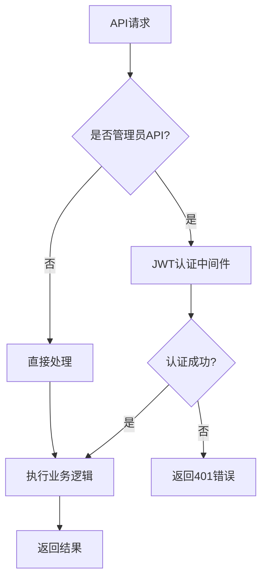

# 游戏API开发设计文档

## 1. 概述

本文档描述Royale Arena项目中游戏管理相关API的开发设计，包括游戏的创建、修改、删除以及查询功能的实现。该功能模块是整个游戏系统的核心组件，负责管理游戏实例的生命周期。

### 核心目标
- 实现游戏实例的CRUD操作
- 提供公开的游戏信息查询接口
- 实现管理员权限控制的游戏管理功能
- 支持游戏与规则模板的关联查询

## 2. 技术架构

### 技术栈
- **后端框架**: Rust + Axum
- **数据库**: MySQL 8.0
- **ORM**: SQLx
- **认证**: JWT + bcrypt
- **序列化**: serde + serde_json

### 模块架构



### 数据流架构



## 3. API接口设计

### 3.1 管理员游戏管理接口

#### 3.1.1 创建游戏
**接口**: `POST /api/admin/games`
**权限**: 需要管理员认证

**请求格式**:
```json
{
  "name": "string",
  "description": "string",
  "director_password": "string",
  "max_players": "integer",
  "rule_template_id": "string (可选)"
}
```

**响应格式**:
```json
{
  "success": true,
  "data": {
    "id": "string",
    "name": "string",
    "description": "string",
    "director_password": "string",
    "max_players": "integer",
    "status": "waiting",
    "rule_template_id": "string|null",
    "created_at": "ISO8601 datetime",
    "updated_at": "ISO8601 datetime"
  }
}
```

#### 3.1.2 修改游戏设置
**接口**: `PUT /api/admin/games/{game_id}`
**权限**: 需要管理员认证

**请求格式**:
```json
{
  "name": "string (可选)",
  "description": "string (可选)",
  "director_password": "string (可选)",
  "max_players": "integer (可选)",
  "rule_template_id": "string (可选)"
}
```

**响应格式**:
```json
{
  "success": true,
  "data": {
    "id": "string",
    "name": "string",
    "description": "string",
    "director_password": "string",
    "max_players": "integer",
    "status": "waiting|running|paused|ended",
    "rule_template_id": "string|null",
    "created_at": "ISO8601 datetime",
    "updated_at": "ISO8601 datetime"
  }
}
```

#### 3.1.3 删除游戏
**接口**: `DELETE /api/admin/games/{game_id}`
**权限**: 需要管理员认证

**响应格式**:
```json
{
  "success": true,
  "message": "Game deleted successfully"
}
```

### 3.2 公开游戏查询接口

#### 3.2.1 获取游戏列表
**接口**: `GET /api/games`
**权限**: 公开访问

**查询参数**:
- `status`: 可选，筛选特定状态的游戏

**响应格式**:
```json
{
  "success": true,
  "data": [
    {
      "id": "string",
      "name": "string",
      "description": "string",
      "status": "waiting|running|paused|ended",
      "player_count": "integer",
      "max_players": "integer",
      "created_at": "ISO8601 datetime"
    }
  ]
}
```

#### 3.2.2 获取指定游戏信息（包括规则）
**接口**: `GET /api/games/{game_id}`
**权限**: 公开访问

**响应格式**:
```json
{
  "success": true,
  "data": {
    "id": "string",
    "name": "string",
    "description": "string",
    "status": "waiting|running|paused|ended",
    "player_count": "integer",
    "max_players": "integer",
    "created_at": "ISO8601 datetime",
    "rule_template": {
      "id": "string",
      "template_name": "string",
      "description": "string",
      "rules_config": {}
    } | null
  }
}
```

## 4. 数据模型设计

### 4.1 核心数据结构

```rust
// Game 实体模型
#[derive(Debug, Clone, sqlx::FromRow, Serialize)]
pub struct Game {
    pub id: String,
    pub name: String,
    pub description: Option<String>,
    pub director_password: String,
    pub max_players: i32,
    pub status: GameStatus,
    pub rule_template_id: Option<String>,
    pub created_at: chrono::DateTime<chrono::Utc>,
    pub updated_at: chrono::DateTime<chrono::Utc>,
}

// 游戏状态枚举
#[derive(Debug, Clone, Serialize, Deserialize, sqlx::Type)]
#[sqlx(type_name = "ENUM", rename_all = "lowercase")]
pub enum GameStatus {
    Waiting,
    Running,
    Paused,
    Ended,
}

// 带规则信息的游戏详情
#[derive(Debug, Serialize)]
pub struct GameWithRules {
    pub id: String,
    pub name: String,
    pub description: Option<String>,
    pub status: GameStatus,
    pub player_count: i32,
    pub max_players: i32,
    pub created_at: chrono::DateTime<chrono::Utc>,
    pub rule_template: Option<RuleTemplateInfo>,
}

// 规则模板信息
#[derive(Debug, Serialize)]
pub struct RuleTemplateInfo {
    pub id: String,
    pub template_name: String,
    pub description: Option<String>,
    pub rules_config: serde_json::Value,
}
```

### 4.2 请求响应模型

```rust
// 创建游戏请求
#[derive(Debug, Deserialize)]
pub struct CreateGameRequest {
    pub name: String,
    pub description: Option<String>,
    pub director_password: String,
    pub max_players: i32,
    pub rule_template_id: Option<String>,
}

// 更新游戏请求
#[derive(Debug, Deserialize)]
pub struct UpdateGameRequest {
    pub name: Option<String>,
    pub description: Option<String>,
    pub director_password: Option<String>,
    pub max_players: Option<i32>,
    pub rule_template_id: Option<String>,
}

// 游戏列表查询参数
#[derive(Debug, Deserialize)]
pub struct GameListQuery {
    pub status: Option<GameStatus>,
}
```

## 5. 业务逻辑层设计

### 5.1 GameService 架构



### 5.2 核心业务逻辑

#### 游戏创建逻辑
1. 验证输入参数的有效性
2. 检查规则模板ID的有效性（如果提供）
3. 生成游戏UUID
4. 插入数据库记录
5. 返回创建的游戏信息

#### 游戏更新逻辑
1. 验证游戏是否存在
2. 验证更新字段的有效性
3. 检查新规则模板ID的有效性（如果提供）
4. 执行数据库更新操作
5. 返回更新后的游戏信息

#### 游戏查询逻辑
1. 构建动态SQL查询条件
2. 执行分页查询
3. 统计玩家数量（实时查询actors表）
4. 关联查询规则模板信息（如需要）
5. 组装响应数据

## 6. 错误处理策略

### 6.1 错误类型定义

```rust
#[derive(Debug, thiserror::Error)]
pub enum GameError {
    #[error("游戏不存在")]
    GameNotFound,
    
    #[error("规则模板不存在")]
    RuleTemplateNotFound,
    
    #[error("游戏名称已存在")]
    GameNameExists,
    
    #[error("游戏状态不允许此操作")]
    InvalidGameState,
    
    #[error("验证失败: {0}")]
    ValidationError(String),
    
    #[error("数据库错误: {0}")]
    DatabaseError(#[from] sqlx::Error),
}
```

### 6.2 错误处理策略

| 错误类型 | HTTP状态码 | 处理方式 |
|---------|-----------|---------|
| GameNotFound | 404 | 返回"游戏不存在"错误 |
| RuleTemplateNotFound | 400 | 返回"规则模板不存在"错误 |
| GameNameExists | 409 | 返回"游戏名称冲突"错误 |
| ValidationError | 400 | 返回具体验证错误信息 |
| DatabaseError | 500 | 记录日志，返回通用服务器错误 |

## 7. 数据库查询优化

### 7.1 关键查询设计

#### 游戏列表查询
```sql
SELECT g.id, g.name, g.description, g.status, g.max_players, g.created_at,
       COUNT(a.id) as player_count
FROM games g
LEFT JOIN actors a ON g.id = a.game_id
WHERE ($1::TEXT IS NULL OR g.status = $1)
GROUP BY g.id
ORDER BY g.created_at DESC
```

#### 游戏详情查询（含规则）
```sql
SELECT g.*, rt.template_name, rt.description as rule_description, rt.rules_config
FROM games g
LEFT JOIN rule_templates rt ON g.rule_template_id = rt.id
WHERE g.id = $1
```

### 7.2 索引优化策略

| 表名 | 索引字段 | 索引类型 | 用途 |
|------|---------|---------|------|
| games | status | 普通索引 | 状态筛选查询 |
| games | created_at | 普通索引 | 创建时间排序 |
| games | name | 唯一索引 | 游戏名称唯一性检查 |
| actors | game_id | 普通索引 | 玩家数量统计 |

## 8. 安全策略

### 8.1 权限控制



### 8.2 数据验证策略

- **游戏名称**: 长度1-100字符，不能包含特殊字符
- **导演密码**: 长度6-50字符，支持字母数字组合
- **最大玩家数**: 1-1000之间的正整数
- **规则模板ID**: 必须是有效的UUID格式且存在于数据库中

### 8.3 敏感信息处理

- 在公开API中隐藏导演密码字段
- 对管理员API返回的密码进行脱敏处理
- 日志记录中排除敏感信息

## 9. 测试策略

### 9.1 单元测试范围

| 测试模块 | 测试内容 | 测试方法 |
|---------|---------|---------|
| models.rs | 数据验证逻辑 | 直接测试验证函数 |
| service.rs | 业务逻辑 | Mock数据库连接 |
| handlers.rs | 请求处理 | 集成测试 |

### 9.2 集成测试设计

```rust
#[sqlx::test(migrations = "../migrations")]
async fn test_game_crud_operations(pool: MySqlPool) -> Result<(), Box<dyn std::error::Error>> {
    // 清理测试数据
    sqlx::query("DELETE FROM games WHERE name LIKE 'test_%'")
        .execute(&pool).await?;
    
    // 测试创建游戏
    let service = GameService::new(pool.clone());
    let request = CreateGameRequest { /* ... */ };
    let game = service.create_game(request).await?;
    
    // 测试查询游戏
    let retrieved = service.get_game_with_rules(&game.id).await?;
    assert_eq!(game.id, retrieved.id);
    
    // 测试更新游戏
    let update_request = UpdateGameRequest { /* ... */ };
    let updated = service.update_game(&game.id, update_request).await?;
    
    // 测试删除游戏
    service.delete_game(&game.id).await?;
    
    Ok(())
}
```

## 10. 性能优化

### 10.1 查询优化策略

- **批量查询**: 在获取游戏列表时，使用LEFT JOIN一次性获取玩家数量
- **缓存策略**: 对于频繁查询的游戏信息，考虑使用Redis缓存
- **前端分页**: 由于游戏数量较少，API返回全部数据，由前端实现分页展示

### 10.2 连接池配置

```rust
// 数据库连接池优化配置
MySqlPoolOptions::new()
    .max_connections(20)
    .min_connections(5)
    .acquire_timeout(Duration::from_secs(10))
    .idle_timeout(Duration::from_secs(600))
```