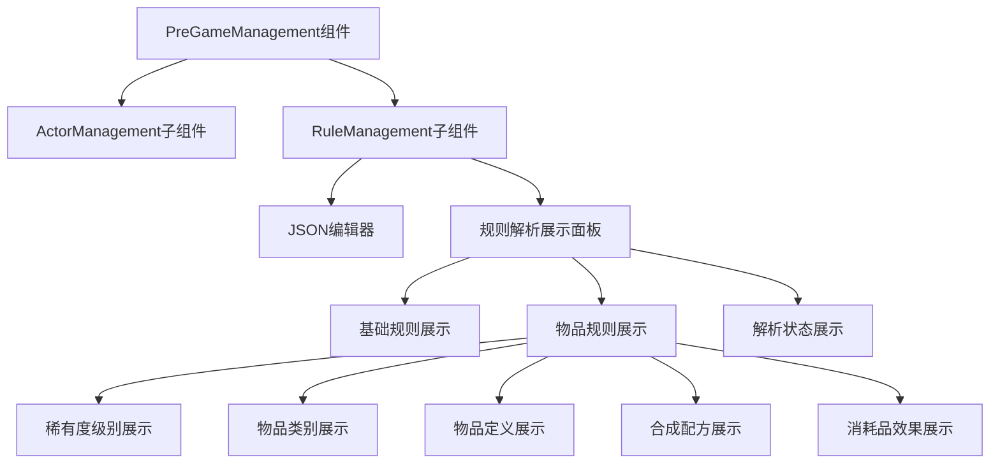

# Royale Arena 游戏规则JSON重构与前端展示设计文档

## 1. 概述

本文档旨在设计一个新的游戏规则JSON结构，以支持Royale Arena游戏中丰富的道具系统、稀有度级别、合成配方和恢复效果等特性。同时，设计前端模块来解析和展示这些规则，并在导演页面的PreGameManagement组件中实现规则展示功能。

## 2. 架构设计

### 2.1 后端规则JSON结构设计

我们将设计一个扩展的JSON结构来存储游戏规则，包含以下主要部分：

### 2.1.1 基础规则配置

基础规则配置包含游戏的核心参数，如地图、玩家属性等：

- `map`: 地图配置，定义游戏中的地点列表和安全区
- `player`: 玩家配置，包括生命值、体力值等属性
- `action_costs`: 行动消耗配置，定义各种行动的体力消耗
- `rest_mode`: 静养模式配置
- `teammate_behavior`: 队友行为规则

```json
{
  "map": {
    "places": [
      "码头", "工厂", "贫民窟", "旅馆", "教堂", "市政厅", "消防局", "池塘",
      "住宅区", "灯塔", "小巷", "学校", "隧道", "山道", "寺庙", "靶场",
      "医院", "森林", "海滩", "墓园", "井", "研究中心"
    ],
    "safe_places": ["研究中心"]
  },
  "player": {
    "max_life": 100,
    "max_strength": 100,
    "daily_strength_recovery": 40,
    "search_cooldown": 30
  },
  "action_costs": {
    "move": 5,
    "search": 5,
    "pick": 0,
    "attack": 0,
    "equip": 0,
    "use": 0,
    "throw": 0,
    "deliver": 105
  },
  "rest_mode": {
    "life_recovery": 25,
    "max_moves": 1
  },
  "teammate_behavior": 0,
  "items": {
    "rarity_levels": [
      {"name": "common", "display_name": "普通", "prefix": "[绿]"},
      {"name": "rare", "display_name": "稀有", "prefix": "[蓝]"},
      {"name": "epic", "display_name": "史诗", "prefix": "[紫]"},
      {"name": "legendary", "display_name": "传说", "prefix": "[橙]"}
    ],
    "categories": [
      {"name": "weapon_melee", "display_name": "近战武器"},
      {"name": "weapon_ranged", "display_name": "远程武器"},
      {"name": "weapon_aoe", "display_name": "范围武器"},
      {"name": "consumable_heal", "display_name": "治疗道具"},
      {"name": "consumable_buff", "display_name": "增益道具"},
      {"name": "consumable_debuff", "display_name": "减益道具"},
      {"name": "equipment_armor", "display_name": "护甲装备"},
      {"name": "utility_vision", "display_name": "侦察道具"},
      {"name": "utility_control", "display_name": "控制道具"},
      {"name": "upgrade", "display_name": "升级道具"}
    ],
    "weapons": [
      {
        "internal_name": "common_weapon",
        "display_names": ["[绿]佩剑", "[绿]战斧", "[绿]长矛", "[绿]皮鞭", "[绿]回力镖", "[绿]IM-10", "[绿]复合弓", "[绿]铁爪"],
        "rarity": "common",
        "properties": {
          "damage": 10,
          "uses": 10000,
          "votes": 1
        }
      },
      {
        "internal_name": "rare_weapon",
        "display_names": ["[蓝]大太刀", "[蓝]死神镰刀", "[蓝]斩马刀", "[蓝]三叉戟", "[蓝]带电短刀", "[蓝]西洋剑", "[蓝]双节棍", "[蓝]荆棘之鞭", "[蓝]白羽扇", "[蓝]燃烧弹", "[蓝]复古扑克", "[蓝]强力回力镖", "[蓝]轻机枪", "[蓝]斯太尔AUG", "[蓝]AK-47", "[蓝]十字弩", "[蓝]诸葛连弩", "[蓝]火矢弓", "[蓝]铁砂掌", "[蓝]羽翼指虎", "[蓝]恶魔之爪"],
        "rarity": "rare",
        "properties": {
          "damage": 20,
          "uses": 10000,
          "votes": 0
        }
      },
      {
        "internal_name": "epic_weapon",
        "display_names": ["[紫]青龙偃月刀", "[紫]盘古斧", "[紫]宇宙双叉戟", "[紫]芭蕉扇", "[紫]风魔手里剑", "[紫]蔚蓝匕首", "[紫]北极星", "[紫]魔弹射手", "[紫]丘比特之弓", "[紫]费尔努特", "[紫]血翼指虎", "[紫]裁决之光"],
        "rarity": "epic",
        "properties": {
          "damage": 30,
          "uses": 10000,
          "votes": 0
        }
      },
      {
        "internal_name": "legendary_weapon",
        "display_names": ["[橙]自然之力.晓", "[橙]自然之力.午", "[橙]自然之力.夜", "[橙]自然之力.日", "[橙]自然之力.月", "[橙]自然之力.星", "[橙]自然之力.水", "[橙]自然之力.火", "[橙]自然之力.风"],
        "rarity": "legendary",
        "properties": {
          "damage": 40,
          "damage_lasted": 10,
          "uses": 5,
          "votes": 0
        }
      }
    ],
    "armors": [
      {
        "internal_name": "common_armor",
        "display_names": ["[绿]皮甲", "[绿]布衣", "[绿]轻甲"],
        "rarity": "common",
        "properties": {
          "defense": 5,
          "uses": 10000,
          "votes": 2
        }
      },
      {
        "internal_name": "rare_armor",
        "display_names": ["[蓝]锁子甲", "[蓝]鳞甲", "[蓝]链甲"],
        "rarity": "rare",
        "properties": {
          "defense": 10,
          "uses": 10000,
          "votes": 2
        }
      },
      {
        "internal_name": "epic_armor",
        "display_names": ["[紫]板甲", "[紫]重甲", "[紫]龙鳞甲"],
        "rarity": "epic",
        "properties": {
          "defense": 15,
          "uses": 10000,
          "votes": 2
        }
      },
      {
        "internal_name": "legendary_armor",
        "display_names": ["[橙]神佑之铠", "[橙]不朽战甲", "[橙]星辰护甲"],
        "rarity": "legendary",
        "properties": {
          "defense": 20,
          "uses": 5,
          "votes": 2
        }
      }
    ],
    "other_items": [
      {
        "name": "[GPS]心跳探测仪1",
        "category": "utility_vision",
        "properties": {
          "uses": 1,
          "votes": 0
        }
      },
      {
        "name": "[侦]手持式雷达1",
        "category": "utility_vision",
        "properties": {
          "uses": 2,
          "votes": 0
        }
      }
    ],
    "upgraders": [
      {
        "internal_name": "natural_upgrader",
        "display_names": ["[合]自然升级器"],
        "rarity": "legendary"
      },
      {
        "internal_name": "artificial_upgrader",
        "display_names": ["[合]人造升级器"],
        "rarity": "rare"
      }
    ],
    "upgrade_recipes": {
      "natural_upgrader": [
        {
          "result": "rare_weapon",
          "ingredients": ["common_weapon"]
        },
        {
          "result": "epic_weapon",
          "ingredients": ["rare_weapon"]
        },
        {
          "result": "legendary_weapon",
          "ingredients": ["epic_weapon"]
        }
      ],
      "artificial_upgrader": [
        {
          "result": "rare_weapon",
          "ingredients": ["common_weapon"]
        },
        {
          "result": "epic_weapon",
          "ingredients": ["rare_weapon"]
        }
      ]
    },
    "consumable_effects": {
      "heal": [
        {
          "name": "[HP100]红花丹",
          "effect_type": "heal",
          "effect_value": 100,
          "cure_injury": true
        }
      ],
      "strength": [
        {
          "name": "[MP100]威士忌",
          "effect_type": "strength",
          "effect_value": 100
        }
      ]
    }
  }
}
```

### 2.2 前端规则解析模块设计

在前端创建一个TypeScript模块 `src/utils/gameRuleParser.ts` 来解析游戏规则JSON：

#### 2.2.1 解析器功能

规则解析模块需要实现以下功能：

1. 解析基础游戏规则配置
2. 解析物品系统规则
3. 验证规则配置的完整性
4. 识别未识别或缺失的规则项
5. 提供友好的错误提示和建议

```typescript
// 定义规则解析结果接口
interface ParsedGameRules {
  // 基础规则
  map: {
    places: string[];
    safePlaces: string[];
  };
  player: {
    maxLife: number;
    maxStrength: number;
    dailyStrengthRecovery: number;
    searchCooldown: number;
  };
  actionCosts: {
    move: number;
    search: number;
    pick: number;
    attack: number;
    equip: number;
    use: number;
    throw: number;
    deliver: number;
  };
  restMode: {
    lifeRecovery: number;
    maxMoves: number;
  };
  teammateBehavior: number;
  
  // 物品规则
  items: {
    rarityLevels: Array<{
      name: string;
      displayName: string;
      prefix: string;
    }>;
    categories: Array<{
      name: string;
      displayName: string;
    }>;
    weapons: Array<{
      internalName: string;
      displayNames: string[];
      rarity: string;
      category: string;
      properties: Record<string, any>;
    }>;
    otherItems: Array<{
      name: string;
      category: string;
      properties: Record<string, any>;
    }>;
    upgraders: Array<{
      internalName: string;
      displayNames: string[];
      rarity: string;
    }>;
    upgradeRecipes: Record<string, Array<{
      result: string;
      ingredients: string[];
    }>>;
    consumableEffects: {
      heal: Array<{
        name: string;
        effectType: string;
        effectValue: number;
        cureInjury: boolean;
      }>;
      strength: Array<{
        name: string;
        effectType: string;
        effectValue: number;
      }>;
    };
  };
  
  // 解析状态
  parsingIssues: string[];
  missingSections: string[];
}

// 定义规则解析器类
class GameRuleParser {
  parse(rulesConfig: any): ParsedGameRules {
    // 实现解析逻辑
    // 返回解析后的规则对象
  }
  
  validate(rulesConfig: any): { isValid: boolean; errors: string[] } {
    // 实现验证逻辑
    // 返回验证结果
  }
}
```

### 2.3 前端展示组件设计

在导演页面的PreGameManagement组件中添加规则展示功能：

#### 2.3.1 展示面板布局

规则展示面板将分为以下几个部分：

1. JSON配置编辑区域（保留文本框供导演直接修改）
2. 规则解析结果展示区域
3. 解析状态展示区域

#### 2.3.2 交互功能

展示面板需要支持以下交互功能：

1. 可折叠/展开的面板设计
2. 错误和警告信息的高亮显示
3. 缺失规则项的明确标识
4. Markdown文档的内嵌展示



## 3. 数据模型设计

### 3.1 游戏规则JSON结构

| 字段 | 类型 | 必需 | 描述 |
|------|------|------|------|
| map | object | 是 | 地图配置 |
| player | object | 是 | 玩家配置 |
| action_costs | object | 是 | 行动消耗配置 |
| rest_mode | object | 是 | 静养模式配置 |
| teammate_behavior | integer | 是 | 队友行为规则 |
| items | object | 是 | 物品系统配置 |

### 3.2 物品系统结构

| 字段 | 类型 | 必需 | 描述 |
|------|------|------|------|
| rarity_levels | array | 是 | 稀有度级别定义 |
| categories | array | 是 | 物品类别定义 |
| weapons | array | 是 | 武器定义 |
| other_items | array | 是 | 其他物品定义 |
| upgraders | array | 是 | 升级道具定义 |
| upgrade_recipes | object | 是 | 合成配方 |
| consumable_effects | object | 是 | 消耗品效果 |

### 3.3 常量名称映射

为了在前端展示中提供友好的名称显示，我们需要定义以下常量映射：

| 内部标识符 | 显示名称 |
|-----------|---------|
| hp | 生命值 |
| strength | 体力值 |
| search_cooldown | 搜索冷却时间 |
| move | 移动 |
| search | 搜索 |
| pick | 拾取 |
| attack | 攻击 |
| equip | 装备 |
| use | 使用 |
| throw | 丢弃 |
| deliver | 传音 |

## 4. 前端实现细节

### 4.1 规则解析模块实现

创建 `src/utils/gameRuleParser.ts` 文件实现规则解析逻辑：

1. 解析基础游戏规则（game_flow, map, player等）
2. 解析物品系统规则（rarity_levels, categories等）
3. 验证规则完整性
4. 识别未识别或缺失的规则项
5. 提供解析状态报告

### 4.2 展示组件实现

修改 `src/views/director/management/PreGameManagement.vue` 组件：

1. 添加规则展示面板
2. 集成规则解析模块
3. 展示解析结果
4. 显示解析问题和缺失项
5. 实现可折叠设计

### 4.3 规则文档存储与访问

为了确保游戏规则文档能够作为静态资源正确生成在Vite发布的版本中，需要将规则文档存储在特定目录中：

1. **文档存储位置**：`public/docs/game-rules.md`
   - 该位置确保文档作为静态资源处理，Vite会直接复制到构建输出目录
   - 通过相对路径 `/docs/game-rules.md` 可以直接访问文档

2. **文档内容**：
   - 包含详细的JSON规则定义说明
   - 提供规则配置示例和最佳实践
   - 作为导演页面规则展示的补充文档

3. **前端访问方式**：
   ```typescript
   // 在组件中获取规则文档内容
   async function loadRulesDocumentation() {
     try {
       const response = await fetch('/docs/game-rules.md');
       const documentation = await response.text();
       // 渲染Markdown文档
       return documentation;
     } catch (error) {
       console.error('Failed to load rules documentation:', error);
       return '';
     }
   }
   ```

4. **Vite配置**：
   - 默认情况下，Vite会将 `public` 目录下的所有文件作为静态资源处理
   - 无需额外配置，文件会保持原有目录结构复制到构建输出目录
   - 可通过 `vite.config.ts` 中的 `publicDir` 选项自定义公共目录（如果需要）

### 4.4 Markdown文档展示

实现一个可折叠的Markdown文档展示组件：

1. 使用Vue组件封装Markdown渲染器
2. 支持折叠/展开功能
3. 自动处理文档内容展示
4. 支持文档目录导航

### 4.4 前端依赖

为了实现上述功能，可能需要安装以下Vue插件：

1. `vue-markdown-render` - 用于渲染Markdown文档
2. `vite-plugin-vue-markdown` - 用于在Vite中处理Markdown文件
3. `element-plus` - 已包含在项目中，用于UI组件

安装命令示例：
```bash
pnpm install vue-markdown-render
pnpm install -D vite-plugin-vue-markdown
```

## 5. 扩展性考虑

1. **向后兼容**：新规则结构应兼容旧版规则配置
2. **模块化设计**：规则解析模块应易于扩展新规则类型
3. **前端组件化**：展示组件应支持插件化扩展新的展示模块
4. **配置驱动**：通过配置文件控制展示内容和样式

## 6. 安全性考虑

1. **输入验证**：对所有输入的规则配置进行严格验证
2. **错误处理**：提供友好的错误提示，避免暴露敏感信息
3. **数据完整性**：确保规则配置在传输和存储过程中的完整性

