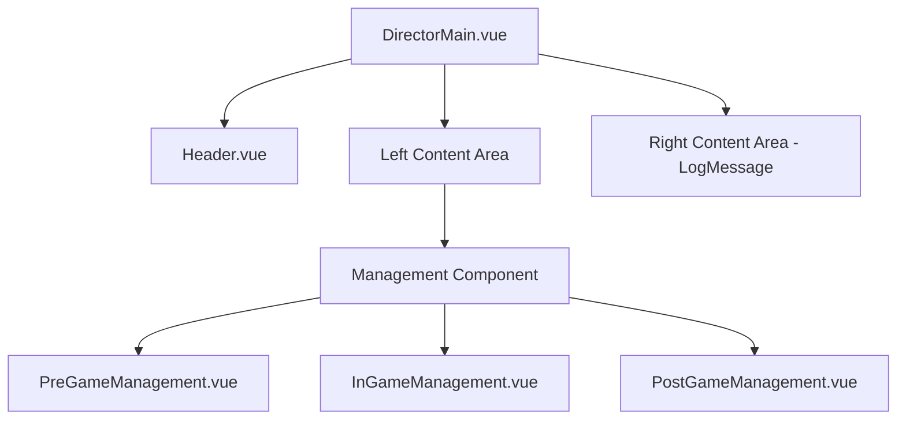
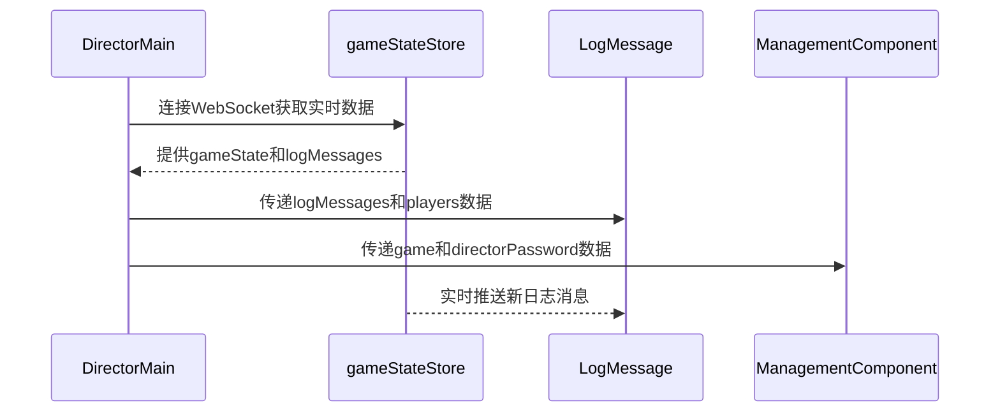

# 游戏UI布局调整设计文档

## 1. 概述

### 1.1 目标
调整导演页面的UI布局，将实时日志消息组件(LogMessage)从InGameManagement.vue中提取出来，放置在DirectorMain.vue中，并实现以下布局要求：
1. 在游戏中状态时，日志显示卡片占满右半屏，其余控件占左半屏
2. 在游戏结束状态时，也显示日志卡片，同样占右半屏

### 1.2 背景
当前的日志消息组件仅在游戏进行中(PAUSED/RUNNING)状态显示，且位于页面底部。根据新的UI需求，需要将日志组件提取到主页面并实现分栏布局。

## 2. 架构设计

### 2.1 组件结构调整

### 2.2 布局方案
采用CSS Flexbox实现两栏布局：
- 左侧栏：包含游戏管理组件(PreGameManagement/InGameManagement/PostGameManagement)
- 右侧栏：显示日志消息组件(LogMessage)

## 3. 实现方案

### 3.1 DirectorMain.vue修改
1. 调整模板结构，将主内容区域分为左右两栏布局
2. 左侧栏包含Header和Management Component
3. 右侧栏为LogMessage组件显示区域
4. 修改LogMessage组件的渲染条件，扩展到游戏结束状态

### 3.2 状态管理调整
1. 保持现有的gameStateStore状态管理不变
2. 确保LogMessage组件能正确接收来自store的日志消息和玩家列表数据
3. 由于PostGameManagement组件也需要显示日志，需确保在游戏结束状态下仍能获取到日志数据

### 3.3 样式调整
1. 使用CSS Flexbox实现左右两栏布局
2. 左侧栏设置为70%宽度，右侧栏设置为30%宽度
3. 为日志区域添加固定高度和滚动条样式
4. 确保在不同屏幕尺寸下的适配性，小屏幕设备采用垂直布局

## 4. 组件交互设计

### 4.1 数据流

### 4.2 条件渲染逻辑
1. LogMessage组件显示条件：
   - 游戏状态为RUNNING或PAUSED时显示(与现有逻辑一致)
   - 游戏状态为ENDED、HIDDEN或DELETED时也显示(新增需求)
2. 左右栏布局应用条件：
   - 当LogMessage组件显示时采用左右分栏布局
   - 当LogMessage组件不显示时采用默认垂直布局

## 5. 响应式设计考虑

### 5.1 桌面端布局
- 使用Flexbox实现左右分栏
- 左侧栏占70%宽度，右侧栏占30%宽度
- 日志区域固定高度并支持滚动

### 5.2 移动端适配
- 在小屏幕设备上，采用上下布局
- 日志区域位于管理组件下方
- 保持组件的基本功能不变

### 5.3 布局切换条件
- 屏幕宽度≥768px时采用左右分栏布局
- 屏幕宽度<768px时采用上下布局