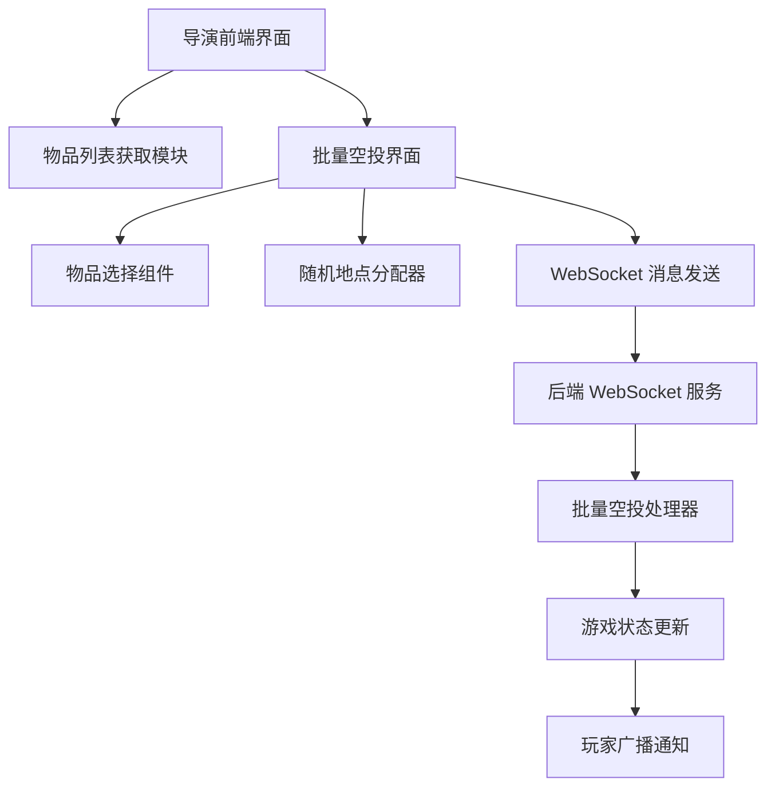
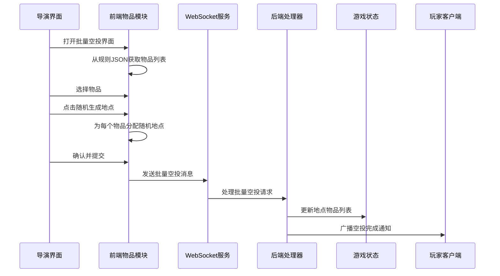
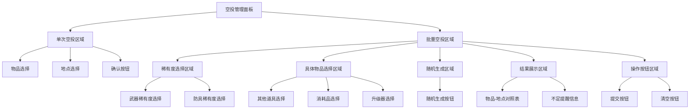
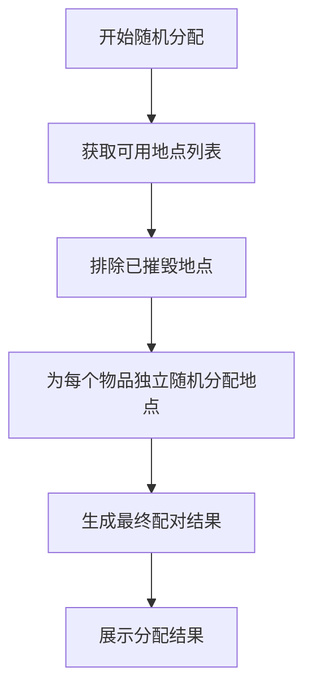
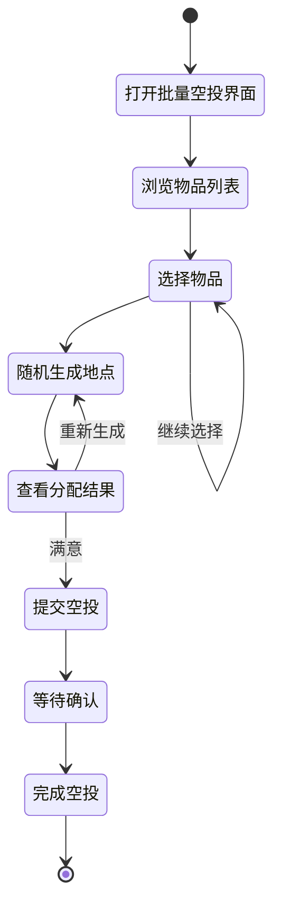

# 物品系统增强设计文档

## 概述

本设计文档定义了 Royale Arena 项目中物品管理系统的增强功能，重点实现基于稀有度的批量空投功能。系统将支持导演通过稀有度选择武器和防具，通过具体名称选择其他物品，并在随机生成阶段从场上未出现的物品中智能挑选。

### 目标

- 实现基于稀有度的武器防具选择机制
- 保留并增强单次空投功能（支持指定特定物品名称）
- 实现批量空投 WebSocket 接口
- 重新设计前端空投界面（单次和批量功能分离）
- 支持智能物品挑选和不足提醒
- 两种空投方式功能互补，无需UI一致性要求

## 技术架构

### 系统组件



### 数据流



## 后端系统设计

### WebSocket 消息协议

### 统一空投消息格式

后端只提供一个统一的批量空投接口，前端单次和批量空投都调用此接口：

```json
{
  "type": "director_action",
  "data": {
    "action": "batch_airdrop",
    "airdrops": [
      {
        "item_name": "[绿]佩剑",
        "place_name": "森林"
      },
      {
        "item_name": "[蓝]冲锋枪",
        "place_name": "工厂"
      }
    ]
  }
}
```

**说明**：
- 单次空投时，`airdrops` 数组只包含一个元素
- 批量空投时，`airdrops` 数组包含多个元素
- 后端根据物品名称自动匹配并附加相应的属性信息

#### 响应消息格式

```json
{
  "type": "game_state",
  "data": {
    "action_result": {
      "message_type": "Info",
      "log_message": "导演执行批量空投操作，成功 5 项",
      "timestamp": "2024-01-01T12:00:00Z"
    }
  }
}
```

### 统一空投处理逻辑

后端只提供一个 `batch_airdrop` 处理器，实现以下逻辑：

1. **物品名称解析**：根据物品名称从游戏规则中查找对应的物品定义
2. **自动属性附加**：根据物品类型和名称自动生成对应的 `properties` 属性
3. **物品对象创建**：为每个空投项创建完整的物品对象
4. **地点添加**：将物品添加到指定地点的物品列表
5. **成功计数**：记录成功空投的物品数量
6. **广播通知**：向所有玩家发送空投完成通知

**物品属性自动匹配规则**：
- **武器**：根据名称匹配 `items.weapons[]` 中的对应项，附加 `damage`、`votes` 等属性
- **防具**：根据名称匹配 `items.armors[]` 中的对应项，附加 `defense`、`votes` 等属性
- **消耗品**：根据名称匹配 `items.consumables[]` 中的对应项，附加 `effect_type`、`effect_value` 等属性
- **其他道具**：根据名称匹配 `items.other_items[]` 中的对应项，附加相应的功能属性
- **升级器**：根据名称匹配 `items.upgraders[]` 中的对应项

### 物品对象结构

```json
{
  "id": "uuid-generated",
  "name": "物品显示名称",
  "item_type": "Equipment",
  "properties": {}
}
```

## 前端系统设计

### 前端双逻辑实现

前端实现两种不同的空投逻辑，但都调用同一个后端接口：

#### 单次空投前端逻辑

1. **物品选择**：从全量物品列表中选择一个具体物品名称
2. **地点选择**：从可用地点列表中选择一个地点
3. **直接提交**：将选择结果包装成一个元素的数组发送给后端

#### 批量空投前端逻辑

1. **稀有度选择**：选择武器/防具的稀有度和数量
2. **具体物品选择**：选择其他物品的具体名称和数量
3. **智能物品挑选**：从场上未出现的对应稀有度物品中随机挑选
4. **随机地点分配**：为每个选中的物品随机分配地点
5. **批量提交**：将所有物品-地点对包装成数组发送给后端

### 物品列表获取模块

#### 规则解析器

从游戏规则 JSON 中提取稀有度和物品信息：

- **稀有度配置**：从 `items.rarity_levels[]` 提取稀有度列表
- **武器稀有度映射**：从 `items.weapons[].rarity` 建立稀有度到武器的映射
- **防具稀有度映射**：从 `items.armors[].rarity` 建立稀有度到防具的映射
- **其他道具**：从 `items.other_items[].name` 提取
- **消耗品**：从 `items.consumables[].name` 提取
- **升级道具**：从 `items.upgraders[].display_names[]` 提取

#### 物品展示机制设计

##### 单次空投物品展示（全量显示）

单次空投显示所有可用物品，不考虑场上是否已存在：

| 物品类型 | 显示方式 | 数据源 |
|---------|----------|--------|
| 武器 | 所有具体名称 | `items.weapons[].display_names[]` |
| 防具 | 所有具体名称 | `items.armors[].display_names[]` |
| 其他道具 | 所有具体名称 | `items.other_items[].name` |
| 消耗品 | 所有具体名称 | `items.consumables[].name` |
| 升级器 | 所有具体名称 | `items.upgraders[].display_names[]` |

##### 批量空投物品展示（稀有度整合+数量上限）

批量空投将武器和防具按稀有度整合，并显示可用数量上限：

| 稀有度类型 | 显示名称格式 | 示例 |
|-----------|-------------|-------|
| common | 普通武器(上限N) | 普通武器(上限8) |
| rare | 稀有武器(上限N) | 稀有武器(上限6) |
| epic | 史诗武器(上限N) | 史诗武器(上限4) |
| legendary | 传说武器(上限N) | 传说武器(上限9) |
| common | 普通防具(上限N) | 普通防具(上限3) |
| rare | 稀有防具(上限N) | 稀有防具(上限5) |
| epic | 史诗防具(上限N) | 史诗防具(上限2) |
| legendary | 传说防具(上限N) | 传说防具(上限6) |

**数量上限计算方法**：
- 上限N = 该稀有度所有可用名称数量 - 场上已出现的名称数量
- 其他物品类型仍然按具体名称展示，不显示数量上限

#### 智能物品挑选逻辑

在随机生成阶段，系统将执行智能挑选：

``mermaid
flowchart TD
    A[开始智能挑选] --> B[获取当前场上已存在物品列表]
    B --> C[遍历导演选择的稀有度需求]
    C --> D[查找该稀有度的所有武器/防具]
    D --> E[过滤掉场上已存在的物品]
    E --> F{剩余物品数量 >= 需求数量?}
    F -->|是| G[随机挑选需求数量的物品]
    F -->|否| H[选择所有剩余物品]
    G --> I[添加到结果列表]
    H --> J[添加到结果列表 + 记录不足提醒]
    I --> K{还有更多稀有度需求?}
    J --> K
    K -->|是| C
    K -->|否| L[生成最终空投列表]
```

**挑选逻辑**：
1. **武器和防具**：从该稀有度的所有可用名称中排除场上已存在的
2. **其他物品类型**：按具体名称直接处理（消耗品、其他道具、升级器）
3. **不足处理**：当某稀有度物品不足时，显示提醒但仍正常展示结果

#### 物品统一列表结构

所有物品将在单一列表中展示，不进行分类，按以下顺序合并：

| 数据源 | 示例物品 |
|--------|----------|
| `items.weapons` | `[绿]佩剑`, `[蓝]冲锋枪` |
| `items.armors` | `[绿]皮甲`, `[蓝]战术背心` |
| `items.other_items` | `[GPS]心跳探测仪` |
| `items.consumables` | `[HP30]绷带` |
| `items.upgraders` | `[合]自然升级器` |

### 批量空投界面设计

#### 界面组件结构



#### 界面布局规范

- **单次空投区域**：精准的单物品名称选择和地点选择界面，支持指定特定物品
- **批量空投稀有度选择**：武器和防具按稀有度分类，显示数量选择器
- **批量空投具体物品选择**：其他物品类型显示具体名称和数量选择
- **随机生成区域**：单一随机生成按钮，每次点击重新生成
- **结果展示区域**：表格形式展示最终的物品-地点配对结果，包含不足提醒
- **操作按钮区域**：提供提交和清空操作

**功能差异化**：
- 单次空投：适用于精确投放特定名称的物品
- 批量空投：适用于大量稀有度物品的快速投放

### 随机地点分配策略

#### 地点筛选规则

1. **排除已摧毁地点**：从 `places` 中筛选 `is_destroyed: false`
2. **不排除即将缩圈的地点**：与 `next_night_destroyed_places` 无关。不需要做任何操作。

#### 分配算法



### WebSocket 集成

#### 消息发送接口

前端单次和批量空投都通过 `webSocketService.sendDirectorAction()` 发送统一的批量空投请求：

**单次空投调用**：
```typescript
webSocketService.sendDirectorAction('batch_airdrop', {
  airdrops: [
    { item_name: '物品名', place_name: '地点名' }
  ]
})
```

**批量空投调用**：
```typescript
webSocketService.sendDirectorAction('batch_airdrop', {
  airdrops: [
    { item_name: '物品1名', place_name: '地点1名' },
    { item_name: '物品2名', place_name: '地点2名' },
    // ... 更多物品
  ]
})

#### 响应处理

监听 WebSocket 消息中的 `action_result`，根据 `message_type` 进行相应处理：

- **Info 类型**：显示轻量级成功提示
- **其他类型**：显示详细操作结果

## 用户交互流程

### 导演操作流程



### 界面交互规范

1. **稀有度选择**：选择武器/防具的稀有度和数量
2. **具体物品选择**：选择其他物品的具体名称和数量
3. **随机生成**：单一按钮，每次点击重新生成所有物品的地点分配和具体名称（武器/防具）
4. **智能挑选提醒**：当某稀有度物品不足时显示提醒信息
5. **结果预览**：表格展示最终的分配方案（包含具体物品名称）
6. **确认提交**：二次确认后发送到后端

## 广播通知机制

### 玩家通知内容

空投完成后，向所有玩家发送统一通知：

```json
{
  "type": "system_message", 
  "data": {
    "message": "导演完成了空投操作"
  }
}
```

### 通知特点

- **信息简化**：不包含具体物品名称或地点信息
- **统一格式**：所有玩家收到相同通知内容  
- **即时发送**：空投处理完成后立即广播

## 实现范围

### 包含功能

- 批量空投 WebSocket 接口实现
- 前端物品列表获取和展示
- 物品选择和数量管理
- 随机地点分配算法
- 批量空投界面重构
- 基础的成功/失败反馈
- 完全移除旧的单次空投逻辑

### 不包含功能

- 复杂的物品验证逻辑
- 单元测试和集成测试
- 高级的空投调度功能
- 过度复杂的界面设计
- 基于 `is_airdropped` 的物品筛选
- 任何性能要求
- 空投物品数量限制
- 单次和批量空投的UI一致性要求

## 技术约束

### 功能保留要求

- **移除后端单次空投逻辑**：完全移除后端的 `handle_drop` 方法和相关逻辑
- **统一后端接口**：后端只保留 `batch_airdrop` 一个处理接口
- **前端双逻辑实现**：前端实现单次和批量两种不同的逻辑
- **后端智能属性生成**：后端根据物品名称自动附加相应的 `properties` 属性
- **功能差异化**：单次空投和批量空投服务不同目的，不要求UI一致性
- **WebSocket统一协议**：两种空投方式都使用相同WebSocket消息格式
- **破坏性更新**：删去后端功能时不保留任何兼容性，确保所有旧逻辑不会被错误调用。

### 安全考虑

- 仅导演用户可执行空投操作
- 通过 WebSocket 认证确保操作权限
- 后端智能处理物品属性生成和场上物品状态检测
- 支持现有的游戏规则 JSON 格式
- 不需要任何单元测试和集成测试