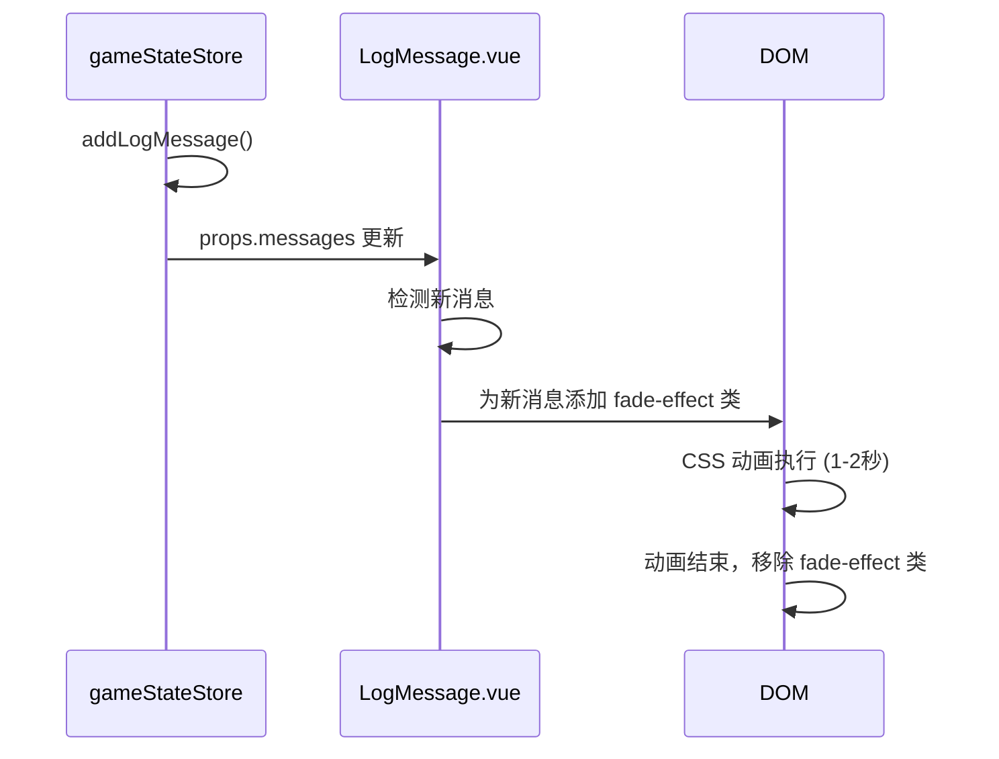

# 日志消息淡出效果设计文档

## 1. 概述

本设计文档旨在为导演控制台的日志消息组件添加新消息的视觉反馈效果。当新的日志消息被添加到日志列表中时，新消息会有一个明显的淡入淡出动画效果，使其在短时间内更加显眼，然后逐渐恢复到正常的显示状态。

## 2. 设计目标

- 当通过 `addLogMessage` 方法添加新消息时，新消息在日志列表中应有明显的视觉反馈
- 新消息初始具有较深的背景色，然后在1-2秒内逐渐变浅，最终与其他消息保持一致
- 效果应适用于所有类型的消息（系统消息和用户消息）
- 不影响现有功能和性能

## 3. 实现方案

### 3.1 技术方案

在 Vue 组件中使用 CSS 动画和 JavaScript 类控制来实现淡入淡出效果：

1. 为新添加的消息添加特殊的 CSS 类
2. 使用 CSS transition 实现背景色的平滑过渡
3. 使用 JavaScript 在动画结束后移除特殊类

### 3.2 核心实现逻辑



### 3.3 状态管理

在 LogMessage.vue 组件中添加一个 Set 来跟踪新消息的 key，用于应用淡入淡出效果：

- 使用消息的时间戳作为唯一标识
- 在消息添加后的动画结束后从 Set 中移除

## 4. 组件修改

### 4.1 LogMessage.vue 修改

#### 4.1.1 添加响应式状态

在 `<script setup>` 部分添加以下代码：

```typescript
// 新增用于跟踪新消息的 Set
const newMessages = ref<Set<string>>(new Set())
```

#### 4.1.2 修改消息渲染部分

修改现有的消息渲染代码，添加动态类绑定：

```html
<div 
  v-for="message in displayedMessages" 
  :key="message.timestamp"
  :class="['log-item', message.message_type, isNewMessage(message.timestamp) ? 'fade-effect' : '']"
  :data-timestamp="message.timestamp"
>
```

#### 4.1.3 添加方法

在 `<script setup>` 部分添加以下方法：

```typescript
// 判断是否为新消息
const isNewMessage = (timestamp: string) => {
  return newMessages.value.has(timestamp)
}

// 监听消息变化，标记新消息
watch(() => props.messages, (newMessagesList, oldMessagesList) => {
  // 检查是否有新消息添加
  if (newMessagesList.length > (oldMessagesList?.length || 0)) {
    const newMessage = newMessagesList[0]
    // 添加到新消息集合
    newMessages.value.add(newMessage.timestamp)
    
    // 设置定时器在动画结束后移除标记
    setTimeout(() => {
      newMessages.value.delete(newMessage.timestamp)
    }, 2000) // 与CSS动画时间保持一致
  }
  
  // 保持原有滚动逻辑
  if (!showAll.value) {
    nextTick(() => {
      scrollToBottom()
    })
  }
}, { deep: true })
```

#### 4.1.4 添加 CSS 样式

在 `<style scoped>` 部分添加以下样式：

```css
/* 新消息淡入淡出效果 */
.log-item.fade-effect.system_notice {
  background-color: #b3d9ff;
  transition: background-color 1.5s ease-out;
}

.log-item.fade-effect.user_directed {
  background-color: #b3e6ff;
  transition: background-color 1.5s ease-out;
}

/* 动画结束后恢复原状 */
.log-item.system_notice {
  background-color: #ecf5ff;
  border-left: 4px solid #409eff;
  transition: background-color 0.3s ease;
}

.log-item.user_directed {
  background-color: #f0f9ff;
  border-left: 4px solid #67c23a;
  transition: background-color 0.3s ease;
}
```

## 5. 样式设计

### 5.1 颜色方案

| 消息类型 | 初始背景色 | 最终背景色 | 动画时长 |
|---------|-----------|-----------|---------|
| 系统消息 | `#b3d9ff` | `#ecf5ff` | 1.5秒 |
| 用户消息 | `#b3e6ff` | `#f0f9ff` | 1.5秒 |

### 5.2 动画曲线

使用 `ease-out` 缓动函数，使动画开始较快，然后逐渐减慢，提供更自然的视觉效果。

## 6. 测试方案

### 6.1 功能测试

1. 验证新消息添加时是否正确应用淡入淡出效果
2. 验证动画结束后消息是否恢复到正常状态
3. 验证系统消息和用户消息是否都有正确的淡入淡出效果
4. 验证多条消息连续添加时效果是否正常

### 6.2 性能测试

1. 验证大量消息时不会出现性能问题
2. 验证动画不会阻塞其他 UI 操作
3. 验证定时器是否正确清理

## 7. 注意事项

1. 确保动画时间与 CSS 中设置的过渡时间保持一致
2. 避免在大量消息情况下产生性能问题
3. 确保组件销毁时正确清理定时器
4. 保持与现有主题样式的一致性