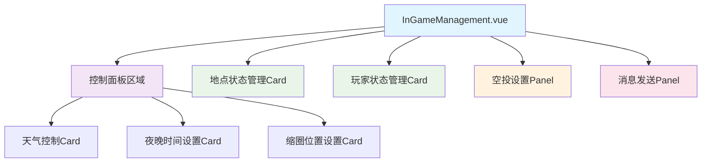
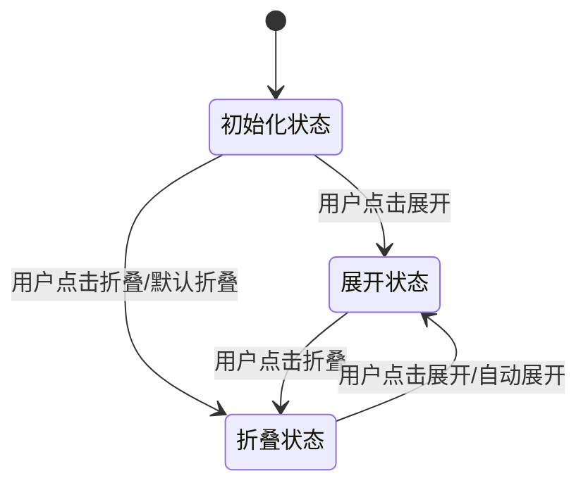
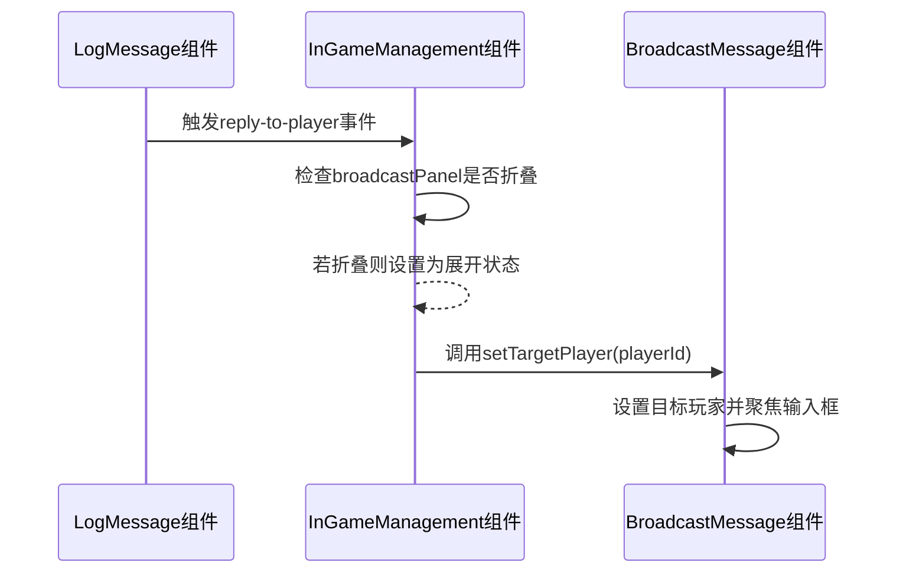

# Panel折叠功能设计文档

## 1. 概述

### 1.1 功能目标
为导演控制台的游戏中管理界面的各个Panel组件添加折叠功能，提升界面空间利用率和用户体验。需要实现以下功能：
1. 地点状态管理、玩家状态管理、空投设置、消息发送等控件支持折叠/展开
2. 地点管理和空投设置Panel默认为折叠状态
3. 当通过LogMessage回复功能触发消息发送时，若消息发送Panel处于折叠状态，则自动展开

### 1.2 设计原则
- 不使用额外折叠控件包装Panel，直接在各Panel组件中实现折叠功能
- 保持现有组件结构和功能不变，仅添加折叠控制逻辑
- 遵循最小化修改原则，避免增加维护复杂度

## 2. 架构设计

### 2.1 组件结构图

### 2.2 折叠状态管理设计

## 3. 功能详细设计

### 3.1 Panel折叠控制机制

#### 3.1.1 折叠状态数据结构
各Panel组件独立管理自己的折叠状态，不需要统一的状态管理对象。

#### 3.1.2 状态管理策略
- 每个Panel组件内部使用ref管理自身的折叠状态
- 折叠状态完全在组件内部处理，不需要外部调用

### 3.2 默认折叠设置
根据需求，以下Panel默认为折叠状态：
- 地点状态管理Panel (PlaceStatusCard.vue)
- 空投设置Panel (AirdropPanel.vue)

其他Panel默认为展开状态：
- 玩家状态管理Panel (PlayerStatusCard.vue)
- 消息发送Panel (BroadcastMessage.vue)

### 3.3 自动展开机制

#### 3.3.1 触发条件
当用户在LogMessage组件中点击回复按钮时，通过`reply-to-player`事件通知InGameManagement组件，若消息发送Panel处于折叠状态，则自动展开。

#### 3.3.2 实现流程

## 4. 组件交互设计

### 4.1 各Panel组件修改

#### 4.1.1 PlaceStatusCard.vue修改
- 添加折叠状态ref，默认值为false(折叠)
- 修改模板结构，将内容部分用collapse-transition包装
- 在卡片头部添加折叠/展开切换按钮

#### 4.1.2 PlayerStatusCard.vue修改
- 添加折叠状态ref，默认值为true(展开)
- 修改模板结构，将内容部分用collapse-transition包装
- 在卡片头部添加折叠/展开切换按钮

#### 4.1.3 AirdropPanel.vue修改
- 添加折叠状态ref，默认值为false(折叠)
- 修改模板结构，将内容部分用collapse-transition包装
- 在卡片头部添加折叠/展开切换按钮

#### 4.1.4 BroadcastMessage.vue修改
- 添加折叠状态ref，默认值为true(展开)
- 修改模板结构，将内容部分用collapse-transition包装
- 在卡片头部添加折叠/展开切换按钮

### 4.2 InGameManagement.vue修改

#### 4.2.1 修改事件处理方法
- 在处理`reply-to-player`事件的方法中添加自动展开逻辑
- 确保在展开后正确调用BroadcastMessage组件方法

### 4.3 与其他组件的交互

#### 4.3.1 与LogMessage组件的交互
- 保持现有回调机制不变
- 通过props和emit实现通信

#### 4.3.2 与各Panel组件的交互
- 保持现有的props传递和事件通信方式
- 确保折叠状态不影响现有功能

## 5. UI/UX设计

### 5.1 折叠按钮设计
- 在每个Panel头部右侧添加折叠/展开按钮
- 使用Element Plus的图标组件(arrow-up/arrow-down)
- 按钮样式与现有设计保持一致

### 5.2 过渡动画
- 使用Element Plus的collapse-transition组件
- 添加适当的展开/收起动画效果
- 确保动画流畅不卡顿