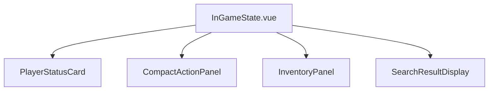

# 玩家控制面板设计文档

## 1. 概述

### 1.1 设计目标
本设计文档旨在定义玩家控制面板的前端界面和交互逻辑，确保与后端WebSocket服务正确通信。控制面板将提供玩家在游戏进行中所需的所有操作功能，包括移动、搜索、攻击、使用道具等。

### 1.2 设计原则
- 紧凑布局：所有操作控件应紧密排列，避免为每个小操作单独建立卡片
- 响应式设计：重点确保手机端浏览体验，避免边框出现较大空隙
- 直观易用：界面布局清晰，操作流程符合用户预期
- 与导演控制台区分：在风格上有较大变化，体现玩家视角的独特性
- 实时反馈：所有操作都应有明确的视觉反馈，告知玩家操作结果

## 2. 架构设计

### 2.1 技术栈
- Vue 3 Composition API
- Element Plus UI组件库
- Pinia状态管理
- WebSocket实时通信

### 2.2 组件结构


注：MessageDisplay使用ActorMain.vue中已有的公用LogMessage组件。

### 2.3 数据流设计
玩家控制面板通过WebSocket与后端服务进行实时通信，数据流如下：
1. 玩家执行操作 → 发送WebSocket消息到后端
2. 后端处理操作 → 广播更新状态给相关玩家
3. 前端通过ActorMain.vue中的WebSocket事件监听器接收完整的游戏状态更新
4. InGameState组件接收更新后的状态并刷新UI显示
5. 玩家看到操作结果反馈

WebSocket的每一条消息都会完整地传递玩家目前可以看到的全部内容，前端只需正确解析并展示这些信息。

### 2.3 状态管理
玩家控制面板将通过ActorMain.vue中已有的GameStateStore管理以下状态：
- 玩家基本信息（生命值、体力值、位置等）
- 背包物品列表
- 手持物品状态
- 上次搜索结果
- 游戏全局状态（天气、游戏阶段、夜晚开始时间、夜晚结束时间、下一轮缩圈位置等）

WebSocket的每一条消息都会完整地讲述一遍玩家目前可以看到的全部内容，前端通过store中的gameState响应式数据来获取最新的游戏状态。当距离下一阶段开始时间小于5分钟时，前端将启动倒计时功能，动态显示剩余时间。玩家可以展开折叠面板查看完整的全局信息。

## 3. 界面设计

### 3.1 布局规范
- 采用紧凑型网格布局，所有操作按钮紧密排列在一起
- 玩家状态信息Card位于最上方
- 紧凑操作面板紧随其后
- 背包面板、搜索结果展示等辅助信息位于下方
- 移动端优先设计，确保在小屏幕设备上也能完整显示所有功能
- 最大宽度限制：手机端100%，平板端最大600px，桌面端720px
- 与导演控制台形成明显风格差异，体现玩家视角的独特性

### 3.2 响应式设计
- 使用CSS Grid和Flexbox实现自适应布局
- 媒体查询适配不同屏幕尺寸：
  - 手机端（≤768px）：单列布局，按钮全宽显示，重要操作按钮放大
  - 平板端（769px-1024px）：多列网格布局，适当调整间距
  - 桌面端（≥1025px）：优化网格布局，充分利用屏幕空间
- 特别优化移动端体验，确保边框不会出现较大空隙
- 所有操作按钮在移动端保持足够大小，便于触摸操作

### 3.3 组件设计

#### 3.3.1 玩家状态显示组件
在最上方单独建立一个Card来展示玩家当前的核心状态信息：
- 生命值（进度条形式）
- 体力值（进度条形式）
- 当前位置
- 显式的下一阶段开始时间
- 时间倒计时功能（当距离夜晚开始或结束时间较近时，动态展示剩余时间）

除了下一夜晚开始时间外，其他全局信息（天气、游戏阶段等）将以默认隐藏的折叠方式展示。玩家可以点击折叠小箭头来展开查看当前的全局信息，包括：
- 天气影响
- 游戏阶段（白天/夜晚）
- 夜晚结束时间
- 下一轮缩圈位置

使用简单的太阳或月亮图案作为背景来提示白天或夜晚状态，不占用其他控件的位置。同时根据白天/夜晚状态略微变更当前状态Card的背景色调以作区分：
- 白天：使用较明亮的背景色调
- 夜晚：使用较深的背景色调

该组件将通过WebSocket接收的实时状态更新进行即时刷新，确保与服务器状态同步。当距离下一阶段开始时间小于5分钟时，将动态显示倒计时，提醒玩家时间的流逝。

#### 3.3.2 紧凑操作面板
集中展示所有可用操作按钮，采用网格布局紧密排列：
- 核心操作：移动、搜索、攻击等高频操作按钮较大且突出
- 道具操作：装备、使用、丢弃等道具相关操作按钮
- 通信操作：传音、发送消息等社交功能按钮
- 特殊操作：出生、捡拾等条件触发的操作按钮

按钮设计采用圆角矩形，颜色区分功能类型，确保在移动设备上易于点击。

与导演控制台的显著区别：
- 不使用卡片式布局，采用扁平化设计
- 按钮更加紧凑，减少不必要的间距
- 颜色方案更加活泼，体现玩家的参与感
- 布局更加集中，避免分散注意力

#### 3.3.3 背包面板
展示玩家当前拥有的物品列表，支持：
- 查看物品详情
- 装备物品
- 使用消耗品
- 丢弃物品

#### 3.3.4 搜索结果展示
显示上次搜索的结果，包括：
- 发现的目标（玩家或物品）
- 可见性状态
- 相关操作按钮

#### 3.3.5 消息显示区域
使用已有的公用LogMessage组件展示系统消息和玩家间通信：
- 系统通知
- 战斗结果
- 其他玩家消息

该组件已在ActorMain.vue中实现，我们只需确保InGameState能够正确显示即可。

## 4. 功能设计

### 4.1 核心操作功能

所有操作均通过WebSocket与后端通信，确保实时性。操作按钮根据游戏状态和玩家条件动态启用/禁用。

#### 4.1.1 出生操作
- 功能：选择出生地点
- 触发条件：游戏开始且玩家未出生
- WebSocket消息格式：
```json
{
  "message_type": "PlayerAction",
  "data": {
    "action": "born",
    "place_name": "地点名称"
  }
}
```

#### 4.1.2 移动操作
- 功能：移动到指定地点
- 触发条件：玩家处于存活状态且有足够体力
- WebSocket消息格式：
```json
{
  "message_type": "PlayerAction",
  "data": {
    "action": "move",
    "target_place": "目标地点名称"
  }
}
```

#### 4.1.3 搜索操作
- 功能：在当前位置搜索玩家或物品
- 触发条件：玩家处于存活状态且有足够体力
- WebSocket消息格式：
```json
{
  "message_type": "PlayerAction",
  "data": {
    "action": "search"
  }
}
```

#### 4.1.4 捡拾操作
- 功能：捡起上次搜索发现的物品
- 触发条件：上次搜索结果为物品且物品仍在原地
- WebSocket消息格式：
```json
{
  "message_type": "PlayerAction",
  "data": {
    "action": "pick"
  }
}
```

#### 4.1.5 攻击操作
- 功能：攻击上次搜索发现的玩家
- 触发条件：上次搜索结果为玩家且玩家仍在原地
- WebSocket消息格式：
```json
{
  "message_type": "PlayerAction",
  "data": {
    "action": "attack"
  }
}
```

#### 4.1.6 装备操作
- 功能：装备指定物品
- 触发条件：背包中有指定物品
- WebSocket消息格式：
```json
{
  "message_type": "PlayerAction",
  "data": {
    "action": "equip",
    "item_id": "物品ID"
  }
}
```

#### 4.1.7 使用道具操作
- 功能：使用手持的道具
- 触发条件：手持指定道具
- WebSocket消息格式：
```json
{
  "message_type": "PlayerAction",
  "data": {
    "action": "use",
    "item_id": "物品ID"
  }
}
```

#### 4.1.8 丢弃道具操作
- 功能：丢弃指定物品
- 触发条件：背包中有指定物品
- WebSocket消息格式：
```json
{
  "message_type": "PlayerAction",
  "data": {
    "action": "throw",
    "item_id": "物品ID"
  }
}
```

#### 4.1.9 传音操作
- 功能：向指定玩家发送消息
- 触发条件：玩家处于存活状态
- WebSocket消息格式：
```json
{
  "message_type": "PlayerAction",
  "data": {
    "action": "deliver",
    "target_player_id": "目标玩家ID",
    "message": "消息内容"
  }
}
```

#### 4.1.10 发送消息给导演操作
- 功能：向导演发送消息
- 触发条件：无特殊限制
- WebSocket消息格式：
```json
{
  "message_type": "PlayerAction",
  "data": {
    "action": "send",
    "message": "消息内容"
  }
}
```

所有操作结果将通过WebSocket完整状态更新机制反馈给前端，确保界面与服务器状态同步。

### 4.2 状态更新机制
- 通过ActorMain.vue中的WebSocket事件监听器接收服务器推送的完整游戏状态更新
- WebSocket的每一条消息都会完整地讲述一遍玩家目前可以看到的全部内容
- 实时更新GameStateStore中的游戏状态
- InGameState组件通过响应式数据获取最新的游戏状态并更新UI
- 根据状态变化动态启用/禁用操作按钮
- 处理服务器返回的操作结果反馈
- 实时计算并显示下一阶段开始倒计时（当距离夜晚开始或结束时间小于5分钟时）

## 5. WebSocket通信设计

### 5.1 连接管理
- 在组件挂载时建立WebSocket连接
- 处理连接错误和重连机制
- 在组件卸载时正确关闭连接
- 与现有游戏状态管理store集成，确保状态同步
- 连接URL格式：`/ws/{gameId}?user_type=actor&password={password}`

### 5.2 消息处理
- 通过ActorMain.vue中的WebSocket事件监听器接收服务器推送的完整状态更新消息
- 每一条消息都会完整地讲述一遍玩家目前可以看到的全部内容
- 实时更新GameStateStore中的游戏状态
- InGameState组件通过响应式数据获取最新的游戏状态并更新UI
- 消息类型包括：
  - `system_message`：系统通知消息
  - `game_state`：游戏状态更新（包含玩家可以看到的完整状态信息，包括夜晚开始和结束时间）
  - `action_result`：操作结果反馈

### 5.3 错误处理
- 网络连接异常时的用户提示
- 操作失败时的错误信息展示
- 自动重连机制（最多尝试5次，间隔3秒）
- 与导演端WebSocket通信保持一致的错误处理策略
- 连接超时处理（默认30秒）

## 6. 样式设计

### 6.1 色彩方案
- 主色调：活力橙色系，体现玩家的参与感和游戏活力
- 辅助色：蓝色用于移动相关操作，绿色用于成功反馈，红色用于攻击等危险操作
- 状态色：生命值用红色渐变，体力值用蓝色渐变
- 白天/夜晚背景色：
  - 白天：使用较明亮的背景色调
  - 夜晚：使用较深的背景色调
- 与导演控制台形成明显视觉差异，导演端采用冷静的蓝灰色系，玩家端采用活跃的橙色系

### 6.2 字体规范
- 主要字体：系统默认字体族
- 标题字体：加粗，字号根据层级递减
- 正文字体：适中大小，确保手机端可读性

### 6.3 间距规范
- 组件间间距：移动端10px，平板端15px，桌面端20px
- 内边距：按钮内边距适中，确保触摸操作的准确性
- 外边距：保持整体布局的平衡感

## 7. 测试策略

### 7.1 单元测试
- 各组件的独立功能测试
- WebSocket消息处理逻辑测试
- 状态更新机制测试
- 玩家操作按钮的事件处理测试
- 表单验证和输入处理测试

### 7.2 集成测试
- 与Pinia store的集成测试
- 与后端WebSocket服务的通信测试
- 响应式布局在不同设备上的表现测试
- 玩家操作与游戏状态同步测试
- 错误处理和重连机制测试

### 7.3 用户体验测试
- 操作流程的顺畅性测试
- 移动端操作的便捷性测试
- 界面在不同屏幕尺寸下的适配测试
- 与导演控制台的视觉区分度测试
- 实时反馈机制的有效性测试