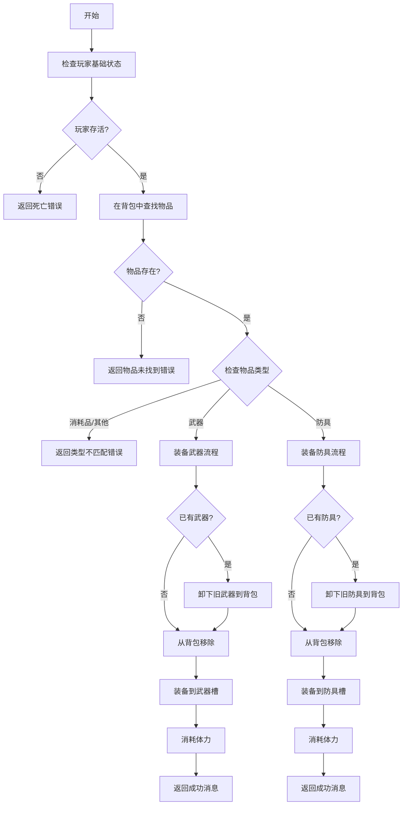
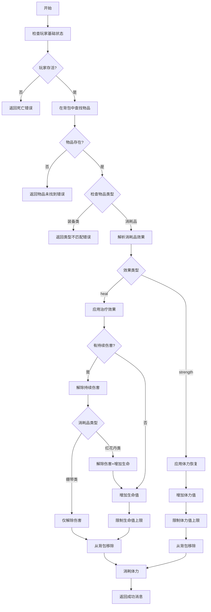
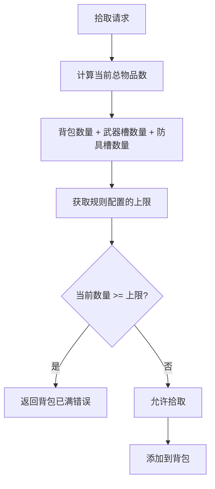
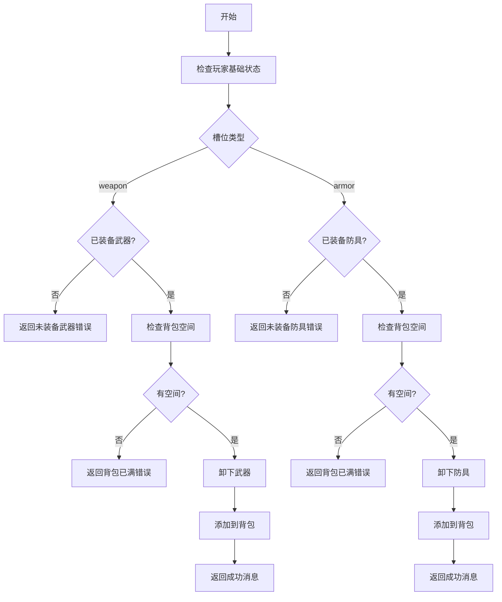
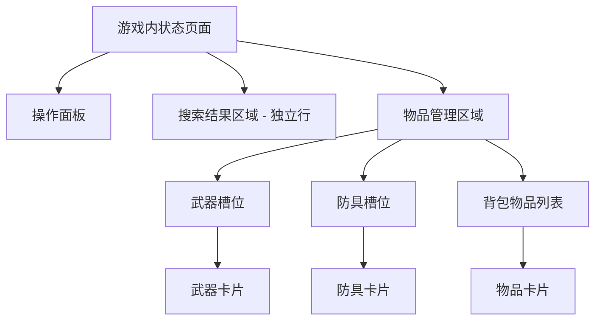
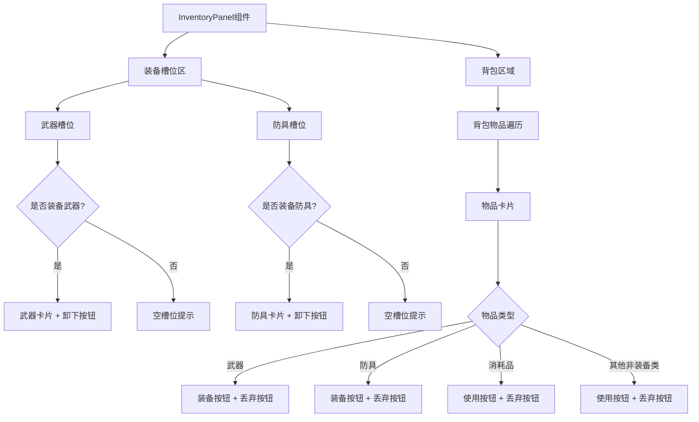
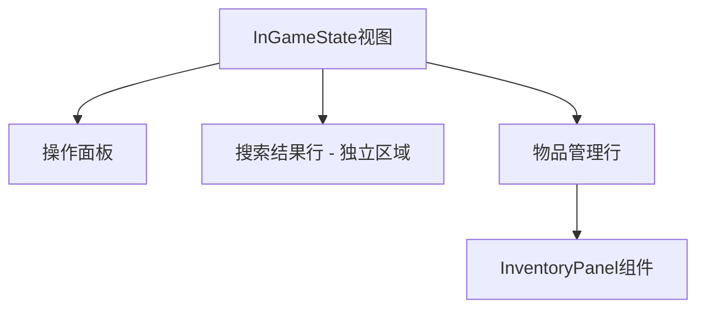
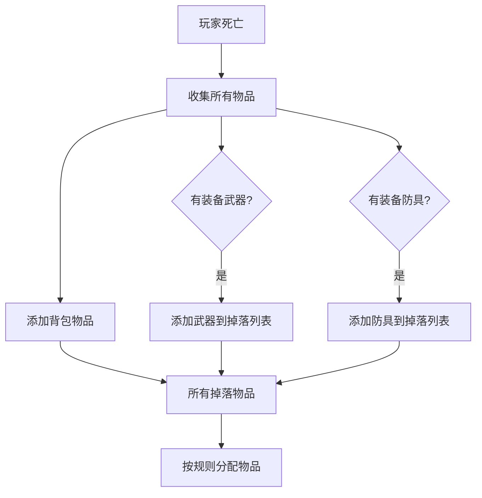

# 玩家装备逻辑重构设计文档

## 概述

本设计重构玩家装备与物品使用逻辑，简化交互流程，移除手持物品（hand_item）机制，实现直接从背包装备和使用物品的操作模式。所有输出使用简体中文。

### 核心目标

- 移除手持物品（hand_item）机制，简化物品交互流程
- 将装备栏从列表（Vec）改为单槽位（Option），限制武器和防具各只能装备一件
- 重构装备函数，实现装备槽位管理和自动卸载逻辑
- 重构使用函数，实现消耗品效果系统
- 实现总物品数量计算，包含背包和已装备物品
- 调整前端显示，分离装备栏和背包展示

## 数据模型重构

### Player 结构变更

#### 装备系统字段变更

移除旧字段：
- `equipped_weapons: Vec<String>` - 删除
- `equipped_armors: Vec<String>` - 删除
- `equipped_items_detail: HashMap<String, Item>` - 删除
- `hand_item: Option<String>` - 删除

新增字段：
- `equipped_weapon: Option<Item>` - 当前装备的武器（单槽位）
- `equipped_armor: Option<Item>` - 当前装备的防具（单槽位）

#### 修改后的 Player 结构

| 字段名 | 类型 | 说明 |
|--------|------|------|
| id | String | 玩家唯一标识 |
| name | String | 玩家名称 |
| location | String | 当前位置 |
| life | i32 | 当前生命值 |
| strength | i32 | 当前体力值 |
| max_life | i32 | 最大生命值 |
| max_strength | i32 | 最大体力值 |
| inventory | Vec\<Item\> | 背包物品列表 |
| equipped_weapon | Option\<Item\> | 当前装备的武器 |
| equipped_armor | Option\<Item\> | 当前装备的防具 |
| last_search_result | Option\<SearchResult\> | 上次搜索结果 |
| is_alive | bool | 是否存活 |
| is_bound | bool | 是否被捆绑 |
| is_born | bool | 是否已出生 |
| rest_mode | bool | 是否处于静养模式 |
| rest_life_recovery | i32 | 静养生命恢复值 |
| rest_moves_used | i32 | 静养已用移动次数 |
| last_search_time | Option\<DateTime\<Utc\>\> | 上次搜索时间 |
| votes | i32 | 当前票数 |
| team_id | Option\<u32\> | 队伍ID |
| bleed_damage | i32 | 持续伤害值 |
| bleed_rounds_remaining | i32 | 持续伤害剩余回合数 |

### Player 方法更新

#### 新增方法

**计算总物品数量**
- 方法名：`get_total_item_count`
- 返回值：`usize`
- 功能：计算背包物品数量 + 已装备武器数量 + 已装备防具数量

**装备武器**
- 方法名：`equip_weapon`
- 参数：`weapon: Item`
- 返回值：`Option<Item>`
- 功能：装备武器到武器槽，如已有装备则返回旧装备

**装备防具**
- 方法名：`equip_armor`
- 参数：`armor: Item`
- 返回值：`Option<Item>`
- 功能：装备防具到防具槽，如已有装备则返回旧装备

**卸下武器**
- 方法名：`unequip_weapon`
- 参数：无
- 返回值：`Option<Item>`
- 功能：卸下当前武器并返回

**卸下防具**
- 方法名：`unequip_armor`
- 参数：无
- 返回值：`Option<Item>`
- 功能：卸下当前防具并返回

**获取总防御值**
- 方法名：`get_total_defense`
- 返回值：`i32`
- 功能：返回当前装备防具的防御值（若无防具则返回0）

**获取武器伤害值**
- 方法名：`get_weapon_damage`
- 返回值：`i32`
- 功能：返回当前装备武器的伤害值（若无武器则返回0）

## 行为逻辑重构

### 装备行为（handle_equip_action）

#### 输入参数

| 参数名 | 类型 | 说明 |
|--------|------|------|
| player_id | &str | 玩家ID |
| item_id | &str | 要装备的物品ID |

#### 执行流程

#### 状态变更规则

| 场景 | 操作前状态 | 操作 | 操作后状态 |
|------|-----------|------|-----------|
| 装备武器（无旧武器） | 背包：[武器A, 物品B] 武器槽：空 | 装备武器A | 背包：[物品B] 武器槽：武器A |
| 装备武器（有旧武器） | 背包：[武器B, 物品C] 武器槽：武器A | 装备武器B | 背包：[武器A, 物品C] 武器槽：武器B |
| 装备防具（无旧防具） | 背包：[防具A, 物品B] 防具槽：空 | 装备防具A | 背包：[物品B] 防具槽：防具A |
| 装备防具（有旧防具） | 背包：[防具B, 物品C] 防具槽：防具A | 装备防具B | 背包：[防具A, 物品C] 防具槽：防具B |

#### 错误处理

| 错误类型 | 消息内容 | 消息类型 |
|---------|---------|---------|
| 玩家已死亡 | 玩家已死亡，无法进行操作 | Info |
| 物品不在背包 | 背包中没有该道具 | Info |
| 类型不匹配 | 该物品不是装备，无法装备 | Info |

#### 返回数据结构

成功返回：
- data字段：
  - equipped_weapon：当前装备的武器（若装备了武器）
  - equipped_armor：当前装备的防具（若装备了防具）
  - inventory：更新后的背包
  - strength：剩余体力值
- 消息类型：SystemNotice
- 日志消息：玩家 {玩家名称} 装备了 {物品名称}

### 使用行为（handle_use_action）

#### 输入参数

| 参数名 | 类型 | 说明 |
|--------|------|------|
| player_id | &str | 玩家ID |
| item_id | &str | 要使用的物品ID |

#### 执行流程

#### 消耗品效果规则

| 效果类型 | 字段名称 | 效果说明 |
|---------|---------|---------|
| 治疗（heal） | effect_value | 恢复指定数值的生命值 |
| 治疗（heal） | cure_bleed | 是否解除持续伤害效果 |
| 体力恢复（strength） | effect_value | 恢复指定数值的体力 |

#### 治疗逻辑详细规则

**绷带类消耗品**（cure_bleed=true，常规治疗）：
- 若有持续伤害效果：仅解除持续伤害，不增加生命值
- 若无持续伤害效果：增加生命值（不超过最大值）

**红花丹类消耗品**（cure_bleed=true，强效治疗）：
- 若有持续伤害效果：解除持续伤害 + 增加生命值
- 若无持续伤害效果：增加生命值（不超过最大值）

#### 状态变更规则

| 场景 | 操作前状态 | 操作 | 操作后状态 |
|------|-----------|------|-----------|
| 使用绷带（有流血） | 生命：50 持续伤害：10 背包：[绷带] | 使用绷带 | 生命：50 持续伤害：0 背包：[] |
| 使用绷带（无流血） | 生命：50 持续伤害：0 背包：[绷带] | 使用绷带 | 生命：80 持续伤害：0 背包：[] |
| 使用红花丹（有流血） | 生命：50 持续伤害：10 背包：[红花丹] | 使用红花丹 | 生命：100（上限） 持续伤害：0 背包：[] |
| 使用矿泉水 | 体力：30 背包：[矿泉水] | 使用矿泉水 | 体力：50 背包：[] |

#### 错误处理

| 错误类型 | 消息内容 | 消息类型 |
|---------|---------|---------|
| 玩家已死亡 | 玩家已死亡，无法进行操作 | Info |
| 物品不在背包 | 背包中没有该道具 | Info |
| 类型不匹配 | 该物品不是消耗品，无法使用 | Info |

#### 返回数据结构

成功返回：
- data字段：
  - life：当前生命值（治疗类消耗品）
  - strength：当前体力值（体力类消耗品或消耗后）
  - bleed_damage：持续伤害值（若解除则为0）
  - bleed_rounds_remaining：持续伤害剩余回合（若解除则为0）
  - inventory：更新后的背包
- 消息类型：SystemNotice
- 日志消息：玩家 {玩家名称} 使用了 {物品名称}

### 拾取行为更新（handle_pick_action）

#### 物品数量检查逻辑

在拾取物品前，需要检查总物品数量是否超过限制：

#### 修改后的检查逻辑

| 检查项 | 计算公式 | 说明 |
|--------|---------|------|
| 当前物品数 | inventory.len() + (equipped_weapon存在?1:0) + (equipped_armor存在?1:0) | 总物品数量 |
| 上限值 | rule_engine.player_config.max_backpack_items | 规则配置的上限 |
| 是否允许拾取 | 当前物品数 < 上限值 | 判断条件 |

### 卸下装备行为（新增）

虽然前端通过"装备"操作可以自动卸下旧装备，但为了完整性，需要提供独立的卸下装备操作。

#### 输入参数

| 参数名 | 类型 | 说明 |
|--------|------|------|
| player_id | &str | 玩家ID |
| slot_type | &str | 槽位类型（"weapon" 或 "armor"） |

#### 执行流程

## 前端界面重构

### 布局结构调整

#### 整体布局

#### 区域划分

| 区域名称 | 显示内容 | 边框样式 |
|---------|---------|---------|
| 武器槽位 | 当前装备的武器（若有） | 红色边框 |
| 防具槽位 | 当前装备的防具（若有） | 蓝色边框 |
| 背包列表 | 背包中所有未装备物品 | 灰色边框 |
| 搜索结果 | 上次搜索结果 | 独立行，绿色边框 |

#### 按钮显示规则

| 物品类型 | 判断依据 | 显示按钮 |
|---------|---------|---------|------|
| 武器 | item_type == "weapon" | 装备、丢弃 |
| 防具 | item_type == "equipment" | 装备、丢弃 |
| 消耗品 | item_type == "consumable" | 使用、丢弃 |
| 其他非装备类 | item_type != "weapon" && item_type != "equipment" | 使用、丢弃 |

### InventoryPanel 组件重构

#### 组件结构

#### 物品卡片按钮逻辑

| 物品位置 | 物品类型 | 显示按钮 | 按钮操作 |
|---------|---------|---------|---------|
| 武器槽位 | 武器 | 卸下 | 发送 unequip(weapon) 事件 |
| 防具槽位 | 防具 | 卸下 | 发送 unequip(armor) 事件 |
| 背包 | 武器 | 装备、丢弃 | 发送 equip-item、discard-item 事件 |
| 背包 | 防具 | 装备、丢弃 | 发送 equip-item、discard-item 事件 |
| 背包 | 消耗品 | 使用、丢弃 | 发送 use-item、discard-item 事件 |
| 背包 | 其他非装备类 | 使用、丢弃 | 发送 use-item、discard-item 事件 |

#### 组件事件

| 事件名称 | 参数 | 触发时机 |
|---------|------|---------|
| equip-item | itemId: string | 点击背包中装备的"装备"按钮 |
| use-item | itemId: string | 点击消耗品的"使用"按钮 |
| discard-item | itemId: string | 点击任何物品的"丢弃"按钮 |
| unequip-weapon | 无 | 点击武器槽位的"卸下"按钮 |
| unequip-armor | 无 | 点击防具槽位的"卸下"按钮 |

### InGameState 视图更新

#### 布局调整

移除手持物品相关代码，调整搜索结果显示位置：

#### 事件处理映射

| 组件事件 | 处理方法 | WebSocket动作 |
|---------|---------|---------------|
| equip-item | handleEquipItem | equip |
| use-item | handleUseItem | use |
| discard-item | handleDiscardItem | throw |
| unequip-weapon | handleUnequipWeapon | unequip |
| unequip-armor | handleUnequipArmor | unequip |

## 关联功能调整

### 攻击行为更新

#### 武器伤害计算

修改武器伤害计算逻辑，从单槽位读取武器属性：

| 检查项 | 旧逻辑 | 新逻辑 |
|--------|-------|-------|
| 是否有武器 | !equipped_weapons.is_empty() | equipped_weapon.is_some() |
| 武器伤害值 | equipped_weapons遍历求和 | equipped_weapon.properties["damage"] |

### 防御计算更新

#### 防御值计算

修改防御值计算逻辑，从单槽位读取防具属性：

| 检查项 | 旧逻辑 | 新逻辑 |
|--------|-------|-------|
| 是否有防具 | !equipped_armors.is_empty() | equipped_armor.is_some() |
| 防御值 | equipped_armors遍历求和 | equipped_armor.properties["defense"] |

### 玩家死亡掉落更新

#### 掉落物品收集

修改掉落物品收集逻辑，从新的装备槽位获取：

## 消息输出规范

### 所有输出语言要求

交互中的所有输出及所有系统输出必须使用简体中文：
- 日志消息
- 错误提示
- 成功通知
- 前端界面文本

### 标准消息模板

| 操作类型 | 成功消息 | 错误消息 |
|---------|---------|---------|
| 装备武器 | 玩家 {玩家名} 装备了武器 {武器名} | 该物品不是武器，无法装备 |
| 装备防具 | 玩家 {玩家名} 装备了防具 {防具名} | 该物品不是防具，无法装备 |
| 使用消耗品 | 玩家 {玩家名} 使用了 {消耗品名} | 该物品不是消耗品，无法使用 |
| 卸下武器 | 玩家 {玩家名} 卸下了武器 {武器名} | 当前未装备武器 |
| 卸下防具 | 玩家 {玩家名} 卸下了防具 {防具名} | 当前未装备防具 |
| 背包已满 | 无 | 背包已满，无法拾取更多物品 |

## 实现范围

### 本次实现内容

- Player 数据结构重构
- handle_equip_action 完整实现
- handle_use_action 完整实现（仅消耗品）
- handle_pick_action 物品数量检查更新
- 新增 handle_unequip_action
- InventoryPanel 组件完整重构
- InGameState 视图调整
- 攻击和防御计算逻辑更新
- 玩家死亡掉落逻辑更新

### 暂不实现内容

- 其他类型物品的使用效果（工具类、陷阱类等）
- 消耗品的高级效果（传送等特殊效果）
- 装备的特殊属性（票数加成等）
- 单元测试
- 集成测试

## 数据迁移策略

### 破坏性变更说明

本次重构为破坏性更新，不保证向后兼容：
- 所有现有游戏状态中的装备数据将失效
- 需要重新创建游戏或清空现有游戏状态
- 旧版本客户端无法与新版本服务端通信