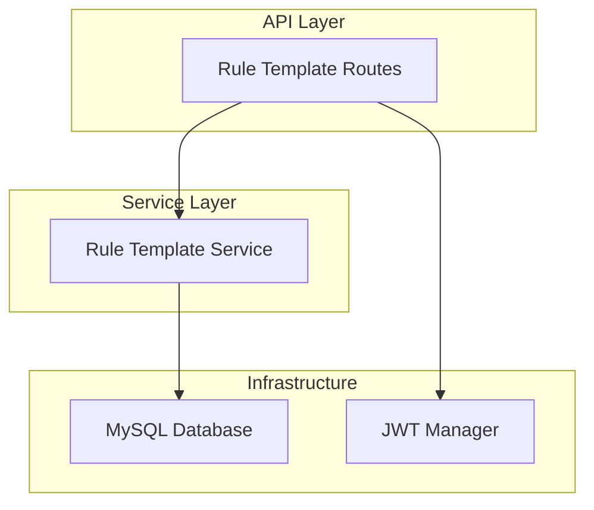

# 规则模版API设计

## 概述

本设计旨在为 Royale Arena 项目实现游戏规则模版的管理功能，包括创建、更新、删除和查询游戏规则模版。规则模版系统允许管理员预设游戏规则配置，便于快速创建具有相同规则的游戏实例。

**架构原则**：基于现有的管理员认证系统，采用相同的分层架构，Service 层直接访问数据库，确保设计一致性。

## 技术架构

### 核心技术栈
- **Web 框架**: Axum 0.8.4
- **数据库**: MySQL + SQLx 0.8.6
- **认证机制**: JWT (jsonwebtoken 9.3.1)
- **异步运行时**: Tokio
- **序列化**: Serde

### 架构分层



## 数据模型设计

### Rule Template 实体结构

```rust
#[derive(Debug, Clone, Serialize, Deserialize, sqlx::FromRow)]
pub struct RuleTemplate {
    pub id: String,  // VARCHAR(36) in database
    pub template_name: String,
    pub description: Option<String>,  // TEXT type in database
    pub is_active: bool,
    pub rules_config: serde_json::Value,
    pub created_at: DateTime<Utc>,
    pub updated_at: DateTime<Utc>,
}

#[derive(Debug, Serialize, Deserialize)]
pub struct RuleTemplateResponse {
    pub id: String,
    pub template_name: String,
    pub description: Option<String>,
    pub is_active: bool,
    pub rules_config: serde_json::Value,
    pub created_at: DateTime<Utc>,
    pub updated_at: DateTime<Utc>,
}

// 统一返回格式：无论是列表查询还是单个查询，都使用RuleTemplateResponse结构

// GET请求的查询参数直接从Query提取，不需要单独的请求结构体
```

### 请求模型

```rust
#[derive(Debug, Serialize, Deserialize)]
pub struct CreateRuleTemplateRequest {
    pub template_name: String,
    pub description: Option<String>,
    pub is_active: Option<bool>,
    pub rules_config: serde_json::Value,
}

#[derive(Debug, Serialize, Deserialize)]
pub struct UpdateRuleTemplateRequest {
    pub template_name: Option<String>,
    pub description: Option<String>,
    pub is_active: Option<bool>,
    pub rules_config: Option<serde_json::Value>,
}
```

## API 端点设计

### 路由组织结构

```
/api/admin/rule-templates
├── POST   /                   # 5. 创建游戏规则模版
└── PUT    /{template_id}      # 6. 更新游戏规则模版

/api/rule-templates
└── GET    /                   # 7. 获取游戏规则模版（支持列表和单个查询）
```

### API 详细设计

#### 5. 创建游戏规则模版

**端点**: `POST /api/admin/rule-templates`  
**认证**: 需要管理员认证  
**权限**: 管理员

**请求体**:
```json
{
  "template_name": "经典大逃杀",
  "description": "标准的大逃杀游戏规则，包含缩圈、物资分布等经典设定",
  "is_active": true,
  "rules_config": {
    "game_flow": {
      "day_duration": 300,
      "night_duration": 900
    },
    "map": {
      "places": [
        "码头", "工厂", "贫民窟", "旅馆", "教堂", "市政厅", "消防局", "池塘",
        "住宅区", "灯塔", "小巷", "学校", "隧道", "山道", "寺庙", "靶场",
        "医院", "森林", "海滩", "墓园", "井", "研究中心"
      ]
    },
    "player": {
      "max_life": 100,
      "max_strength": 100,
      "daily_strength_recovery": 40
    },
    "action": {
      "move_cost": 5,
      "search_cost": 5,
      "search_cooldown": 30
    },
    "rest_mode": {
      "life_recovery": 25,
      "max_moves": 1
    },
    "teammate_behavior": 0
  }
}
```

**字段验证**:
- `template_name`: 必填，长度1-100字符，不能为空白字符串
- `description`: 可选，TEXT类型，支持长文本
- `is_active`: 可选，默认为true
- `rules_config`: 必填，有效的JSON对象

**成功响应** (201 Created):
```json
{
  "success": true,
  "data": {
    "id": "123e4567-e89b-12d3-a456-426614174000",
    "template_name": "经典大逃杀",
    "description": "标准的大逃杀游戏规则，包含缩圈、物资分布等经典设定",
    "is_active": true,
    "rules_config": {
      "game_flow": {
        "day_duration": 300,
        "night_duration": 900
      },
      "map": {
        "places": [
          "码头", "工厂", "贫民窟", "旅馆", "教堂", "市政厅", "消防局", "池塘",
          "住宅区", "灯塔", "小巷", "学校", "隧道", "山道", "寺庙", "靶场",
          "医院", "森林", "海滩", "墓园", "井", "研究中心"
        ]
      },
      "player": {
        "max_life": 100,
        "max_strength": 100,
        "daily_strength_recovery": 40
      },
      "action": {
        "move_cost": 5,
        "search_cost": 5,
        "search_cooldown": 30
      },
      "rest_mode": {
        "life_recovery": 25,
        "max_moves": 1
      },
      "teammate_behavior": 0
    },
    "created_at": "2025-01-19T10:30:00Z",
    "updated_at": "2025-01-19T10:30:00Z"
  }
}
```

**错误响应**:
- `400 Bad Request`: 参数验证失败
- `401 Unauthorized`: 未提供有效的认证令牌
- `409 Conflict`: 模版名称已存在
- `500 Internal Server Error`: 服务器内部错误

#### 6. 更新游戏规则模版

**端点**: `PUT /api/admin/rule-templates/{template_id}`  
**认证**: 需要管理员认证  
**权限**: 管理员

**路径参数**:
- `template_id`: String格式的模版ID

**请求体**:
```json
{
  "template_name": "经典大逃杀 v2.0",
  "description": "更新的大逃杀游戏规则，优化了缩圈机制",
  "is_active": true,
  "rules_config": {
    "game_flow": {
      "day_duration": 360,
      "night_duration": 1080
    },
    "map": {
      "places": [
        "码头", "工厂", "贫民窟", "旅馆", "教堂", "市政厅", "消防局", "池塘",
        "住宅区", "灯塔", "小巷", "学校", "隧道", "山道", "寺庙", "靶场",
        "医院", "森林", "海滩", "墓园", "井", "研究中心"
      ]
    },
    "player": {
      "max_life": 100,
      "max_strength": 120,
      "daily_strength_recovery": 50
    },
    "action": {
      "move_cost": 4,
      "search_cost": 4,
      "search_cooldown": 25
    },
    "rest_mode": {
      "life_recovery": 30,
      "max_moves": 1
    },
    "teammate_behavior": 5
  }
}
```

**字段验证**:
- 所有字段均为可选，至少需要提供一个字段
- `template_name`: 长度1-100字符，不能为空白字符串
- `description`: TEXT类型，支持长文本
- `rules_config`: 有效的JSON对象

**成功响应** (200 OK):
```json
{
  "success": true,
  "data": {
    "id": "123e4567-e89b-12d3-a456-426614174000",
    "template_name": "经典大逃杀 v2.0",
    "description": "更新的大逃杀游戏规则，优化了缩圈机制",
    "is_active": true,
    "rules_config": {
      "map": {
        "size": "1200x1200",
        "zones": 6
      },
      "game_duration": 2100,
      "shrink_intervals": [350, 700, 1050, 1400, 1750],
      "max_players": 120,
      "spawn_settings": {
        "weapons": 0.25,
        "armor": 0.25,
        "consumables": 0.5
      }
    },
    "created_at": "2025-01-19T10:30:00Z",
    "updated_at": "2025-01-19T11:15:00Z"
  }
}
```

**错误响应**:
- `400 Bad Request`: 参数验证失败或请求体为空
- `401 Unauthorized`: 未提供有效的认证令牌
- `404 Not Found`: 指定的模版不存在
- `409 Conflict`: 模版名称已存在（如果更新了name）
- `500 Internal Server Error`: 服务器内部错误

#### 7. 获取游戏规则模版

**端点**: `GET /api/rule-templates`  
**认证**: 无需认证  
**权限**: 公开访问

**查询参数**:
- `id`: 可选，String，获取指定ID的模版（返回单元素数组）
- `is_active`: 可选，boolean，筛选激活状态的模版
- `search`: 可选，string，按模版名称搜索

**请求示例**:
```
# 获取所有模版列表
GET /api/rule-templates?is_active=true&search=经典

# 获取特定模版
GET /api/rule-templates?id=123e4567-e89b-12d3-a456-426614174000
```

**成功响应** (200 OK):
```json
{
  "success": true,
  "data": [
    {
      "id": "123e4567-e89b-12d3-a456-426614174000",
      "template_name": "经典大逃杀 v2.0",
      "description": "更新的大逃杀游戏规则，优化了缩圈机制",
      "is_active": true,
      "rules_config": {
        "game_flow": {
          "day_duration": 300,
          "night_duration": 900
        },
        "map": {
          "places": [
            "码头", "工厂", "贫民窟", "旅馆", "教堂", "市政厅", "消防局", "池塘",
            "住宅区", "灯塔", "小巷", "学校", "隧道", "山道", "寺庙", "靶场",
            "医院", "森林", "海滩", "墓园", "井", "研究中心"
          ]
        },
        "player": {
          "max_life": 100,
          "max_strength": 100,
          "daily_strength_recovery": 40
        },
        "action": {
          "move_cost": 5,
          "search_cost": 5,
          "search_cooldown": 30
        },
        "rest_mode": {
          "life_recovery": 25,
          "max_moves": 1
        },
        "teammate_behavior": 0
      },
      "created_at": "2025-01-19T10:30:00Z",
      "updated_at": "2025-01-19T11:15:00Z"
    },
    {
      "id": "456e7890-e89b-12d3-a456-426614174111",
      "template_name": "快速模式",
      "description": "15分钟快速游戏模式",
      "is_active": true,
      "created_at": "2025-01-19T09:00:00Z",
      "updated_at": "2025-01-19T09:00:00Z"
    }
  ]
}
```

**错误响应**:
- `400 Bad Request`: 查询参数格式错误或ID格式无效
- `500 Internal Server Error`: 服务器内部错误

## 数据库交互设计

### SQL 查询示例

#### 创建规则模版
```sql
INSERT INTO rule_templates (id, template_name, description, is_active, rules_config)
VALUES (?, ?, ?, ?, ?)
```

#### 更新规则模版
```sql
UPDATE rule_templates 
SET template_name = ?, description = ?, is_active = ?, rules_config = ?, updated_at = CURRENT_TIMESTAMP
WHERE id = ?
```

#### 查询模版（支持筛选和ID查询）
```sql
-- 通用查询，支持ID、激活状态和名称搜索
SELECT id, template_name, description, is_active, 
       CASE WHEN ? IS NOT NULL THEN rules_config ELSE NULL END as rules_config,
       created_at, updated_at
FROM rule_templates
WHERE (? IS NULL OR id = ?)
  AND (? IS NULL OR is_active = ?)
  AND (? IS NULL OR template_name LIKE ?)
ORDER BY created_at DESC
```

## 服务层实现设计

### Rule Template Service

```rust
pub struct RuleTemplateService {
    pool: SqlPool,
}

impl RuleTemplateService {
    pub async fn create_template(&self, request: CreateRuleTemplateRequest) -> Result<RuleTemplateResponse, ServiceError> {
        // 1. 验证模版名称唯一性
        // 2. 生成UUID和时间戳
        // 3. 插入数据库
        // 4. 返回创建的模版信息
    }
    
    pub async fn update_template(&self, template_id: String, request: UpdateRuleTemplateRequest) -> Result<RuleTemplateResponse, ServiceError> {
        // 1. 检查模版是否存在
        // 2. 验证模版名称唯一性（如果更新了名称）
        // 3. 更新数据库记录
        // 4. 返回更新后的模版信息
    }
    
    pub async fn get_templates(&self, id: Option<String>, is_active: Option<bool>, search: Option<String>) -> Result<Vec<RuleTemplateResponse>, ServiceError> {
        // 1. 构建查询条件
        // 2. 统一返回数组格式，包含rules_config字段
        // 3. 执行查询并返回统一的数组格式
    }
    
    async fn check_template_exists(&self, template_id: &str) -> Result<bool, sqlx::Error> {
        // 检查模版是否存在
    }
    
    async fn check_name_uniqueness(&self, name: &str, exclude_id: Option<&str>) -> Result<bool, sqlx::Error> {
        // 检查模版名称唯一性
    }
}
```

## 错误处理

### 自定义错误类型

```rust
#[derive(Debug, thiserror::Error)]
pub enum RuleTemplateError {
    #[error("模版名称已存在")]
    NameAlreadyExists,
    
    #[error("模版不存在")]
    TemplateNotFound,
    
    #[error("无效的JSON配置: {0}")]
    InvalidRulesConfig(String),
    
    #[error("模版名称不能为空")]
    EmptyTemplateName,
    
    #[error("数据库错误: {0}")]
    DatabaseError(#[from] sqlx::Error),
}
```

## 测试策略

### 单元测试

```rust
#[cfg(test)]
mod tests {
    use super::*;
    
    #[sqlx::test(migrations = "../migrations")]
    async fn test_rule_template_crud_operations(pool: SqlPool) -> Result<(), Box<dyn std::error::Error>> {
        // 清理测试数据
        sqlx::query("DELETE FROM rule_templates").execute(&pool).await?;
        
        let service = RuleTemplateService::new(pool);
        
        // 测试创建模版
        let create_request = CreateRuleTemplateRequest { /* ... */ };
        let created = service.create_template(create_request).await?;
        assert_eq!(created.template_name, "测试模版");
        
        // 测试更新模版
        let update_request = UpdateRuleTemplateRequest { /* ... */ };
        let updated = service.update_template(created.id, update_request).await?;
        assert_eq!(updated.template_name, "更新的模版");
        
        // 测试查询功能
        let list_result = service.get_templates(None, None, None).await?;
        assert_eq!(list_result.len(), 1);
        
        let id_result = service.get_templates(Some(created.id), None, None).await?;
        assert_eq!(id_result.len(), 1);
        assert!(id_result[0].get("rules_config").is_some());
        
        Ok(())
    }
}
```

## 项目模块结构

建议在现有项目结构基础上添加：

```
src/
├── rule_template.rs         # 规则模版模块入口
├── rule_template/          # 规则模版子模块
│   ├── handlers.rs         # 路由处理函数
│   ├── service.rs          # 规则模版服务
│   ├── models.rs           # 数据模型
│   └── errors.rs           # 错误定义
```

### 路由注册

需要在 `routes.rs` 中注册两组路由：

```rust
// 管理员路由 - 需要认证
.route("/api/admin/rule-templates", post(create_template))
.route("/api/admin/rule-templates/:id", put(update_template))

// 公开路由 - 无需认证
.route("/api/rule-templates", get(get_templates))
```