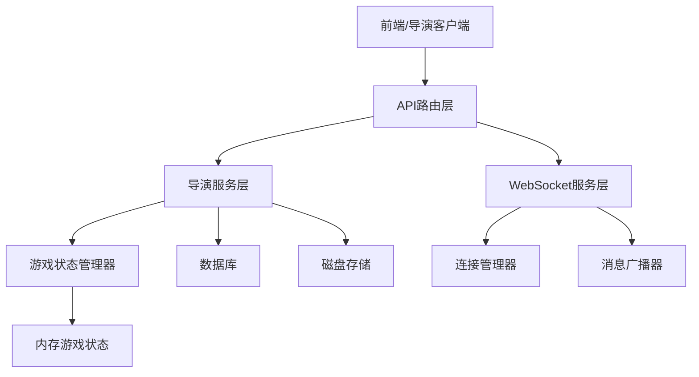

# WebSocket游戏控制功能迁移设计文档

## 1. 概述

### 1.1 项目背景
Royale Arena 是一个基于网页的大逃杀游戏，支持实时、互动性强的多人在线生存竞技体验。项目包含导演工具，用于控制游戏进程、规则和状态。

### 1.2 当前问题
目前，WebSocket服务模块中包含了游戏状态控制相关的功能函数（如开始游戏、暂停游戏、结束游戏、恢复游戏等）。这些功能本质上属于导演服务的职责范围，应该迁移到导演服务模块中实现，以符合单一职责原则和架构规范。

### 1.3 迁移目标
1. 将WebSocket服务中的游戏状态控制函数迁移到导演服务模块
2. 新增一个API接口，用于导演通过密码验证后修改游戏状态
3. 保持现有功能的完整性和正确性
4. 实现WebSocket连接状态管理：只在游戏处于"进行时"或"暂停时"接受客户端连接
5. 实现结束游戏时中断所有WebSocket连接

## 2. 架构设计

### 2.1 当前架构分析
当前架构中，WebSocket服务承担了不应属于它的职责：
- 游戏状态变更（数据库操作）
- 游戏状态持久化（磁盘读写）
- WebSocket连接管理

根据项目规范，这些功能应该由专门的服务层处理。

### 2.2 迁移后架构
迁移后，各模块职责将更加清晰：
- WebSocket服务：仅负责WebSocket连接处理和消息传递
- 导演服务：负责游戏状态控制、数据库操作和状态持久化
- 游戏状态管理器：负责内存中的游戏状态管理



## 3. 功能迁移设计

### 3.1 待迁移功能列表
从WebSocket服务迁移到导演服务的功能包括：
1. 开始游戏（等待中 → 进行中）
2. 暂停游戏（进行中 → 暂停）
3. 结束游戏（进行中 → 结束）
4. 恢复游戏（暂停 → 进行中）
5. 保存游戏状态到磁盘
6. 从磁盘恢复游戏状态

### 3.2 迁移实现方案

#### 3.2.1 导演服务扩展
在`backend/src/director/service.rs`中新增以下方法：

```rust
impl DirectorService {
    /// 开始游戏（等待中 → 进行中）
    pub async fn start_game(&self, app_state: &AppState, game_id: &str) -> Result<(), DirectorError> {
        // 更新数据库中游戏状态为 "running"
        let result = sqlx::query!(
            "UPDATE games SET status = 'running', updated_at = CURRENT_TIMESTAMP WHERE id = ?",
            game_id
        )
        .execute(&self.pool)
        .await
        .map_err(|e| DirectorError::DatabaseError(e))?;
        
        if result.rows_affected() == 0 {
            return Err(DirectorError::GameNotFound);
        }
        
        // 初始化游戏内存状态
        let game = app_state.game_service.get_game_by_id(game_id).await
            .map_err(|e| DirectorError::OtherError(format!("Failed to get game: {}", e)))?;
        app_state.game_state_manager.get_game_state(game_id, game.rules_config).await
            .map_err(|e| DirectorError::OtherError(format!("Failed to initialize game state: {}", e)))?;
        
        // 更新连接管理器中的游戏状态
        app_state.connection_manager.update_game_status(game_id, GameStatus::Running).await;
        
        Ok(())
    }

    /// 暂停游戏（进行中 → 暂停）
    pub async fn pause_game(&self, app_state: &AppState, game_id: &str) -> Result<(), DirectorError> {
        // 更新数据库中游戏状态为 "paused"
        let result = sqlx::query!(
            "UPDATE games SET status = 'paused', updated_at = CURRENT_TIMESTAMP WHERE id = ?",
            game_id
        )
        .execute(&self.pool)
        .await
        .map_err(|e| DirectorError::DatabaseError(e))?;
        
        if result.rows_affected() == 0 {
            return Err(DirectorError::GameNotFound);
        }
        
        // 将当前游戏状态序列化并保存到磁盘文件
        app_state.game_state_manager.save_game_state_to_disk(game_id).await
            .map_err(|e| DirectorError::OtherError(format!("Failed to save game state to disk: {}", e)))?;
        
        // 更新连接管理器中的游戏状态
        app_state.connection_manager.update_game_status(game_id, GameStatus::Paused).await;
        
        Ok(())
    }

    /// 结束游戏（进行中 → 结束）
    pub async fn end_game(&self, app_state: &AppState, game_id: &str) -> Result<(), DirectorError> {
        // 更新数据库中游戏状态为 "ended"
        let result = sqlx::query!(
            "UPDATE games SET status = 'ended', updated_at = CURRENT_TIMESTAMP WHERE id = ?",
            game_id
        )
        .execute(&self.pool)
        .await
        .map_err(|e| DirectorError::DatabaseError(e))?;
        
        if result.rows_affected() == 0 {
            return Err(DirectorError::GameNotFound);
        }
        
        // 将当前游戏状态序列化并保存到磁盘文件
        app_state.game_state_manager.save_game_state_to_disk(game_id).await
            .map_err(|e| DirectorError::OtherError(format!("Failed to save game state to disk: {}", e)))?;
        
        // 断开所有WebSocket连接
        app_state.connection_manager.disconnect_all_connections_for_game(game_id).await;
        
        // 更新连接管理器中的游戏状态
        app_state.connection_manager.update_game_status(game_id, GameStatus::Ended).await;
        
        Ok(())
    }

    /// 恢复游戏（暂停 → 进行中）
    pub async fn resume_game(&self, app_state: &AppState, game_id: &str) -> Result<(), DirectorError> {
        // 更新数据库中游戏状态为 "running"
        let result = sqlx::query!(
            "UPDATE games SET status = 'running', updated_at = CURRENT_TIMESTAMP WHERE id = ?",
            game_id
        )
        .execute(&self.pool)
        .await
        .map_err(|e| DirectorError::DatabaseError(e))?;
        
        if result.rows_affected() == 0 {
            return Err(DirectorError::GameNotFound);
        }
        
        // 从磁盘文件中恢复游戏状态
        app_state.game_state_manager.load_game_state_from_disk(game_id).await
            .map_err(|e| DirectorError::OtherError(format!("Failed to load game state from disk: {}", e)))?;
        
        // 更新连接管理器中的游戏状态
        app_state.connection_manager.update_game_status(game_id, GameStatus::Running).await;
        
        Ok(())
    }
}
```

#### 3.2.2 WebSocket服务修改
在`backend/src/websocket/service.rs`中，移除以下方法：
- `start_game`
- `pause_game`
- `end_game`
- `resume_game`
- `save_game_state_to_disk`
- `load_game_state_from_disk`

修改调用这些方法的地方，改为调用导演服务中的对应方法。

### 3.3 新增API接口设计

#### 3.3.1 接口定义
新增导演更新游戏状态的API接口：
- 路径：`PUT /game/{game_id}/status`
- 请求方法：PUT
- 请求参数：
  - Path参数：`game_id` (游戏ID)
  - Body参数：
    ```json
    {
      "password": "director_password",
      "status": "running" // 目标状态
    }
    ```

#### 3.3.2 接口实现
在`backend/src/director/handlers.rs`中新增处理函数：

```rust
/// 导演更新游戏状态
pub async fn update_game_status(
    State(state): State<AppState>,
    Path(game_id): Path<String>,
    Json(request): Json<UpdateGameStatusRequest>,
) -> Result<Json<serde_json::Value>, DirectorError> {
    // 验证导演密码
    state.director_service.verify_director_password(&game_id, &request.password).await?;
    
    // 根据目标状态调用对应的导演服务方法
    let result = match request.status {
        GameStatus::Running => {
            // 检查当前状态是否允许转换到Running
            let game = state.game_service.get_game_by_id(&game_id).await
                .map_err(|e| DirectorError::OtherError(format!("Failed to get game: {}", e)))?;
            
            match game.status {
                GameStatus::Waiting => state.director_service.start_game(&state, &game_id).await,
                GameStatus::Paused => state.director_service.resume_game(&state, &game_id).await,
                _ => return Err(DirectorError::InvalidGameStateTransition),
            }
        },
        GameStatus::Paused => state.director_service.pause_game(&state, &game_id).await,
        GameStatus::Ended => state.director_service.end_game(&state, &game_id).await,
        _ => return Err(DirectorError::InvalidGameStateTransition),
    };
    
    result?;
    
    Ok(Json(json!({
        "success": true,
        "message": "Game status updated successfully"
    })))
}
```

在`backend/src/director/models.rs`中定义请求模型：

```rust
/// 导演更新游戏状态请求
#[derive(Debug, Deserialize)]
pub struct UpdateGameStatusRequest {
    /// 导演密码
    pub password: String,
    /// 目标游戏状态
    pub status: GameStatus,
}
```

在`backend/src/director/errors.rs`中新增错误类型：

```rust
#[derive(Debug)]
pub enum DirectorError {
    // ... 现有错误类型
    InvalidGameStateTransition,
    // ... 现有错误类型
}
```

## 4. WebSocket连接管理增强设计

### 4.1 连接状态管理
为了实现只在游戏处于"进行时"或"暂停时"接受客户端连接，需要在连接管理器中增加游戏状态跟踪功能：

1. 在连接管理器中维护一个游戏状态映射，记录每个游戏的当前状态
2. 在WebSocket连接认证阶段检查游戏状态
3. 在游戏状态变更时更新连接管理器中的状态

### 4.2 连接中断机制
为了在结束游戏时中断所有WebSocket连接，需要在连接管理器中增加断开连接功能：

1. 提供按游戏ID断开所有连接的方法
2. 在结束游戏时调用该方法

### 4.3 连接管理器扩展
在`backend/src/websocket/connection_manager.rs`中增加以下方法：

```rust
impl ConnectionManager {
    /// 更新游戏状态
    pub async fn update_game_status(&self, game_id: &str, status: GameStatus) {
        // 实现游戏状态更新逻辑
    }
    
    /// 断开指定游戏的所有连接
    pub async fn disconnect_all_connections_for_game(&self, game_id: &str) {
        // 实现断开所有连接逻辑
    }
    
    /// 检查游戏是否接受连接
    pub async fn is_game_accepting_connections(&self, game_id: &str) -> bool {
        // 实现连接状态检查逻辑
    }
}
```

## 5. 数据模型与状态转换

### 5.1 游戏状态枚举
游戏状态定义在`backend/src/game/models.rs`中：

```rust
#[derive(Debug, Clone, PartialEq, Serialize, Deserialize, sqlx::Type)]
#[sqlx(type_name = "status", rename_all = "lowercase")]
pub enum GameStatus {
    #[serde(rename = "waiting")]
    Waiting,
    #[serde(rename = "running")]
    Running,
    #[serde(rename = "paused")]
    Paused,
    #[serde(rename = "ended")]
    Ended,
    #[serde(rename = "hidden")]
    Hidden,
    #[serde(rename = "deleted")]
    Deleted,
}
```

### 4.2 状态转换规则
合法的状态转换包括：
- Waiting → Running (开始游戏)
- Running → Paused (暂停游戏)
- Running → Ended (结束游戏)
- Paused → Running (恢复游戏)

## 6. 错误处理与验证

### 6.1 密码验证
所有导演操作都需要验证导演密码，确保只有合法的导演可以执行操作。

### 6.2 状态转换验证
在执行状态变更前，需要验证当前状态是否允许转换到目标状态。

### 6.3 错误类型定义
在导演服务中定义专门的错误类型来处理各种异常情况。

## 7. 测试策略

### 7.1 集成测试
在Director模块的集成测试中，添加新加入的用于切换游戏状态的API接口的测试。
