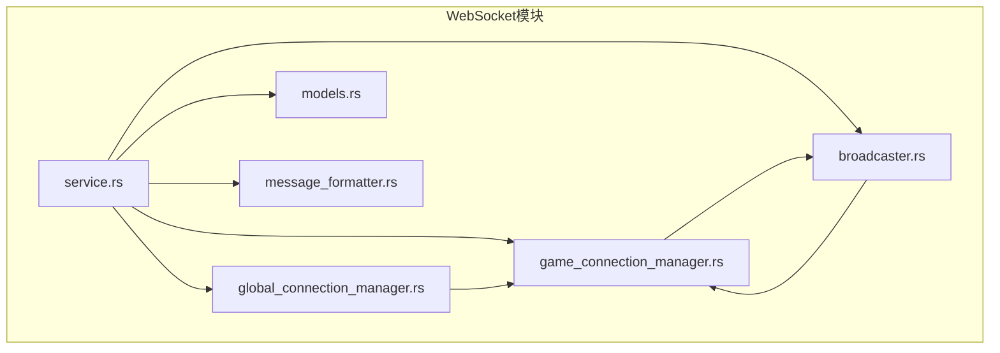
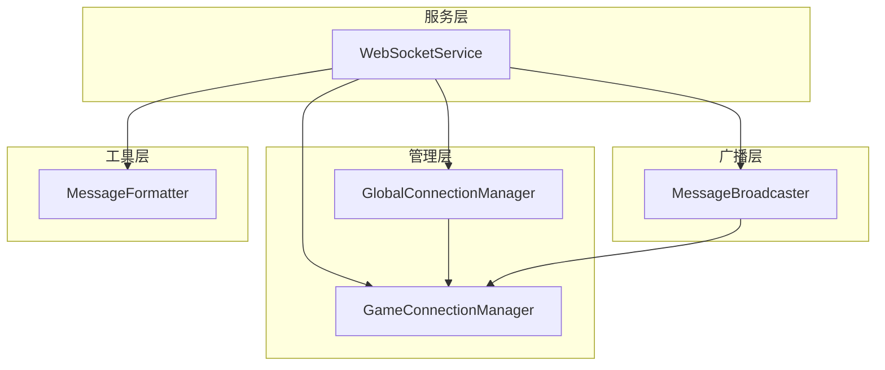
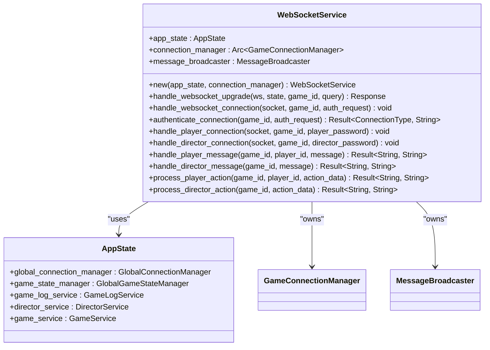
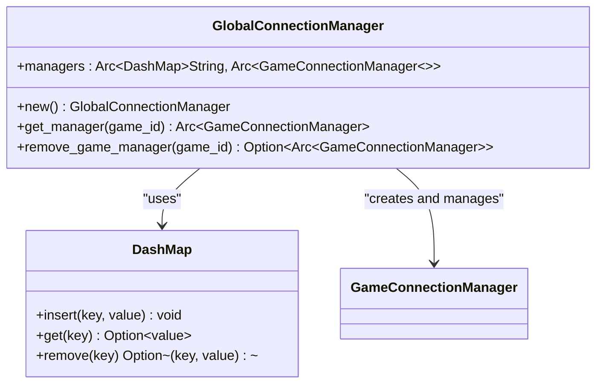
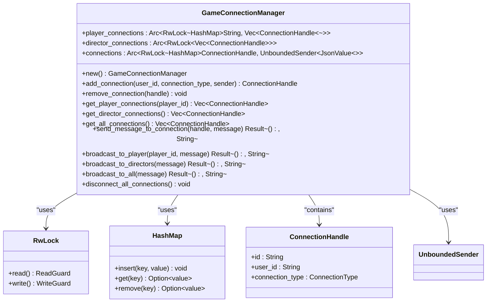
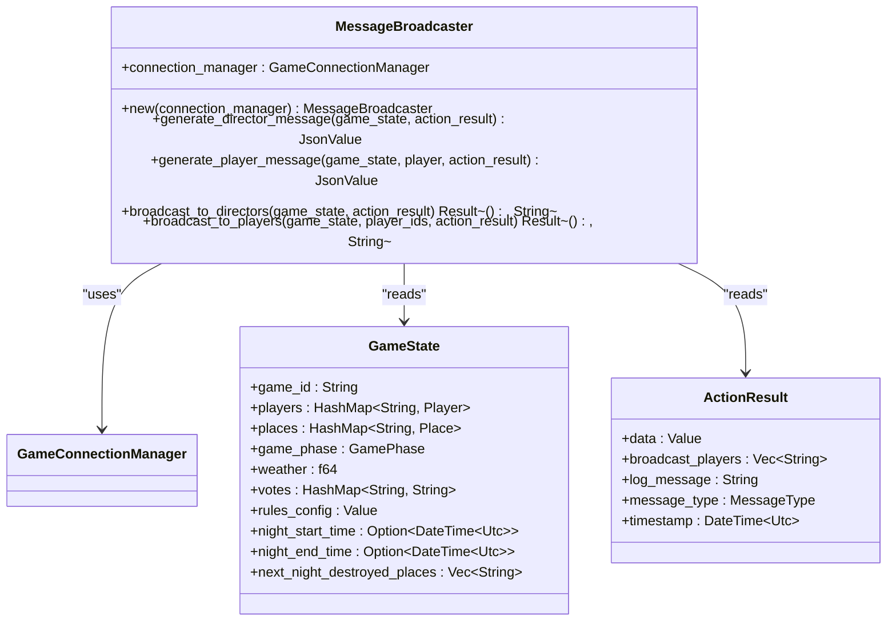
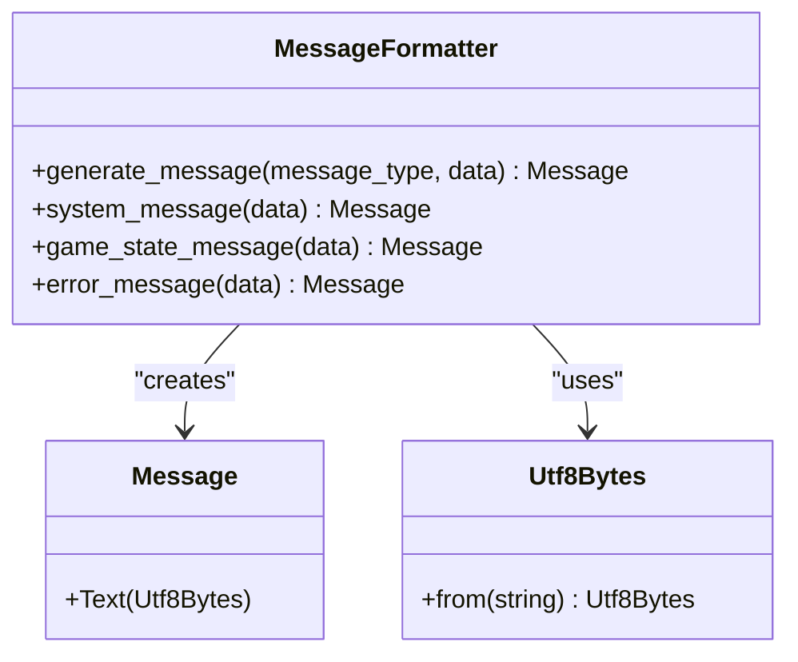
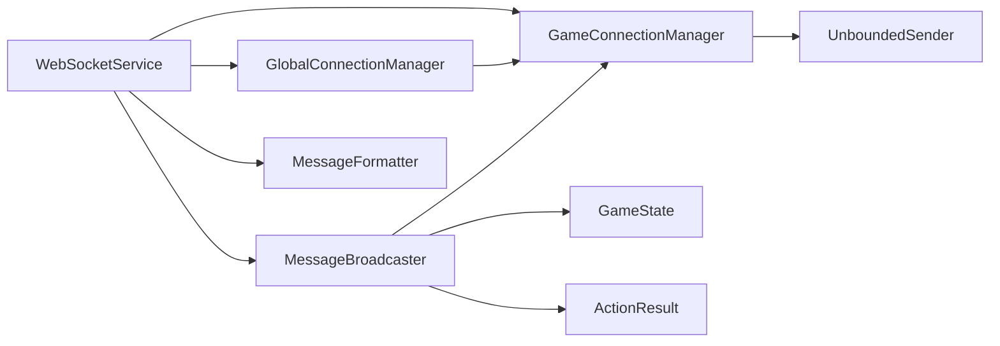

# WebSocket架构

<cite>
**Referenced Files in This Document**   
- [service.rs](file://backend/src/websocket/service.rs)
- [global_connection_manager.rs](file://backend/src/websocket/global_connection_manager.rs)
- [game_connection_manager.rs](file://backend/src/websocket/game_connection_manager.rs)
- [broadcaster.rs](file://backend/src/websocket/broadcaster.rs)
- [models.rs](file://backend/src/websocket/models.rs)
- [message_formatter.rs](file://backend/src/websocket/message_formatter.rs)
- [main.rs](file://backend/src/main.rs)
</cite>

## 目录
1. [引言](#引言)
2. [项目结构](#项目结构)
3. [核心组件](#核心组件)
4. [架构概述](#架构概述)
5. [详细组件分析](#详细组件分析)
6. [依赖关系分析](#依赖关系分析)
7. [性能考虑](#性能考虑)
8. [故障排除指南](#故障排除指南)
9. [结论](#结论)

## 引言

WebSocket架构是Royale Arena后端系统的核心通信机制，负责处理实时游戏状态更新、玩家行动和导演控制指令的双向通信。该架构设计旨在提供低延迟、高可靠性的实时通信服务，支持多用户并发连接，并确保数据的安全性和隐私性。

## 项目结构

WebSocket相关代码位于`backend/src/websocket`目录下，采用模块化设计，各组件职责分明：



**Diagram sources**
- [service.rs](file://backend/src/websocket/service.rs)
- [global_connection_manager.rs](file://backend/src/websocket/global_connection_manager.rs)
- [game_connection_manager.rs](file://backend/src/websocket/game_connection_manager.rs)
- [broadcaster.rs](file://backend/src/websocket/broadcaster.rs)

**Section sources**
- [service.rs](file://backend/src/websocket/service.rs)
- [global_connection_manager.rs](file://backend/src/websocket/global_connection_manager.rs)

## 核心组件

WebSocket架构由四个核心组件构成：WebSocket服务、全局连接管理器、游戏连接管理器和消息广播器。这些组件协同工作，实现了高效、安全的实时通信功能。

**Section sources**
- [service.rs](file://backend/src/websocket/service.rs#L1-L600)
- [global_connection_manager.rs](file://backend/src/websocket/global_connection_manager.rs#L1-L56)
- [game_connection_manager.rs](file://backend/src/websocket/game_connection_manager.rs#L1-L167)
- [broadcaster.rs](file://backend/src/websocket/broadcaster.rs#L1-L73)

## 架构概述

WebSocket架构采用分层设计模式，从上至下分为服务层、管理层和广播层。这种设计实现了关注点分离，提高了系统的可维护性和可扩展性。



**Diagram sources**
- [service.rs](file://backend/src/websocket/service.rs)
- [global_connection_manager.rs](file://backend/src/websocket/global_connection_manager.rs)
- [game_connection_manager.rs](file://backend/src/websocket/game_connection_manager.rs)
- [broadcaster.rs](file://backend/src/websocket/broadcaster.rs)
- [message_formatter.rs](file://backend/src/websocket/message_formatter.rs)

## 详细组件分析

### WebSocket服务分析

WebSocket服务是整个架构的入口点，负责处理WebSocket连接的升级和认证。

#### 类图


**Diagram sources**
- [service.rs](file://backend/src/websocket/service.rs#L45-L600)

**Section sources**
- [service.rs](file://backend/src/websocket/service.rs#L45-L600)

### 全局连接管理器分析

全局连接管理器负责管理所有游戏实例的连接管理器，实现了多游戏实例的隔离和管理。

#### 类图


**Diagram sources**
- [global_connection_manager.rs](file://backend/src/websocket/global_connection_manager.rs#L8-L56)

**Section sources**
- [global_connection_manager.rs](file://backend/src/websocket/global_connection_manager.rs#L8-L56)

### 游戏连接管理器分析

游戏连接管理器负责管理单个游戏实例的所有WebSocket连接，包括玩家和导演的连接。

#### 类图


**Diagram sources**
- [game_connection_manager.rs](file://backend/src/websocket/game_connection_manager.rs#L20-L167)

**Section sources**
- [game_connection_manager.rs](file://backend/src/websocket/game_connection_manager.rs#L20-L167)

### 消息广播器分析

消息广播器负责向玩家和导演广播游戏状态更新消息，提供隐私保护机制。

#### 类图


**Diagram sources**
- [broadcaster.rs](file://backend/src/websocket/broadcaster.rs#L1-L73)

**Section sources**
- [broadcaster.rs](file://backend/src/websocket/broadcaster.rs#L1-L73)

### 模型定义分析

WebSocket模型定义了通信过程中使用的各种数据结构。

#### 类图
```mermaid
classDiagram
class WebSocketAuthRequest {
+user_type : ConnectionType
+password : String
}
class WebSocketClientMessage {
+message_type : WebSocketMessageType
+data : JsonValue
}
class GameState {
+game_id : String
+players : HashMap~String, Player~
+places : HashMap~String, Place~
+game_phase : GamePhase
+weather : f64
+votes : HashMap~String, String~
+rules_config : Value
+night_start_time : Option~DateTime~Utc~~
+night_end_time : Option~DateTime~Utc~~
+next_night_destroyed_places : Vec~String~
}
class Player {
+id : String
+name : String
+location : String
+life : i32
+strength : i32
+inventory : Vec~Item~
+equipped_item : Option~String~
+hand_item : Option~String~
+last_search_result : Option~SearchResult~
+is_alive : bool
+is_bound : bool
+rest_mode : bool
+last_search_time : Option~DateTime~Utc~~
+votes : i32
}
class Place {
+name : String
+players : Vec~String~
+items : Vec~Item~
+is_destroyed : bool
}
class Item {
+id : String
+name : String
+item_type : ItemType
+properties : Value
}
class ActionResult {
+data : Value
+broadcast_players : Vec~String~
+log_message : String
+message_type : MessageType
+timestamp : DateTime~Utc~
}
enum ConnectionType {
Actor
Director
}
enum WebSocketMessageType {
PlayerAction
DirectorAction
}
enum GamePhase {
Day
Night
}
enum ItemType {
Weapon
Consumable
Equipment
}
WebSocketClientMessage --> WebSocketMessageType : "has"
GameState --> Player : "contains"
GameState --> Place : "contains"
Player --> Item : "has"
Player --> SearchResult : "has"
ActionResult --> MessageType : "has"
```

**Diagram sources**
- [models.rs](file://backend/src/websocket/models.rs#L1-L290)

**Section sources**
- [models.rs](file://backend/src/websocket/models.rs#L1-L290)

### 消息格式化器分析

消息格式化器提供了统一的消息生成和格式化功能。

#### 类图


**Diagram sources**
- [message_formatter.rs](file://backend/src/websocket/message_formatter.rs#L1-L31)

**Section sources**
- [message_formatter.rs](file://backend/src/websocket/message_formatter.rs#L1-L31)

## 依赖关系分析

WebSocket架构的组件之间存在明确的依赖关系，形成了清晰的调用链。



**Diagram sources**
- [service.rs](file://backend/src/websocket/service.rs)
- [global_connection_manager.rs](file://backend/src/websocket/global_connection_manager.rs)
- [game_connection_manager.rs](file://backend/src/websocket/game_connection_manager.rs)
- [broadcaster.rs](file://backend/src/websocket/broadcaster.rs)
- [message_formatter.rs](file://backend/src/websocket/message_formatter.rs)

**Section sources**
- [service.rs](file://backend/src/websocket/service.rs)
- [global_connection_manager.rs](file://backend/src/websocket/global_connection_manager.rs)
- [game_connection_manager.rs](file://backend/src/websocket/game_connection_manager.rs)
- [broadcaster.rs](file://backend/src/websocket/broadcaster.rs)
- [message_formatter.rs](file://backend/src/websocket/message_formatter.rs)

## 性能考虑

WebSocket架构在设计时充分考虑了性能因素：

1. **并发处理**：使用`Arc`和`RwLock`实现线程安全的共享状态管理。
2. **内存效率**：通过`DashMap`和`HashMap`实现高效的键值存储。
3. **异步通信**：利用Tokio的异步运行时实现非阻塞I/O操作。
4. **连接复用**：通过连接句柄机制实现连接的高效管理和复用。

## 故障排除指南

### 常见问题及解决方案

1. **连接认证失败**
   - 检查游戏ID和密码是否正确
   - 确认游戏状态是否允许连接（等待中或已结束的游戏不允许连接）

2. **消息广播失败**
   - 检查连接管理器中的连接是否存在
   - 验证消息格式是否符合预期

3. **性能瓶颈**
   - 监控连接数和消息吞吐量
   - 优化数据库查询和状态更新逻辑

4. **连接断开**
   - 检查网络状况
   - 验证服务器资源使用情况

**Section sources**
- [service.rs](file://backend/src/websocket/service.rs)
- [game_connection_manager.rs](file://backend/src/websocket/game_connection_manager.rs)

## 结论

WebSocket架构为Royale Arena提供了强大而灵活的实时通信能力。通过分层设计和模块化组件，该架构实现了高内聚、低耦合的设计原则，确保了系统的可维护性和可扩展性。未来可以进一步优化消息压缩、连接池管理和错误恢复机制，以提升整体性能和可靠性。