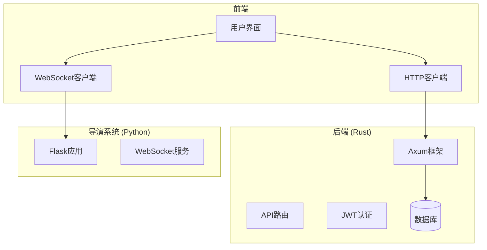
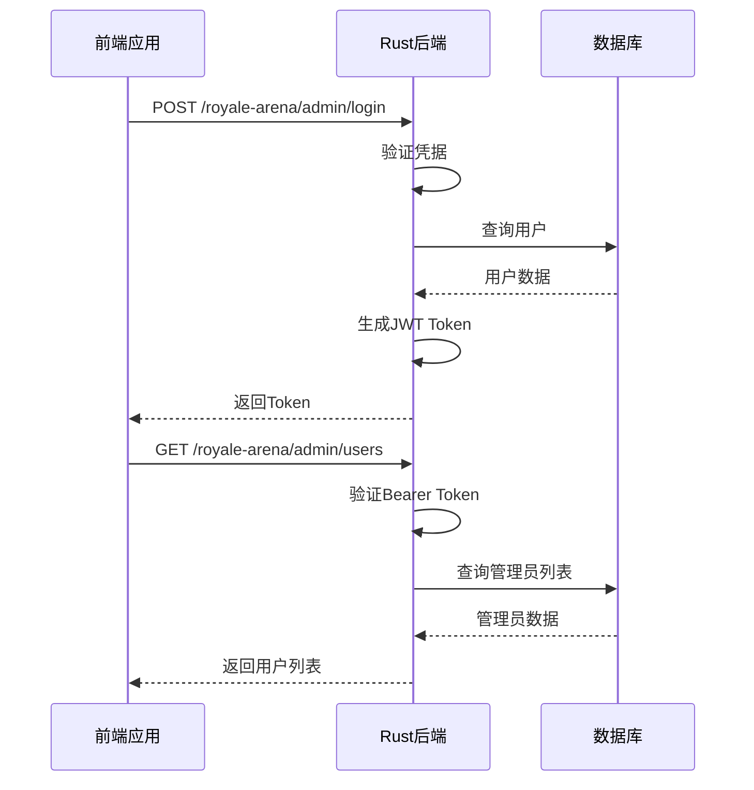
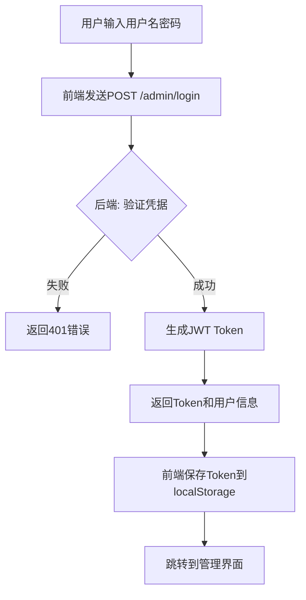
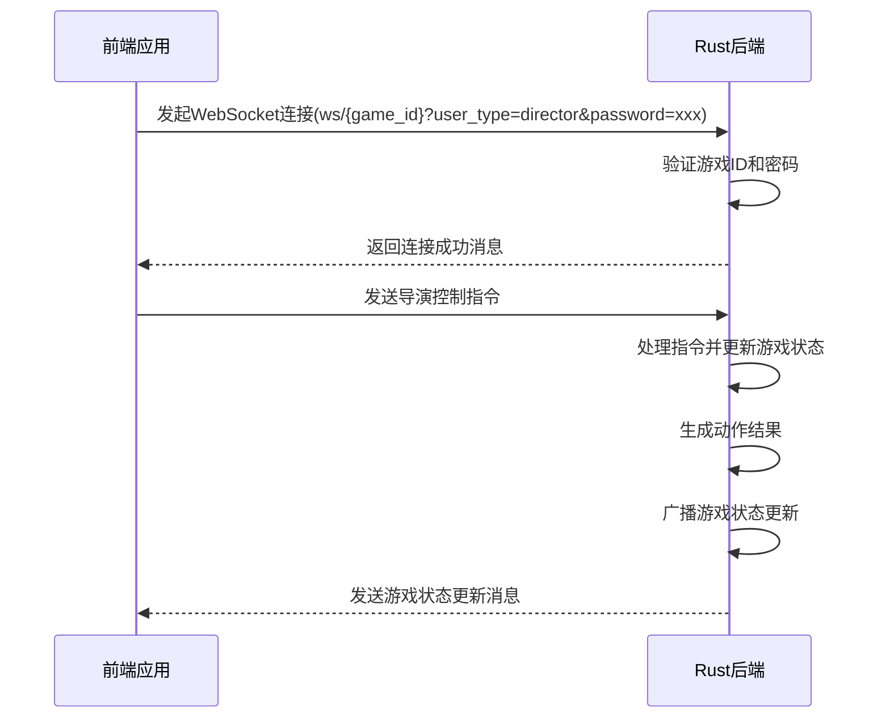
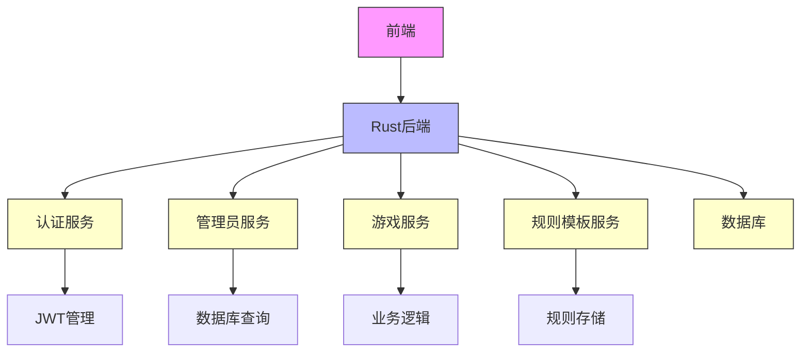

# API 集成

<cite>
**本文档引用的文件**  
- [QWEN.md](file://QWEN.md)
- [backend/QWEN.md](file://backend/QWEN.md)
- [frontend/QWEN.md](file://frontend/QWEN.md)
- [backend/src/main.rs](file://backend/src/main.rs) - *后端主服务实现*
- [backend/src/routes.rs](file://backend/src/routes.rs) - *API路由定义*
- [backend/src/auth/service.rs](file://backend/src/auth/service.rs) - *JWT认证服务*
- [backend/src/admin/handlers.rs](file://backend/src/admin/handlers.rs) - *管理员API处理程序*
- [backend/src/admin/models.rs](file://backend/src/admin/models.rs) - *管理员数据模型*
- [backend/src/websocket/service.rs](file://backend/src/websocket/service.rs) - *WebSocket服务实现*
- [backend/src/websocket/broadcaster.rs](file://backend/src/websocket/broadcaster.rs) - *消息广播器*
- [backend/src/websocket/models.rs](file://backend/src/websocket/models.rs) - *WebSocket数据模型*
- [backend/src/websocket/message_formatter.rs](file://backend/src/websocket/message_formatter.rs) - *消息格式化模块*
- [frontend/src/services/adminService.ts](file://frontend/src/services/adminService.ts) - *前端管理员服务*
- [frontend/src/services/adminClient.ts](file://frontend/src/services/adminClient.ts) - *HTTP客户端配置*
- [frontend/src/stores/admin.ts](file://frontend/src/stores/admin.ts) - *管理员状态管理*
- [frontend/src/services/config.ts](file://frontend/src/services/config.ts) - *API配置*
- [frontend/src/services/webSocketService.ts](file://frontend/src/services/webSocketService.ts) - *WebSocket服务类*
- [frontend/src/types/gameStateTypes.ts](file://frontend/src/types/gameStateTypes.ts) - *游戏状态类型定义*
</cite>

## 更新摘要
**已更新内容**  
- 修正了关于Python Flask后端的过时信息，确认当前系统使用Rust后端
- 更新了REST API通信机制，详细描述了基于JWT的认证流程
- 新增了管理员登录流程的代码示例和状态管理机制
- 更新了架构概览图，反映真实的Rust + Axum后端架构
- 添加了请求拦截器和错误处理的最佳实践
- **新增WebSocket实时通信实现细节**：根据最新代码重构，详细说明WebSocket连接建立、消息格式、广播机制和错误处理
- **更新WebSocket消息格式**：描述重构后的消息结构，包括系统消息、游戏状态消息和动作结果消息
- **添加导演控制指令示例**：提供导演通过WebSocket发送控制指令的代码示例
- **微调规则物品输出显示**：根据最新提交，调整了规则管理界面中物品信息的显示方式

## 目录
1. [简介](#简介)
2. [项目结构](#项目结构)
3. [核心组件](#核心组件)
4. [架构概览](#架构概览)
5. [详细组件分析](#详细组件分析)
6. [依赖分析](#依赖分析)
7. [性能考虑](#性能考虑)
8. [故障排除指南](#故障排除指南)
9. [结论](#结论)

## 简介

Royale Arena 是一个基于网页的大逃杀游戏，采用前后端分离架构。前端使用 Vue3 + TypeScript + Vite 构建，后端由 Rust 开发，提供 REST API 和 WebSocket 接口。本文档详细说明前端如何通过 HTTP 客户端（如 fetch 或 axios）与后端通信，涵盖 RESTful API 调用流程、身份验证机制、错误处理、响应解析以及 WebSocket 实时通信的实现方式。

## 项目结构

项目整体分为前端、后端和导演系统三大部分：

- **前端**：位于 `frontend/royale-arena-frontend`，使用 Vue3 框架，通过 REST API 和 WebSocket 与后端交互。
- **后端**：位于 `backend/royale-arena-backend`，基于 Rust 和 Axum 框架，提供 API 服务和数据库操作。
- **导演系统**：位于 `python_directors/`，使用 Flask 实现 REST API 和 WebSocket 服务，负责实时游戏控制。



**图示来源**  
- [backend/src/main.rs](file://backend/src/main.rs#L1-L69)
- [backend/src/routes.rs](file://backend/src/routes.rs#L1-L98)

**本节来源**  
- [QWEN.md](file://QWEN.md#L1-L51)
- [backend/QWEN.md](file://backend/QWEN.md#L1-L66)
- [frontend/QWEN.md](file://frontend/QWEN.md#L1-L56)

## 核心组件

核心通信组件包括：
- **REST API**：用于用户登录、状态查询和指令提交。
- **WebSocket**：用于实时接收游戏状态更新和导演指令。
- **身份验证机制**：通过 JWT Bearer Token 进行用户识别。
- **状态管理**：前端使用 Pinia 管理用户认证状态和游戏数据。

这些组件协同工作，确保玩家和导演能够实时、安全地与游戏系统交互。

**本节来源**  
- [frontend/QWEN.md](file://frontend/QWEN.md#L1-L56)
- [backend/src/auth/service.rs](file://backend/src/auth/service.rs)
- [frontend/src/stores/admin.ts](file://frontend/src/stores/admin.ts)

## 架构概览

系统采用分层架构，前端通过两种协议与后端通信：

1. **REST API**：处理一次性请求，如登录、状态查询和管理操作。
2. **WebSocket**：维持长连接，实时推送游戏状态更新。

后端作为核心服务层，直接处理业务逻辑并与数据库交互。



**图示来源**  
- [backend/src/main.rs](file://backend/src/main.rs#L1-L69)
- [backend/src/routes.rs](file://backend/src/routes.rs#L1-L98)
- [backend/src/auth/service.rs](file://backend/src/auth/service.rs#L1-L81)

## 详细组件分析

### REST API 通信机制

前端通过标准 HTTP 方法与 Rust 后端提供的 REST API 进行通信，主要接口包括：

#### 管理员登录认证流程


**图示来源**  
- [backend/src/admin/handlers.rs](file://backend/src/admin/handlers.rs#L1-L73)
- [backend/src/auth/service.rs](file://backend/src/auth/service.rs#L1-L81)

#### 身份验证机制
系统采用基于 JWT 的身份验证方案：

1. **Token生成**：用户登录成功后，后端生成包含用户信息的 JWT Token。
2. **Token验证**：后续请求通过 `Authorization: Bearer <token>` 头进行验证。
3. **权限控制**：通过中间件检查用户角色（超级管理员等）。

```typescript
// 前端HTTP客户端配置
const adminClient = axios.create({
  baseURL: API_CONFIG.BASE_URL,
  timeout: API_CONFIG.TIMEOUT,
  headers: {
    'Content-Type': 'application/json'
  }
})

// 请求拦截器 - 始终添加认证token
adminClient.interceptors.request.use(config => {
  const token = localStorage.getItem('admin_token')
  if (token) {
    config.headers.Authorization = `Bearer ${token}`
  }
  return config
})
```

**代码来源**  
- [frontend/src/services/adminClient.ts](file://frontend/src/services/adminClient.ts#L1-L40)
- [backend/src/auth/middleware.rs](file://backend/src/auth/middleware.rs#L1-L62)

#### 管理员API调用示例
```typescript
// 管理员服务 - 登录
async login(credentials: LoginCredentials): Promise<LoginResponse> {
  const response = await apiClient.post(API_ENDPOINTS.ADMIN_LOGIN, credentials)
  return response.data
}

// 获取管理员列表
async getAdmins(): Promise<ApiResponse<AdminUser[]>> {
  const response = await adminClient.get(API_ENDPOINTS.ADMIN_USERS)
  return response.data
}

// 创建管理员
async createAdmin(data: CreateAdminRequest): Promise<ApiResponse<AdminUser>> {
  const response = await adminClient.post(API_ENDPOINTS.ADMIN_USERS, data)
  return response.data
}
```

**代码来源**  
- [frontend/src/services/adminService.ts](file://frontend/src/services/adminService.ts#L1-L70)
- [backend/src/admin/models.rs](file://backend/src/admin/models.rs#L1-L103)

#### 状态管理机制
前端使用 Pinia 进行状态管理，确保认证状态在应用中同步：

```typescript
// 管理员状态管理
export const useAdminStore = defineStore('admin', () => {
  const isLoggedIn = ref(false)
  const userInfo = ref<AdminUser | null>(null)
  const token = ref<string | null>(null)
  
  // 登录操作
  const login = async (credentials: LoginCredentials) => {
    try {
      const response = await adminService.login(credentials)
      token.value = response.token
      userInfo.value = response.user
      isLoggedIn.value = true
      
      // 保存到本地存储
      localStorage.setItem('admin_token', response.token)
      localStorage.setItem('admin_user', JSON.stringify(response.user))
    } catch (err) {
      // 错误处理
    }
  }
  
  // 登出操作
  const logout = () => {
    token.value = null
    userInfo.value = null
    isLoggedIn.value = false
    
    // 清除本地存储
    localStorage.removeItem('admin_token')
    localStorage.removeItem('admin_user')
  }
})
```

**代码来源**  
- [frontend/src/stores/admin.ts](file://frontend/src/stores/admin.ts#L1-L128)
- [frontend/src/services/config.ts](file://frontend/src/services/config.ts#L1-L24)

### WebSocket 实时通信

根据最新的代码重构，WebSocket 实现实时通信功能，支持导演和玩家的实时交互。

#### WebSocket连接建立
前端通过 `WebSocketService` 类建立与后端的连接，连接URL包含游戏ID、用户类型和密码。

```typescript
// WebSocket服务类
export class WebSocketService {
  private ws: WebSocket | null = null
  private url: string = ''
  private status: WebSocketStatus = WebSocketStatus.DISCONNECTED
  private listeners: Array<(event: WebSocketEvent) => void> = []
  private gameId: string = ''
  private password: string = ''
  private userType: string = ''

  // 连接到WebSocket服务器
  connect(gameId: string, password: string, userType: string, timeout: number = API_CONFIG.TIMEOUT): Promise<void> {
    return new Promise((resolve, reject) => {
      this.gameId = gameId
      this.password = password
      this.userType = userType
      this.url = `${API_CONFIG.BASE_URL}/ws/${gameId}?user_type=${userType}&password=${encodeURIComponent(password)}`
      
      try {
        this.setStatus(WebSocketStatus.CONNECTING)
        this.ws = new WebSocket(this.url)

        this.ws.onopen = () => {
          console.log('WebSocket连接已建立')
          this.setStatus(WebSocketStatus.CONNECTED)
          resolve()
        }

        this.ws.onmessage = (event) => {
          try {
            const data = JSON.parse(event.data)
            this.handleMessage(data)
          } catch (error) {
            console.error('解析WebSocket消息失败:', error)
          }
        }

        this.ws.onclose = () => {
          console.log('WebSocket连接已关闭')
          this.setStatus(WebSocketStatus.DISCONNECTED)
        }

        this.ws.onerror = (error) => {
          console.error('WebSocket连接错误:', error)
          this.setStatus(WebSocketStatus.ERROR)
          reject(error)
        }
      } catch (error) {
        console.error('创建WebSocket连接失败:', error)
        this.setStatus(WebSocketStatus.ERROR)
        reject(error)
      }
    })
  }
}
```

**代码来源**  
- [frontend/src/services/webSocketService.ts](file://frontend/src/services/webSocketService.ts#L1-L259)
- [backend/src/websocket/service.rs](file://backend/src/websocket/service.rs#L1-L601)

#### WebSocket消息格式
WebSocket消息采用统一的JSON格式，包含消息类型和数据。

```json
{
  "type": "system_message",
  "data": {
    "message": "WebSocket connection established successfully"
  }
}
```

后端使用 `message_formatter` 模块生成标准化的消息：

```rust
/// 内部消息生成函数，直接返回可发送的WebSocket消息
fn generate_message(message_type: &str, data: JsonValue) -> Message {
    let json_value = json!({
        "type": message_type,
        "data": data
    });
    Message::Text(Utf8Bytes::from(serde_json::to_string(&json_value).unwrap()))
}

/// 生成系统消息，直接返回可发送的WebSocket消息
pub fn system_message(data: JsonValue) -> Message {
    generate_message("system_message", data)
}

/// 生成游戏状态消息，直接返回可发送的WebSocket消息
pub fn game_state_message(data: JsonValue) -> Message {
    generate_message("game_state", data)
}
```

**代码来源**  
- [backend/src/websocket/message_formatter.rs](file://backend/src/websocket/message_formatter.rs#L1-L32)
- [backend/src/websocket/models.rs](file://backend/src/websocket/models.rs#L1-L291)

#### WebSocket消息处理流程


**图示来源**  
- [backend/src/websocket/service.rs](file://backend/src/websocket/service.rs#L1-L601)
- [frontend/src/services/webSocketService.ts](file://frontend/src/services/webSocketService.ts#L1-L259)

#### 导演控制指令示例
导演可以通过WebSocket发送各种控制指令来管理游戏。

```typescript
// 发送导演控制指令
sendDirectorAction(action: string, params: Record<string, any> = {}): void {
    const message = {
        type: 'director_action',
        data: {
            action,
            ...params
        }
    }
    this.sendMessage(message)
}

// 使用示例
webSocketService.sendDirectorAction('set_night_start_time', {
    timestamp: '2025-08-25T10:00:00Z'
});

webSocketService.sendDirectorAction('modify_place', {
    place_name: '森林',
    is_destroyed: true
});

webSocketService.sendDirectorAction('drop', {
    place_name: '平原',
    item: {
        id: 'item_001',
        name: '急救包',
        item_type: 'consumable',
        properties: { heal_amount: 50 }
    }
});
```

**代码来源**  
- [frontend/src/services/webSocketService.ts](file://frontend/src/services/webSocketService.ts#L1-L259)
- [backend/src/websocket/service.rs](file://backend/src/websocket/service.rs#L1-L601)

#### 消息广播机制
后端使用 `MessageBroadcaster` 实现智能消息广播，根据不同用户类型发送不同视角的游戏状态。

```rust
/// 消息广播器
#[derive(Clone)]
pub struct MessageBroadcaster {
    /// 连接管理器
    connection_manager: GameConnectionManager,
}

impl MessageBroadcaster {
    /// 生成导演视角消息（包含完整游戏状态）
    pub fn generate_director_message(game_state: &GameState, action_result: Option<&ActionResult>) -> JsonValue {
        json!({
            "global_state": game_state.generate_global_state_info(),
            "game_data": {
                "players": game_state.players,
                "places": game_state.places,
            },
            "action_result": action_result.map(|res| res.to_client_response())
        })
    }

    /// 生成玩家视角消息（保护隐私，不显示其他玩家位置和物品）
    pub fn generate_player_message(game_state: &GameState, player: &Player, action_result: Option<&ActionResult>) -> JsonValue {
        // 构建玩家视角的地点信息（不包含其他玩家信息和物品信息）
        let places: Vec<JsonValue> = game_state.places.values().map(|place| {
            json!({
                "name": place.name,
                "is_destroyed": place.is_destroyed
            })
        }).collect();

        json!({
            "global_state": game_state.generate_global_state_info(),
            "game_data": {
                "player": player,
                "places": places
            },
            "action_result": action_result.map(|res| res.to_client_response())
        })
    }

    /// 向所有导演广播
    pub async fn broadcast_to_directors(&self, game_state: &GameState, action_result: &ActionResult) -> Result<(), String> {
        let message = MessageBroadcaster::generate_director_message(game_state, Some(action_result));
        self.connection_manager.broadcast_to_directors(message).await
    }

    /// 向特定玩家广播
    pub async fn broadcast_to_players(&self, game_state: &GameState, player_ids: &[String], action_result: &ActionResult) -> Result<(), String> {
        for player_id in player_ids {
            if let Some(player) = game_state.players.get(player_id) {
                let message = MessageBroadcaster::generate_player_message(game_state, player, Some(action_result));
                self.connection_manager.broadcast_to_player(player_id, message).await?;
            }
        }
        Ok(())
    }
}
```

**代码来源**  
- [backend/src/websocket/broadcaster.rs](file://backend/src/websocket/broadcaster.rs#L1-L74)
- [backend/src/websocket/models.rs](file://backend/src/websocket/models.rs#L1-L291)

#### 连接管理机制
后端使用 `GameConnectionManager` 管理游戏的所有WebSocket连接。

```rust
/// WebSocket游戏连接管理器
/// 管理单个游戏的所有WebSocket连接
#[derive(Clone)]
pub struct GameConnectionManager {
    /// 玩家连接映射：玩家ID -> [连接句柄]
    player_connections: Arc<RwLock<HashMap<String, Vec<ConnectionHandle>>>>,
    /// 导演连接列表
    director_connections: Arc<RwLock<Vec<ConnectionHandle>>>,
    /// 实际的WebSocket连接：连接句柄 -> WebSocket发送端
    connections: Arc<RwLock<HashMap<ConnectionHandle, tokio::sync::mpsc::UnboundedSender<JsonValue>>>>,
}
```

**代码来源**  
- [backend/src/websocket/game_connection_manager.rs](file://backend/src/websocket/game_connection_manager.rs#L1-L168)

### 错误处理机制

系统实现了完善的错误处理机制：

1. **HTTP客户端拦截器**：自动处理401未授权错误，清除过期Token并重定向到登录页。
2. **前端友好错误信息**：根据HTTP状态码提供用户友好的错误提示。
3. **后端统一错误响应**：使用 `ServiceError` 统一处理各类错误。

```typescript
// 响应拦截器 - 处理认证错误
adminClient.interceptors.response.use(
  response => response,
  error => {
    if (error.response?.status === 401) {
      // 清除过期token
      localStorage.removeItem('admin_token')
      localStorage.removeItem('admin_user')
      
      // 重定向到管理员登录页
      if (window.location.pathname.startsWith('/admin') && 
          !window.location.pathname.includes('/login')) {
        window.location.href = '/admin/login'
      }
    }
    return Promise.reject(error)
  }
)
```

**代码来源**  
- [frontend/src/services/adminClient.ts](file://frontend/src/services/adminClient.ts#L1-L40)
- [backend/src/errors.rs](file://backend/src/errors.rs)

## 依赖分析

系统各组件之间的依赖关系如下：



**图示来源**  
- [backend/src/main.rs](file://backend/src/main.rs#L1-L69)
- [backend/src/routes.rs](file://backend/src/routes.rs#L1-L98)
- [backend/src/database.rs](file://backend/src/database.rs)

**本节来源**  
- [backend/src/main.rs](file://backend/src/main.rs#L1-L69)
- [backend/src/routes.rs](file://backend/src/routes.rs#L1-L98)

## 性能考虑

当前架构的性能特点：

- **优点**:
  - Rust后端提供高性能API服务。
  - 使用连接池管理数据库连接。
  - JWT认证机制轻量高效。
  - 前端状态管理减少重复请求。
  - WebSocket实现实时通信，减少轮询开销。

- **潜在瓶颈**:
  - 未使用缓存机制，高频查询可能影响性能。
  - 文件存储未优化，大文件传输可能影响响应速度。

建议未来引入Redis缓存机制，进一步提升系统性能。

## 故障排除指南

### 常见问题及解决方案

1. **无法登录**
   - 检查用户名密码是否正确
   - 确认后端服务正在运行（端口 3000）
   - 查看浏览器控制台是否有网络错误
   - 检查JWT密钥配置是否正确

2. **页面无法加载**
   - 确保 Rust 服务器正在运行
   - 检查 API 基础URL配置
   - 验证前端构建产物是否正确部署

3. **操作无响应**
   - 检查网络连接是否正常
   - 查看浏览器开发者工具中的网络请求
   - 检查后端日志是否有错误信息
   - 验证数据库连接是否正常

4. **权限不足**
   - 确认用户是否为超级管理员
   - 检查JWT Token是否包含正确的权限声明
   - 验证中间件配置是否正确

5. **WebSocket连接失败**
   - 检查游戏ID是否正确
   - 确认游戏状态是否为"进行时"或"暂停时"
   - 验证用户类型和密码是否正确
   - 检查后端日志中的认证错误信息

**本节来源**  
- [backend/src/auth/middleware.rs](file://backend/src/auth/middleware.rs#L1-L62)
- [frontend/src/services/adminClient.ts](file://frontend/src/services/adminClient.ts#L1-L40)
- [backend/src/errors.rs](file://backend/src/errors.rs)
- [backend/src/websocket/service.rs](file://backend/src/websocket/service.rs#L1-L601)

## 结论

Royale Arena 的 API 集成由 Rust 后端实现，使用 Axum 框架提供 RESTful API 服务。前端通过 axios 与后端通信，使用 JWT Bearer Token 进行身份验证，并通过 Pinia 进行状态管理。系统架构清晰，性能优越，具备良好的扩展性。WebSocket 实现了完整的实时通信功能，支持导演和玩家的实时交互，消息广播机制确保了不同用户类型的隐私保护。建议未来引入缓存机制，进一步提升系统性能。