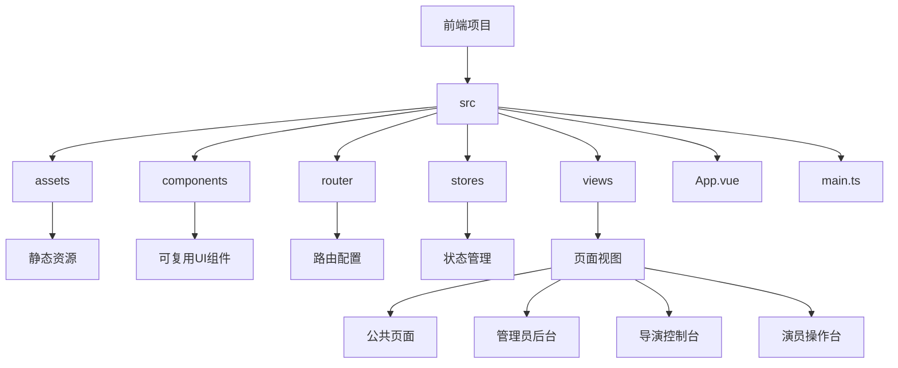
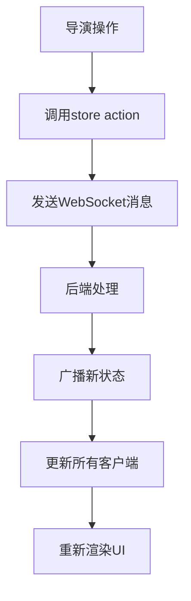
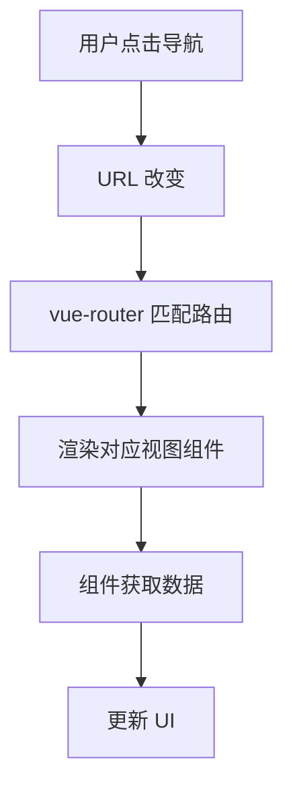

# 前端架构

<cite>
**本文档引用的文件**  
- [main.ts](file://frontend\src\main.ts) - *应用初始化流程*
- [App.vue](file://frontend\src\App.vue) - *根组件结构与初始化*
- [router/index.ts](file://frontend\src\router\index.ts) - *路由配置与导航逻辑*
- [stores/admin.ts](file://frontend\src\stores\admin.ts) - *管理员状态管理*
- [stores/game.ts](file://frontend\src\stores\game.ts) - *游戏状态管理*
- [stores/gameState.ts](file://frontend\src\stores\gameState.ts) - *导演/演员界面状态管理*
- [views/HomePage.vue](file://frontend\src\views\HomePage.vue) - *首页组件实现*
- [views/admin/AdminLoginPage.vue](file://frontend\src\views\admin\AdminLoginPage.vue) - *管理员登录页面实现*
- [views/admin/AdminLayout.vue](file://frontend\src\views\admin\AdminLayout.vue) - *管理员后台布局*
- [views/director/DirectorMain.vue](file://frontend\src\views\director\DirectorMain.vue) - *导演控制台主界面*
- [views/actor/ActorMain.vue](file://frontend\src\views\actor\ActorMain.vue) - *演员操作台主界面*
- [components/GameCard.vue](file://frontend\src\components\GameCard.vue) - *游戏卡片组件*
- [components/LogMessage.vue](file://frontend\src\components\LogMessage.vue) - *日志消息显示组件*
- [services/gameService.ts](file://frontend\src\services\gameService.ts) - *游戏服务API*
- [services/adminService.ts](file://frontend\src\services\adminService.ts) - *管理员服务API*
- [services/webSocketService.ts](file://frontend\src\services\webSocketService.ts) - *WebSocket服务实现*
</cite>

## 更新摘要
**变更内容**   
- 新增了导演控制台和演员操作台的前端架构说明
- 扩展了vue-router配置，包含新的导演和演员路由
- 新增了gameState.ts状态管理模块的详细说明
- 更新了WebSocket服务层的设计与实现细节
- 增加了导演/演员界面的数据流与通信机制示例
- 修正了App.vue中认证初始化逻辑的描述
- 更新了main.ts中Element Plus图标的注册方式
- 根据package.json更新了项目依赖信息

## 目录
1. [项目结构](#项目结构)
2. [核心组件](#核心组件)
3. [Vue 3 组合式API与组件化设计](#vue-3-组合式api与组件化设计)
4. [App.vue 根组件分析](#appvue-根组件分析)
5. [vue-router 路由配置与导航逻辑](#vue-router-路由配置与导航逻辑)
6. [Pinia 全局状态管理机制](#pinia-全局状态管理机制)
7. [main.ts 应用初始化流程](#maints-应用初始化流程)
8. [组件间通信与数据流示例](#组件间通信与数据流示例)

## 项目结构

royale-arena 前端项目采用模块化结构，基于 Vue 3 和 Vite 构建，遵循现代前端工程化最佳实践。项目结构清晰，按功能划分目录，便于维护和扩展。



**Section sources**
- [src](file://frontend\src)
- [views](file://frontend\src\views)
- [components](file://frontend\src\components)

## 核心组件

前端项目的核心组件包括：
- **main.ts**: 应用入口文件，负责初始化 Vue 实例、安装插件和挂载应用
- **App.vue**: 根组件，定义全局布局和路由视图
- **router/index.ts**: 路由配置文件，定义页面导航、懒加载策略和路由守卫
- **stores/admin.ts**: 管理员状态管理模块，使用 Pinia 实现登录状态管理
- **stores/game.ts**: 游戏状态管理模块，使用 Pinia 实现游戏列表状态管理
- **stores/gameState.ts**: 导演/演员界面状态管理模块，处理实时游戏状态
- **views/HomePage.vue**: 首页视图组件，展示游戏列表和搜索功能
- **views/admin/AdminLoginPage.vue**: 管理员登录页面，实现管理员认证功能
- **views/admin/AdminLayout.vue**: 管理员后台布局，提供导航和用户信息
- **views/director/DirectorMain.vue**: 导演控制台主界面，提供游戏控制功能
- **views/actor/ActorMain.vue**: 演员操作台主界面，提供玩家交互功能
- **components/GameCard.vue**: 游戏卡片组件，展示单个游戏的信息和操作
- **components/LogMessage.vue**: 日志消息组件，显示游戏事件和系统消息
- **services/webSocketService.ts**: WebSocket服务，处理实时通信

这些组件共同构成了前端应用的基础架构，实现了组件化、模块化和状态管理的完整体系。

**Section sources**
- [main.ts](file://frontend\src\main.ts#L1-L23)
- [App.vue](file://frontend\src\App.vue#L1-L17)
- [router/index.ts](file://frontend\src\router\index.ts#L1-L175)
- [stores/admin.ts](file://frontend\src\stores\admin.ts#L1-L159)
- [stores/game.ts](file://frontend\src\stores\game.ts#L1-L71)
- [stores/gameState.ts](file://frontend\src\stores\gameState.ts#L1-L289)
- [views/HomePage.vue](file://frontend\src\views\HomePage.vue)
- [views/admin/AdminLoginPage.vue](file://frontend\src\views\admin\AdminLoginPage.vue)
- [views/admin/AdminLayout.vue](file://frontend\src\views\admin\AdminLayout.vue)
- [views/director/DirectorMain.vue](file://frontend\src\views\director\DirectorMain.vue)
- [views/actor/ActorMain.vue](file://frontend\src\views\actor\ActorMain.vue)
- [components/GameCard.vue](file://frontend\src\components\GameCard.vue)
- [components/LogMessage.vue](file://frontend\src\components\LogMessage.vue)
- [services/webSocketService.ts](file://frontend\src\services\webSocketService.ts#L1-L258)

## Vue 3 组合式API与组件化设计

royale-arena 前端采用 Vue 3 的组合式 API（Composition API）进行组件化设计。组合式 API 提供了更灵活的代码组织方式，允许开发者按逻辑关注点组织代码，而不是强制按照选项（如 data、methods、computed）划分。

项目中的所有组件均使用 `<script setup>` 语法糖，这是一种编译时语法，能够简化组合式 API 的使用。例如，在 HomePage.vue 组件中：

```vue
<script setup lang="ts">
import { ref, computed, onMounted, watch } from 'vue'
import { useRouter } from 'vue-router'
import { useGameStore } from '@/stores/game'
import GameCard from '@/components/GameCard.vue'

const router = useRouter()
const gameStore = useGameStore()

// 响应式数据
const currentPage = ref(1)
const pageSize = ref(12)

// 计算属性
const paginatedGames = computed(() => {
  const start = (currentPage.value - 1) * pageSize.value
  const end = start + pageSize.value
  return gameStore.filteredGames.slice(start, end)
})

// 生命周期
onMounted(async () => {
  await gameStore.loadGames()
})
</script>
```

这种设计模式具有以下优势：
- **更好的类型推断**: 与 TypeScript 配合更自然
- **更少的样板代码**: 无需显式 return 或 setup 函数
- **更直观的逻辑组织**: 相关逻辑可以就近组织
- **更高效的编译优化**: `<script setup>` 经过编译优化，性能更好

组件化设计遵循单一职责原则，每个组件只负责特定的 UI 功能，通过 props 接收数据，通过事件或状态管理进行通信。

**Section sources**
- [views/HomePage.vue](file://frontend\src\views\HomePage.vue)
- [views/director/DirectorMain.vue](file://frontend\src\views\director\DirectorMain.vue)
- [views/actor/ActorMain.vue](file://frontend\src\views\actor\ActorMain.vue)
- [components/GameCard.vue](file://frontend\src\components\GameCard.vue)
- [components/LogMessage.vue](file://frontend\src\components\LogMessage.vue)

## App.vue 根组件分析

App.vue 是整个前端应用的根组件，负责定义全局布局和路由视图。作为应用的入口组件，它承载了主要的 UI 结构和导航功能。

```vue
<template>
  <div id="app">
    <router-view />
  </div>
</template>

<script setup lang="ts">
// 认证初始化在路由守卫中处理，这里不需要重复调用
</script>

<style>
#app {
  font-family: -apple-system, BlinkMacSystemFont, 'Segoe UI', Roboto, Oxygen, Ubuntu, Cantarell, 'Helvetica Neue', sans-serif;
  -webkit-font-smoothing: antialiased;
  -moz-osx-font-smoothing: grayscale;
}
</style>
```

根组件的主要职责包括：
- **路由视图**: 使用 `<router-view />` 组件作为路由内容的占位符
- **全局样式**: 定义全局 CSS 样式，包括字体、盒模型、Element Plus 组件样式调整和响应式工具类
- **无初始化逻辑**: 认证初始化已移至路由守卫中处理，避免重复执行

App.vue 保持了极简的设计，专注于提供应用的容器结构，体现了关注点分离的设计原则。

**Section sources**
- [App.vue](file://frontend\src\App.vue#L1-L17)

## vue-router 路由配置与导航逻辑

vue-router 是 Vue 官方的路由管理器，royale-arena 前端使用它来实现单页应用（SPA）的页面导航和路由管理。

路由配置文件 `router/index.ts` 定义了应用的路由规则：

```ts
const routes = [
  // 公共路由
  {
    path: '/',
    name: 'Home',
    component: HomePage,
    meta: {
      title: '雾雨小镇大逃杀 - 首页'
    }
  },
  {
    path: '/game/:id',
    name: 'GameDetail',
    component: GameDetailPage,
    meta: {
      title: '游戏详情'
    }
  },
  {
    path: '/game/:id/player',
    name: 'PlayerInterface',
    component: PlayerInterface,
    meta: {
      title: '玩家界面'
    }
  },
  {
    path: '/game/:id/director',
    name: 'DirectorMain',
    component: DirectorMain,
    meta: {
      title: '导演控制台'
    }
  },
  {
    path: '/game/:id/director/:password',
    name: 'DirectorMainWithPassword',
    component: DirectorMain,
    meta: {
      title: '导演控制台'
    }
  },
  {
    path: '/game/:id/actor',
    name: 'ActorMain',
    component: ActorMain,
    meta: {
      title: '演员界面'
    }
  },
  {
    path: '/game/:id/actor/:password',
    name: 'ActorMainWithPassword',
    component: ActorMain,
    meta: {
      title: '演员界面'
    }
  },
  
  // 管理员登录路由
  {
    path: '/admin/login',
    name: 'AdminLogin',
    component: AdminLoginPage,
    meta: {
      title: '管理员登录'
    }
  },
  
  // 管理员后台路由（需要认证）
  {
    path: '/admin',
    component: AdminLayout,
    meta: {
      requiresAuth: true,
      title: '管理后台'
    },
    redirect: '/admin/games',
    children: [
      {
        path: 'games',
        name: 'AdminGames',
        component: AdminGamesPage,
        meta: {
          title: '游戏管理'
        }
      },
      {
        path: 'rules',
        name: 'AdminRules',
        component: AdminRulesPage,
        meta: {
          title: '规则模版管理'
        }
      },
      {
        path: 'admins',
        name: 'AdminUsers',
        component: AdminUsersPage,
        meta: {
          requiresSuperAdmin: true,
          title: '管理员管理'
        }
      }
    ]
  },
  
  // 404 重定向
  {
    path: '/:pathMatch(.*)*',
    redirect: '/'
  }
]
```

关键特性包括：
- **HTML5 History 模式**: 使用 `createWebHistory` 实现无刷新的页面导航
- **懒加载**: 所有视图组件使用动态导入实现代码分割和懒加载
- **路由元信息**: 使用 `meta` 字段定义页面标题、认证要求等元数据
- **嵌套路由**: 管理员后台使用嵌套路由实现布局组件复用
- **路由守卫**: 使用 `beforeEach` 守卫实现认证检查和页面重定向
- **参数化路由**: 支持游戏ID和密码作为路由参数，用于导演和演员界面访问

路由守卫逻辑：
```ts
router.beforeEach(async (to, _from, next) => {
  const adminStore = useAdminStore()
  
  // 只在需要认证的路由上才初始化认证状态，避免干扰正常的路由跳转
  if (to.meta.requiresAuth && !adminStore.isLoggedIn) {
    try {
      await adminStore.initAuth()
    } catch (err) {
      console.warn('初始化认证状态失败:', err)
    }
  }
  
  // 设置页面标题
  if (to.meta.title) {
    document.title = to.meta.title as string
  }
  
  // 检查是否需要管理员认证
  if (to.meta.requiresAuth) {
    if (!adminStore.isLoggedIn) {
      next('/admin/login')
      return
    }
    
    // 检查是否需要超级管理员权限
    if (to.meta.requiresSuperAdmin && !adminStore.isSuperAdmin) {
      next('/admin/games')
      return
    }
  }
  
  // 如果已登录管理员访问登录页，重定向到后台
  if (to.name === 'AdminLogin' && adminStore.isLoggedIn) {
    next('/admin/games')
    return
  }
  
  next()
})
```

**Section sources**
- [router/index.ts](file://frontend\src\router\index.ts#L1-L175)

## Pinia 全局状态管理机制

Pinia 是 Vue 的官方状态管理库，royale-arena 前端使用它来管理跨组件的全局状态。src/stores 目录下的 admin.ts、game.ts 和 gameState.ts 文件定义了三个主要的状态存储。

### 管理员状态管理 (admin.ts)

```ts
export const useAdminStore = defineStore('admin', () => {
  // 状态
  const isLoggedIn = ref(false)
  const userInfo = ref<AdminUser | null>(null)
  const token = ref<string | null>(null)
  const loading = ref(false)
  const error = ref<string | null>(null)

  // 计算属性
  const isSuperAdmin = computed(() => {
    return userInfo.value?.is_super_admin || false
  })

  // 操作
  const initAuth = async () => { /* ... */ }
  const login = async (credentials: LoginCredentials) => { /* ... */ }
  const logout = () => { /* ... */ }

  return { 
    isLoggedIn, userInfo, token, loading, error,
    isSuperAdmin,
    initAuth, login, logout, clearError
  }
})
```

### 游戏状态管理 (game.ts)

```ts
export const useGameStore = defineStore('game', () => {
  // 状态
  const games = ref<GameListItem[]>([])
  const loading = ref(false)
  const searchQuery = ref('')
  const statusFilter = ref<GameFilterType>('all' as GameFilterType)
  const error = ref<string | null>(null)

  // 计算属性
  const filteredGames = computed(() => {
    return filterGamesByStatus(games.value, statusFilter.value, searchQuery.value)
  })

  // 操作
  const loadGames = async () => { /* ... */ }
  const refreshGames = async () => { /* ... */ }
  const setSearchQuery = (query: string) => { /* ... */ }

  return { 
    games, loading, searchQuery, statusFilter, error,
    filteredGames,
    loadGames, refreshGames, setSearchQuery, setStatusFilter, clearError
  }
})
```

### 导演/演员界面状态管理 (gameState.ts)

```ts
export const useGameStateStore = defineStore('gameState', () => {
  // 状态
  const gameState = ref<DirectorGameState | ActorGameState | null>(null)
  const connected = ref(false)
  const connecting = ref(false)
  const error = ref<string | null>(null)
  const logMessages = ref<ActionResult[]>([])

  // 计算属性
  const globalState = computed<GlobalState | null>(() => {
    return gameState.value?.global_state || null
  })

  const gameData = computed<DirectorGameData | ActorGameData | null>(() => {
    return gameState.value?.game_data || null
  })

  // 操作
  const connect = async (gameId: string, password: string, userType: string) => { /* ... */ }
  const disconnect = () => { /* ... */ }
  const updateGameState = (newState: DirectorGameState | ActorGameState) => { /* ... */ }
  const sendDirectorAction = (action: string, params: Record<string, any> = {}) => { /* ... */ }
  const sendPlayerAction = (action: string, params: Record<string, any> = {}) => { /* ... */ }

  return { 
    // 状态
    gameState, connected, connecting, error, logMessages,
    // 计算属性
    globalState, gameData, directorPlayers, directorPlaces, actorPlayer, actorPlaces,
    // 操作
    connect, disconnect, updateGameState, addLogMessage, clearLogMessages,
    sendDirectorAction, sendPlayerAction, updateWeather, setNightTime, setDestroyPlaces,
    togglePlaceStatus, updatePlayerLife, updatePlayerStrength, movePlayer,
    togglePlayerBinding, destroyPlace, sendBroadcast, sendDirectorMessageToPlayer, clearError
  }
})
```

Pinia 状态管理的核心概念包括：
- **Store**: 使用 `defineStore` 创建的状态容器，每个 store 有唯一的 ID
- **State**: 使用 ref() 定义的响应式状态
- **Getters**: 使用 computed() 定义的派生状态
- **Actions**: 定义业务逻辑的方法

状态管理机制的工作流程：
1. 在 main.ts 中通过 `app.use(createPinia())` 安装 Pinia 插件
2. 在组件中通过 `useAdminStore()`、`useGameStore()` 或 `useGameStateStore()` 获取 store 实例
3. 访问或修改 store 中的状态和方法
4. 所有使用该 store 的组件都能响应状态变化

这种集中式状态管理解决了组件间通信的复杂性，特别适用于需要跨多个组件共享状态的场景。

**Section sources**
- [stores/admin.ts](file://frontend\src\stores\admin.ts#L1-L159)
- [stores/game.ts](file://frontend\src\stores\game.ts#L1-L71)
- [stores/gameState.ts](file://frontend\src\stores\gameState.ts#L1-L289)

## main.ts 应用初始化流程

main.ts 是前端应用的入口文件，负责应用的初始化和启动过程。其主要任务包括创建 Vue 应用实例、安装必要的插件和挂载应用到 DOM。

```ts
import { createApp } from 'vue'
import { createPinia } from 'pinia'
import ElementPlus from 'element-plus'
import 'element-plus/dist/index.css'
import * as ElementPlusIconsVue from '@element-plus/icons-vue'
import router from './router'
import App from './App.vue'
import './style.css'

const app = createApp(App)

// 注册Element Plus图标
for (const [key, component] of Object.entries(ElementPlusIconsVue)) {
  app.component(key, component)
}

// 安装插件
app.use(createPinia())
app.use(router)
app.use(ElementPlus)

// 挂载应用
app.mount('#app')
```

初始化流程的详细步骤：
1. **导入依赖**: 导入 Vue 核心函数、Pinia、Element Plus、根组件、路由器和样式文件
2. **创建应用实例**: 使用 `createApp(App)` 创建 Vue 应用实例
3. **注册图标组件**: 遍历 Element Plus 图标库，将所有图标注册为全局组件
4. **安装插件**: 通过 `app.use()` 方法安装 Pinia、vue-router 和 Element Plus 插件
5. **挂载应用**: 使用 `app.mount('#app')` 将应用挂载到 HTML 的根元素

这个流程遵循了 Vue 3 的应用实例 API，提供了更好的类型支持和模块化能力。通过插件系统，可以轻松扩展应用功能，如状态管理、路由、UI 组件库等。

**Section sources**
- [main.ts](file://frontend\src\main.ts#L1-L23)

## 组件间通信与数据流示例

royale-arena 前端项目展示了多种组件间通信和数据流模式，体现了现代 Vue 应用的典型实践。

### Props 传递（父组件 → 子组件）
HomePage 组件通过 props 将游戏数据传递给 GameCard 组件：

```vue
<!-- HomePage.vue -->
<GameCard
  v-for="game in paginatedGames"
  :key="game.id"
  :game="game"
  @view-detail="handleViewGameDetail"
/>

<!-- GameCard.vue -->
<script setup lang="ts">
interface Props {
  game: GameListItem
}
const props = defineProps<Props>()
</script>
```

### 事件触发（子组件 → 父组件）
GameCard 组件通过 `$emit` 触发事件通知父组件：

```vue
<!-- GameCard.vue -->
<el-button @click="$emit('view-detail', game)">查看详情</el-button>

<script setup lang="ts">
const emit = defineEmits<{
  'view-detail': [game: GameListItem]
}>()
</script>
```

### 全局状态管理（Pinia）
多个组件共享和响应全局状态：

```ts
// 在任何组件中
import { useGameStore } from '@/stores/game'

const gameStore = useGameStore()
await gameStore.loadGames()
```

### WebSocket 实时通信
通过 WebSocket 服务与后端进行实时双向通信：

```ts
// services/webSocketService.ts
class WebSocketService {
  private ws: WebSocket | null = null
  
  connect(gameId: string, password: string, userType: string): Promise<void> {
    this.ws = new WebSocket(`${API_CONFIG.BASE_URL}/ws/${gameId}?user_type=${userType}&password=${encodeURIComponent(password)}`)
    // ... 连接逻辑
  }
  
  sendMessage(message: any): void {
    if (this.ws && this.status === WebSocketStatus.CONNECTED) {
      this.ws.send(JSON.stringify(message))
    }
  }
  
  addEventListener(listener: (event: WebSocketEvent) => void): void {
    this.listeners.push(listener)
  }
}

export const webSocketService = new WebSocketService()
```

### 导演控制指令流
导演控制台发送指令到后端：



### 服务层调用
通过服务层与后端 API 通信：

```ts
// services/gameService.ts
export const gameService = {
  async getGames(query?: GameListQuery): Promise<ApiResponse<GameListItem[]>> {
    const response = await apiClient.get(API_ENDPOINTS.GAMES, { params: query })
    return response.data
  }
}

// 在组件中使用
const response = await gameService.getGames({ filter: statusFilter.value })
```

### 路由驱动的数据流
路由变化驱动视图更新：



这些通信模式共同构成了应用的数据流体系，从简单的 props 传递到复杂的全局状态管理和实时通信，满足了不同场景下的通信需求。

**Section sources**
- [views/HomePage.vue](file://frontend\src\views\HomePage.vue)
- [components/GameCard.vue](file://frontend\src\components\GameCard.vue)
- [stores/game.ts](file://frontend\src\stores\game.ts#L1-L71)
- [stores/gameState.ts](file://frontend\src\stores\gameState.ts#L1-L289)
- [services/webSocketService.ts](file://frontend\src\services\webSocketService.ts#L1-L258)
- [services/gameService.ts](file://frontend\src\services\gameService.ts#L1-L56)
- [services/adminService.ts](file://frontend\src\services\adminService.ts)