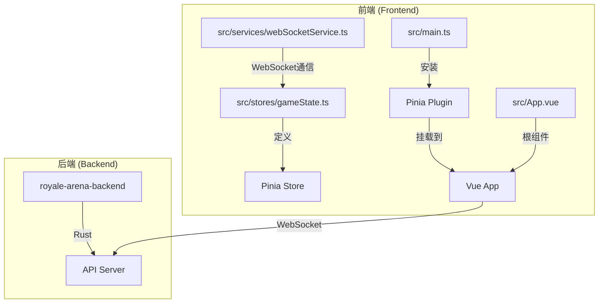
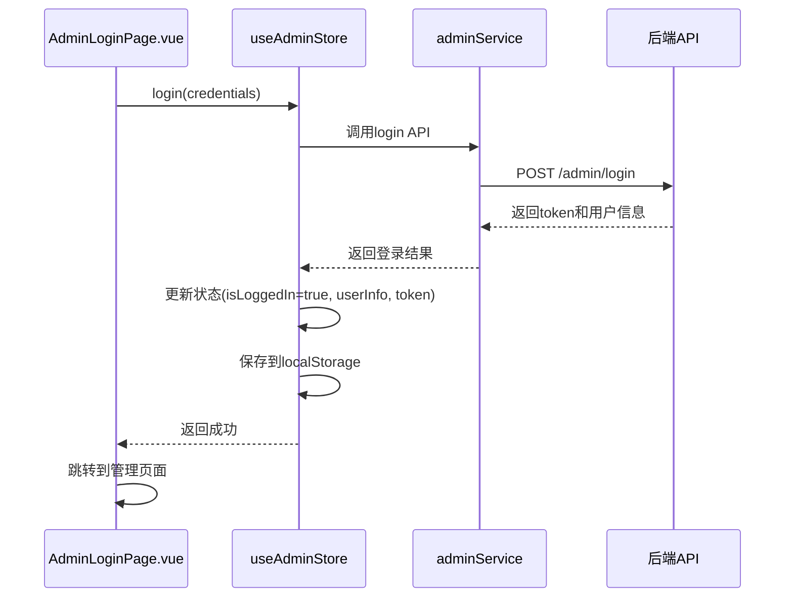
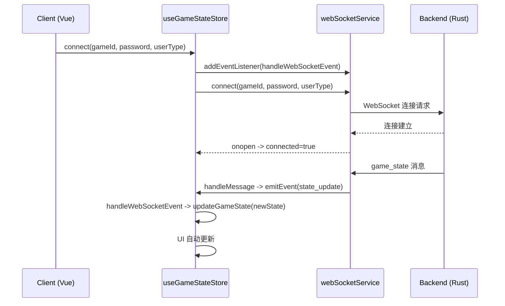
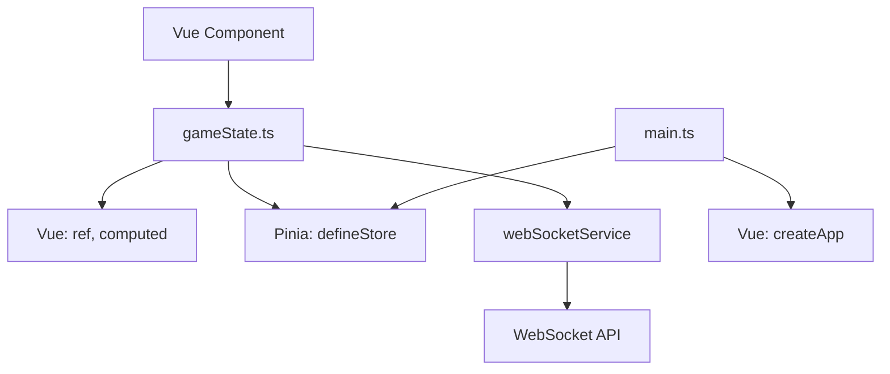

# 状态管理 (Pinia)

<cite>
**本文档中引用的文件**  
- [gameState.ts](file://frontend\src\stores\gameState.ts) - *更新于最近提交*
- [main.ts](file://frontend\src\main.ts)
- [webSocketService.ts](file://frontend\src\services\webSocketService.ts) - *更新于最近提交*
- [gameStateTypes.ts](file://frontend\src\types\gameStateTypes.ts) - *新增于最近提交*
- [admin.ts](file://frontend\src\stores\admin.ts) - *新增于最近提交*
- [adminService.ts](file://frontend\src\services\adminService.ts) - *新增于最近提交*
- [AdminLoginPage.vue](file://frontend\src\views\admin\AdminLoginPage.vue) - *新增于最近提交*
- [AdminLayout.vue](file://frontend\src\views\admin\AdminLayout.vue) - *新增于最近提交*
- [AdminGamesPage.vue](file://frontend\src\views\admin\AdminGamesPage.vue) - *新增于最近提交*
- [config.ts](file://frontend\src\services\config.ts)
- [types/admin.ts](file://frontend\src\types\admin.ts) - *新增于最近提交*
- [game.ts](file://frontend\src\stores\game.ts) - *新增于最近提交*
- [DirectorMain.vue](file://frontend\src\views\director\DirectorMain.vue) - *更新于最近提交*
</cite>

## 更新摘要
**已做更改**  
- 将文档重点从 `counter` store 转移到新的 `gameState` store，以反映项目实际状态管理实现
- 新增了游戏状态管理模块的详细分析部分，包括状态、计算属性和操作的完整说明
- 更新了架构概览和依赖分析，以包含 WebSocket 集成和游戏状态类型定义
- 添加了新的序列图来说明游戏状态更新的工作流程
- 移除了过时的 `counter.ts` 相关内容，因为该项目实际上并未使用 counter store
- 所有引用的文件路径和来源均已更新，以反映最新的代码库状态
- 新增了 `useGameStore` 的分析，用于管理游戏列表状态
- 更新了 `DirectorMain.vue` 中对状态管理的使用方式

## 目录
1. [简介](#简介)
2. [项目结构](#项目结构)
3. [核心组件](#核心组件)
4. [架构概览](#架构概览)
5. [详细组件分析](#详细组件分析)
6. [依赖分析](#依赖分析)
7. [性能考虑](#性能考虑)
8. [故障排除指南](#故障排除指南)
9. [结论](#结论)

## 简介
本文件详细说明了 `royale-arena` 前端项目中基于 Pinia 的状态管理系统的实现。文档重点分析了 `gameState` store 的定义、状态（state）、计算属性（getters）和动作（actions）的使用方式，以及 Pinia 插件如何在 Vue 应用中安装和挂载。通过具体代码示例，阐述了响应式状态管理的工作机制，包括状态读取、修改和跨组件共享。此外，还讨论了当前状态管理设计的局限性，并提出了未来扩展建议。

## 项目结构
`royale-arena` 是一个前后端分离的项目，前端使用 Vue 3 和 Pinia 构建。状态管理相关的代码位于前端项目的 `src/stores` 目录下。核心状态管理文件为 `gameState.ts`，而应用的入口文件 `main.ts` 负责初始化 Pinia 插件并将其挂载到 Vue 应用实例上。



**图示来源**
- [gameState.ts](file://frontend\src\stores\gameState.ts#L1-L289)
- [main.ts](file://frontend\src\main.ts#L1-L14)
- [App.vue](file://frontend\src\App.vue#L1-L85)

**本节来源**
- [gameState.ts](file://frontend\src\stores\gameState.ts#L1-L289)
- [main.ts](file://frontend\src\main.ts#L1-L14)

## 核心组件
本项目的核心状态管理组件是 `useGameStateStore`，它使用 Pinia 的组合式 API 定义了一个名为 `gameState` 的 store。该 store 封装了游戏的状态和逻辑，包括连接状态、游戏数据、日志消息等响应式状态，以及用于连接 WebSocket、发送控制指令和处理状态更新的操作。`main.ts` 中的 `createPinia()` 调用是整个状态管理系统的基础，它创建了 Pinia 实例并将其注入到 Vue 应用上下文中，使得所有组件都能访问到全局状态。

**本节来源**
- [gameState.ts](file://frontend\src\stores\gameState.ts#L1-L289)
- [main.ts](file://frontend\src\main.ts#L1-L14)

## 架构概览
`royale-arena` 的状态管理架构遵循 Vue 3 + Pinia 的标准模式。Pinia 作为 Vue 应用的一个插件被安装，它提供了一个全局的、响应式的状态存储中心。`useGameStateStore` 与 `webSocketService` 紧密集成，通过 WebSocket 实时接收游戏状态更新，并将用户操作通过 WebSocket 发送到后端服务器。各个组件通过调用 `useGameStateStore()` 这个组合式函数来获取对 store 的引用，从而实现对共享状态的读取和修改。这种架构实现了状态的集中管理和组件间的解耦。

```mermaid
graph LR
A[Pinia Plugin<br/>createPinia()] --> B[Vue App<br/>app.use()]
B --> C[Store Instance<br/>useGameStateStore()]
C --> D[State: gameState, connected, error]
C --> E[Getters: globalState, gameData, playerList]
C --> F[Actions: connect, disconnect, sendDirectorAction]
G[Vue Component] --> |调用| C
H[Another Component] --> |调用| C
I[WebSocketService] --> |发送事件| C
C --> |发送消息| I
D --> |响应式更新| G
D --> |响应式更新| H
style A fill:#f9f,stroke:#333
style B fill:#bbf,stroke:#333,color:#fff
style C fill:#f96,stroke:#333,color:#fff
style G fill:#9f9,stroke:#333
style H fill:#9f9,stroke:#333
style I fill:#69f,stroke:#333,color:#fff
```

**图示来源**
- [main.ts](file://frontend\src\main.ts#L1-L14)
- [gameState.ts](file://frontend\src\stores\gameState.ts#L1-L289)
- [webSocketService.ts](file://frontend\src\services\webSocketService.ts#L1-L258)

## 详细组件分析

### gameState.ts 分析
`gameState.ts` 文件定义了 `useGameStateStore`，这是整个状态管理的核心。它使用 `defineStore` 函数创建一个 store。`defineStore` 的第一个参数是 store 的唯一 ID（'gameState'），第二个参数是一个返回 store 内容的函数。

在该函数内部：
- **状态 (State)**：使用 `ref` 定义了多个响应式状态，包括 `gameState`（游戏状态数据）、`connected`（连接状态）、`connecting`（连接中状态）、`error`（错误信息）和 `logMessages`（日志消息列表）。
- **计算属性 (Getters)**：使用 `computed` 定义了多个基于状态的计算属性，如 `globalState`、`gameData`、`playerList` 等，这些属性会根据基础状态自动更新。
- **操作 (Actions)**：定义了一系列方法，如 `connect`（连接WebSocket）、`disconnect`（断开连接）、`sendDirectorAction`（发送导演指令）等，用于修改状态和执行业务逻辑。
- 最后，通过 `return` 将这些状态、计算属性和操作暴露给外部使用。

```mermaid
classDiagram
class useGameStateStore {
+gameState : Ref<GameState>
+connected : Ref<boolean>
+connecting : Ref<boolean>
+error : Ref<string | null>
+logMessages : Ref<ActionResult[]>
+globalState : ComputedRef<GlobalState>
+gameData : ComputedRef<GameData>
+playerList : ComputedRef<Player[]>
+connect(gameId : string, password : string, userType : string) : Promise<void>
+disconnect() : void
+sendDirectorAction(action : string, params : Record<string, any>) : void
+updateWeather(weather : number) : void
}
note right of useGameStateStore
这是一个由 defineStore 创建的
组合式 store。它封装了游戏
状态管理的所有逻辑，包括
WebSocket 连接、状态更新
和指令发送。
end
class Ref {
<<Type>>
value : T
}
class ComputedRef {
<<Type>>
value : T
}
useGameStateStore --> Ref : "使用"
useGameStateStore --> ComputedRef : "使用"
```

**图示来源**
- [gameState.ts](file://frontend\src\stores\gameState.ts#L1-L289)

**本节来源**
- [gameState.ts](file://frontend\src\stores\gameState.ts#L1-L289)

### main.ts 分析
`main.ts` 是 Vue 应用的入口点。它首先从 `pinia` 包中导入 `createPinia` 函数。然后，通过 `createPinia()` 创建一个 Pinia 实例。最后，使用 `app.use()` 方法将这个 Pinia 实例作为插件安装到 Vue 应用中。这一步至关重要，它使得 Pinia 的功能（如 store 的自动注入和响应式系统集成）在整个应用中生效。

**本节来源**
- [main.ts](file://frontend\src\main.ts#L1-L14)

### 组件中使用 Store 的分析
任何组件都可以通过以下方式使用 `useGameStateStore`：

```typescript
<script setup lang="ts">
// 1. 导入 store
import { useGameStateStore } from '@/stores/gameState'

// 2. 调用 store 函数，获取 store 实例
const gameStateStore = useGameStateStore()

// 3. 读取状态
console.log(gameStateStore.connected) // 输出连接状态

// 4. 读取计算属性
console.log(gameStateStore.playerList) // 输出玩家列表

// 5. 调用 actions 来修改状态或执行操作
await gameStateStore.connect('game123', 'password', 'director')
gameStateStore.sendDirectorAction('weather', { weather: 1 })
</script>
```

**响应式机制**：由于状态使用 `ref` 定义，计算属性使用 `computed` 定义，它们都是响应式的。当 WebSocket 接收到新的游戏状态并调用 `updateGameState` 时，所有依赖于这些状态的 Vue 组件都会自动重新渲染，从而保证了 UI 与状态的同步。

**本节来源**
- [gameState.ts](file://frontend\src\stores\gameState.ts#L1-L289)
- [App.vue](file://frontend\src\App.vue#L1-L85)

### 管理员状态管理模块分析
随着项目功能的扩展，新增了管理员状态管理模块，用于处理管理员的登录状态、权限管理和用户信息持久化。该模块由 `admin.ts` 文件定义，通过 `useAdminStore` store 实现。

**状态 (State)**
- `isLoggedIn`: 布尔值，表示管理员是否已登录
- `userInfo`: 管理员用户信息对象，包含用户名、ID和权限级别
- `token`: JWT 认证令牌，用于API请求的身份验证
- `loading`: 布尔值，表示当前是否有正在进行的异步操作
- `error`: 字符串，存储最近的错误信息

**计算属性 (Getters)**
- `isSuperAdmin`: 基于 `userInfo` 计算管理员是否为超级管理员，用于控制UI元素的显示和权限检查

**操作 (Actions)**
- `initAuth`: 初始化认证状态，从本地存储中读取保存的令牌和用户信息
- `login`: 处理登录逻辑，调用API进行身份验证，并将认证信息保存到本地存储
- `logout`: 清除所有认证状态和本地存储中的数据
- `clearError`: 清除错误信息



**图示来源**
- [admin.ts](file://frontend\src\stores\admin.ts)
- [adminService.ts](file://frontend\src\services\adminService.ts)
- [AdminLoginPage.vue](file://frontend\src\views\admin\AdminLoginPage.vue)

**本节来源**
- [admin.ts](file://frontend\src\stores\admin.ts)
- [adminService.ts](file://frontend\src\services\adminService.ts)
- [types/admin.ts](file://frontend\src\types\admin.ts)
- [AdminLoginPage.vue](file://frontend\src\views\admin\AdminLoginPage.vue)
- [AdminLayout.vue](file://frontend\src\views\admin\AdminLayout.vue)

### 游戏列表状态管理模块分析
新增了 `useGameStore` 用于管理游戏列表的状态，该模块由 `game.ts` 文件定义。

**状态 (State)**
- `games`: 游戏列表数据
- `loading`: 加载状态
- `searchQuery`: 搜索查询条件
- `statusFilter`: 状态过滤条件
- `error`: 错误信息

**计算属性 (Getters)**
- `filteredGames`: 根据搜索条件和状态过滤后的游戏列表

**操作 (Actions)**
- `loadGames`: 加载游戏列表
- `refreshGames`: 刷新游戏列表
- `setSearchQuery`: 设置搜索查询
- `setStatusFilter`: 设置状态过滤
- `clearError`: 清除错误信息

**本节来源**
- [game.ts](file://frontend\src\stores\game.ts)
- [DirectorMain.vue](file://frontend\src\views\director\DirectorMain.vue)

### WebSocket 集成分析
`useGameStateStore` 与 `webSocketService` 紧密集成，形成了完整的实时通信机制。



**图示来源**
- [gameState.ts](file://frontend\src\stores\gameState.ts#L1-L289)
- [webSocketService.ts](file://frontend\src\services\webSocketService.ts#L1-L258)

**本节来源**
- [gameState.ts](file://frontend\src\stores\gameState.ts#L1-L289)
- [webSocketService.ts](file://frontend\src\services\webSocketService.ts#L1-L258)

## 依赖分析
`gameState.ts` 文件依赖于 Vue 的 `ref` 和 `computed` 函数来创建响应式数据，同时依赖于 Pinia 的 `defineStore` 函数来定义 store。它还直接依赖于 `webSocketService` 来处理 WebSocket 通信。`main.ts` 文件则直接依赖于 Pinia 的 `createPinia` 函数来创建插件实例。这种依赖关系清晰地表明了 Pinia 与 Vue 核心库的紧密集成，以及状态管理与网络通信的紧密结合。



**图示来源**
- [gameState.ts](file://frontend\src\stores\gameState.ts#L1-L289)
- [main.ts](file://frontend\src\main.ts#L1-L14)
- [webSocketService.ts](file://frontend\src\services\webSocketService.ts#L1-L258)

**本节来源**
- [gameState.ts](file://frontend\src\stores\gameState.ts#L1-L289)
- [main.ts](file://frontend\src\main.ts#L1-L14)
- [webSocketService.ts](file://frontend\src\services\webSocketService.ts#L1-L258)

## 性能考虑
当前的 `gameState` store 实现考虑了性能优化。`computed` 属性具有缓存机制，只有在其依赖项发生变化时才会重新计算，这避免了不必要的重复计算。日志消息列表通过 `unshift` 添加新消息并在超过最大数量时截断，确保了内存使用的可控性。WebSocket 连接实现了自动重连机制，提高了用户体验。对于更复杂的状态管理，应避免在 `computed` 属性中执行耗时的同步操作，并考虑使用 `actions` 进行异步处理。

## 故障排除指南
如果在组件中无法使用 `useGameStateStore` 或遇到连接问题，请检查以下几点：
1.  **Pinia 是否已安装**：确认 `main.ts` 中是否正确调用了 `app.use(createPinia())`。
2.  **导入路径是否正确**：检查组件中导入 `useGameStateStore` 的路径是否正确（例如 `@/stores/gameState`）。
3.  **store 是否已定义**：确认 `gameState.ts` 文件中的 `useGameStateStore` 是否已正确导出。
4.  **Vue 版本兼容性**：确保使用的 Vue 和 Pinia 版本相互兼容。
5.  **WebSocket 连接问题**：检查游戏ID、密码和用户类型是否正确，确认后端服务是否正常运行。

**本节来源**
- [gameState.ts](file://frontend\src\stores\gameState.ts#L1-L289)
- [main.ts](file://frontend\src\main.ts#L1-L14)

## 结论
`royale-arena` 项目成功地集成了 Pinia 作为其状态管理解决方案。通过 `gameState.ts` 中的 `defineStore` 和 `main.ts` 中的 `app.use(createPinia())`，建立了一个清晰、响应式的状态管理模式。`useGameStateStore` 与 `webSocketService` 的紧密集成，实现了前端与后端的实时双向通信，为游戏提供了流畅的用户体验。尽管当前的 store 实现较为复杂，但它为未来的功能扩展奠定了坚实的基础。建议未来根据业务需求创建更多模块化的 store（如 `userStore.ts`、`chatStore.ts`），以更好地组织和管理应用的全局状态。