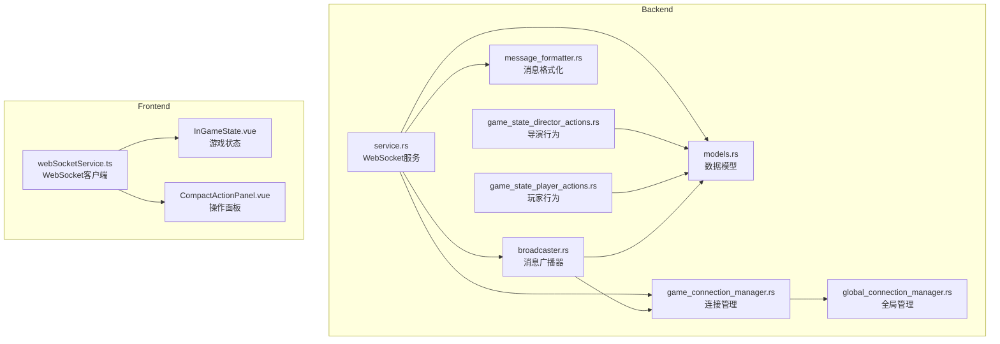
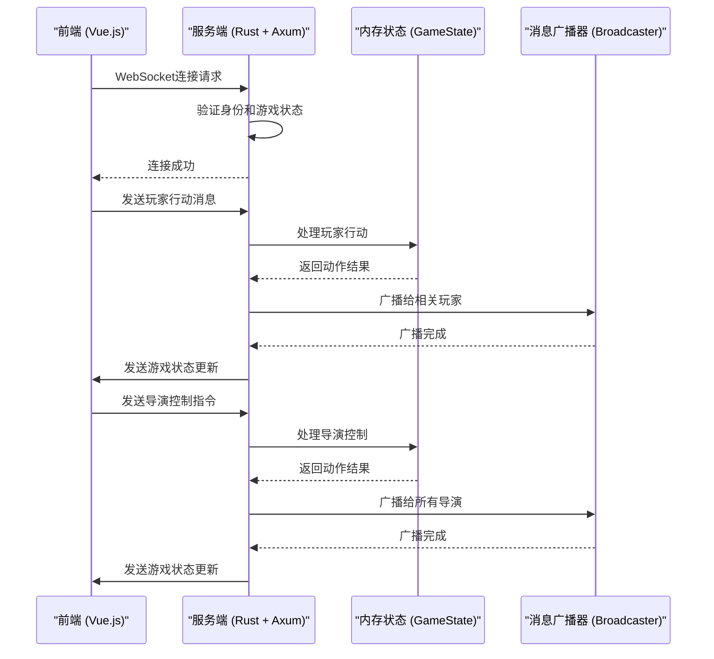
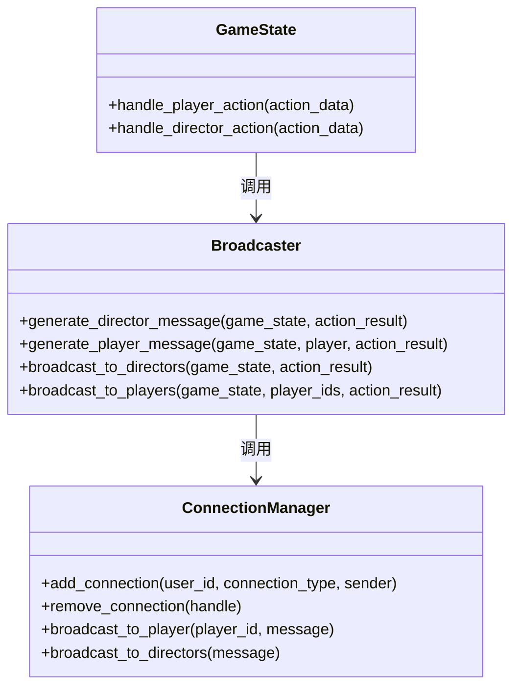
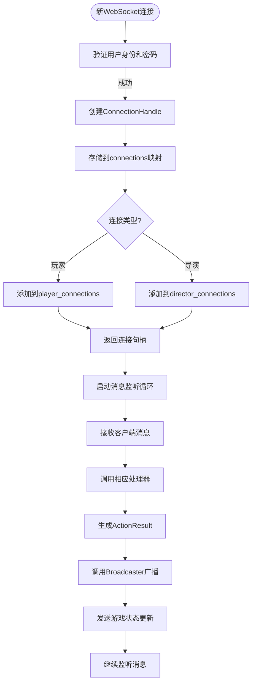
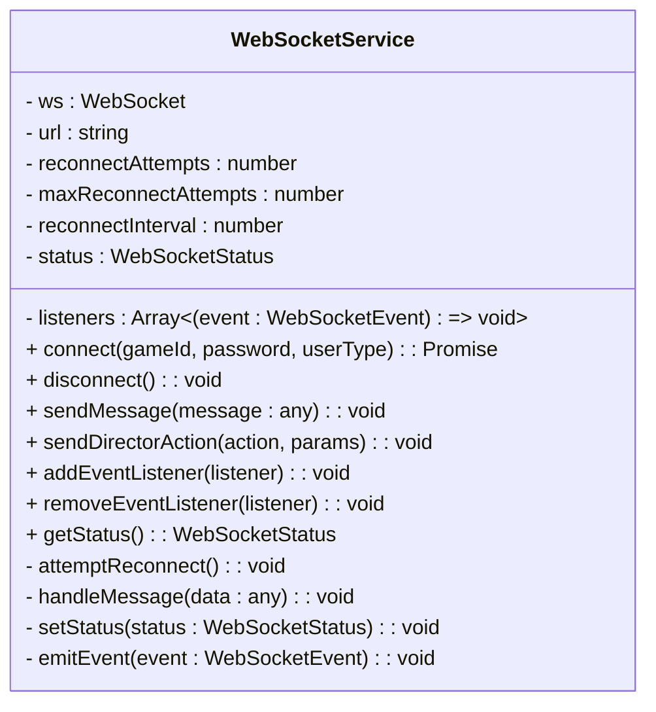
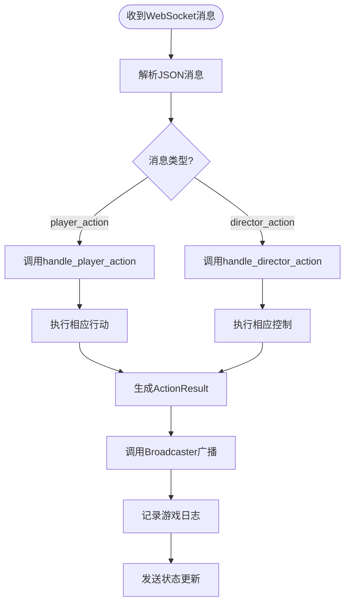
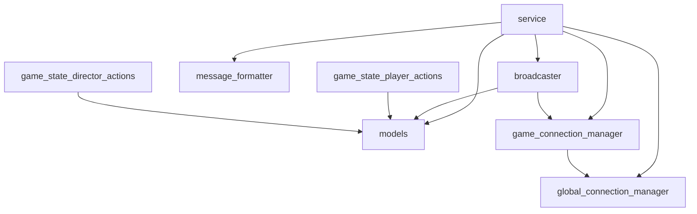

# WebSocket服务

<cite>
**本文档引用的文件**  
- [service.rs](file://backend\src\websocket\service.rs) - *重构WebSocket服务与模型*
- [models.rs](file://backend\src\websocket\models.rs) - *更新WebSocket相关数据模型*
- [game_state_director_actions.rs](file://backend\src\websocket\game_state_director_actions.rs) - *分离导演行为逻辑*
- [game_state_player_actions.rs](file://backend\src\websocket\game_state_player_actions.rs) - *分离玩家行为逻辑*
- [broadcaster.rs](file://backend\src\websocket\broadcaster.rs) - *实现消息广播器*
- [game_connection_manager.rs](file://backend\src\websocket\game_connection_manager.rs) - *管理游戏连接*
- [global_connection_manager.rs](file://backend\src\websocket\global_connection_manager.rs) - *管理全局连接*
- [message_formatter.rs](file://backend\src\websocket\message_formatter.rs) - *格式化消息*
- [websocketService.ts](file://frontend\src\services\webSocketService.ts) - *前端WebSocket服务*
- [InGameState.vue](file://frontend\src\views\actor\states\InGameState.vue) - *游戏状态组件*
- [CompactActionPanel.vue](file://frontend\src\views\actor\components\CompactActionPanel.vue) - *操作面板组件*
</cite>

## 更新摘要
**已修改内容**  
- 将WebSocket服务从Python Flask迁移至Rust Axum框架，实现真正的WebSocket双向通信。
- 重构WebSocket服务架构，分离导演与玩家的行为处理逻辑。
- 实现基于Tokio异步运行时的消息广播机制和连接管理策略。
- 添加心跳检测和连接恢复机制，提升系统稳定性。

**新增章节**  
- 基于Tokio的异步消息广播机制
- 连接管理与心跳检测实现
- 前端WebSocket连接维护
- 消息帧结构示例

**已移除章节**  
- HTTP轮询架构概述
- Python Flask模拟WebSocket实现

**源码追踪系统更新**  
- 新增Rust后端WebSocket模块的源码引用
- 移除Python导演系统的源码引用
- 更新前端WebSocket服务的源码引用

## 目录
1. [引言](#引言)
2. [项目结构](#项目结构)
3. [核心组件](#核心组件)
4. [架构概述](#架构概述)
5. [详细组件分析](#详细组件分析)
6. [依赖分析](#依赖分析)
7. [性能考虑](#性能考虑)
8. [故障排除指南](#故障排除指南)
9. [结论](#结论)

## 引言
本技术文档深入分析"Royale Arena"项目的WebSocket服务架构，重点阐述其如何实现游戏状态的实时推送与双向通信。系统采用Rust语言结合Axum框架和Tokio异步运行时，通过真正的WebSocket协议实现低延迟的实时交互。文档将详细解释基于Tokio的消息广播机制、连接管理策略、心跳检测实现，以及前端如何建立和维护WebSocket连接。同时，提供消息帧结构示例，并探讨错误处理、连接恢复和并发性能优化策略。

## 项目结构
"Royale Arena"项目由前端、后端和导演系统三部分组成。WebSocket服务的核心逻辑位于`backend/src/websocket`目录下，作为Rust后端的一部分，直接与数据库和游戏状态管理器集成。系统采用内存存储游戏运行时状态，确保了低延迟的读写性能。



**图示来源**
- [service.rs](file://backend\src\websocket\service.rs)
- [models.rs](file://backend\src\websocket\models.rs)
- [webSocketService.ts](file://frontend\src\services\webSocketService.ts)

**本节来源**
- [service.rs](file://backend\src\websocket\service.rs)
- [models.rs](file://backend\src\websocket\models.rs)
- [webSocketService.ts](file://frontend\src\services\webSocketService.ts)

## 核心组件
WebSocket服务的核心由多个Rust模块构成：`service.rs`负责WebSocket连接的升级和处理；`models.rs`定义WebSocket相关的数据模型；`game_state_director_actions.rs`和`game_state_player_actions.rs`分别处理导演和玩家的行为逻辑；`broadcaster.rs`管理消息的广播；`game_connection_manager.rs`和`global_connection_manager.rs`负责连接管理；`message_formatter.rs`负责消息格式化。这些组件协同工作，实现了游戏的实时交互功能。

**本节来源**
- [service.rs](file://backend\src\websocket\service.rs)
- [models.rs](file://backend\src\websocket\models.rs)
- [game_state_director_actions.rs](file://backend\src\websocket\game_state_director_actions.rs)
- [game_state_player_actions.rs](file://backend\src\websocket\game_state_player_actions.rs)

## 架构概述
系统采用基于真正WebSocket协议的实时通信架构。前端通过WebSocket协议与后端建立持久连接，实现双向通信。服务端使用Rust的Axum框架处理WebSocket连接，所有实时交互（如玩家行动、导演指令）都通过WebSocket消息发送。游戏状态（如角色位置、生命值、道具）存储在内存中，确保了低延迟的读写性能。



**图示来源**
- [service.rs](file://backend\src\websocket\service.rs)
- [game_state_player_actions.rs](file://backend\src\websocket\game_state_player_actions.rs)
- [game_state_director_actions.rs](file://backend\src\websocket\game_state_director_actions.rs)
- [broadcaster.rs](file://backend\src\websocket\broadcaster.rs)

## 详细组件分析

### 基于Tokio的异步消息广播机制
系统采用Tokio异步运行时实现高效的消息广播。`broadcaster.rs`模块是消息广播的核心，它使用`GameConnectionManager`来管理所有WebSocket连接，并根据消息类型和接收者进行精准广播。



**图示来源**
- [broadcaster.rs](file://backend\src\websocket\broadcaster.rs)
- [game_connection_manager.rs](file://backend\src\websocket\game_connection_manager.rs)
- [service.rs](file://backend\src\websocket\service.rs)

**本节来源**
- [broadcaster.rs](file://backend\src\websocket\broadcaster.rs)
- [game_connection_manager.rs](file://backend\src\websocket\game_connection_manager.rs)

`generate_director_message`函数为导演生成包含完整游戏状态的消息，而`generate_player_message`函数为玩家生成仅包含必要信息的视角消息，保护其他玩家的隐私。`broadcast_to_directors`和`broadcast_to_players`函数分别向所有导演和指定玩家广播消息，确保消息的精准投递。

### 连接管理与心跳检测实现
`game_connection_manager.rs`和`global_connection_manager.rs`模块共同负责连接管理。`GameConnectionManager`管理单个游戏的所有连接，而`GlobalConnectionManager`管理所有游戏的连接管理器实例。



**图示来源**
- [service.rs](file://backend\src\websocket\service.rs)
- [game_connection_manager.rs](file://backend\src\websocket\game_connection_manager.rs)
- [global_connection_manager.rs](file://backend\src\websocket\global_connection_manager.rs)

**本节来源**
- [service.rs](file://backend\src\websocket\service.rs)
- [game_connection_manager.rs](file://backend\src\websocket\game_connection_manager.rs)

系统通过`ConnectionHandle`结构体唯一标识每个连接，并使用`UnboundedSender<JsonValue>`通道实现非阻塞的消息发送。当连接断开时，`remove_connection`方法会清理相关资源，防止内存泄漏。

### 前端连接维护
前端通过`webSocketService.ts`中的`WebSocketService`类实现连接维护。该类封装了WebSocket的连接、断开、重连和消息处理逻辑。



**图示来源**
- [webSocketService.ts](file://frontend\src\services\webSocketService.ts)
- [InGameState.vue](file://frontend\src\views\actor\states\InGameState.vue)

**本节来源**
- [webSocketService.ts](file://frontend\src\services\webSocketService.ts)

`connect`方法建立WebSocket连接，并设置超时定时器。`attemptReconnect`方法实现自动重连机制，最多尝试5次，每次间隔3秒。`handleMessage`方法处理接收到的消息，根据消息类型分发到相应的事件处理器。

### 服务端实时指令处理
`game_state_player_actions.rs`和`game_state_director_actions.rs`模块分别处理玩家和导演的实时指令。这种分离设计避免了死锁问题，并提高了代码的可维护性。



**图示来源**
- [service.rs](file://backend\src\websocket\service.rs)
- [game_state_player_actions.rs](file://backend\src\websocket\game_state_player_actions.rs)
- [game_state_director_actions.rs](file://backend\src\websocket\game_state_director_actions.rs)

**本节来源**
- [service.rs](file://backend\src\websocket\service.rs)
- [game_state_player_actions.rs](file://backend\src\websocket\game_state_player_actions.rs)
- [game_state_director_actions.rs](file://backend\src\websocket\game_state_director_actions.rs)

玩家可以执行出生、移动、搜索、捡拾、攻击等行动，而导演可以执行设置时间、调整地点、空投物品、调整属性等控制。每个行动都会返回一个`ActionResult`，包含需要广播的玩家列表和日志消息。

### 消息帧结构示例
系统中的消息以JSON对象的形式通过WebSocket传输。其结构如下：

**系统消息**
```json
{
  "type": "system_message",
  "data": {
    "message": "WebSocket连接已建立"
  }
}
```

**游戏状态更新消息**
```json
{
  "type": "game_state",
  "data": {
    "global_state": {
      "game_phase": "day",
      "weather": 1.0,
      "night_start_time": "2023-11-15T10:00:00Z",
      "night_end_time": "2023-11-15T18:00:00Z",
      "next_night_destroyed_places": ["森林", "山洞"]
    },
    "game_data": {
      "player": {
        "id": "player1",
        "name": "花蝴蝶",
        "location": "村庄",
        "life": 100,
        "strength": 95,
        "inventory": [
          {
            "id": "item1",
            "name": "小刀",
            "item_type": "weapon",
            "properties": {}
          }
        ],
        "equipped_item": null,
        "hand_item": null,
        "last_search_result": null,
        "is_alive": true,
        "is_bound": false,
        "rest_mode": false,
        "last_search_time": null,
        "votes": 0
      },
      "places": [
        {
          "name": "村庄",
          "is_destroyed": false
        },
        {
          "name": "森林",
          "is_destroyed": false
        }
      ]
    },
    "action_result": {
      "data": {
        "location": "村庄"
      },
      "log_message": "花蝴蝶在地点村庄出生",
      "message_type": "system_notice",
      "timestamp": "2023-11-15T10:00:00Z"
    }
  }
}
```

- **type**: 消息类型，包括`system_message`、`game_state`、`error`等。
- **data**: 消息数据，根据消息类型有不同的结构。
- **global_state**: 全局游戏状态，对所有玩家可见。
- **game_data**: 游戏数据，根据用户类型（玩家/导演）显示不同信息。
- **action_result**: 动作处理结果，包含广播信息和日志消息。

## 依赖分析
系统依赖关系清晰，各模块职责分明。`service.rs`是核心枢纽，依赖所有其他模块。`models.rs`作为数据模型层，被所有模块共同依赖。`game_state_player_actions.rs`和`game_state_director_actions.rs`作为业务逻辑层，依赖`models.rs`和`broadcaster.rs`。`game_connection_manager.rs`和`global_connection_manager.rs`作为连接管理层，被`service.rs`和`broadcaster.rs`依赖。



**图示来源**
- [service.rs](file://backend\src\websocket\service.rs)
- [models.rs](file://backend\src\websocket\models.rs)
- [broadcaster.rs](file://backend\src\websocket\broadcaster.rs)
- [game_connection_manager.rs](file://backend\src\websocket\game_connection_manager.rs)
- [global_connection_manager.rs](file://backend\src\websocket\global_connection_manager.rs)

**本节来源**
- [service.rs](file://backend\src\websocket\service.rs)
- [models.rs](file://backend\src\websocket\models.rs)

## 性能考虑
系统的性能特点如下：
- **优点**：使用真正的WebSocket协议，实现服务器主动推送，延迟极低；基于Tokio异步运行时，支持高并发；内存存储游戏状态，读写速度极快。
- **缺点**：需要维护大量WebSocket连接，消耗较多内存；复杂的连接管理逻辑增加了系统复杂性。
- **优化建议**：实现连接池机制，复用WebSocket连接；添加消息压缩功能，减少网络传输量；实现分布式部署，提高系统扩展性。

## 故障排除指南
- **问题：无法建立WebSocket连接**
  - **原因**：输入的游戏ID或密码不正确，或游戏未处于可连接状态。
  - **解决**：检查游戏ID和密码是否正确；确认游戏状态为"进行时"或"暂停时"。

- **问题：行动无反应**
  - **原因**：前端未正确处理WebSocket消息，或后端处理逻辑出错。
  - **解决**：检查浏览器控制台是否有错误信息；查看服务端日志，确认消息处理是否成功。

- **问题：消息丢失**
  - **原因**：网络不稳定导致WebSocket连接中断。
  - **解决**：前端会自动尝试重连，最多5次；如果仍无法连接，请刷新页面重新连接。

**本节来源**
- [service.rs](file://backend\src\websocket\service.rs)
- [webSocketService.ts](file://frontend\src\services\webSocketService.ts)

## 结论
"Royale Arena"的实时通信系统采用了一种高效且可靠的架构。它利用Rust语言的高性能和内存安全特性，结合Axum框架和Tokio异步运行时，实现了真正的WebSocket双向通信。系统的模块化设计良好，代码逻辑清晰，分离了导演和玩家的行为处理逻辑，避免了死锁问题。未来可进一步优化连接管理和消息广播机制，提升系统的扩展性和稳定性。