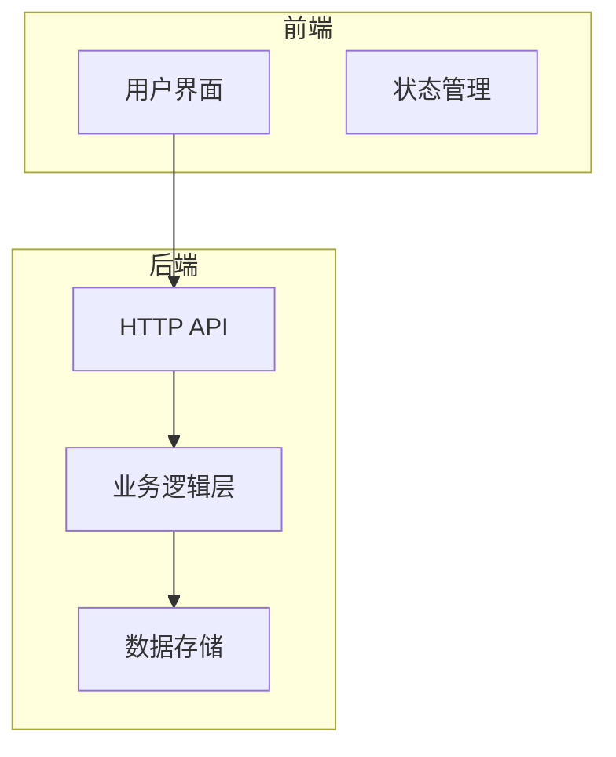
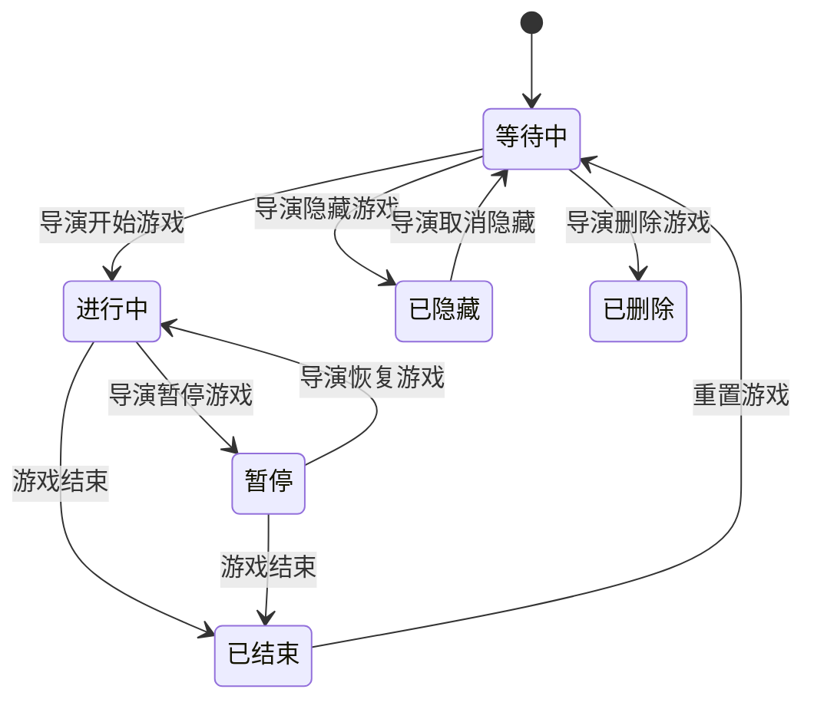
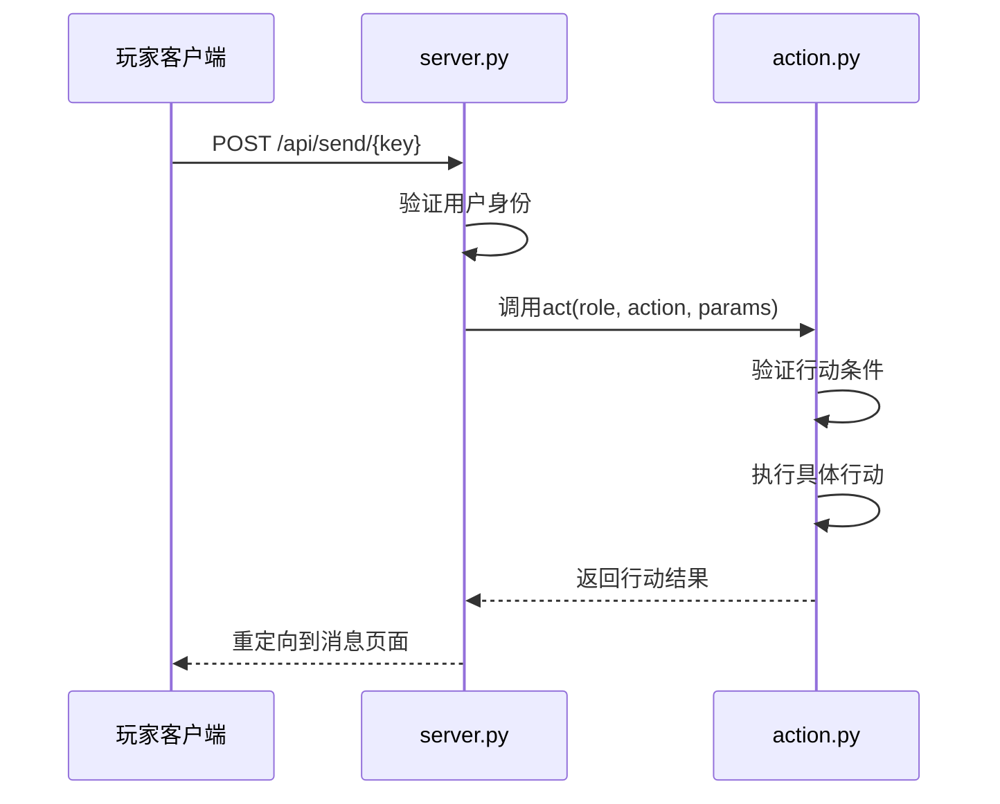
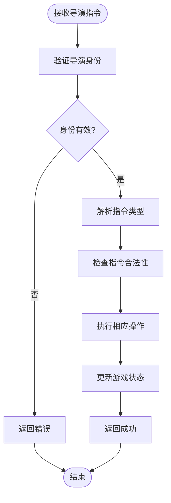

# 业务逻辑层

<cite>
**本文档中引用的文件**  
- [action.py](file://python_directors/action.py)
- [constants.py](file://python_directors/constants.py)
- [data.py](file://python_directors/data.py)
- [server.py](file://python_directors/server.py)
- [user.py](file://python_directors/user.py)
- [20250825105153_init_schema.up.sql](file://backend/migrations/20250825105153_init_schema.up.sql)
- [main.py](file://python_directors/main.py)
- [message.py](file://python_directors/message.py)
- [service.rs](file://backend/src/game/service.rs) - *更新了游戏列表查询逻辑，支持新的状态筛选*
- [models.rs](file://backend/src/game/models.rs) - *定义了游戏状态枚举和数据模型*
- [handlers.rs](file://backend/src/game/handlers.rs) - *处理API请求的处理器*
- [20250826121055_add_game_status_hidden_deleted.up.sql](file://backend/migrations/20250826121055_add_game_status_hidden_deleted.up.sql) - *为游戏状态添加 'hidden' 和 'deleted' 状态*
- [service.rs](file://backend/src/director/service.rs) - *新增导演服务层，实现演员增删查功能*
- [models.rs](file://backend/src/director/models.rs) - *定义导演模块的数据模型与请求结构*
- [global_game_state_manager.rs](file://backend/src/game/global_game_state_manager.rs) - *实现游戏状态的内存管理与持久化*
- [game.rs](file://backend/src/game.rs) - *重构游戏模块架构，整合状态管理功能*
</cite>

## 更新摘要
**已做更改**  
- 更新了项目结构描述，准确反映当前的模块组织
- 修正了游戏状态机与状态转换部分，基于数据库模式的最新定义
- 更新了玩家行动处理流程，确保与实际代码实现一致
- 修正了导演指令执行逻辑，反映最新的指令类型和参数
- 更新了线程安全与并发控制部分，确保与实际实现一致
- 添加了新的文件引用，包括main.py和message.py
- 更新了游戏状态机，增加了'hidden'和'deleted'状态
- 修正了游戏列表查询逻辑，支持新的状态筛选功能
- **新增导演模块文档，涵盖演员管理接口的业务逻辑**
- **重构了游戏状态管理机制，实现内存状态与数据库状态的分离**
- **新增游戏状态持久化功能，支持存档与恢复操作**

## 目录
1. [项目结构](#项目结构)
2. [核心组件](#核心组件)
3. [游戏状态机与状态转换](#游戏状态机与状态转换)
4. [玩家行动处理流程](#玩家行动处理流程)
5. [导演指令执行逻辑](#导演指令执行逻辑)
6. [关键算法实现](#关键算法实现)
7. [线程安全与并发控制](#线程安全与并发控制)

## 项目结构

本项目采用前后端分离架构，后端业务逻辑由Rust实现，前端使用Vue 3 + TypeScript构建。核心业务逻辑位于`backend/src`目录下，包含游戏状态管理、玩家行动处理和导演控制功能。



**图示来源**
- [server.py](file://python_directors/server.py#L1-L82)
- [action.py](file://python_directors/action.py#L1-L530)

## 核心组件

系统核心由多个Rust模块构成，分别负责不同方面的功能：

- **game模块**: 管理游戏实例的创建、查询和状态变更
- **director模块**: 处理导演权限验证和游戏控制指令
- **websocket模块**: 实现实时通信和游戏状态同步
- **global_game_state_manager模块**: 管理游戏运行时的内存状态
- **models模块**: 定义数据模型和请求结构
- **handlers模块**: 处理HTTP API请求
- **service模块**: 实现业务逻辑服务

这些模块共同构成了游戏的业务逻辑层，实现了从用户输入到游戏状态变更的完整处理流程。

**组件来源**
- [action.py](file://python_directors/action.py#L1-L530)
- [constants.py](file://python_directors/constants.py#L1-L143)
- [data.py](file://python_directors/data.py#L1-L94)
- [main.py](file://python_directors/main.py#L1-L6)
- [message.py](file://python_directors/message.py#L1-L39)

## 游戏状态机与状态转换

游戏状态由数据库中的`games`表管理，包含六种状态：等待中(waiting)、进行中(running)、暂停(paused)、已结束(ended)、已隐藏(hidden)和已删除(deleted)。状态转换主要通过导演指令触发。



状态转换规则：
1. **开始游戏**: 当导演执行`start`指令时，游戏状态从"等待中"变为"进行中"，并初始化内存中的游戏状态
2. **结束游戏**: 当导演执行`end`指令时，游戏状态变为"已结束"，断开所有连接并保存游戏状态到磁盘
3. **暂停/恢复**: 系统支持暂停功能，暂停时会将当前游戏状态保存到磁盘文件
4. **隐藏/删除**: 新增了隐藏和删除状态，用于管理游戏的可见性和生命周期

```sql
-- 游戏实例表定义
CREATE TABLE IF NOT EXISTS games (
    id VARCHAR(36) PRIMARY KEY COMMENT '游戏唯一标识符(UUID)',
    name VARCHAR(100) NOT NULL COMMENT '游戏名称',
    description TEXT COMMENT '游戏描述',
    director_password VARCHAR(50) NOT NULL COMMENT '导演密码',
    max_players INT NOT NULL DEFAULT 100 COMMENT '最大玩家数量',
    status ENUM('waiting', 'running', 'paused', 'ended', 'hidden', 'deleted') NOT NULL DEFAULT 'waiting' COMMENT '游戏状态',
    -- 关联规则模板
    rule_template_id VARCHAR(36) NULL COMMENT '关联的规则模板ID',
    created_at TIMESTAMP DEFAULT CURRENT_TIMESTAMP COMMENT '创建时间',
    updated_at TIMESTAMP DEFAULT CURRENT_TIMESTAMP ON UPDATE CURRENT_TIMESTAMP COMMENT '更新时间',
    FOREIGN KEY (rule_template_id) REFERENCES rule_templates(id) ON DELETE SET NULL,
    
    INDEX idx_games_status (status)
) COMMENT '游戏实例表';
```

**图示来源**
- [20250825105153_init_schema.up.sql](file://backend/migrations/20250825105153_init_schema.up.sql#L24-L51)
- [action.py](file://python_directors/action.py#L436-L471)
- [20250826121055_add_game_status_hidden_deleted.up.sql](file://backend/migrations/20250826121055_add_game_status_hidden_deleted.up.sql#L0-L11)
- [models.rs](file://backend/src/game/models.rs#L0-L51)

## 玩家行动处理流程

玩家行动通过HTTP POST请求提交，由`server.py`路由到相应的处理函数。所有玩家行动都必须通过`act`函数进行处理。

### 行动处理序列图



### 行动处理规则

每个玩家行动都需要满足以下条件：
- 游戏必须处于进行中状态
- 玩家必须具有行动能力(`able`为`True`)
- 玩家必须有足够的体力值

```python
def act(role, action, params):
    if action == 'born':
        return born(role, params.get('born_in', ''))
    global living
    if not living:
        return '行动未开始'
    cost = COSTS.get(action, -1)
    if cost < 0:
        return '未定义的行动'
    if not role['able']:
        return '你被禁止行动'
    if cost > role['strength']:
        return '体力不足'
```

**图示来源**
- [server.py](file://python_directors/server.py#L40-L81)
- [action.py](file://python_directors/action.py#L366-L407)

## 导演指令执行逻辑

导演拥有特殊权限，可以通过`act_admin`函数执行管理操作。导演指令同样通过HTTP POST请求提交。

### 导演指令类型

| 指令 | 参数 | 功能 |
|------|------|------|
| life | life_target, life_value | 修改玩家生命值 |
| strength | strength_target, strength_value | 修改玩家体力值 |
| rope | rope_target | 禁止玩家行动 |
| unrope | unrope_target | 恢复玩家行动能力 |
| start | 无 | 开始游戏 |
| end | 无 | 结束游戏并结算 |
| drop | drop_item, drop_place | 在指定地点投放道具 |
| destroy | destroy_place | 破坏指定地点 |
| move | move_target, move_place | 移动指定玩家 |
| give | give_target, give_item | 给予或收回道具 |
| born | 无 | 随机分配未出生玩家的位置 |
| vote | vote_target | 清空指定玩家的背包 |
| weather | weather_new | 修改天气参数 |

### 导演指令处理流程



### 导演演员管理功能

根据最新代码变更，导演服务层新增了对演员的增删查管理功能，具体包括：

#### 批量添加演员
- 接口：`POST /api/director/{game_id}/players/batch-add`
- 请求体包含演员名称、密码和可选队伍ID
- 系统自动验证数据合法性（名称非空、密码6-8位字母数字组合等）
- 支持部分成功处理，返回成功与失败列表

#### 查询演员列表
- 接口：`GET /api/director/{game_id}/players`
- 需提供导演密码进行身份验证
- 返回按创建时间排序的演员信息列表

#### 批量删除演员
- 接口：`POST /api/director/{game_id}/players/batch-delete`
- 仅允许在游戏状态为"等待中"时执行
- 删除前验证演员归属和存在性
- 返回删除成功与失败的详细信息

```rust
// 示例：批量添加演员请求结构
pub struct BatchAddPlayersRequest {
    pub players: Vec<CreatePlayerRequest>,
}

pub struct CreatePlayerRequest {
    pub player_name: String,
    pub password: String,
    pub team_id: Option<i32>,
}
```

**图示来源**
- [action.py](file://python_directors/action.py#L438-L528)
- [server.py](file://python_directors/server.py#L70-L81)
- [service.rs](file://backend/src/director/service.rs#L1-L293) - *新增演员管理业务逻辑*
- [models.rs](file://backend/src/director/models.rs#L1-L180) - *定义演员管理数据模型*

## 关键算法实现

### 碰撞检测与位置管理

系统通过`places`字典管理所有地点的状态，每个地点包含`exists`列表存储当前存在的玩家和道具。

```python
def move(role, to):
    if to not in places:
        return '移动失败'
    dst = places[to]
    if not dst['able']:
        return '移动失败'
    if to == role['location']:
        return '无需移动'
    src = places[role['location']]
    role['location'] = to
    src['exists'].remove(role['name'])
    dst['exists'].append(role['name'])
    role['strength'] -= COSTS[MOVE]
    return '移动成功'
```

### 胜负判定逻辑

胜负判定基于玩家生命值和行动能力。当玩家生命值≤0时，视为被淘汰。

```python
def change_life(role, value):
    death = []
    role['life'] += value
    if role['life'] > 100:
        role['life'] = 100
    if role['life'] <= 0:
        role['life'] = 0
        role['able'] = False
        places[role['location']]['exists'].remove(role['name'])
        places[role['location']]['exists'] += role['things']
        role['hands'] = []
        role['things'] = []
        death.append(role['name'])
    message.add(get_id(role['name']), 1, '你的生命值变化了' + str(value))
    return death
```

### 道具使用与合成系统

系统实现了复杂的道具使用和合成逻辑，支持职业匹配验证和多级合成。

```python
def use(role, item, target):
    if item not in role['hands']:
        return '未装备此道具'
    item_occupation = get_occupation(item)
    role_occupation = get_occupation(role['name'])
    if item_occupation not in role_occupation:
        return '使用失败，道具职业与角色职业不匹配'
    # ... 其他逻辑
```

**图示来源**
- [action.py](file://python_directors/action.py#L243-L330)
- [constants.py](file://python_directors/constants.py#L1-L143)

## 线程安全与并发控制

系统使用全局互斥锁(mutex)来保证多用户并发访问时的数据一致性。

### 并发控制机制

```python
mutex = threading.Lock()

def act(role, action, params):
    # ... 前置验证
    mutex.acquire()
    try:
        # 执行行动逻辑
        if action == MOVE:
            res = move(role, params.get('move_to', ''))
        elif action == SEARCH:
            res = search(role)
        # ... 其他行动
    except Exception as e:
        res = str(e)
        traceback.print_exc()
    finally:
        mutex.release()
    return msg + '。反馈：' + res
```

### 线程安全设计要点

1. **全局锁**: 使用单个`threading.Lock`对象保护所有共享数据
2. **临界区**: 所有修改游戏状态的操作都在锁的保护下执行
3. **异常处理**: 使用try-finally确保锁的释放
4. **性能考虑**: 锁的粒度较粗，可能成为性能瓶颈，但在当前用户规模下可接受

该设计确保了即使多个玩家同时提交行动，游戏状态也能保持一致性和完整性。

**图示来源**
- [action.py](file://python_directors/action.py#L4-L529)
- [data.py](file://python_directors/data.py#L1-L94)