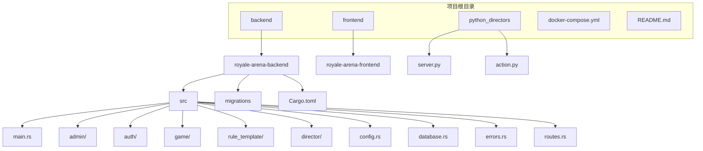
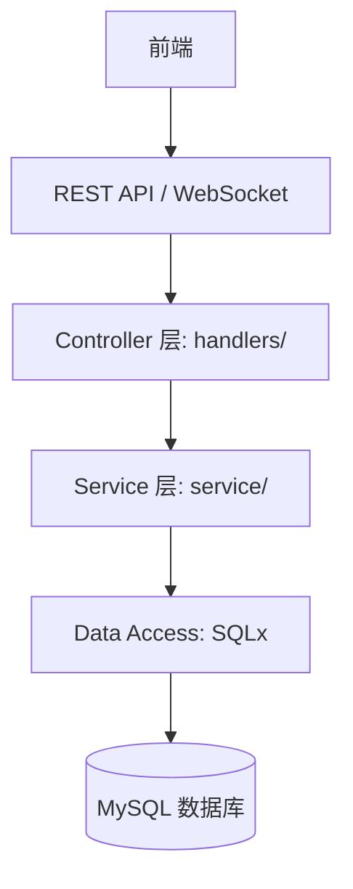
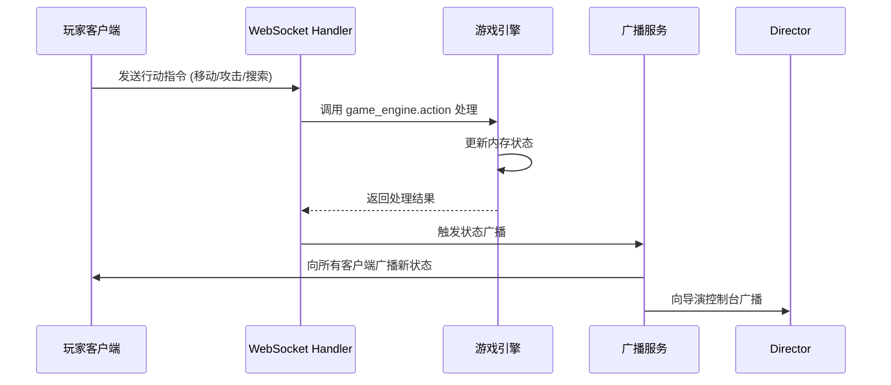
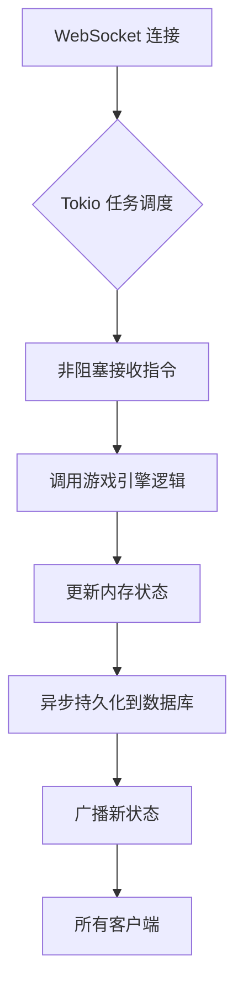
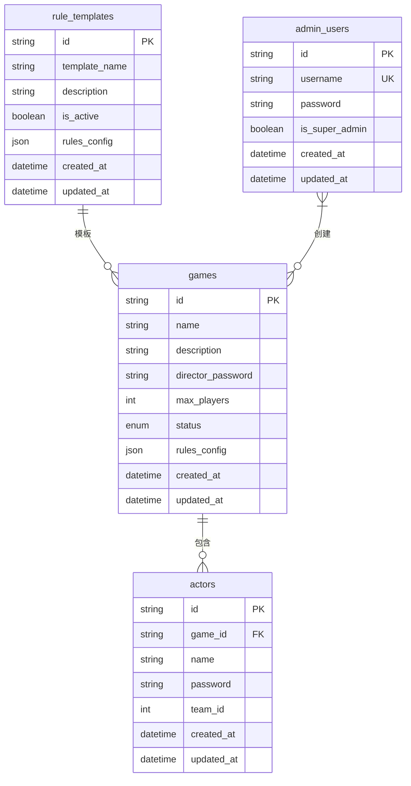
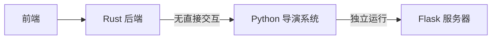

# 后端架构

<cite>
**本文档中引用的文件**  
- [main.rs](file://backend/royale-arena-backend/src/main.rs)
- [Cargo.toml](file://backend/royale-arena-backend/Cargo.toml)
- [README.md](file://README.md)
- [QWEN.md](file://backend/QWEN.md)
- [DIRECTORY.md](file://docs/backend/DIRECTORY.md)
- [schema.sql](file://backend/sql/schema.sql)
- [migrations/README.md](file://backend/royale-arena-backend/migrations/README.md)
- [routes.rs](file://backend/royale-arena-backend/src/routes.rs) - *新增admin模块路由*
- [admin/handlers.rs](file://backend/royale-arena-backend/src/admin/handlers.rs) - *新增管理员API处理程序*
- [admin/models.rs](file://backend/royale-arena-backend/src/admin/models.rs) - *新增管理员数据模型*
- [admin/service.rs](file://backend/royale-arena-backend/src/admin/service.rs) - *新增管理员服务逻辑*
- [auth/service.rs](file://backend/royale-arena-backend/src/auth/service.rs) - *认证服务集成*
- [20250825105153_init_schema.up.sql](file://backend/royale-arena-backend/migrations/20250825105153_init_schema.up.sql) - *数据库表结构定义*
- [20250826121055_add_game_status_hidden_deleted.up.sql](file://backend/royale-arena-backend/migrations/20250826121055_add_game_status_hidden_deleted.up.sql) - *更新游戏状态枚举*
- [game/models.rs](file://backend/royale-arena-backend/src/game/models.rs) - *游戏数据模型，包含GameStatus枚举*
- [game/handlers.rs](file://backend/royale-arena-backend/src/game/handlers.rs) - *游戏API处理程序*
- [game/service.rs](file://backend/royale-arena-backend/src/game/service.rs) - *游戏服务逻辑*
- [game/errors.rs](file://backend/royale-arena-backend/src/game/errors.rs) - *游戏错误定义*
- [rule_template/models.rs](file://backend/royale-arena-backend/src/rule_template/models.rs) - *规则模版数据模型*
- [rule_template/handlers.rs](file://backend/royale-arena-backend/src/rule_template/handlers.rs) - *规则模版API处理程序*
- [rule_template/service.rs](file://backend/royale-arena-backend/src/rule_template/service.rs) - *规则模版服务逻辑*
- [rule_template/errors.rs](file://backend/royale-arena-backend/src/rule_template/errors.rs) - *规则模版错误定义*
- [lib.rs](file://backend/royale-arena-backend/src/lib.rs) - *模块公共接口导出*
- [director.rs](file://backend/royale-arena-backend/src/director.rs) - *新增导演模块接口*
- [director/handlers.rs](file://backend/royale-arena-backend/src/director/handlers.rs) - *新增导演API处理程序*
- [director/service.rs](file://backend/royale-arena-backend/src/director/service.rs) - *新增导演服务逻辑*
- [director/models.rs](file://backend/royale-arena-backend/src/director/models.rs) - *新增演员数据模型*
- [main.rs](file://backend/royale-arena-backend/src/main.rs) - *集成导演服务*
- [routes.rs](file://backend/royale-arena-backend/src/routes.rs) - *新增导演接口路由*
- [websocket/service.rs](file://backend/royale-arena-backend/src/websocket/service.rs) - *重构WebSocket服务和异步处理*
- [websocket/game_connection_manager.rs](file://backend/royale-arena-backend/src/websocket/game_connection_manager.rs) - *重构连接管理器为全局多线程并发共享*
- [websocket/global_connection_manager.rs](file://backend/royale-arena-backend/src/websocket/global_connection_manager.rs) - *新增全局连接管理器*
- [websocket/broadcaster.rs](file://backend/royale-arena-backend/src/websocket/broadcaster.rs) - *重构广播系统和消息记录模型*
- [game/global_game_state_manager.rs](file://backend/royale-arena-backend/src/game/global_game_state_manager.rs) - *重构后端WebSocket服务和异步处理*
</cite>

## 更新摘要
**变更内容**  
- 新增了游戏状态枚举 `GameStatus` 的详细说明，包括新增的 `hidden` 和 `deleted` 状态
- 更新了游戏模块的API详情，增加了游戏状态筛选功能
- 扩展了数据库设计部分，详细描述了 `games` 表的 `status` 字段变更
- 更新了游戏服务逻辑，说明了 `get_games` 方法如何处理状态筛选
- 新增了游戏模块错误处理的详细信息
- 修正了RESTful API架构部分，准确反映游戏状态相关的API行为
- **新增导演模块文档**：详细描述了导演系统通过API管理演员的功能，包括批量增删演员和查询演员列表
- **新增导演接口路由**：在 `routes.rs` 中添加了 `/game/{game_id}/players` 路由，支持POST、GET、DELETE操作
- **集成导演服务**：在 `main.rs` 中初始化 `DirectorService` 并注入应用状态
- **重构WebSocket连接管理**：将原有的 `ConnectionManager` 重命名为 `GameConnectionManager`，并引入新的 `GlobalConnectionManager` 来管理所有游戏的连接管理器实例
- **解决WebSocket死锁问题**：优化了连接管理器的同步机制，使用 `DashMap` 实现高效的并发访问
- **重构WebSocket消息格式**：分离了导演和玩家的消息生成逻辑，增强了隐私保护机制
- **重构广播系统**：创建了独立的 `MessageBroadcaster` 组件，负责向玩家和导演广播游戏状态更新
- **增强游戏状态管理**：`GlobalGameStateManager` 现在与REST API服务完全分离，专门负责内存中的游戏状态管理

**更新来源**  
- [7576a7ad03eda47a7fc32b7e32115b0fb4db1aab](https://github.com/royale-arena/commit/7576a7ad03eda47a7fc32b7e32115b0fb4db1aab): 前端实现首页、管理员登录页面，api简单交互验证
- [893f21398ccb7ddb65bdc80632754363d0c46df2](https://github.com/royale-arena/commit/893f21398ccb7ddb65bdc80632754363d0c46df2): rule-template-api模块编写测试通过
- [7957623bd2037458ef92d701c08364cf34c558b3](https://github.com/royale-arena/commit/7957623bd2037458ef92d701c08364cf34c558b3): admin模块编写测试通过，添加路由及其他基础内容
- [60e4635bfd166d539e4f2524ba6c3fa7253cddc7](https://github.com/royale-arena/commit/60e4635bfd166d539e4f2524ba6c3fa7253cddc7): 实现导演增加、查询、删除演员后端接口
- [94c5f7d3103e012dfd8a1d7c382fef8674400365](https://github.com/royale-arena/commit/94c5f7d3103e012dfd8a1d7c382fef8674400365): 搭建前端演员操作台框架
- [39eadf1743670536f251f7be694903112c7a5dcf](https://github.com/royale-arena/commit/39eadf1743670536f251f7be694903112c7a5dcf): 解决ws连接时产生的死锁 优化部分输出
- [17db8e9d512ae0b05621963de1eaba49a6b3dc8b](https://github.com/royale-arena/commit/17db8e9d512ae0b05621963de1eaba49a6b3dc8b): 重构前端ws发射器，编写简单导演界面，修正后端一些异步问题
- [b7539b0ede03d8265196eccb5685009809379a6c](https://github.com/royale-arena/commit/b7539b0ede03d8265196eccb5685009809379a6c): 初步构建前端导演控制台界面，尝试ws交互；重构后台ws返回消息格式
- [ac295dd5225a06f0e06765ab5fc2431177b727f6](https://github.com/royale-arena/commit/ac295dd5225a06f0e06765ab5fc2431177b727f6): 实现导演迁移游戏状态、本地存储，异步结束连接；重构connection管理器到全局多线程并发共享；重构广播字段内容
- [9813b053e4dc0f4f8bf114a49f5fbf044900c983](https://github.com/royale-arena/commit/9813b053e4dc0f4f8bf114a49f5fbf044900c983): 重构广播系统和广播消息记录模型，重构日志记录表服务，重构基础游戏身份验证
- [8323289307302da1a977c7ecac3bcd931916f0c7](https://github.com/royale-arena/commit/8323289307302da1a977c7ecac3bcd931916f0c7): ws后台实现暂存2 分离导演和玩家行为逻辑 改写读写锁

## 目录
1. [项目结构](#项目结构)  
2. [技术栈与核心组件](#技术栈与核心组件)  
3. [模块划分与业务逻辑分层](#模块划分与业务逻辑分层)  
4. [RESTful API 与 WebSocket 架构](#restful-api-与-websocket-架构)  
5. [Tokio 异步运行时与高并发处理](#tokio-异步运行时与高并发处理)  
6. [数据库交互与数据存储策略](#数据库交互与数据存储策略)  
7. [Python 导演系统集成](#python-导演系统集成)
8. [导演模块API详情](#导演模块api详情)

## 项目结构

Royale Arena 项目的整体结构清晰，采用前后端分离与独立服务模块的设计。后端基于 Rust 构建，前端使用 Vue 3 + TypeScript，另有 Python 编写的导演系统用于辅助控制。



**图示来源**  
- [README.md](file://README.md)
- [DIRECTORY.md](file://docs/backend/DIRECTORY.md)

## 技术栈与核心组件

### 编程语言与框架
- **编程语言**：Rust（2024 版本）
- **Web 框架**：Axum（支持 REST API 与 WebSocket）
- **异步运行时**：Tokio（启用 full 特性）
- **数据库访问**：SQLx（MySQL 驱动）
- **序列化**：Serde（支持 JSON 与结构体转换）
- **日志系统**：Tracing + Tower-HTTP 的 TraceLayer
- **环境变量**：Dotenvy

### 核心依赖说明
| 依赖库 | 用途 |
|--------|------|
| axum | 提供 Web 路由与中间件支持 |
| tokio | 异步任务调度与 I/O 操作 |
| sqlx | 异步数据库操作，支持编译时 SQL 验证 |
| serde | 数据序列化与反序列化 |
| jsonwebtoken | JWT 认证支持 |
| bcrypt | 密码哈希加密 |
| uuid | UUID 生成 |
| chrono | 时间处理 |

**Section sources**
- [Cargo.toml](file://backend/royale-arena-backend/Cargo.toml)
- [QWEN.md](file://backend/QWEN.md)

## 模块划分与业务逻辑分层

根据代码库的实际结构，后端采用清晰的模块化设计，遵循现代 Rust 模块系统（无 `mod.rs`，使用同名 `.rs` 文件）。

### 源码目录结构
```
src/
├── admin/                  # 管理员模块
│   ├── handlers.rs         # 管理员API处理程序
│   ├── models.rs           # 管理员数据模型
│   └── service.rs          # 管理员服务逻辑
├── auth/                   # 认证模块
│   ├── jwt.rs              # JWT令牌管理
│   ├── middleware.rs       # 认证中间件
│   └── service.rs          # 认证服务
├── bin/                    # 二进制工具
│   └── init_admin_users.rs # 管理员用户初始化
├── game/                   # 游戏模块
│   ├── errors.rs           # 游戏错误定义
│   ├── handlers.rs         # 游戏API处理程序
│   ├── models.rs           # 游戏数据模型
│   └── service.rs          # 游戏服务逻辑
├── rule_template/          # 规则模版模块
│   ├── errors.rs           # 规则模版错误定义
│   ├── handlers.rs         # 规则模版API处理程序
│   ├── models.rs           # 规则模版数据模型
│   └── service.rs          # 规则模版服务逻辑
├── director/               # 导演模块
│   ├── errors.rs           # 导演错误定义
│   ├── handlers.rs         # 导演API处理程序
│   ├── models.rs           # 演员数据模型
│   └── service.rs          # 导演服务逻辑
├── websocket/              # WebSocket模块
│   ├── broadcaster.rs      # 消息广播器
│   ├── game_connection_manager.rs # 游戏连接管理器
│   ├── global_connection_manager.rs # 全局连接管理器
│   ├── message_formatter.rs # 消息格式化器
│   ├── models.rs           # WebSocket相关模型
│   └── service.rs          # WebSocket服务
├── admin.rs                # 管理员模块公共接口
├── auth.rs                 # 认证模块公共接口
├── config.rs               # 配置管理
├── database.rs             # 数据库连接池
├── errors.rs               # 自定义错误类型
├── game.rs                 # 游戏模块公共接口
├── lib.rs                  # 库入口
├── main.rs                 # 应用入口
└── routes.rs               # 路由配置
```

### 业务逻辑分层


**Section sources**
- [QWEN.md](file://backend/QWEN.md)
- [src/admin.rs](file://backend/royale-arena-backend/src/admin.rs)
- [src/auth.rs](file://backend/royale-arena-backend/src/auth.rs)
- [src/game.rs](file://backend/royale-arena-backend/src/game.rs)
- [src/rule_template.rs](file://backend/royale-arena-backend/src/rule_template.rs)
- [src/director.rs](file://backend/royale-arena-backend/src/director.rs)
- [src/lib.rs](file://backend/royale-arena-backend/src/lib.rs)

## RESTful API 与 WebSocket 架构

### 系统通信逻辑
根据 `QWEN.md` 文档，系统采用职责分离设计：
1. **REST API**：仅处理认证与状态查询。
2. **WebSocket**：仅处理实时操作指令。

这种设计确保了高实时性与低延迟。

### API 接口分类
| 模块 | 功能 |
|------|------|
| `/api/admin/login` | 管理员登录认证 |
| `/api/admin/users` | 管理员账户管理（仅超级管理员） |
| `/api/admin/rule-templates` | 规则模版创建与更新（需管理员权限） |
| `/api/rule-templates` | 规则模版查询（公开接口） |
| `/api/games` | 游戏列表查询（公开接口） |
| `/api/admin/games` | 游戏创建与管理（需管理员权限） |
| `/api/game/{game_id}/players` | 演员管理（导演密码认证） |
| `/health` | 健康检查 |

### 管理员模块API详情
#### 认证接口
- **POST /api/admin/login**: 管理员登录，返回JWT令牌
- **GET /health**: 健康检查，返回服务状态

#### 管理员账户管理接口（需超级管理员权限）
- **GET /api/admin/users**: 获取管理员列表
- **POST /api/admin/users**: 创建管理员账户
- **PUT /api/admin/users/:user_id**: 更新管理员账户
- **DELETE /api/admin/users/:user_id**: 删除管理员账户

### 游戏模块API详情
#### 游戏管理接口（需管理员权限）
- **POST /api/admin/games**: 创建新游戏
- **PUT /api/admin/games/{game_id}**: 更新游戏信息
- **DELETE /api/admin/games/{game_id}**: 删除游戏

#### 游戏查询接口（公开接口）
- **GET /api/games**: 获取游戏列表，支持以下查询参数：
  - `filter`: 按游戏状态筛选，可选值包括：
    - `all`: 所有活动游戏（等待中、进行中、已暂停、已结束）
    - `active`: 活动中游戏（等待中、进行中、已暂停）
    - `waiting`: 等待中游戏
    - `running`: 进行中游戏
    - `ended`: 已结束游戏
    - `hidden`: 已隐藏游戏（管理员可见）
    - `deleted`: 已删除游戏（管理员可见）
- **GET /api/games/{game_id}**: 获取指定游戏的详细信息（包含规则信息）

### 规则模版模块API详情
#### 规则模版管理接口（需管理员权限）
- **POST /api/admin/rule-templates**: 创建规则模版
- **PUT /api/admin/rule-templates/{id}**: 更新规则模版

#### 规则模版查询接口（公开接口）
- **GET /api/rule-templates**: 获取规则模版列表，支持以下查询参数：
  - `id`: 按ID精确查询
  - `is_active`: 按激活状态筛选
  - `search`: 按模版名称模糊搜索

### 导演模块API详情
#### 演员管理接口（需导演密码认证）
- **POST /api/game/{game_id}/players**: 批量添加演员
  - 请求参数：`password`（导演密码，通过查询参数传递）
  - 请求体：包含演员列表的JSON数组，每个演员包含名称、密码和可选队伍ID
  - 支持批量操作，返回成功与失败列表
- **GET /api/game/{game_id}/players**: 查询演员列表
  - 请求参数：`password`（导演密码，通过查询参数传递）
  - 返回当前游戏的所有演员信息
- **DELETE /api/game/{game_id}/players**: 批量删除演员
  - 请求参数：`password`（导演密码，通过查询参数传递）
  - 请求体：包含要删除的演员ID列表
  - 仅允许在游戏状态为 `waiting` 时执行删除操作

**Section sources**
- [routes.rs](file://backend/royale-arena-backend/src/routes.rs)
- [director/handlers.rs](file://backend/royale-arena-backend/src/director/handlers.rs)
- [director/service.rs](file://backend/royale-arena-backend/src/director/service.rs)
- [director/models.rs](file://backend/royale-arena-backend/src/director/models.rs)

### API请求与响应格式
#### 创建游戏请求
```json
{
  "name": "新游戏",
  "description": "这是一个新游戏",
  "director_password": "password123",
  "max_players": 50,
  "rule_template_id": "template-123"
}
```

#### 创建规则模版请求
```json
{
  "template_name": "经典模版",
  "description": "经典游戏规则",
  "is_active": true,
  "rules_config": {
    "game_flow": {
      "day_duration": 300,
      "night_duration": 180
    }
  }
}
```

#### 批量添加演员请求
```json
{
  "players": [
    {
      "player_name": "演员1",
      "password": "abc123",
      "team_id": 1
    },
    {
      "player_name": "演员2",
      "password": "def456",
      "team_id": 2
    }
  ]
}
```

#### 批量删除演员请求
```json
{
  "player_ids": ["uuid1", "uuid2", "uuid3"]
}
```

#### API响应统一格式
```json
{
  "success": true,
  "data": {
    // 具体数据
  }
}
```

#### 错误响应格式
```json
{
  "success": false,
  "error": "错误信息"
}
```

### WebSocket 消息流


**Section sources**
- [routes.rs](file://backend/royale-arena-backend/src/routes.rs)
- [admin/handlers.rs](file://backend/royale-arena-backend/src/admin/handlers.rs)
- [auth/middleware.rs](file://backend/royale-arena-backend/src/auth/middleware.rs)
- [game/handlers.rs](file://backend/royale-arena-backend/src/game/handlers.rs)
- [game/models.rs](file://backend/royale-arena-backend/src/game/models.rs)
- [rule_template/handlers.rs](file://backend/royale-arena-backend/src/rule_template/handlers.rs)
- [rule_template/models.rs](file://backend/royale-arena-backend/src/rule_template/models.rs)
- [director/handlers.rs](file://backend/royale-arena-backend/src/director/handlers.rs)
- [director/models.rs](file://backend/royale-arena-backend/src/director/models.rs)

## Tokio 异步运行时与高并发处理

### Tokio 配置
在 `Cargo.toml` 中启用了 `tokio` 的 `full` 特性，包含：
- 多线程运行时（rt-multi-thread）
- 网络 I/O（net）
- 文件系统（fs）
- 定时器（time）
- 同步原语（sync）

这使得后端能够高效处理大量并发连接。

### 高并发游戏状态更新机制
1. **异步任务调度**：每个 WebSocket 连接作为一个异步任务运行在 Tokio 运行时中。
2. **非阻塞 I/O**：数据库操作通过 `sqlx` 异步执行，不阻塞主线程。
3. **内存状态管理**：游戏运行时数据（玩家状态、位置、道具）存储在内存中，避免频繁数据库读写。
4. **批量持久化**：行动结束后，将内存状态批量写入数据库或文件。



**Section sources**
- [Cargo.toml](file://backend/royale-arena-backend/Cargo.toml)
- [QWEN.md](file://backend/QWEN.md)

## 数据库交互与数据存储策略

### 数据库设计
使用 MySQL 存储静态数据，通过 `20250825105153_init_schema.up.sql` 和 `20250826121055_add_game_status_hidden_deleted.up.sql` 定义以下表结构：

#### admin_users 表结构
| 字段名 | 类型 | 约束 | 说明 |
|--------|------|------|------|
| id | VARCHAR(36) | PRIMARY KEY | 管理员唯一标识符(UUID) |
| username | VARCHAR(50) | NOT NULL, UNIQUE | 管理员用户名 |
| password | VARCHAR(255) | NOT NULL | 管理员密码(密文存储) |
| is_super_admin | BOOLEAN | NOT NULL, DEFAULT FALSE | 是否为超级管理员 |
| created_at | TIMESTAMP | DEFAULT CURRENT_TIMESTAMP | 创建时间 |
| updated_at | TIMESTAMP | DEFAULT CURRENT_TIMESTAMP ON UPDATE CURRENT_TIMESTAMP | 更新时间 |

#### rule_templates 表结构
| 字段名 | 类型 | 约束 | 说明 |
|--------|------|------|------|
| id | VARCHAR(36) | PRIMARY KEY | 模版唯一标识符(UUID) |
| template_name | VARCHAR(100) | NOT NULL | 模版名称 |
| description | TEXT | NULL | 模版描述 |
| is_active | BOOLEAN | NOT NULL, DEFAULT TRUE | 模版是否激活 |
| rules_config | JSON | NOT NULL | 完整的游戏规则配置(JSON格式) |
| created_at | TIMESTAMP | DEFAULT CURRENT_TIMESTAMP | 模版创建时间 |
| updated_at | TIMESTAMP | DEFAULT CURRENT_TIMESTAMP ON UPDATE CURRENT_TIMESTAMP | 模版更新时间 |

#### games 表结构
| 字段名 | 类型 | 约束 | 说明 |
|--------|------|------|------|
| id | VARCHAR(36) | PRIMARY KEY | 游戏唯一标识符(UUID) |
| name | VARCHAR(100) | NOT NULL | 游戏名称 |
| description | TEXT | NULL | 游戏描述 |
| director_password | VARCHAR(50) | NOT NULL | 导演密码 |
| max_players | INT | NOT NULL, DEFAULT 100 | 最大玩家数量 |
| status | ENUM('waiting', 'running', 'paused', 'ended', 'hidden', 'deleted') | NOT NULL, DEFAULT 'waiting' | 游戏状态 |
| rules_config | JSON | NOT NULL | 完整的游戏规则配置(JSON格式) |
| created_at | TIMESTAMP | DEFAULT CURRENT_TIMESTAMP | 创建时间 |
| updated_at | TIMESTAMP | DEFAULT CURRENT_TIMESTAMP ON UPDATE CURRENT_TIMESTAMP | 更新时间 |

#### actors 表结构
| 字段名 | 类型 | 约束 | 说明 |
|--------|------|------|------|
| id | VARCHAR(36) | PRIMARY KEY | 演员唯一标识符(UUID) |
| game_id | VARCHAR(36) | FOREIGN KEY | 所属游戏ID |
| name | VARCHAR(50) | NOT NULL | 演员名称 |
| password | VARCHAR(50) | NOT NULL | 演员密码 |
| team_id | INT | NOT NULL, DEFAULT 0 | 队伍ID |
| created_at | TIMESTAMP | DEFAULT CURRENT_TIMESTAMP | 创建时间 |
| updated_at | TIMESTAMP | DEFAULT CURRENT_TIMESTAMP ON UPDATE CURRENT_TIMESTAMP | 更新时间 |



**Diagram sources**
- [20250825105153_init_schema.up.sql](file://backend/royale-arena-backend/migrations/20250825105153_init_schema.up.sql)
- [20250826121055_add_game_status_hidden_deleted.up.sql](file://backend/royale-arena-backend/migrations/20250826121055_add_game_status_hidden_deleted.up.sql)
- [game/models.rs](file://backend/royale-arena-backend/src/game/models.rs)
- [rule_template/models.rs](file://backend/royale-arena-backend/src/rule_template/models.rs)
- [director/models.rs](file://backend/royale-arena-backend/src/director/models.rs)

### 数据存储策略
| 数据类型 | 存储位置 | 说明 |
|---------|--------|------|
| 静态数据 | MySQL | 玩家账户、游戏信息、规则模板、管理员账户 |
| 运行时数据 | 内存 | 玩家实时状态、位置、道具、游戏进度 |
| 日志数据 | MySQL | 游戏日志、击杀记录 |
| 持久化 | 文件 | 行动结束后将内存状态写入文件 |

**Section sources**
- [20250825105153_init_schema.up.sql](file://backend/royale-arena-backend/migrations/20250825105153_init_schema.up.sql)
- [20250826121055_add_game_status_hidden_deleted.up.sql](file://backend/royale-arena-backend/migrations/20250826121055_add_game_status_hidden_deleted.up.sql)
- [QWEN.md](file://backend/QWEN.md)
- [migrations/README.md](file://backend/royale-arena-backend/migrations/README.md)

## Python 导演系统集成

### 系统关系
前端与后端通过 REST API 和 WebSocket 交互，而 Python 导演系统是独立的旧版系统，**不与新后端直接集成**。



### Python 系统功能
- 使用 Flask 构建 Web 服务。
- 通过 `/api/login` 和 `/api/view/<key>` 处理登录与视图。
- 支持导演通过密码控制游戏（移动、搜索、攻击等）。
- 使用内存存储角色、地点、道具状态。

### 与新系统的对比
| 功能 | Python 系统 | Rust 后端 |
|------|------------|----------|
| 技术栈 | Python + Flask | Rust + Axum |
| 数据存储 | 内存 | MySQL + 内存 |
| 实时通信 | HTTP 轮询 | WebSocket |
| 可扩展性 | 低 | 高（异步、类型安全） |
| 安全性 | 明文密码 | 支持 JWT 与 bcrypt |

**Section sources**
- [python_directors/server.py](file://python_directors/server.py)
- [python_directors/action.py](file://python_directors/action.py)
- [frontend/QWEN.md](file://frontend/QWEN.md)

## 导演模块API详情
### 接口设计
导演模块提供基于导演密码认证的演员管理接口，无需JWT令牌，通过游戏ID和导演密码进行访问控制。

### 认证机制
- 所有导演接口均通过 `director_password` 查询参数进行认证
- 在 `DirectorService::verify_director_password` 中验证密码正确性
- 仅允许访问指定 `game_id` 对应的资源

### 批量添加演员
- **验证流程**：
  1. 验证导演密码
  2. 检查演员名称是否重复
  3. 验证单个演员数据（名称非空、密码格式等）
- **批量处理**：支持部分成功，返回成功与失败列表
- **数据验证**：
  - 演员名称：1-50字符
  - 密码：6-8位字母数字组合
  - 队伍ID：非负整数，可选

### 批量删除演员
- **前置检查**：
  1. 验证导演密码
  2. 检查游戏状态是否为 `waiting`（未开始）
- **删除限制**：游戏开始后禁止删除演员
- **数据一致性**：确保删除的演员属于当前游戏

### 查询演员列表
- 返回指定游戏的所有演员信息
- 包含ID、名称、密码、队伍ID等基本信息
- 按创建时间升序排列

**Section sources**
- [director/handlers.rs](file://backend/royale-arena-backend/src/director/handlers.rs)
- [director/service.rs](file://backend/royale-arena-backend/src/director/service.rs)
- [director/models.rs](file://backend/royale-arena-backend/src/director/models.rs)
- [main.rs](file://backend/royale-arena-backend/src/main.rs)
- [routes.rs](file://backend/royale-arena-backend/src/routes.rs)