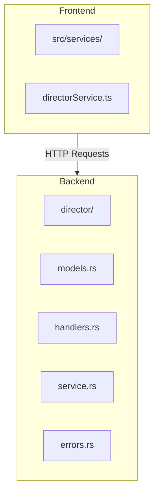
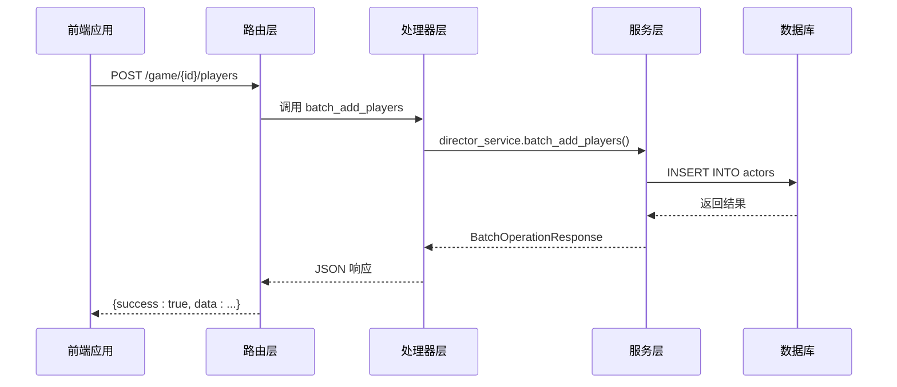
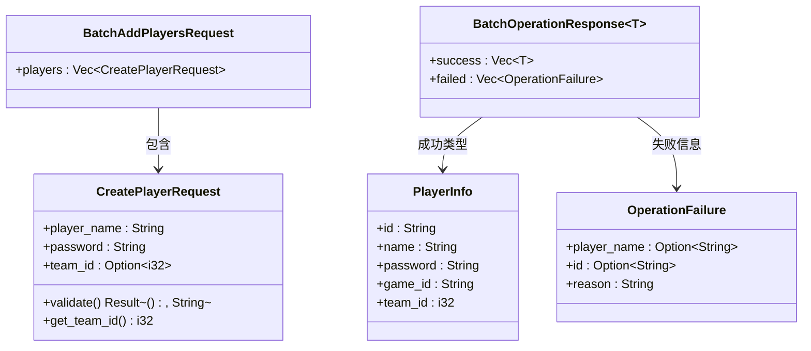
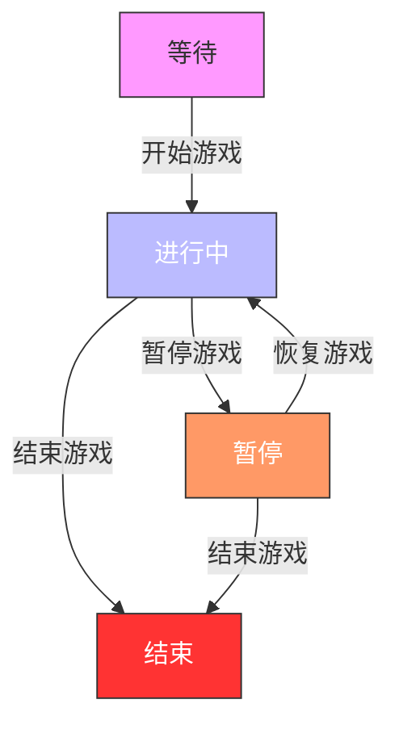
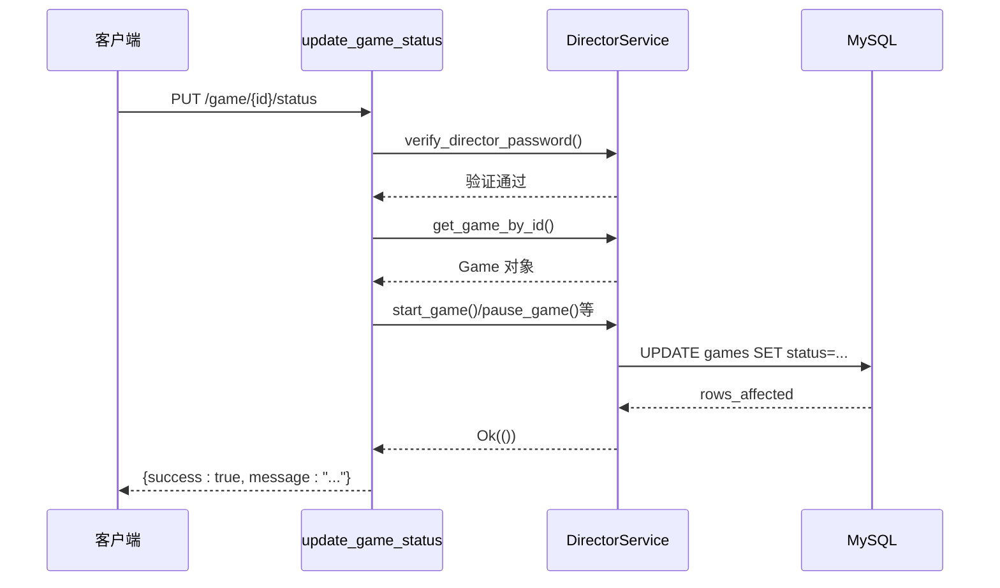
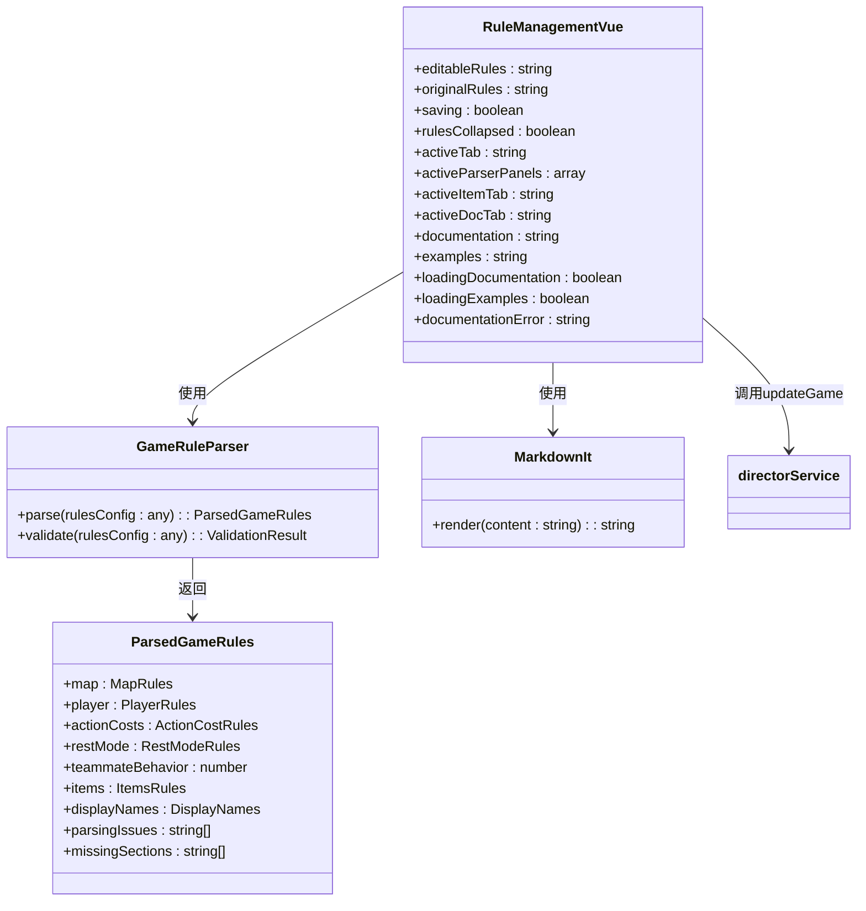
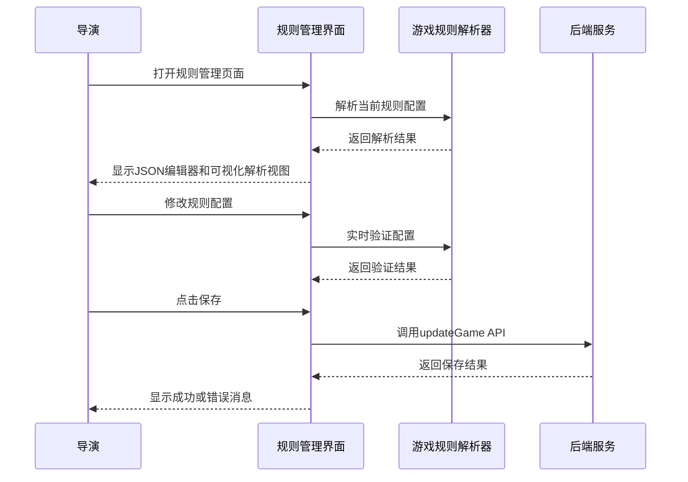
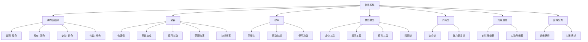
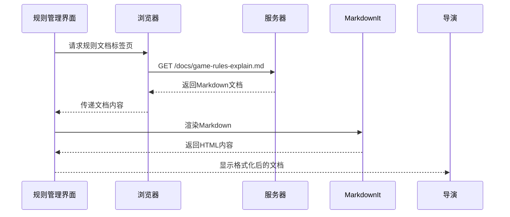
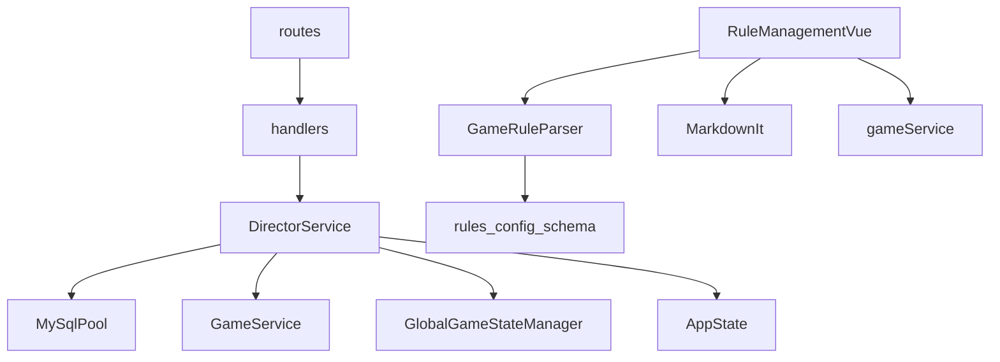

# 导演控制台功能

<cite>
**本文档中引用的文件**  
- [handlers.rs](file://backend/src/director/handlers.rs)
- [service.rs](file://backend/src/director/service.rs)
- [models.rs](file://backend/src/director/models.rs)
- [errors.rs](file://backend/src/director/errors.rs)
- [routes.rs](file://backend/src/routes.rs)
- [directorService.ts](file://frontend/src/services/directorService.ts)
- [RuleManagement.vue](file://frontend/src/views/director/management/RuleManagement.vue) - *规则管理界面，最近更新*
- [game-rules-examples.md](file://frontend/public/docs/game-rules-examples.md) - *游戏规则配置示例文档*
- [game-rules-explain.md](file://frontend/public/docs/game-rules-explain.md) - *游戏规则配置说明文档*
- [gameRuleParser.ts](file://frontend/src/utils/gameRuleParser.ts) - *游戏规则解析器工具*
</cite>

## 更新摘要
**变更内容**   
- 更新了规则管理功能的相关文档，以反映最新的用户界面和功能变更
- 新增了关于规则管理组件、物品系统显示优化和规则文档集成的详细说明
- 扩展了架构概览部分，增加了前端组件与后端服务的交互流程
- 更新了依赖分析，包含了新的前端工具和服务
- 修订了故障排除指南，增加了规则配置相关的常见问题

### 目录
1. [简介](#简介)
2. [项目结构](#项目结构)
3. [核心组件](#核心组件)
4. [架构概览](#架构概览)
5. [详细组件分析](#详细组件分析)
6. [依赖分析](#依赖分析)
7. [性能考虑](#性能考虑)
8. [故障排除指南](#故障排除指南)
9. [结论](#结论)

## 简介
导演控制台是 Royale Arena 游戏系统中的关键管理模块，专为游戏主持人（导演）设计，用于全面管理游戏生命周期和参与者。该功能允许导演创建、启动、暂停、恢复和结束游戏，并对演员进行批量增删操作。此外，导演还可以手动存盘游戏状态、查看存档列表以及验证游戏身份。整个系统通过 RESTful API 与前端交互，确保安全性和可扩展性。

## 项目结构
导演控制台功能主要分布在后端 `backend/src/director` 模块和前端 `frontend/src/services` 中。后端采用 Rust 编写，基于 Axum Web 框架实现 REST 接口；前端使用 TypeScript 封装服务调用逻辑，便于 Vue.js 应用集成。



**图示来源**
- [handlers.rs](file://backend/src/director/handlers.rs)
- [directorService.ts](file://frontend/src/services/directorService.ts)

**本节来源**
- [handlers.rs](file://backend/src/director/handlers.rs)
- [directorService.ts](file://frontend/src/services/directorService.ts)

## 核心组件
导演控制台的核心功能包括：批量添加/删除演员、获取演员列表、更新游戏状态、手动存盘、查询存档文件等。所有操作均需提供有效的导演密码进行身份验证，确保安全性。系统在执行关键操作前会检查游戏当前状态，防止非法状态转换。

**本节来源**
- [service.rs](file://backend/src/director/service.rs)
- [models.rs](file://backend/src/director/models.rs)

## 架构概览
导演控制台采用分层架构设计，包含路由层、处理器层、服务层和数据模型层。请求首先由 `routes.rs` 注册并转发至对应的处理器函数，处理器调用 `DirectorService` 执行业务逻辑，最终通过 SQL 查询与数据库交互。



**图示来源**
- [routes.rs](file://backend/src/routes.rs)
- [handlers.rs](file://backend/src/director/handlers.rs)
- [service.rs](file://backend/src/director/service.rs)

## 详细组件分析

### 批量操作分析
导演控制台支持批量添加和删除演员，所有操作均以事务方式处理，保证部分成功时仍能返回详细结果。

#### 类图展示


**图示来源**
- [models.rs](file://backend/src/director/models.rs)

**本节来源**
- [models.rs](file://backend/src/director/models.rs)
- [service.rs](file://backend/src/director/service.rs)

### 游戏状态管理分析
导演可以控制游戏的运行状态，包括开始、暂停、恢复和结束游戏。状态变更受严格约束，避免非法转换。

#### 状态转换流程图


**图示来源**
- [service.rs](file://backend/src/director/service.rs)

#### 状态更新序列图


**图示来源**
- [handlers.rs](file://backend/src/director/handlers.rs)
- [service.rs](file://backend/src/director/service.rs)

**本节来源**
- [handlers.rs](file://backend/src/director/handlers.rs)
- [service.rs](file://backend/src/director/service.rs)

### 规则管理功能分析
导演现在可以通过专门的规则管理界面来编辑和维护游戏规则配置。该功能提供了JSON编辑器和可视化解析器两种模式，帮助导演更好地理解和修改复杂的规则配置。

#### 规则管理界面组件图


**图示来源**
- [RuleManagement.vue](file://frontend/src/views/director/management/RuleManagement.vue)
- [gameRuleParser.ts](file://frontend/src/utils/gameRuleParser.ts)

#### 规则管理交互流程


**图示来源**
- [RuleManagement.vue](file://frontend/src/views/director/management/RuleManagement.vue)
- [gameService.ts](file://frontend/src/services/gameService.ts)

**本节来源**
- [RuleManagement.vue](file://frontend/src/views/director/management/RuleManagement.vue)
- [gameRuleParser.ts](file://frontend/src/utils/gameRuleParser.ts)
- [gameService.ts](file://frontend/src/services/gameService.ts)

### 物品系统显示优化
为了提升用户体验，规则管理界面现在能够更清晰地展示物品系统的配置信息，包括稀有度级别、武器、护甲和其他道具的详细属性。

#### 物品系统可视化展示


**图示来源**
- [RuleManagement.vue](file://frontend/src/views/director/management/RuleManagement.vue)
- [game-rules-explain.md](file://frontend/public/docs/game-rules-explain.md)

**本节来源**
- [RuleManagement.vue](file://frontend/src/views/director/management/RuleManagement.vue)
- [game-rules-explain.md](file://frontend/public/docs/game-rules-explain.md)

### 规则文档集成
规则管理界面集成了详细的规则文档和使用示例，帮助导演更好地理解各项配置的含义和用法。

#### 文档加载流程


**图示来源**
- [RuleManagement.vue](file://frontend/src/views/director/management/RuleManagement.vue)
- [game-rules-explain.md](file://frontend/public/docs/game-rules-explain.md)

**本节来源**
- [RuleManagement.vue](file://frontend/src/views/director/management/RuleManagement.vue)
- [game-rules-explain.md](file://frontend/public/docs/game-rules-explain.md)

### 错误处理机制
系统定义了详细的错误类型，涵盖游戏不存在、密码错误、状态非法转换等多种场景，并通过 HTTP 状态码正确映射。

```mermaid
classDiagram
class DirectorError {
+GameNotFound
+InvalidDirectorPassword
+PlayerNameExists{name}
+InvalidGameStateTransition
+DatabaseError{sqlx : : Error}
+OtherError{message}
}
DirectorError <|-- ValidationError
DirectorError <|-- DatabaseError
class ValidationError {
+message : String
}
class DatabaseError {
+source : sqlx : : Error
}
```

**图示来源**
- [errors.rs](file://backend/src/director/errors.rs)

**本节来源**
- [errors.rs](file://backend/src/director/errors.rs)

## 依赖分析
导演模块依赖于数据库连接池、游戏服务、全局游戏状态管理器等多个核心组件。其接口设计独立于 JWT 认证体系，使用专用的导演密码验证机制。前端规则管理功能还依赖于游戏规则解析器和Markdown渲染器等工具。



**图示来源**
- [service.rs](file://backend/src/director/service.rs)
- [routes.rs](file://backend/src/routes.rs)
- [RuleManagement.vue](file://frontend/src/views/director/management/RuleManagement.vue)
- [gameRuleParser.ts](file://frontend/src/utils/gameRuleParser.ts)

**本节来源**
- [service.rs](file://backend/src/director/service.rs)
- [routes.rs](file://backend/src/routes.rs)
- [RuleManagement.vue](file://frontend/src/views/director/management/RuleManagement.vue)
- [gameRuleParser.ts](file://frontend/src/utils/gameRuleParser.ts)

## 性能考虑
- 所有数据库操作使用异步 SQLX 执行，避免阻塞主线程。
- 批量操作采用逐条处理而非事务回滚策略，确保即使部分失败也能保留成功记录。
- 存盘操作由独立的任务队列处理，不影响主请求响应速度。
- 内存中维护游戏状态副本，减少频繁磁盘 I/O。
- 规则管理界面的JSON解析和验证在客户端完成，减轻服务器负担。
- Markdown文档采用懒加载策略，仅在用户访问相应标签页时才加载。

## 故障排除指南
以下是一些常见问题及其解决方案：

| 问题现象 | 可能原因 | 解决方案 |
|--------|--------|--------|
| 添加演员失败 | 密码格式不合法 | 确保密码为6-8位字母数字组合 |
| 批量操作部分失败 | 用户名或密码重复 | 检查输入数据是否与现有用户冲突 |
| 无法暂停游戏 | 当前状态非“进行中” | 确认游戏处于运行状态 |
| 存档文件未生成 | 磁盘空间不足或权限问题 | 检查服务器存储情况 |
| 接口返回401 | 导演密码错误 | 核对密码是否正确 |
| 规则保存失败 | JSON格式错误 | 检查JSON语法，确保所有括号匹配 |
| 规则配置无效果 | 未点击保存按钮 | 确认已点击"保存规则"按钮 |
| 文档加载失败 | 网络问题或文件不存在 | 检查服务器状态和文档路径 |
| 物品属性显示异常 | 配置字段名称错误 | 核对配置中的字段名称是否正确 |

**本节来源**
- [service.rs](file://backend/src/director/service.rs)
- [models.rs](file://backend/src/director/models.rs)
- [RuleManagement.vue](file://frontend/src/views/director/management/RuleManagement.vue)

## 结论
导演控制台功能完整且安全，提供了对游戏全生命周期的精细控制能力。前后端分离的设计使得接口清晰、易于维护。新增的规则管理功能极大地提升了导演配置游戏规则的效率和准确性。未来可进一步优化批量操作的并发性能，并增加操作日志审计功能以提升可追溯性。