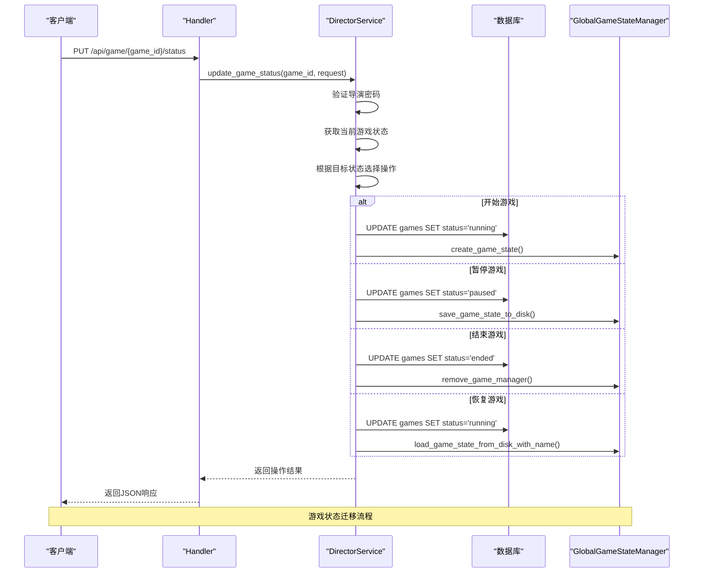
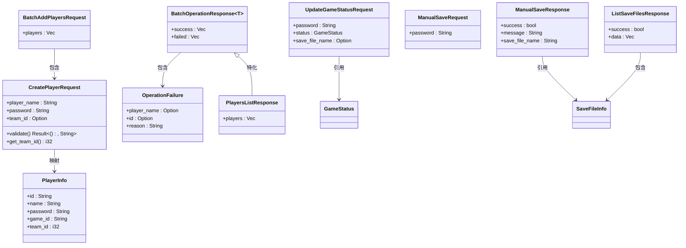
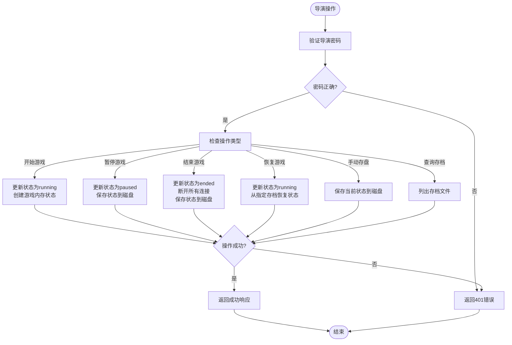
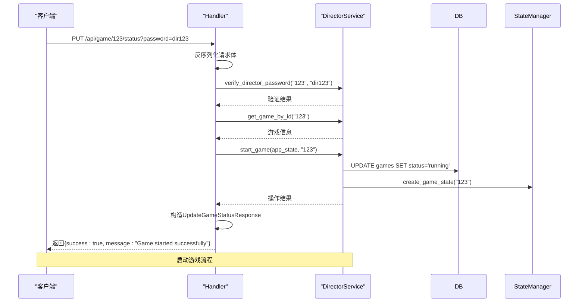
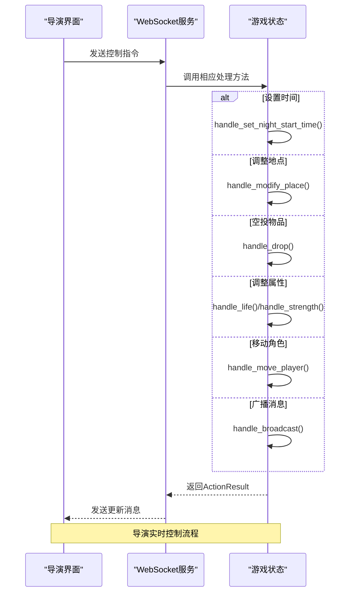
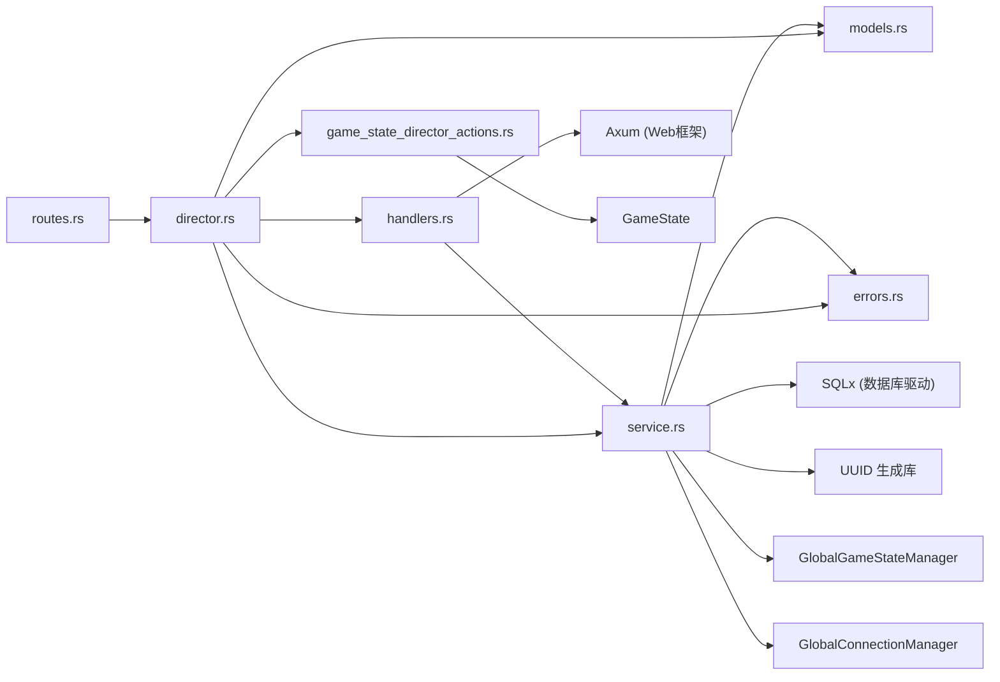

# 导演管理API

<cite>
**本文档引用的文件**  
- [models.rs](file://backend/src/director/models.rs) - *更新了游戏状态和存盘功能*
- [service.rs](file://backend/src/director/service.rs) - *重构了导演服务，支持状态迁移和本地存储*
- [handlers.rs](file://backend/src/director/handlers.rs) - *新增手动存盘和状态更新接口*
- [errors.rs](file://backend/src/director/errors.rs) - *更新了错误类型以支持新功能*
- [routes.rs](file://backend/src/routes.rs) - *更新了路由架构*
- [director.rs](file://backend/src/director.rs) - *更新了模块入口*
- [game_state_director_actions.rs](file://backend/src/websocket/game_state_director_actions.rs) - *新增导演控制动作*
- [global_game_state_manager.rs](file://backend/src/game/global_game_state_manager.rs) - *实现游戏状态管理*
</cite>

## 更新摘要
**变更内容**   
- 将文档从基础演员管理扩展为全面的导演控制台系统
- 新增游戏状态管理、手动存盘、规则修改等高级功能
- 更新架构概览以反映WebSocket集成和全局状态管理
- 扩展故障排除指南以涵盖新的操作场景
- 增加导演控制动作的具体说明

## 目录
1. [简介](#简介)
2. [项目结构](#项目结构)
3. [核心组件](#核心组件)
4. [架构概览](#架构概览)
5. [详细组件分析](#详细组件分析)
6. [依赖分析](#依赖分析)
7. [性能考虑](#性能考虑)
8. [故障排除指南](#故障排除指南)
9. [结论](#结论)

## 简介
导演管理API是"Royale Arena"系统中的核心控制模块，现已从基础的演员管理系统升级为全面的导演控制台。该模块不仅提供对演员（Player）的批量管理能力，还支持游戏状态控制、手动存盘、实时干预等高级功能。

本API设计遵循RESTful原则，通过密码验证机制确保操作的安全性，并与WebSocket系统深度集成，实现导演对游戏进程的实时控制。新增的手动存盘和状态恢复功能确保了游戏状态的可靠持久化，而启动服务器时自动暂停所有游戏的设计则保障了状态可以正确恢复。

## 项目结构
导演管理模块位于`backend/src/director/`目录下，采用清晰的分层架构，包含四个核心文件：
- `models.rs`: 定义请求、响应及数据结构
- `service.rs`: 实现核心业务逻辑
- `handlers.rs`: 处理HTTP请求与响应
- `errors.rs`: 定义模块专用错误类型

此外，`director.rs`作为模块入口，对外导出所有公共接口。系统还通过`websocket/game_state_director_actions.rs`实现了导演对游戏状态的直接控制。

```mermaid
graph TB
subgraph "导演模块"
models["models.rs<br/>数据模型"]
service["service.rs<br/>业务逻辑"]
handlers["handlers.rs<br/>请求处理器"]
errors["errors.rs<br/>错误定义"]
end
handlers --> service : 调用
service --> models : 使用
handlers --> models : 使用
service --> errors : 返回错误
handlers --> errors : 返回错误
service --> game_state_manager["GlobalGameStateManager<br/>全局游戏状态管理器"]
service --> connection_manager["GlobalConnectionManager<br/>全局连接管理器"]
```

**图示来源**  
- [models.rs](file://backend/src/director/models.rs)
- [service.rs](file://backend/src/director/service.rs)
- [handlers.rs](file://backend/src/director/handlers.rs)
- [errors.rs](file://backend/src/director/errors.rs)
- [global_game_state_manager.rs](file://backend/src/game/global_game_state_manager.rs)
- [global_connection_manager.rs](file://backend/src/websocket/global_connection_manager.rs)

## 核心组件
导演管理API的核心功能已从简单的演员管理扩展为全面的游戏控制，主要包括：
- **批量添加/删除演员**：支持一次添加或移除多个演员
- **获取演员列表**：查询指定游戏下的所有演员信息
- **游戏状态管理**：支持开始、暂停、结束、恢复游戏
- **手动存盘**：允许导演在任意时刻保存游戏状态
- **状态恢复**：从指定存档文件恢复游戏状态
- **实时干预**：通过WebSocket直接修改游戏状态

所有操作均需提供有效的导演密码，并通过`DirectorService`进行业务逻辑处理，确保数据一致性与安全性。

**中文(中文)来源**  
- [models.rs](file://backend/src/director/models.rs#L1-L231)
- [service.rs](file://backend/src/director/service.rs#L1-L450)
- [handlers.rs](file://backend/src/director/handlers.rs#L1-L188)
- [game_state_director_actions.rs](file://backend/src/websocket/game_state_director_actions.rs#L1-L390)

## 架构概览
导演管理API采用典型的三层架构：处理层（Handlers）、服务层（Service）和数据层（Database）。HTTP请求由Axum框架路由至相应的处理函数，处理函数调用服务层执行业务逻辑，服务层通过SQLx与MySQL数据库交互，并与全局游戏状态管理器协同工作。



**图示来源**  
- [handlers.rs](file://backend/src/director/handlers.rs#L1-L188)
- [service.rs](file://backend/src/director/service.rs#L1-L450)
- [global_game_state_manager.rs](file://backend/src/game/global_game_state_manager.rs)

## 详细组件分析

### 数据模型分析
`models.rs`文件定义了所有与导演模块相关的数据结构，包括请求、响应和实体。



**图示来源**  
- [models.rs](file://backend/src/director/models.rs#L1-L231)
- [game/models.rs](file://backend/src/game/models.rs#L1-L415)

### 服务层分析
`service.rs`中的`DirectorService`是业务逻辑的核心，封装了所有与数据库交互的操作。



**图示来源**  
- [service.rs](file://backend/src/director/service.rs#L1-L450)
- [global_game_state_manager.rs](file://backend/src/game/global_game_state_manager.rs)

### 处理器分析
`handlers.rs`中的函数负责将HTTP请求转换为服务层调用，并将结果格式化为JSON响应。



**图示来源**  
- [handlers.rs](file://backend/src/director/handlers.rs#L1-L188)
- [service.rs](file://backend/src/director/service.rs#L1-L450)

### 导演控制动作分析
`game_state_director_actions.rs`实现了导演对游戏状态的直接控制，通过WebSocket消息触发。



**图示来源**  
- [game_state_director_actions.rs](file://backend/src/websocket/game_state_director_actions.rs#L1-L390)
- [websocket/service.rs](file://backend/src/websocket/service.rs)

## 依赖分析
导演管理模块依赖于多个外部组件和内部服务。



**图示来源**  
- [routes.rs](file://backend/src/routes.rs#L1-L153)
- [director.rs](file://backend/src/director.rs)
- [game_state_director_actions.rs](file://backend/src/websocket/game_state_director_actions.rs)

## 性能考虑
- **批量操作**：通过批量添加/删除接口减少数据库往返次数，提升性能
- **索引优化**：建议在`actors`表的`game_id`和`name`字段上建立索引，以加速查询和重复检查
- **连接池**：使用`MySqlPool`确保数据库连接的高效复用
- **内存使用**：批量操作的结果在内存中构建，需注意单次操作的规模，避免内存溢出
- **状态持久化**：存盘操作涉及磁盘I/O，建议在非高峰时段执行大规模存盘
- **WebSocket并发**：全局连接管理器采用多线程并发共享，确保高并发下的连接管理效率

## 故障排除指南
| 问题现象 | 可能原因 | 解决方案 |
|--------|--------|--------|
| 返回401 Unauthorized | 导演密码错误或游戏不存在 | 检查game_id和密码是否正确 |
| 返回409 Conflict | 游戏已开始，无法删除演员 | 确保在游戏状态为"waiting"时执行删除 |
| 返回400 Bad Request | 输入数据验证失败 | 检查演员名称是否为空、过长，密码是否为6-8位字母数字 |
| 返回500 Internal Server Error | 数据库连接失败或SQL错误 | 检查数据库服务状态和连接配置 |
| 部分操作失败 | 名称重复或演员不存在 | 检查`failed`数组中的具体原因 |
| 存盘失败 | 磁盘空间不足或权限问题 | 检查服务器磁盘空间和文件写入权限 |
| 无法恢复游戏 | 存档文件不存在或损坏 | 检查存档文件列表，确认文件名正确 |
| 状态迁移失败 | 状态转换不合法 | 检查当前状态和目标状态是否符合转换规则 |

**中文(中文)来源**  
- [errors.rs](file://backend/src/director/errors.rs#L1-L124)
- [service.rs](file://backend/src/director/service.rs#L1-L450)
- [game/models.rs](file://backend/src/game/models.rs#L1-L415)

## 结论
导演管理API已从基础的演员管理系统发展为全面的游戏控制中心。其模块化设计、清晰的分层架构和完善的错误处理机制，确保了系统的稳定性和可维护性。通过批量操作、状态管理和实时控制功能，既提升了操作效率，又保障了数据安全。

新增的手动存盘和状态恢复功能为游戏运营提供了更高的可靠性，而WebSocket集成则实现了导演对游戏进程的实时干预。建议在生产环境中结合监控和日志系统，进一步提升可观察性，并定期备份存档文件以防数据丢失。