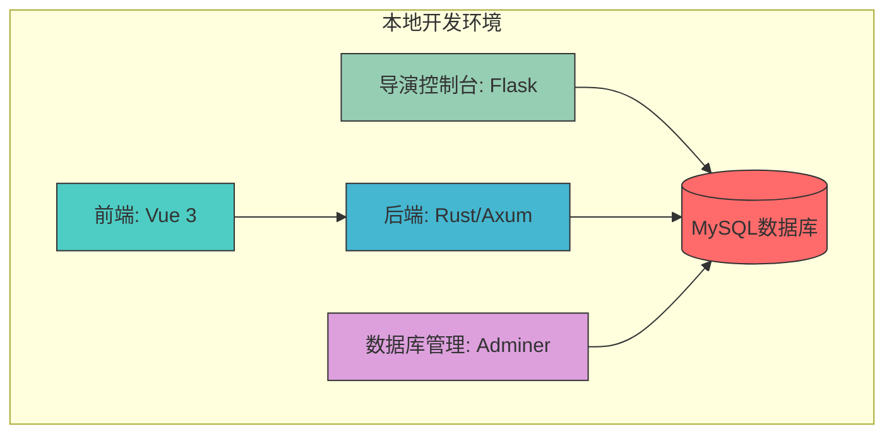
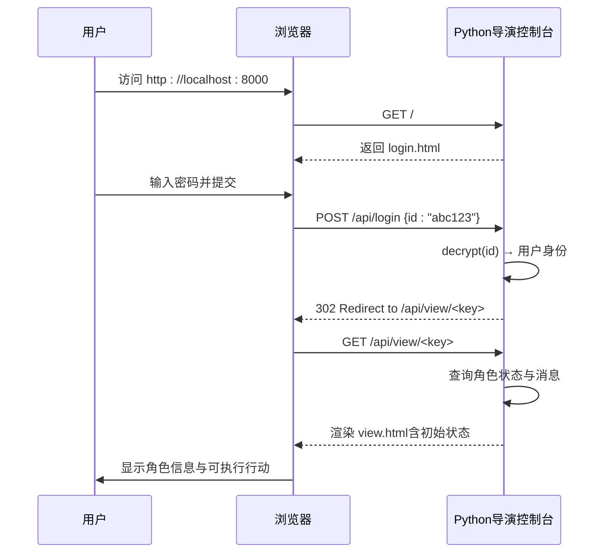

# 快速开始

<cite>
**本文档中引用的文件**  
- [README.md](file://README.md)
- [docker-compose.yml](file://docker-compose.yml)
- [package.json](file://frontend/royale-arena-frontend/package.json)
- [Cargo.toml](file://backend/royale-arena-backend/Cargo.toml)
- [main.py](file://python_directors/main.py)
- [server.py](file://python_directors/server.py)
- [login.html](file://python_directors/templates/login.html)
- [view.html](file://python_directors/templates/view.html)
</cite>

## 目录
1. [简介](#简介)
2. [项目结构](#项目结构)
3. [环境搭建与服务启动](#环境搭建与服务启动)
4. [服务访问方式](#服务访问方式)
5. [交互示例：登录并查看初始游戏状态](#交互示例登录并查看初始游戏状态)

## 简介

《Royale Arena》是一款基于网页的大逃杀类游戏，支持玩家在限定时间内执行移动、搜索、攻击、使用道具等操作。系统包含前端界面、Rust后端服务和Python导演控制台，通过Docker可一键部署所有组件。

本指南旨在为新开发者和用户提供清晰的快速入门指引，涵盖从代码克隆到服务运行的完整流程，并通过一个简单的“Hello World”级别交互示例验证环境配置是否正确。

**Section sources**
- [README.md](file://README.md#L1-L55)

## 项目结构

项目采用模块化设计，主要分为前端、后端和导演控制台三大模块：

```
.
├── backend                     # 后端服务（Rust）
│   └── royale-arena-backend    # Axum框架构建的API服务
├── frontend                    # 前端应用（Vue 3 + TypeScript）
│   └── royale-arena-frontend   # Vite构建的单页应用
├── python_directors            # 导演控制台（Flask + Jinja2模板）
│   ├── templates               # HTML模板文件
│   └── *.py                    # Python业务逻辑
├── docker-compose.yml          # 多容器编排配置
└── README.md                   # 项目说明文档
```

系统通过 `docker-compose.yml` 统一管理前端、后端、数据库及管理工具的启动与网络连接。



**Diagram sources**
- [docker-compose.yml](file://docker-compose.yml#L1-L67)
- [README.md](file://README.md#L1-L55)

## 环境搭建与服务启动

按照以下步骤完成环境配置并启动所有服务：

### 1. 克隆仓库

```bash
git clone https://github.com/your-username/royale-arena.git
cd royale-arena
```

### 2. 安装依赖

#### 前端依赖（npm）

```bash
cd frontend/royale-arena-frontend
npm install
```

该命令将根据 `package.json` 安装 Vue 3、Pinia、TypeScript 等依赖。

**Section sources**
- [package.json](file://frontend/royale-arena-frontend/package.json#L1-L33)

#### 后端依赖（cargo）

```bash
cd backend/royale-arena-backend
cargo build
```

此命令将根据 `Cargo.toml` 下载并编译 Axum、Tokio、SQLx、Serde 等Rust库。

**Section sources**
- [Cargo.toml](file://backend/royale-arena-backend/Cargo.toml#L1-L33)

### 3. 使用 Docker Compose 启动所有服务

根目录下的 `docker-compose.yml` 已定义完整的服务栈，执行以下命令即可启动全部组件：

```bash
docker-compose up --build
```

该命令将构建并启动以下四个容器：
- `royale-arena-backend`: Rust后端服务，监听端口 `8080`
- `royale-arena-frontend`: Vue前端开发服务器，监听端口 `5173`
- `discuz_mysql`: MySQL 5.7数据库，初始化字符集为GBK
- `discuz_adminer`: Web版数据库管理工具，可通过浏览器访问

> **提示**：首次运行会自动拉取镜像并构建本地镜像，可能需要几分钟时间。

**Section sources**
- [docker-compose.yml](file://docker-compose.yml#L1-L67)

## 服务访问方式

服务启动成功后，可通过以下地址访问各组件：

| 服务 | 访问地址 | 用途说明 |
|------|----------|----------|
| 前端应用 | [http://localhost:5173](http://localhost:5173) | 游戏主界面（当前为默认Vite模板） |
| 后端API | [http://localhost:8080](http://localhost:8080) | RESTful API接口服务 |
| Python导演控制台 | [http://localhost:8000](http://localhost:8000) | 导演/玩家操作入口 |
| 数据库管理（Adminer） | [http://localhost:8081](http://localhost:8081) | 可视化管理MySQL数据库 |

> **注意**：当前前端项目尚未集成游戏逻辑，仅为默认Vite+Vue模板页面。核心交互功能集中在Python导演控制台。

**Section sources**
- [docker-compose.yml](file://docker-compose.yml#L1-L67)
- [server.py](file://python_directors/server.py#L1-L81)

## 交互示例：登录并查看初始游戏状态

以下是一个“Hello World”级别的交互示例，用于验证整个系统是否正常运行。

### 1. 访问导演控制台登录页

打开浏览器，访问：
```
http://localhost:8000
```

页面将显示登录表单，标题为“大逃杀行动入口”。

### 2. 输入初始密码登录

在输入框中输入任意预设的“演员号初始密码”，例如：
```
abc123
```
点击“登录”按钮。

> **说明**：系统通过 `user.py` 中的 `PASSWORDS` 和 `ROLES` 映射关系识别角色身份。例如，输入 `DIRECTOR_PASSWORD` 将以“导演”身份登录。

**Section sources**
- [login.html](file://python_directors/templates/login.html#L1-L20)
- [user.py](file://python_directors/user.py#L1-L33)

### 3. 查看初始游戏状态

登录成功后，浏览器将跳转至类似以下地址：
```
http://localhost:8000/api/view/XXXXXXXXXXXX
```
其中 `XXXXXXXXXXXX` 是基于用户ID加密生成的访问密钥。

此时页面将显示该角色的初始游戏状态，包括：
- 角色名称、生命值、体力、当前位置
- 手中道具与背包道具列表
- 可执行的行动选项（如移动、搜索、攻击等）
- 历史行动记录区域

例如，一个普通玩家的界面可能显示：
```
猎人，生命：100，体力：100，当前位置：空地
手中道具：无 | 背包道具：小刀(10次) 医疗包(5次)
```

同时，页面底部会列出历史对话记录（初始为空）。

### 4. 验证环境配置

若能成功看到上述信息，则表明：
✅ Docker服务已正常启动  
✅ Python导演控制台运行正常  
✅ 用户认证与会话机制工作正常  
✅ 前后端路由与模板渲染无误  

这相当于本系统的“Hello World”验证，说明开发环境已准备就绪。



**Diagram sources**
- [server.py](file://python_directors/server.py#L1-L81)
- [login.html](file://python_directors/templates/login.html#L1-L20)
- [view.html](file://python_directors/templates/view.html#L1-L186)

**Section sources**
- [server.py](file://python_directors/server.py#L1-L81)
- [login.html](file://python_directors/templates/login.html#L1-L20)
- [view.html](file://python_directors/templates/view.html#L1-L186)