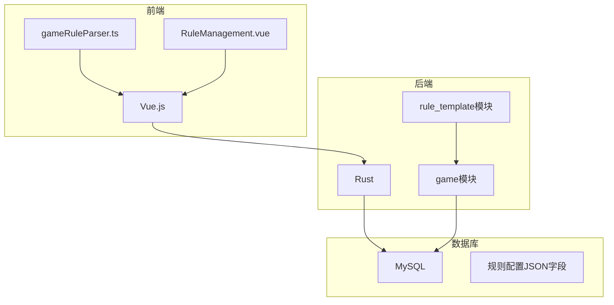
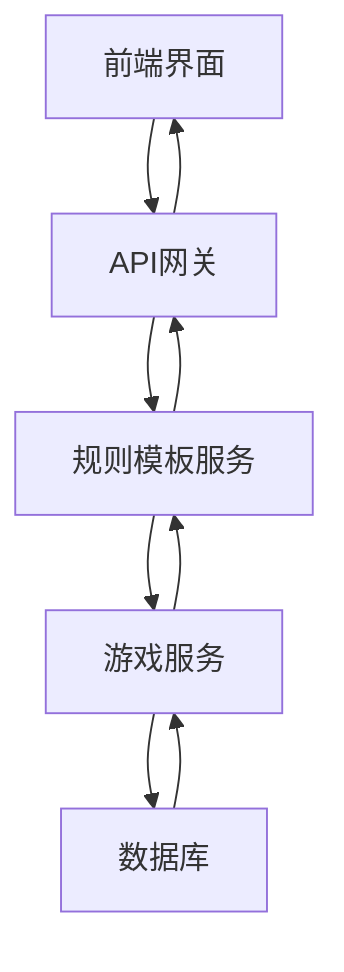
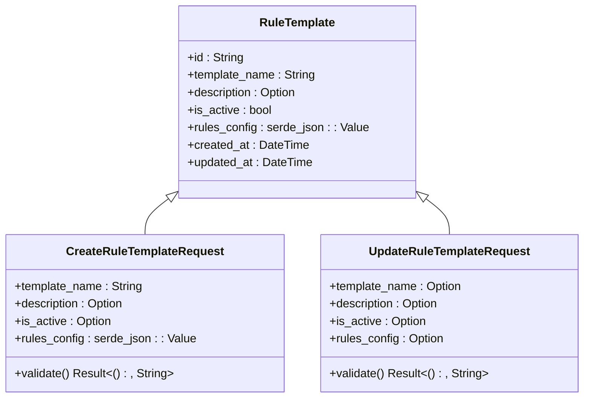
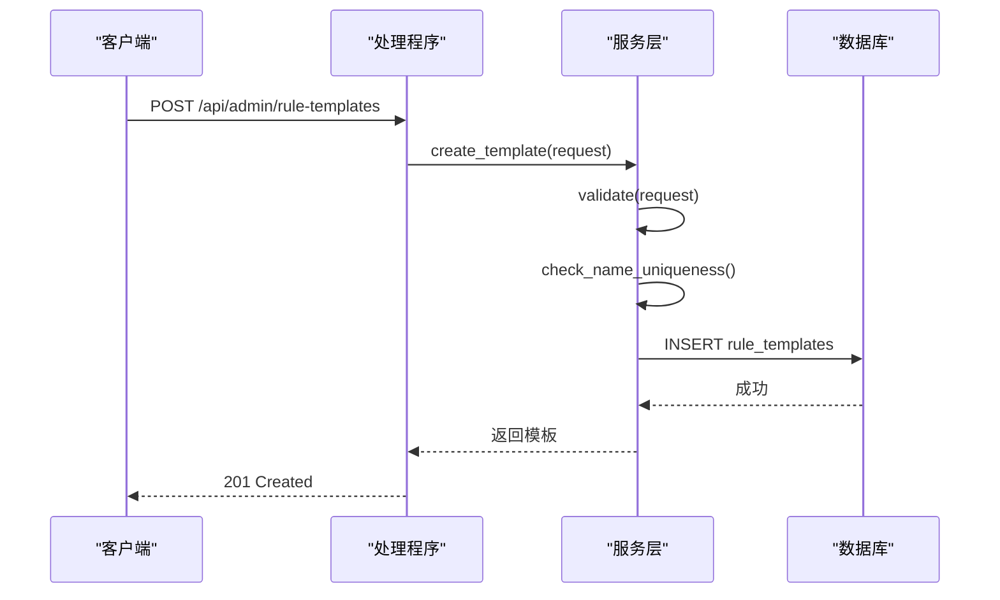
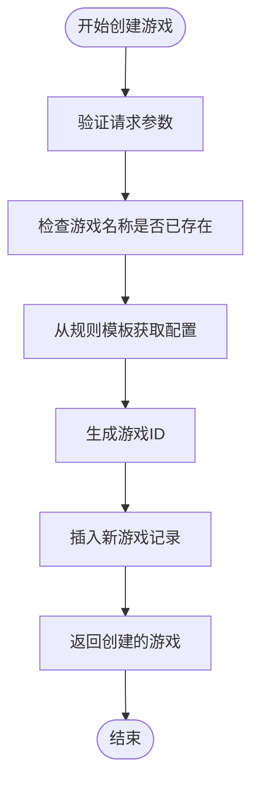
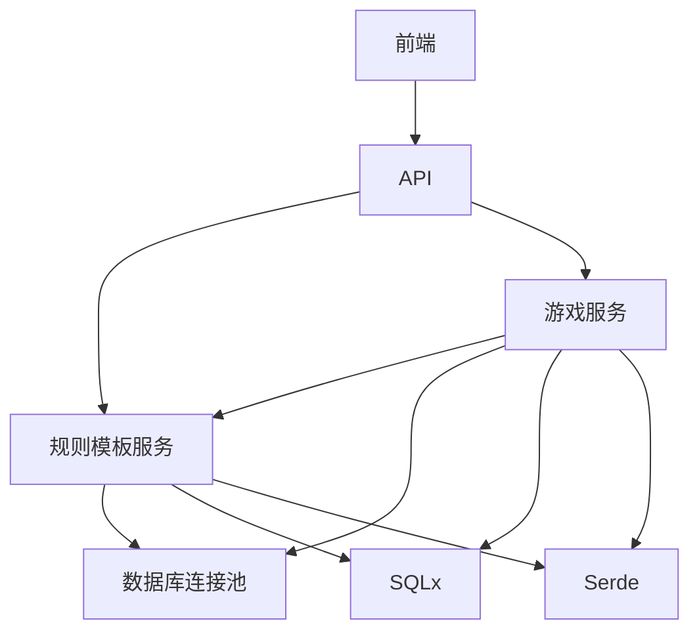

# 游戏规则文档

<cite>
**本文档引用文件**   
- [game-rules-examples.md](file://frontend/public/docs/game-rules-examples.md)
- [game-rules-explain.md](file://frontend/public/docs/game-rules-explain.md)
- [models.rs](file://backend/src/rule_template/models.rs)
- [service.rs](file://backend/src/rule_template/service.rs)
- [handlers.rs](file://backend/src/rule_template/handlers.rs)
- [errors.rs](file://backend/src/rule_template/errors.rs)
- [20250915152136_game_rule_json.up.sql](file://backend/migrations/20250915152136_game_rule_json.up.sql)
- [game/models.rs](file://backend/src/game/models.rs)
- [game/service.rs](file://backend/src/game/service.rs)
- [game/handlers.rs](file://backend/src/game/handlers.rs)
</cite>

## 目录
1. [简介](#简介)
2. [项目结构](#项目结构)
3. [核心组件](#核心组件)
4. [架构概述](#架构概述)
5. [详细组件分析](#详细组件分析)
6. [依赖分析](#依赖分析)
7. [性能考虑](#性能考虑)
8. [故障排除指南](#故障排除指南)
9. [结论](#结论)
10. [附录](#附录)

## 简介
本文档旨在全面介绍 Royale Arena 游戏规则系统的实现细节、API 接口、集成模式以及实际应用示例。该系统允许管理员创建和管理游戏规则模板，这些模板定义了游戏的各种行为和参数，包括地图设置、玩家属性、行动消耗、物品系统等。通过 RESTful API 和数据库迁移，系统实现了灵活的规则配置和高效的规则应用机制。

## 项目结构
本项目采用典型的前后端分离架构，后端使用 Rust 语言开发，前端使用 Vue.js 框架。游戏规则相关的代码主要集中在 `backend/src/rule_template` 目录下，包括模型定义、服务逻辑和处理程序。数据库迁移脚本定义了规则配置的存储方式，而前端文档提供了详细的规则配置示例和说明。



**图源**
- [game-rules-explain.md](file://frontend/public/docs/game-rules-explain.md)
- [models.rs](file://backend/src/rule_template/models.rs)
- [20250915152136_game_rule_json.up.sql](file://backend/migrations/20250915152136_game_rule_json.up.sql)

## 核心组件
游戏规则系统的核心组件包括规则模板模型、服务层和处理程序。`RuleTemplate` 结构体定义了规则模板的数据结构，包含模板名称、描述、激活状态和规则配置。服务层提供了创建、更新和查询规则模板的业务逻辑，而处理程序则负责接收 HTTP 请求并调用相应的服务方法。

**节源**
- [models.rs](file://backend/src/rule_template/models.rs#L1-L242)
- [service.rs](file://backend/src/rule_template/service.rs#L8-L11)
- [handlers.rs](file://backend/src/rule_template/handlers.rs#L1-L65)

## 架构概述
系统采用分层架构设计，前端通过 API 与后端交互，后端服务处理业务逻辑并与数据库通信。规则配置以 JSON 格式存储在数据库中，确保了灵活性和可扩展性。当创建新游戏时，系统会从选定的规则模板中复制配置到游戏记录中，从而实现规则的继承和应用。



**图源**
- [handlers.rs](file://backend/src/rule_template/handlers.rs#L1-L65)
- [service.rs](file://backend/src/rule_template/service.rs#L8-L11)
- [game/service.rs](file://backend/src/game/service.rs#L1-L298)

## 详细组件分析

### 规则模板模型分析
规则模板模型定义了规则模板的基本属性和验证逻辑。`RuleTemplate` 结构体包含了模板的 ID、名称、描述、激活状态和规则配置。`CreateRuleTemplateRequest` 和 `UpdateRuleTemplateRequest` 结构体分别用于创建和更新规则模板的请求，它们都包含了验证方法来确保输入数据的有效性。



**图源**
- [models.rs](file://backend/src/rule_template/models.rs#L1-L242)

### 规则模板服务分析
规则模板服务实现了规则模板的 CRUD 操作。`RuleTemplateService` 结构体包含了一个数据库连接池，用于与数据库交互。`create_template` 方法负责创建新的规则模板，它首先验证请求数据，然后检查模板名称的唯一性，最后将模板插入数据库。`update_template` 方法用于更新现有模板，它同样需要验证数据并检查名称唯一性。



**图源**
- [service.rs](file://backend/src/rule_template/service.rs#L8-L11)
- [handlers.rs](file://backend/src/rule_template/handlers.rs#L1-L65)

### 游戏服务中的规则应用
游戏服务在创建新游戏时应用规则模板。`GameService` 的 `create_game` 方法接收 `CreateGameRequest`，其中包含规则模板 ID。服务会从数据库中获取对应的规则模板，并将其配置复制到新创建的游戏记录中。这确保了每个游戏都有独立的规则配置，即使原始模板后来被修改也不会影响已创建的游戏。



**图源**
- [game/service.rs](file://backend/src/game/service.rs#L1-L298)
- [game/models.rs](file://backend/src/game/models.rs#L1-L415)

## 依赖分析
游戏规则系统依赖于多个外部组件和内部模块。后端依赖于 SQLx 用于数据库操作，Serde 用于 JSON 序列化，Axum 用于构建 Web 服务。内部模块之间存在明确的依赖关系：游戏服务依赖于规则模板服务来获取规则配置，而规则模板服务又依赖于数据库连接池。



**图源**
- [service.rs](file://backend/src/rule_template/service.rs#L8-L11)
- [game/service.rs](file://backend/src/game/service.rs#L1-L298)

## 性能考虑
为了提高性能，系统采用了多项优化措施。首先，规则配置以 JSON 格式直接存储在游戏表中，避免了在游戏运行时进行额外的数据库查询。其次，服务层的方法使用了异步编程模型，可以高效地处理并发请求。此外，数据库查询使用了参数化语句，有助于防止 SQL 注入并提高查询效率。

## 故障排除指南
在使用游戏规则系统时可能会遇到一些常见问题。例如，创建规则模板时如果名称已存在，会返回 409 冲突错误。此时应检查是否已有同名模板，或选择其他名称。更新游戏时如果提供的模板 ID 不存在，会返回 404 错误，需要确认模板 ID 是否正确。对于 JSON 配置格式错误，系统会返回 400 错误，建议使用 JSON 验证工具检查配置文件。

**节源**
- [errors.rs](file://backend/src/rule_template/errors.rs#L1-L75)
- [models.rs](file://backend/src/rule_template/models.rs#L1-L242)

## 结论
Royale Arena 的游戏规则系统提供了一个灵活且强大的机制来定义和管理游戏行为。通过将规则配置存储为 JSON 格式，系统实现了高度的可定制性。API 设计遵循 RESTful 原则，便于集成和使用。未来可以考虑增加规则版本控制功能，以便更好地管理规则的变更历史。

## 附录
### 完整规则配置示例
```json
{
  "map": {
    "places": [
      "码头", "工厂", "贫民窟", "旅馆", "教堂", "市政厅", "消防局", "池塘",
      "住宅区", "灯塔", "小巷", "学校", "隧道", "山道", "寺庙", "靶场",
      "医院", "森林", "海滩", "墓园", "井", "研究中心"
    ],
    "safe_places": ["研究中心"]
  },
  "player": {
    "max_life": 100,
    "max_strength": 100,
    "daily_strength_recovery": 40,
    "search_cooldown": 30,
    "max_equipped_weapons": 1,
    "max_equipped_armors": 1,
    "max_backpack_items": 4
  },
  "action_costs": {
    "move": 5,
    "search": 5,
    "pick": 0,
    "attack": 0,
    "equip": 0,
    "use": 0,
    "throw": 0,
    "deliver": 105
  },
  "rest_mode": {
    "life_recovery": 25,
    "max_moves": 1
  },
  "teammate_behavior": 0,
  "items": {
    "rarity_levels": [
      {"name": "common", "display_name": "普通", "prefix": "[绿]", "is_airdropped": true},
      {"name": "rare", "display_name": "稀有", "prefix": "[蓝]", "is_airdropped": true},
      {"name": "epic", "display_name": "史诗", "prefix": "[紫]", "is_airdropped": false},
      {"name": "legendary", "display_name": "传说", "prefix": "[橙]", "is_airdropped": false}
    ],
    "weapons": [
      {
        "internal_name": "common_weapon",
        "display_names": ["[绿]佩剑", "[绿]战斧", "[绿]长矛", "[绿]皮鞭", "[绿]回力镖", "[绿]IM-10", "[绿]复合弓", "[绿]铁爪"],
        "rarity": "common",
        "properties": {
          "damage": 10,
          "votes": 1
        }
      }
    ],
    "armors": [
      {
        "internal_name": "common_armor",
        "display_names": ["[绿]皮甲", "[绿]布衣", "[绿]轻甲"],
        "rarity": "common",
        "properties": {
          "defense": 5,
          "votes": 2
        }
      }
    ],
    "other_items": [
      {
        "name": "[GPS]心跳探测仪",
        "category": "utility_locator",
        "properties": {
          "votes": 3,
          "targets": 1
        }
      }
    ],
    "consumables": [
      {
        "name": "[HP30]绷带",
        "effect_type": "heal",
        "effect_value": 30,
        "cure_bleed": true
      }
    ],
    "upgraders": [
      {
        "internal_name": "natural_upgrader",
        "display_names": ["[合]自然升级器"],
        "rarity": "legendary"
      }
    ],
    "upgrade_recipes": {
      "natural_upgrader": [
        {
          "result": "rare_weapon",
          "ingredients": ["common_weapon"]
        }
      ]
    }
  },
  "display_names": {
    "player_max_life": "生命值",
    "player_max_strength": "体力值",
    "player_daily_strength_recovery": "每日体力恢复",
    "player_search_cooldown": "搜索冷却时间",
    "action_move": "移动",
    "action_search": "搜索",
    "action_pick": "拾取",
    "action_attack": "攻击",
    "action_equip": "装备",
    "action_use": "使用",
    "action_throw": "丢弃",
    "action_deliver": "传音",
    "rest_life_recovery": "生命恢复",
    "rest_max_moves": "最大移动次数"
  }
}
```

**节源**
- [game-rules-examples.md](file://frontend/public/docs/game-rules-examples.md)
- [game-rules-explain.md](file://frontend/public/docs/game-rules-explain.md)