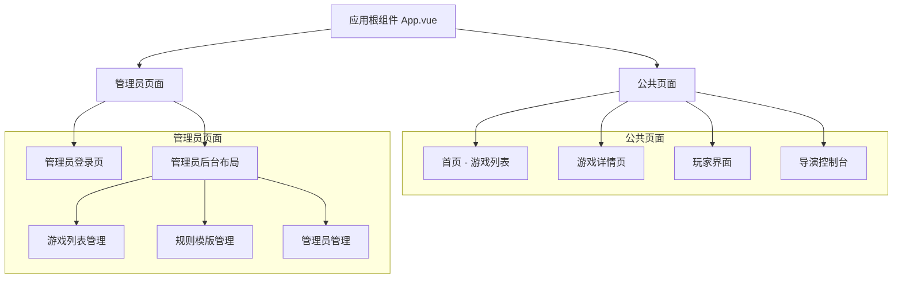
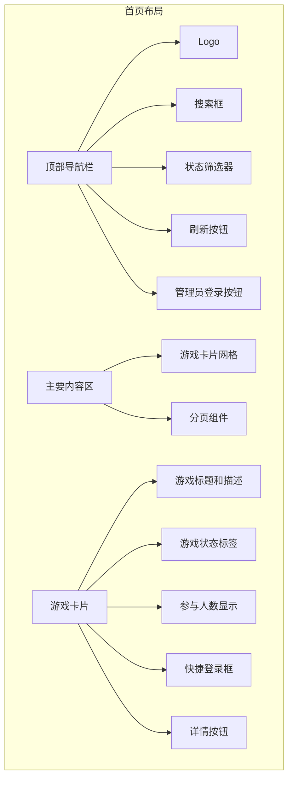
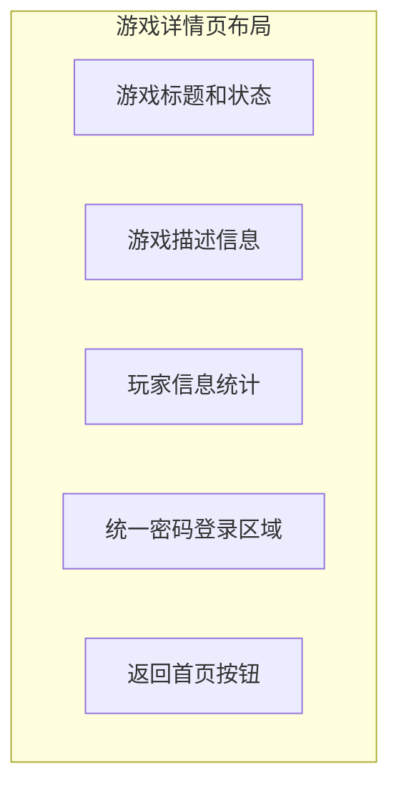
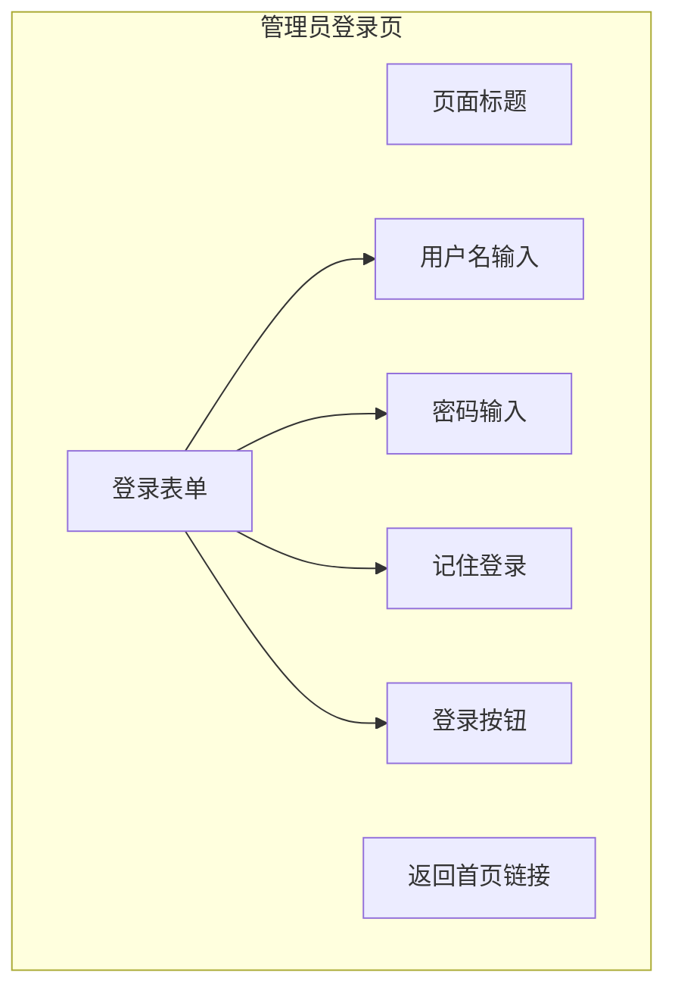
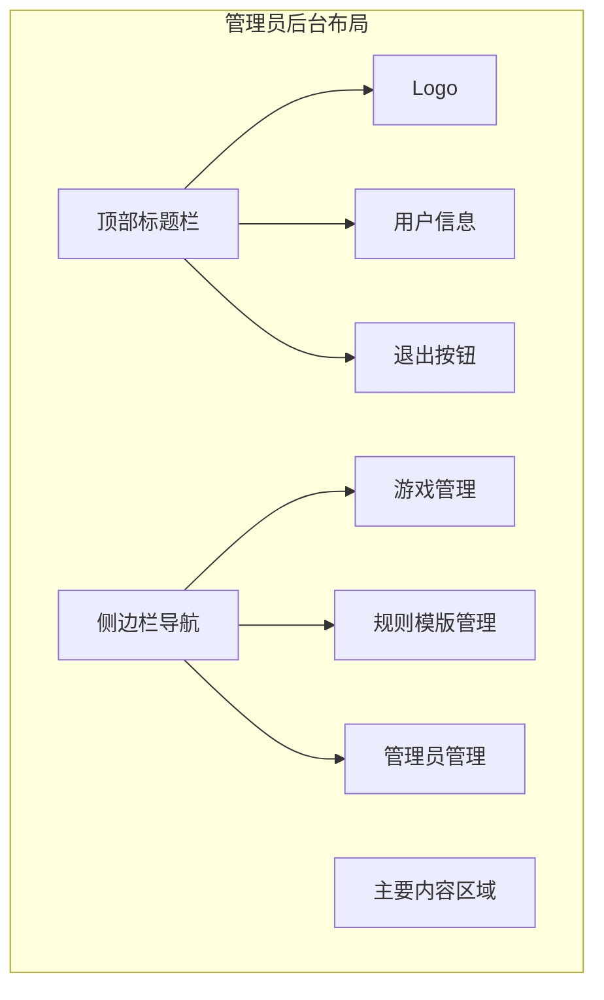

# Royale Arena 前端页面设计

## 概述

本文档详细描述 Royale Arena 前端应用的页面架构设计，包括用户界面布局、路由设计、响应式适配以及 API 集成策略。系统采用 Vue 3 + TypeScript + Element Plus 技术栈，支持桌面端和移动端的响应式设计。

## 技术栈

- **框架**: Vue 3 + TypeScript + Composition API
- **构建工具**: Vite
- **UI 组件库**: Element Plus
- **状态管理**: Pinia
- **路由管理**: Vue Router 4
- **HTTP 客户端**: Axios
- **样式方案**: CSS Modules + Element Plus Design Tokens
- **响应式设计**: Flexbox + CSS Grid + Media Queries

## 整体页面架构

### 页面层次结构



### 路由设计

```javascript
const routes = [
  // 公共路由
  { path: '/', name: 'Home', component: HomePage },
  { path: '/game/:id', name: 'GameDetail', component: GameDetailPage },
  { path: '/game/:id/player', name: 'PlayerInterface', component: PlayerInterface },
  { path: '/game/:id/director', name: 'DirectorConsole', component: DirectorConsole },
  
  // 管理员路由（需要认证）
  { path: '/admin/login', name: 'AdminLogin', component: AdminLoginPage },
  { 
    path: '/admin', 
    component: AdminLayout,
    meta: { requiresAuth: true },
    children: [
      { path: 'games', name: 'AdminGames', component: AdminGamesPage },
      { path: 'rules', name: 'AdminRules', component: AdminRulesPage },
      { path: 'admins', name: 'AdminUsers', component: AdminUsersPage, meta: { requiresSuperAdmin: true } }
    ]
  }
]
```

### 响应式布局适配

#### 断点设计
```css
/* 响应式断点设计 */
$breakpoint-mobile: 768px;
$breakpoint-tablet: 1024px;
$breakpoint-desktop: 1280px;

/* 移动端优先设计 */
.container {
  padding: 0 16px; /* 移动端 */
}

@media (min-width: 768px) {
  .container {
    padding: 0 24px; /* 平板端 */
  }
}

@media (min-width: 1024px) {
  .container {
    padding: 0 32px; /* 桌面端 */
  }
}
```

## 页面详细设计

### 1. 网页首页 (HomePage.vue)

#### 功能需求
- 展示当前所有游戏列表（包括各种状态）
- 支持客户端筛选和搜索功能
- 支持分页浏览
- 提供游戏状态筛选：活动中、等待中、进行中、已结束、全部、已隐藏
- 管理员登录入口（右上角）
- 手动刷新功能
- 每个游戏卡片包含快捷密码登录框

#### 页面布局


#### 游戏状态筛选类型
```typescript
enum GameFilterType {
  ALL = 'all',           // 全部（不包括已隐藏）
  ACTIVE = 'active',     // 活动中（等待中、进行中、已暂停）
  WAITING = 'waiting',   // 等待中
  RUNNING = 'running',   // 进行中
  ENDED = 'ended',       // 已结束
  HIDDEN = 'hidden'      // 已隐藏
}

enum GameStatus {
  WAITING = 'waiting',
  RUNNING = 'running', 
  PAUSED = 'paused',
  ENDED = 'ended',
  HIDDEN = 'hidden',
  DELETED = 'deleted'
}
```

### 2. 游戏详情页 (GameDetailPage.vue)

#### 功能需求
- 显示游戏的详细信息（不包括规则具体内容）
- 提供统一的密码登录框（导演和演员使用同一个）
- 登录成功后自动跳转到对应的界面
- 显示当前玩家列表和游戏状态

#### 页面布局


### 3. 玩家界面 (PlayerInterface.vue)

#### 功能需求
- 显示玩家的游戏状态
- 提供玩家操作界面
- 实时更新游戏状态

### 4. 导演控制台 (DirectorConsole.vue)

#### 功能需求
- 游戏控制面板
- 玩家管理
- 游戏进程控制

### 5. 管理员登录页 (AdminLoginPage.vue)

#### 功能需求
- 管理员身份验证
- 记住登录状态
- 登录后跳转到管理后台

#### 页面布局


### 6. 管理员后台布局 (AdminLayout.vue)

#### 功能需求
- 左侧边栏导航（桌面端）或顶部导航（移动端）
- 主要内容区域
- 用户信息和退出功能

#### 页面布局


### 7. 游戏列表管理 (AdminGamesPage.vue)

#### 功能需求
- 游戏列表展示（包括所有状态）
- 创建新游戏
- 编辑游戏信息
- 修改游戏状态（隐藏/删除等）
- 搜索和筛选

### 8. 规则模版管理 (AdminRulesPage.vue)

#### 功能需求
- 规则模版列表
- 创建新模版
- 编辑模版
- 启用/禁用模版

### 9. 管理员管理 (AdminUsersPage.vue)

#### 功能需求
- 管理员账户列表
- 创建新管理员
- 修改权限
- 仅超级管理员可访问

## API 集成设计

### API 基础配置

考虑到后台服务器不会部署在根目录，设计API子路径配置：

```typescript
// api/config.ts
export const API_CONFIG = {
  BASE_URL: process.env.NODE_ENV === 'production' 
    ? '/api/royale-arena'  // 生产环境子路径
    : '/api',              // 开发环境
  TIMEOUT: 30000
}

// API endpoints
export const API_ENDPOINTS = {
  // 游戏相关
  GAMES: '/games',
  GAME_DETAIL: '/games/{id}',
  
  // 管理员相关
  ADMIN_LOGIN: '/admin/auth/login',
  ADMIN_GAMES: '/admin/games',
  ADMIN_RULES: '/admin/rule-templates',
  ADMIN_USERS: '/admin/users',
  
  // 游戏参与
  JOIN_AS_PLAYER: '/games/{id}/join/player',
  JOIN_AS_DIRECTOR: '/games/{id}/join/director'
}
```

### HTTP 客户端配置

```typescript
// api/client.ts
import axios from 'axios'
import { API_CONFIG } from './config'

const apiClient = axios.create({
  baseURL: API_CONFIG.BASE_URL,
  timeout: API_CONFIG.TIMEOUT,
  headers: {
    'Content-Type': 'application/json'
  }
})

// 请求拦截器 - 添加认证token
apiClient.interceptors.request.use(config => {
  const token = localStorage.getItem('admin_token')
  if (token) {
    config.headers.Authorization = `Bearer ${token}`
  }
  return config
})

// 响应拦截器 - 处理错误
apiClient.interceptors.response.use(
  response => response,
  error => {
    if (error.response?.status === 401) {
      // 清除过期token，重定向到登录页
      localStorage.removeItem('admin_token')
      window.location.href = '/admin/login'
    }
    return Promise.reject(error)
  }
)

export default apiClient
```

## 状态管理设计

### 全局状态结构

```typescript
// stores/game.ts
import { defineStore } from 'pinia'

export const useGameStore = defineStore('game', () => {
  const games = ref<Game[]>([])
  const loading = ref(false)
  const searchQuery = ref('')
  const statusFilter = ref<GameFilterType>(GameFilterType.ALL)
  
  // 计算属性
  const filteredGames = computed(() => {
    return filterGamesByStatus(games.value, statusFilter.value, searchQuery.value)
  })
  
  // 操作
  const loadGames = async () => {
    loading.value = true
    try {
      const response = await gameService.getGames()
      games.value = response.data
    } finally {
      loading.value = false
    }
  }
  
  return {
    games,
    loading,
    searchQuery,
    statusFilter,
    filteredGames,
    loadGames
  }
})

// stores/admin.ts
export const useAdminStore = defineStore('admin', () => {
  const isLoggedIn = ref(false)
  const userInfo = ref<AdminUser | null>(null)
  
  const login = async (credentials: LoginCredentials) => {
    const response = await adminService.login(credentials)
    localStorage.setItem('admin_token', response.token)
    userInfo.value = response.user
    isLoggedIn.value = true
  }
  
  const logout = () => {
    localStorage.removeItem('admin_token')
    userInfo.value = null
    isLoggedIn.value = false
  }
  
  return {
    isLoggedIn,
    userInfo,
    login,
    logout
  }
})
```

## 响应式设计规范

### 移动端适配策略

1. **导航适配**
   - 桌面端：水平导航栏
   - 移动端：汉堡菜单 + 抽屉导航

2. **卡片布局适配**
   - 桌面端：3列网格布局
   - 平板端：2列网格布局  
   - 移动端：单列堆叠布局

3. **表单适配**
   - 移动端优化输入体验
   - 增大点击区域
   - 优化键盘交互

4. **管理后台适配**
   - 桌面端：左侧边栏 + 主内容区
   - 移动端：顶部导航 + 全屏内容

## 项目目录结构

```
frontend/
├── src/
│   ├── components/          # 可复用组件
│   │   ├── GameCard.vue
│   │   ├── GameFilter.vue
│   │   └── AdminLayout.vue
│   ├── views/              # 页面组件
│   │   ├── HomePage.vue
│   │   ├── GameDetailPage.vue
│   │   ├── AdminLoginPage.vue
│   │   └── admin/
│   │       ├── AdminGamesPage.vue
│   │       ├── AdminRulesPage.vue
│   │       └── AdminUsersPage.vue
│   ├── stores/             # 状态管理
│   │   ├── game.ts
│   │   └── admin.ts
│   ├── services/           # API服务
│   │   ├── gameService.ts
│   │   └── adminService.ts
│   ├── utils/              # 工具函数
│   │   ├── gameFilter.ts
│   │   └── responsive.ts
│   ├── types/              # TypeScript类型定义
│   │   ├── game.ts
│   │   └── admin.ts
│   └── styles/             # 样式文件
│       ├── variables.css
│       └── responsive.css
├── public/
└── package.json
```

## 开发指南

### 开发环境设置

1. 安装依赖
```bash
cd frontend
npm install
```

2. 启动开发服务器
```bash
npm run dev
```

3. API代理配置（vite.config.ts）
```typescript
export default defineConfig({
  server: {
    proxy: {
      '/api': {
        target: 'http://localhost:8080',
        changeOrigin: true
      }
    }
  }
})
```

### 构建和部署

1. 构建生产版本
```bash
npm run build
```

2. 预览构建结果
```bash
npm run preview
```

## 总结

本设计文档提供了 Royale Arena 前端应用的完整架构方案，包括：

- 基于 Vue 3 + TypeScript 的现代前端技术栈
- 响应式设计支持移动端和桌面端
- 完整的页面路由和状态管理方案
- API 集成和错误处理策略
- 管理员后台的完整功能设计

该设计确保了系统的可扩展性、用户体验的一致性以及代码的可维护性。所有筛选逻辑都在前端实现，降低了后端复杂度，提升了用户交互的响应速度。